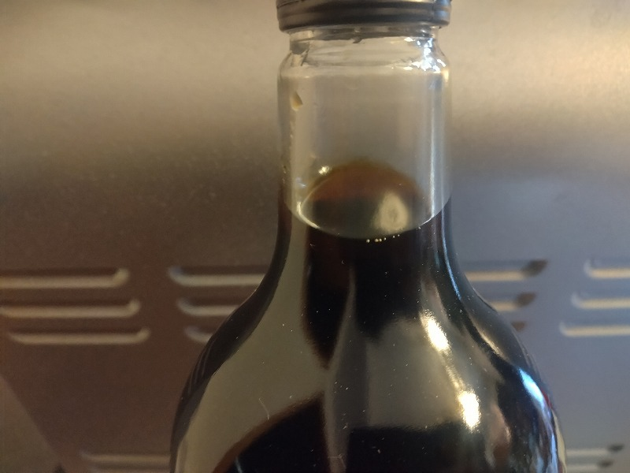
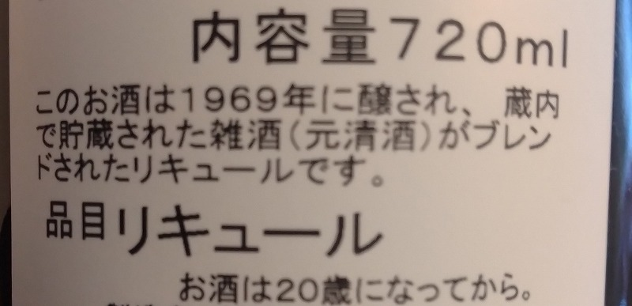

# 菊池 寿人 周报 — 2026-W19

- 周次：2026-W19
- 提交时间：2026-05-06 11:58:36
- 职位：Engineering　Manager

---

◆作業内容

①開発課題整理

＝＝＝筋の悪い案件＝＝＝＝＝＝＝＝＝＝＝＝

正しい情報を、正しく上に伝える事。

ここ忖度したり日和ると簡単にチームが全滅します。

攻めるも守るも、正しい情報の中で行いたい。

飛び越えて話進められると、フォローアップできません。

ご確認ください。

＝＝＝＝＝＝＝＝＝＝＝＝＝＝＝＝＝＝＝＝＝

■言葉を丁寧に扱わない奴は大嫌いだ！

アーシュラ・K・ルグウィン氏のゲド戦記を手に取ったのは何時だったか。宮崎駿が映像化をあきらめたというコラムを読んだ後だったか、まぁ20歳くらいだった気がする。簡単に述べると、作者は言葉を世界の核として捉えていて、それを非常に繊細であり、また、危険な存在であると捉えていた。にも関わらず、誰もが安易に触れ得るという点を、ともすれば病的なまでの恐怖心を持って警鐘を鳴らしている様に思えた。その一方で同じ位に言葉の持つ真の力、秩序や美しさに憧憬や安寧を感じている節があり、その両極端な感情の引き合いの激しい奔流の上に、ゲド戦記の世界観が静かに乗っかっている危うさに心を惹かれたのを覚えている。兎に角、読後の余韻が深く長かった記憶がある。大和言葉などもその頃気になっていて色々調べていたのを、今思い出した。そもそも我々おっさん世代は、手紙が主流で、ポケベルが出たのも、Docomoのiモードでメールが使える様になったのも思春期が終わった後だった。会社に入って送るFAX、メールなど、言葉尻一つ、助詞助動詞のみならず修飾語にも睨みを効かされ、何度も何度も書き直しさせられた記憶がある。つまり、生み出されてしまった言葉はあっという間に自分の手を離れて、勝手に解釈され、理解され、誤解され、そもそも読み捨てられ、時にとんでもない化け物になって仕事に直撃する経験を味わって来た。一方、生粋のデジタルっ子世代は、言葉を選ばない、安易に発する、ことに何ら抵抗も存念も無い。短文以前に絵文字を使う事で、相手に相手が気持ちいい感覚で受け取れる様に自分を消し、また、発した言葉に責任が無い状態まで希釈して使っているのが見て取れる。全員ではないが、正しく言葉を使おうとしている人間には、ほとんど会った事がない。勿論、仕事中にだ。故に、資料がいい加減で、それを元にした設計書も、テストケースも見るに堪えない穴だらけの欠陥文書になっていても指摘されるまで気が付いてもいない。最近私が目にする、提供して貰った資料をアーシュラ・K・ルグウィン氏が一瞥したならば、髪を引きちぎって目から血を流し泡を吹いて死んでしまうだろう。私にしたって天を仰ぎ、なんなら情けなさ過ぎてリアル涙目になってしまうのだから。技術者を名乗るなら技術を使え。

ちなみに、作画だけがジブリで中身がゲス戦記は、珍しく批判したくて見に行った映画だが、開始５分で原作者に土下座した。私が、代わりに、心の中で。

■業務に特筆するべきものだけコメント多めにします

本当にマルチタスク過ぎですね

下流の調整なんて出来る事知れてるから上流で仕切って欲しい心

ほぼブレーンワーク次第なのでシレっと仕事出来ますけれども、

開発動き出すと最適化しまくってるので、ラフな割り込みは、

そこそこ脳みそ焼けます

・ポイント支払

消費税法万歳！

・インバウンド向け基幹対応仕様待ち

景品表示法万歳！資金決済方万歳(今回なら届出制か)！

●EC相談

事前連絡や導入までのテストなど、基本的な事はうっかりでは済まされませんからね

●防犯エリア展開

TEC殿がGW復帰するので動きます

・生鮮要望全般

早くスケジュールを私に教えてください。なんなら残課題と課題解決のマイルストーンでもいいです。勝手に想像します。

・レーンセルフ

がっかりだよ、君たち。

・QR印字

考えます。

・保守相談

相手の気持ちにたって考えると、案外スムーズにいくのだけれど、相互に信頼関係接続が出来ていない状況で、本音ぶっこむと拗れるのと、やった事も無い人が相手の気持ちを想像せず立場振りかざすと上手く行くはずが無いよね、割とそういうのが更にあるよね。

・保守観点

それでいいなんて、そんな感覚は、死ぬまで一回もねーんです。

口にした途端に、それは墓場にいると思った方がよいのですよ。

展開チーム

浅い

（固定）

知識がない以前に、仕事としてのノウハウがない。

事に、適切な指導が行えていない。

から、そうなる、当たり前。

・支払併用の動き

続報なし

●2026リリース

5月中旬以降をターゲットにしたリリース準備中。

5月中に一回リリースして欲しいとの要望が急に来た

・他一覧に乗っけるか検討中の案件複数

細々やりたい事が届いています

・各種要望

重たい課題が複数動いている為、そもそものロードマップの組み換え

を行いながらブレーンワークをしている状況です。

ブレーンワークなので真顔で仕事していますが、中々にカオスです。

それはそれで、いつもの事なので気にせず相談してください。

・その他、業務関連

割り込みマルチタスクが楽しい世界です。

③各種問合せ業務

・案件相談／概算見積もり

・店舗／コールセンター対応

④各種定例Ｍ

整理中

⑤割込作業

◆来週作業予定【5/11～5/15】

〇社内

今期要望整理

PoC各種

コール状況の棚卸

〇課題・要望の推進

棚卸

〇展開フォロー

成長しないのでもう無理です

〇其の他

なし

■ニワカは宝であります、が、ニワカで語るのはダサいぜ

ニワカ、気持ちは判る。好きが止まらないのも判る。語りたいのも判る。誰だってかつては何かのニワカだったからだ。ただ様々な業界でも先駆者達は、もはや後追いでは手が届かない体験と、その変遷と共に成長してきた得難い重みを持つ。後発組であっても金にモノを言わせ、狂気じみた行動力で経験を買い漁った猛者ですら、先駆者のソレに敬意を払うのだ。ましてやニワカが情報を幾ら詰め込もうとも塵芥ほどの価値しかない。想像や受け売りの話など失笑を買うしかないのは自明だ。故にニワカは身の丈を自認し謙虚に生きるべきなのだ。ニワカである事を素直に認識し、聞く姿勢を見せ、丁寧に相槌を打つ。そこにこそ、知らない世界の秘密の扉がある。驕った知識欲では決してたどり着かず、誰かに手を引いて貰うしかないのだ。ニワカが先駆者相手に狭い知識を披露し、やれ本に書いてた、誰かに聞いた、としても体験ではない時点で何の価値もない。だが同じニワカでも年齢によって情状酌量が適応される事がある。知り得た年数が同じでも、若い子は良い。若気の至りで済まされる20代なら、後年に振り返って身悶えする程度で挽回が利くからだ。問題はその先だ。爺とおっさん、お前らには人生経験というものが付帯しているだろう。人生経験がある癖に自我を消せないニワカを若ニワカと同じニワカと扱って良いのか？答えは否だ。仮に滓ニワカと呼ぼう。老害という人間性の劣化、その正体こそが滓ニワカなのだ。滓ニワカは安易に間違った知識という名の恥をばらまく。誰もお前の承認欲求に応える義務はないし是正してあげる優しさなど持ち合わせていない。ひとたび指摘されようものなら、俺は正しい、俺はそう聞いた、俺らの時代はそうだったはず、と否定する醜悪さは見るに堪えない。一方、突然、滓ニワカないし老害化する事例があり得る。定年退職、肩書を無くした人間がある日、暗黒面に落ちている事がある。これはアップデート機会の喪失なのか、アイデンティティを外付けにしてきたツケなのか。狭い世界の話で周りに迷惑を掛けたり否定したりする事は慎むべきだ。これこそ若ニワカは未来の自分への反面教師とすべきだ。謙虚さが無ければ、誰でも滓ニワカになり、滓ニワカの一般名称が老害という呼称として世間に認知されるのだ。ニワカの成長には、大好きであり続けている状態が大前提だ。昔ちょっと興味があった、知り得た程度の状態で語る場合は、滓ニワカ、老害になりかねない。折角出たニワカの芽のまま枯らすのではなく芽吹いたならば好きを咲かせるべきだ。若ニワカは反面教師として滓ニワカを視界の隅に収めつつ、若ニワカ時代にしか出来ないラフな立ち回りで自分の拘りを満喫し咲かせた人だけが、必然、謙虚な姿勢を身に付けた博識者へと昇華されるのだ。

定年退職だったり離婚したりと自分の拠り所を喪失したおっさん共の堕ちっぷりが哀れなのと年々数が増えているから鬱陶しい。若いうちから評価軸を内側に作り自責思考で内面磨きをしていないと詰むんだろうな、という愚痴。

・これを見てくれ、大古酒なのに何ならクリーミーなんだぜ、円熟の極み、老害の対極

私信へ返信

>行きたい店

煩い、汚い、マナー最悪が平気ならまずはクリアです

お持ち帰りの餃子だけ頼んで、中央公園でビール決めたらどうでしょ

>頑張ります

悲しいけど０１ですからねぇ

やり直しは成長は出来ますけれども怠さが勝ちますよね

>手間取って

へい、準備は進めています

連絡お願いします（まだご担当者様が一緒なのが・・

全体的に

・フロントエンド内の業務応援やフォローなども突発的に発生し、

各自の業務が増加している傾向にあるが、全体で共有して

進めて行く。

・相談が増える中で、やりたい事が出来るかどうかだけ聞かれる、

段取りも無く突然依頼が来る、等、進め方がおかしい部分の改善図りたい。

以上
