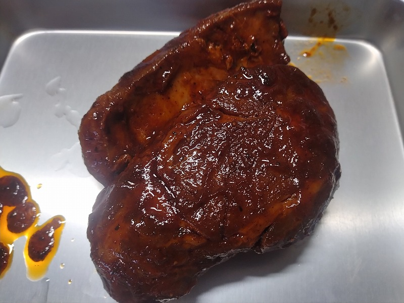
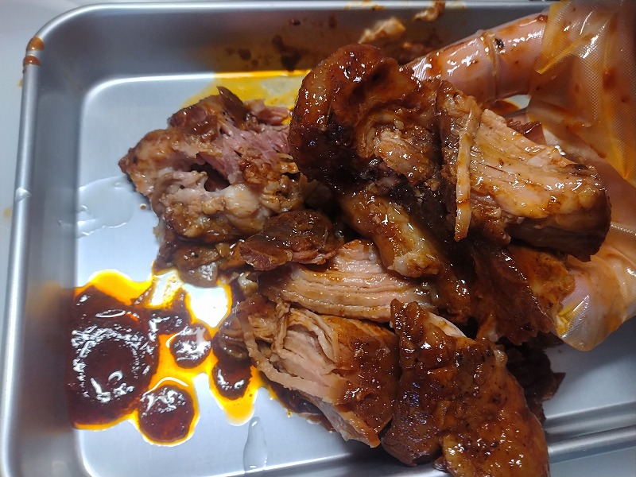

# 菊池 寿人 周报 — 2026-W20

- 周次：2026-W20
- 提交时间：2026-05-13 05:46:58
- 职位：Engineering　Manager

---

◆作業内容

①開発課題整理

＝＝＝筋の悪い案件＝＝＝＝＝＝＝＝＝＝＝＝

正しい情報を、正しく上に伝える事。

ここ忖度したり日和ると簡単にチームが全滅します。

攻めるも守るも、正しい情報の中で行いたい。

飛び越えて話進められると、フォローアップできません。

ご確認ください。

＝＝＝＝＝＝＝＝＝＝＝＝＝＝＝＝＝＝＝＝＝

■言葉を大切にしないと大変な事になります

先回に引き続き、言葉を重視しない人達の危うさについてです。センスや才能と言うものが無い人間には何もできないのか？といえば、ほとんどの人間にはセンスも才能も無いのです。とすれば人類はもっと早く淘汰されていたでしょう。時代の転換点となりうる天才などは時に異端とされ攻撃される対象になり得もしましたが、それでも生み出されたものは多くの秀才によって解析され、センスや才能がなくても判るレベルにかみ砕かれ浸透していくのです。つまり、センスや才能がなくても、一定レベルまでの成長は、自身の体力や時間を消費する事で、技術的精神的な向上は可能なのです。それを努力と言うセンスも才能もない人向けの甘い言葉に置き換える向きが世の風潮ですが、無いなら無いなりに、何かを犠牲にすれば一定の成長は見込めるのです。ここで大事なのが、事前に模倣と猿真似の違いを理解しておく事です。もう一つ、それより大事なのは自分の役に立たないプライドではなく、現実、自分が出来ているかどうかのメタ視点で物事を見れるかです。結果、正しく真似をして、成功も失敗もすべて自責を中心に反省出来る力があるか、によります。反省するにはセンスや才能が必要でしょうか？私は反省するだけであれば、出来ない自分を認めなかったり、他責思考に流れない素直さがあれば、十分だと思っています。悲しい事に、ある程度成長してしまった人間というものは、「No１にならなくてもいい、もっともっと大切なOnly１」という呪いの言葉に侵されている点です。これは「お客様は神様です」に匹敵する、駄目な人間を増長勘違いさせる恐ろしい呪いですが、・・・閑話休題。ではセンスも才能もない人間の正しいアプローチはなんでしょうか？それは、Google検索のAI回答を見て見ましょう。【模倣】模倣（もほう）とは、**他者の行動、形態、作品をまねる、または似せること**。学習の基本や技術習得、社会的流行の基盤となる行為であり、ビジネスや芸術では、既存のものを分析し再構築する手法として活用される一方、法的には不正競争防止法などで制限される「商品形態模倣」の定義にも使われる。【猿真似】「猿真似（さるまね）」とは、**本質を理解せず、表面的な部分だけを他人の真似すること**。よく考えずにうわべだけを模倣する様子を、軽蔑的なニュアンスを含んで表現する言葉です。 如何でしたか？流石AI、本質を切り出せば言葉のエッジが切れ過ぎてセンスや才能がない人間が傷つくと判って優しく書いていますね。要するに、凄いと思ったら、何から何まで徹底的に真似し尽くす事が必要なのです。この真似る努力は、前述のセンスや才能が無い人間が使う自己欺瞞の努力ではなく、世界世間に通用する努力です。徹底的な解析と分解が必要になります。当然、センスや才能が無い人間が幾ら真似た所で見様見真似になりますが、このベクトルが正しければ猿真似には堕ちません。この試行錯誤、もっと言えば、自分が判らない、無駄とも思える様な細部まで徹底する事で、自身の成功体験と共に、少しづつ世界が広がっていく感覚を得られる事が、模倣の良い所なのです。一方、横柄な心構えや邪な甘い考えてパクればいいやと考える気持ちが一ミリでもあった瞬間に、上手く行かない事すら、真似ている相手のせいにしかねないモンスターが産まれます。最初の姿勢一つで、この差がはっきり出てしまいます。例えば本気で真似をしようとすれば、食品安全マネジメントの国際規格ISO22000、HACCPを元に作られたGFS1認証規格でもあるFSSC22000、日本発のGFS1認証規格でもあるJFS規格、サプライチェーン向けのHACCP認証、原材料のトレースアビリティや育成方法の管理、輸送管理基準、自社工場での厳密な工程管理、出荷判定検査の徹底、焼成、鉄板加熱方法、提供方法までのマニュアル管理が必要な事は明白で、とりあえず手の届く処からではないって事は門前小僧の私でも理解できてしまいます。なんてったって、ド素人の小僧である私ですら、人様に提供しようと思えば、蛋白質の熱変性や凝固温度帯における水分動態（これは結合水や不動水だけでなく遊離水）はメイラード反応に大きく影響を与える事になり、脂肪融点とコラーゲン融点を睨みながら、熱伝導率を考えて、フライパンの素材や厚みに想いを馳せたりするものです。この辺りは門前小僧の領域なのです。ましてや、プロがプロを真似るとなれば、相応の覚悟と知識を学ぶ必要があります。ITだろうが、営業だろうが、鋳造だろうが、料理だろうが、真似るテクニックと、反省のスキルを上げる事が、センスや才能が無い人間が、踏ん張る為に出来るたった一つの道だと思います。例えば玉ねぎを鉄板の上に敷く目的や理由がどこまで研ぎ澄まされているかを見るだけでも、沢山のものが見えてきます。

■業務に特筆するべきものだけコメント多めにします

本当にマルチタスク過ぎですね

下流の調整なんて出来る事知れてるから上流で仕切って欲しい心

ほぼブレーンワーク次第なのでシレっと仕事出来ますけれども、

開発動き出すと最適化しまくってるので、ラフな割り込みは、

そこそこ脳みそ焼けます

・ポイント支払

消費税法万歳！

・インバウンド向け基幹対応仕様待ち

景品表示法万歳！資金決済方万歳(今回なら届出制か)！

●EC相談

なんかがっかりですよ

●防犯エリア展開

巻きます

・生鮮要望全般

内情把握、返事します

・レーンセルフ

漸くにしてひと段落

・QR印字

考えます。

・保守相談

がんばってね

・保守観点

それでいいなんて、そんな感覚は、死ぬまで一回もねーんです。

口にした途端に、それは墓場にいると思った方がよいのですよ。

展開チーム

浅い

（固定）

知識がない以前に、仕事としてのノウハウがない。

事に、適切な指導が行えていない。

から、そうなる、当たり前。

・支払併用の動き

開発中

●2026リリース

5月中旬以降をターゲットにしたリリース準備中。

生鮮周りの展開計画

・他一覧に乗っけるか検討中の案件複数

細々やりたい事が届いています

・各種要望

重たい課題が複数動いている為、そもそものロードマップの組み換え

を行いながらブレーンワークをしている状況です。

ブレーンワークなので真顔で仕事していますが、中々にカオスです。

それはそれで、いつもの事なので気にせず相談してください。

・その他、業務関連

割り込みマルチタスクが楽しい世界です。

③各種問合せ業務

・案件相談／概算見積もり

・店舗／コールセンター対応

④各種定例Ｍ

整理中

⑤割込作業

◆来週作業予定【5/18～5/22】

〇社内

今期要望整理

PoC各種

コール状況の棚卸

〇課題・要望の推進

棚卸

〇展開フォロー

成長しないのでもう無理です

〇其の他

なし

■私こう見えて選挙区毎に誰が当選しているかで・・

そのブロック全体を蔑む程度には子供の頃から政治が好きです。そんな私が沖縄に興味を持つと思いますか？そう、私を知る人間であれば、まぁ、そうだよな、という反応をされます。そこいくと、唯一の海外経験地である台湾は、仕事、プライベートで何度訪れたか判りません（もっともコロナで2020年春の旅行の計画がトんでから行けてませんけど）。仲良くしている飲食店から沖縄の古座にヤギ食いにいこうと誘われたものの、前述の通りの為、心が揺れません。まぁ、仲良くしている彼ら（常連連中）と話題のヤギを食うというネタと考えると、私が本当に沖縄に行くための最後のチャンスになるかもしれない、と言う想いと、沖縄いくなら台湾行きたいワンという、リアル葛藤で、暫く悶々とする事でしょう。旅程が知事選の開票前なんだよな。。美ら海水族館で魚見ながら料理方法を考えるのは楽しそうだが、如何せん、イラブチャー見てもどうしていいか判らんだろうな。

・プルドポークを作ってみた

・握撃で余裕

私信へ返信

>餃子だけ

君子危うきに近寄らず

>かわりません

AI解説：元凶（げんきょう）とは、悪い結果や騒動を引き起こした「中心となる原因」や「黒幕（人物）」を指す言葉です。ただの「原因」とは異なり、特に悪の根源や諸悪の根源を指す際に使われます。読み方は「げんきょう」が正しく、「がんきょう」は誤りです

全体的に

・フロントエンド内の業務応援やフォローなども突発的に発生し、

各自の業務が増加している傾向にあるが、全体で共有して

進めて行く。

・相談が増える中で、やりたい事が出来るかどうかだけ聞かれる、

段取りも無く突然依頼が来る、等、進め方がおかしい部分の改善図りたい。

以上
