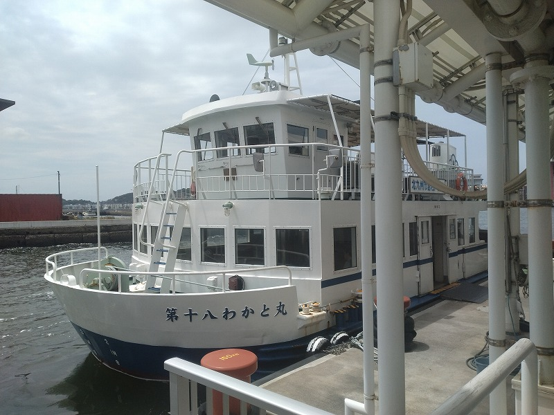
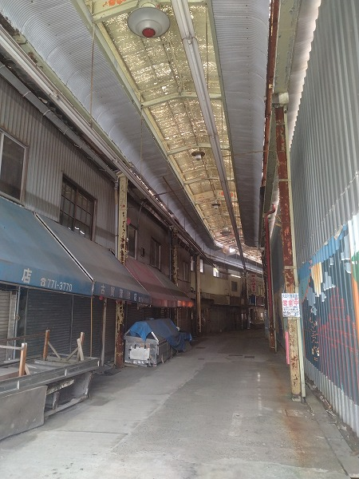
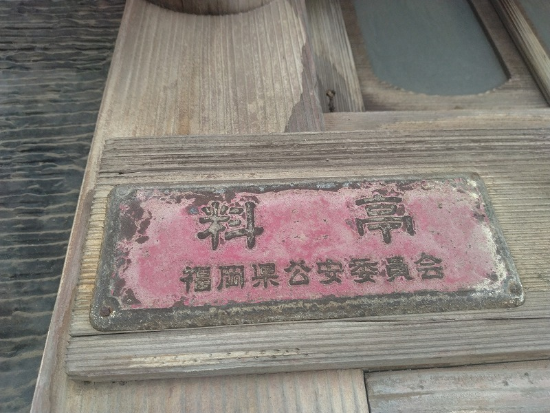

# 菊池 寿人 周报 — 2026-W21

- 周次：2026-W21
- 提交时间：2026-05-19 04:02:57
- 职位：Engineering　Manager

---

◆作業内容

①開発課題整理

＝＝＝筋の悪い案件＝＝＝＝＝＝＝＝＝＝＝＝

正しい情報を、正しく上に伝える事。

ここ忖度したり日和ると簡単にチームが全滅します。

攻めるも守るも、正しい情報の中で行いたい。

飛び越えて話進められると、フォローアップできません。

ご確認ください。

＝＝＝＝＝＝＝＝＝＝＝＝＝＝＝＝＝＝＝＝＝

■何言ってんだ案件

という事で、私が軽蔑して止まないChatGPTことチャッピー質問してみました。

▼▼▼▼▼

例えば、開発案件の大小に関わらず、要求要件仕様を明確にしない、プロジェクトスコープを定義しないで、未精査状態のステークホルダーにやりたい事が出来るかどうかだけを訪ねるプロジェクトマネージャーと名乗る人物が存在する場合、それは善か悪か。ここでの善悪論は存在許容とする。また、善悪関わらず、そのような行動をとってしまう背景にはどのような、能力的心理的経験的な問題が潜むか、推測して簡潔に指摘してほしい。

▲▲▲▲▲

存在許容の観点で言えば、「悪寄り」です。

 理由は単純で、その行為は“探索”ではなく、“責任回避付きの意思決定前倒し”になりやすいからです。

本来、PMの最低限の役割には以下が含まれます。

- スコープ境界の定義
- 要求／要件／制約の分離
- 不確実性の明示
- ステークホルダー利害整理
- 「何を決めていないか」の管理
- 実現性評価の前提条件固定

これらを行わずに、

> 「で、できますか？」

だけを聞く行為は、実質的には：

- 責任を実装側へ押し付ける
- 後から条件変更可能な曖昧契約を作る
- 「言った／言わない」空間を意図せず生成する
- プロジェクトではなく期待幻想を駆動する

になりやすい。

特に未精査ステークホルダー相手だと、

 「要求」と「願望」と「妄想」と「政治」が未分離なので、PMが構造化しなければならない。

 そこを飛ばす時点で、PM機能を放棄している側面があります。

ただし、例外はあります。

例えば：

- 超初期プリセールス
- PoC以前の探索
- 研究開発テーマの粗ヒアリング
- 0→1アイデア壁打ち

では、

> 「まず可能性だけ広く見る」

という行為自体は成立します。

しかしその場合でも、本来は：

- 「まだ要求定義前です」
- 「現時点では実現性の粗評価です」
- 「確定条件ではありません」

を明示する必要がある。

つまり問題の本質は、「探索そのもの」ではなく、

> 探索フェーズと定義フェーズを区別できていないこと

です。

背景として潜みやすい問題は、概ね以下です。

## 1. 能力的問題

### ■ 要件定義能力不足

要求整理の方法論を知らない。

- 業務要件
- 機能要件
- 非機能要件
- 制約条件
- 優先順位
- スコープ境界

を分解できない。

結果、

 「できますか？」しか言えない。

### ■ 抽象化能力不足

曖昧情報を構造化できない。

PMは本来、

 カオスから論点を切り出す職種。

それができないと、

 会議が“願望収集”になる。

### ■ 不確実性管理能力不足

「未確定」を管理できない。

本来は：

- 仮説
- 前提
- リスク
- 未決事項

を分離して扱う必要がある。

それができないため、

 曖昧なままGo判定に流れる。

## 2. 心理的問題

### ■ 嫌われ回避

要求を整理すると、

 相手に「それは無理」「そこは決めてください」を言う必要がある。

それを避けたい。

結果、

 “聞き心地の良い調整屋”

 になる。

### ■ PMを「御用聞き」と誤認

管理ではなく迎合を仕事だと思っている。

これは特に、

 営業出身で構造化訓練が弱いケースに多い。

### ■ 責任恐怖

スコープ定義すると責任が発生する。

曖昧なままだと、

 後で：

- 「聞いてません」
- 「想定外でした」
- 「追加要件です」

が使える。

無意識的に曖昧性へ逃げる。

## 3. 経験的問題

### ■ “なんとかなる成功体験”

小規模案件で偶然回ってしまった。

特に：

- 少人数
- 属人運用
- 現場吸収
- 長時間労働

で成立した経験を一般化している。

### ■ 真の炎上原因を理解していない

炎上を、

- 技術不足
- 工数不足

だと思っている。

しかし実際には、

 多くは：

- スコープ未定義
- 責任境界不明
- 意思決定不在
- 要求変動未管理

から始まる。

そこへの理解が浅い。

## 4. 組織病理としての問題

個人ではなく、

 会社構造の可能性もある。

例えば：

- 要件定義に予算が付かない
- 営業が先に受注する
- 「まずできると言え」文化
- PMが意思決定権を持たない
- 顧客逆らい禁止文化

この場合、

 PM個人が未成熟というより、

 組織が“曖昧受注モデル”で動いている。

この構造では、

 まともなPMほど疲弊・離脱しやすい。

結論としては、

> 「未整理状態で“できますか”だけを回すPM」

は、

- PM機能を理解していない
- または責任を扱う能力／権限／胆力が不足している
- あるいは組織構造に適応した結果として歪んでいる

可能性が高い。

そして最も危険なのは、

> 本人が“調整力が高い”と思い込んでいるケース

です。

実際には、

 未定義性を減らしていないため、

 問題を未来へ先送りしているだけになりやすい。

▼▼▼▼▼

久々にまともな回答してるじゃん

▲▲▲▲▲

ありがとうございます。

 今回の論点は比較的、構造化しやすい類型でした。

特に重要なのは、

> 「探索」と「定義」を混同している

点です。

ここを分離せずにPMを名乗ると、実態は：

- 調整屋
- 伝書鳩
- 空気維持係
- 責任拡散装置

になりやすい。

一方、本来のPM機能は、

 不確実性を“減らす”方向に働く必要がある。

つまり、

- 未決事項を見える化する
- 前提を固定する
- 責任境界を定義する
- 変更コストを明示する
- 「誰が何を決めたか」を残す

が中心業務です。

だから、要求未整理のまま「できますか？」を回す行為は、表面的にはコミュニケーションでも、構造的には：

> 意思決定責任を他者へ移送している

に近い。

そして厄介なのは、このタイプが短期的には“感じが良い”ことです。

- 否定しない
- まず受ける
- 顧客を気持ちよくさせる
- 社内対立を避ける

ため、一見すると有能に見える。

しかし中長期では、

- スコープ爆発
- 認識齟齬
- 責任不明
- 「そんなつもりじゃなかった」
- 追加費用揉め
- 品質崩壊

を誘発しやすい。

つまり、

 「初期摩擦を避けた代償を、後工程全体へ複利で押し付ける」

 タイプです。

===

だってさ。久しぶりに声掛けたら割とちゃんとした事を返してきた。記載の中の、「■真の炎上原因を理解していない」ってのが本質だなって、え？ですよね。そりゃそうですよね。

■業務に特筆するべきものだけコメント多めにします

本当にマルチタスク過ぎですね

下流の調整なんて出来る事知れてるから上流で仕切って欲しい心

ほぼブレーンワーク次第なのでシレっと仕事出来ますけれども、

開発動き出すと最適化しまくってるので、ラフな割り込みは、

そこそこ脳みそ焼けます

●ポイント支払

何がしたいのですか？

・インバウンド向け基幹対応仕様待ち

一旦、方向性が決まりました。

・EC相談

なんかがっかりですよ。

●防犯エリア展開

巻いてます

仕様は兎も角、うちでやった方がよい気がしています。

●生鮮要望全般

脇田CKで進めましょう。

・QR印字

考えます。

・保守相談

がんばってね。追加質問ないので、次回から消します。

・保守観点

それでいいなんて、そんな感覚は、死ぬまで一回もねーんです。

口にした途端に、それは墓場にいると思った方がよいのですよ。

展開チーム

浅い

（固定）

知識がない以前に、仕事としてのノウハウがない。

事に、適切な指導が行えていない。

から、そうなる、当たり前。

・支払併用の動き

開発中

●2026リリース

5月中旬以降をターゲットにしたリリース実施中。

生鮮周りの展開計画

・他一覧に乗っけるか検討中の案件複数

細々やりたい事が届いています

・各種要望

重たい課題が複数動いている為、そもそものロードマップの組み換え

を行いながらブレーンワークをしている状況です。

ブレーンワークなので真顔で仕事していますが、中々にカオスです。

それはそれで、いつもの事なので気にせず相談してください。

●飲食POS

何がしたいのですか？

・その他、業務関連

割り込みマルチタスクが楽しい世界です。

③各種問合せ業務

・案件相談／概算見積もり

・店舗／コールセンター対応

④各種定例Ｍ

整理中

⑤割込作業

◆来週作業予定【5/25～5/29】

〇社内

今期要望整理

PoC各種

コール状況の棚卸

〇課題・要望の推進

棚卸

〇展開フォロー

成長しないのでもう無理です

〇其の他

なし

■GW中になんと１日休みがあったんですよ！

不肖わたくし、４０歳までなら同世代の中でTOPクラスに休日を覚えていたのですが、人間使わなくなると何一つ思い出せないものなんですね。今では昭和天皇の誕生日しか思い出せない状況ですが、なんと、今年休みがあったのに忘れており、かつ、IotLabに出勤中だったため、選択肢無さ過ぎて悶々と計画を立ててました。で、結局どこに行ったのかというと、そこそこ早起きして戸畑探索からの岩戸連絡船にのり、あの若松エリアを探索してました。判る人は判ると思いますが、古き良きの時代の足跡を偲び歩きしてきました。まじで欠片を探して相当歩きましたが・・やはり寄る年月にすっかりと風化され、何とも言えないバラックと寂れた商店街になっていましたね。趣を残していたのが金鍋という料亭ですかね。これって明治6年に制定された「芸妓並貸座敷世渡内規則」によって地方の公安員会届出の鑑札なんですが、初めて実物を見ました。丁度トライアル若松のPOS設置があった週だったのもあり、近くの若松ラ・ムーの店舗偵察したりと、なんだかんだと４時間程度は歩き回った一日でした。が、如何せん狙っていた若松の古い銭湯が定休日だったり、戸畑の銭湯も開店時間も遅く、それ入って折尾経由で直方からバス乗ろうものなら終バスという地獄プランだった為、ちょっと小倉に立ち寄り、ささっと揚子江のミニ肉まんを片手さくっと宮田町まで戻り、いつもの飲み屋で酒を飲むと言う平日スタイルでしたね。たまの散歩もいいもんですね。

ちゃんと地元民の足でした

１店舗しか開いてなかったけど、モノは良かった魚屋さん

実物ですよ！

私信へ返信

>知らんがな

ジャークチキンやカルニタスみたいなのは？もう何年も口にしてませんが、大腸包小腸や虱目魚肚湯、下水湯なんか最高に最高です。オッソブーコはギューテールでたまに作りますけど、旨いもんですよ。シーズニングスパイスあるから便利な世の中です。

全体的に

・フロントエンド内の業務応援やフォローなども突発的に発生し、

各自の業務が増加している傾向にあるが、全体で共有して

進めて行く。

・相談が増える中で、やりたい事が出来るかどうかだけ聞かれる、

段取りも無く突然依頼が来る、等、進め方がおかしい部分の改善図りたい。

以上
