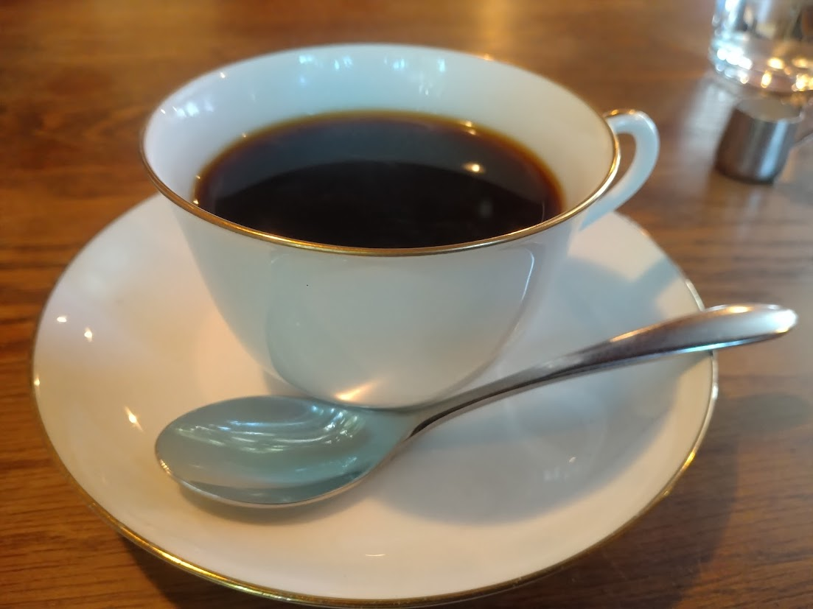

# 菊池 寿人 周报 — 2026-W22

- 周次：2026-W22
- 提交时间：2026-05-27 12:23:10
- 职位：Engineering　Manager

---

◆作業内容

①開発課題整理

＝＝＝筋の悪い案件＝＝＝＝＝＝＝＝＝＝＝＝

正しい情報を、正しく上に伝える事。

ここ忖度したり日和ると簡単にチームが全滅します。

攻めるも守るも、正しい情報の中で行いたい。

飛び越えて話進められると、フォローアップできません。

ご確認ください。

＝＝＝＝＝＝＝＝＝＝＝＝＝＝＝＝＝＝＝＝＝

■何言ってんだ案件2

話聞くだけで脳が疲弊する感覚が最も嫌いです。やめて欲しいのに何で時代が進んでもなくならないのでしょう。普通に普通の事をしないのが不思議です。免罪符と勘違いして発行されがちな、知らないから決められない、は、必要な事を整理するだけなら、関係ないはずです。その割に思いや想像を介入させる意図が全く判りません。要件やスコープという概念が無い時代に痛い目に遭わされていないのでしょうか？それならとても幸せな人生を歩んできたのだと思います。し、ある時代を経験しているなら、やらない理由が見つかりません。周りがやらないからといっても、自分が他者にそうして良い理由には成りません。と、言う夢を見たの。夢ね、夢。

これがね、荘子情弱宜しく、浅い理解の現実逃避の話であればまだいいんですが、自己判断への不信や囚われの世界でも迷いでもありません。その段階は私23歳で強制的に触れさせられ、とっくの昔に通り過ぎました。あぁ思い出してきた、ムラタめ。あいつのせいでどれだけ睡眠時間を削って哲学書思想書を読み漁った事か。なるほど、何言ってんだ案件、改め、またかよ案件だったか。あ、他にもいっぱい顔が浮かんで来た。マジで無駄な残業を沢山させてくれた人達のお蔭で、沢山勉強したなぁ。私にはいい思い出が沢山あるので、もう大丈夫です。これ以上増やす必要はないです。まぁ、夢だけどね、夢、夢。

・若い子向けのAKIRA講座

未読未見の人は、漫画版とアニメ版をお勧めします。手書きのクオリティがおかしい時代でもかなりおかしい名作です。ちょっと（記憶以上に）グロ描写ありです。デスマーチと親和性があり、とても良く会話にあがりました。開発現場では、朝昼晩限らず、誰かが死んだ目をして口走ってました。そう特に①を。

①到底現実として受け入れられないアホ仕様やスケジュールを渡された時に使うセリフ。夢落ちにしたい気持ちと、本来の意味での崩壊する未来や不吉な状況を感じた事自体、揶揄したい時に使うとベストチョイス。キヨコの予知(直観)が光る。

　「私、、夢をみたの・・」

②何時か自分も、あんな無理筋であり得ないバカげた指示や適当は発言を、同僚や部下に向かってしてしまうのではないか、あの様なバカオロカ達と同じ様に成り下がって、矜持も無いYesマンになるんじゃないか、と言う、悪口を思いっきり詰め込んだ独白を、全否定される前提で使う言葉。もし敬愛する上司や信頼する同僚部下から「せやな」「お前だけな」「そうっすね」「もう始まってますよ」って言われたら、心臓がギュッとなるやつ。あの様になりたくない時、君は違うよって否定されて安堵したい／甘える時に使うとベストチョイス。キヨコの達観、不安が滲む。

　「でも、いつかはきっと・・私たちにも・・・」

③デスマーチ上等、破綻済み、ブレーンワーク崩壊、案件に入った初回打ち合わせで、1か月遅れ（時には納品予定日を過ぎていたりすることも）を捲し立てられ、どうしてくれるんだと詰められる、そんな理不尽ながらもよくある愚痴を聞かされた時に使う言葉。本来の意味からはズレるが、ババーン、〇〇アウトーが無い時代に、何時もの事をいちいち愚痴んな、諦めな、と突き放しきらない時に使うと、語気も柔らかくてベストチョイス。マサルの冷静さ、諦観が垣間見える。

「もう始まっているからね」

■業務に特筆するべきものだけコメント多めにします

本当にマルチタスク過ぎですね

下流の調整なんて出来る事知れてるから上流で仕切って欲しい心

ほぼブレーンワーク次第なのでシレっと仕事出来ますけれども、

開発動き出すと最適化しまくってるので、ラフな割り込みは、

そこそこ脳みそ焼けます

●ポイント支払

遊べよとまれ♪

●インバウンド向け基幹対応仕様待ち

一旦、方向性が決まりました。

と思ったが、違うのか？確認とります。

●EC相談

どういう状況か連絡がないので、次回から消します。

●防犯エリア展開

整理を進めます。初手からやっとけば、と言うのはありますけどね。

●生鮮要望全般

脇田CK配下で運用準備完了。次回から消します。

・QR印字

考えます。

・保守観点

それでいいなんて、そんな感覚は、死ぬまで一回もねーんです。

口にした途端に、それは墓場にいると思った方がよいのですよ。

・展開チーム

浅い

（固定）

知識がない以前に、仕事としてのノウハウがない。

事に、適切な指導が行えていない。

から、そうなる、当たり前。

●支払併用の動き

開発中。

・2026リリース

6月リリースは見送りの方向で検討中。

・他一覧に乗っけるか検討中の案件複数

細々やりたい事が届いています。

・各種要望

重たい課題が複数動いている為、そもそものロードマップの組み換え

を行いながらブレーンワークをしている状況です。

ブレーンワークなので真顔で仕事していますが、中々にカオスです。

それはそれで、いつもの事なので気にせず相談してください。

●飲食POS

何がしたいのですか？

・その他、業務関連

割り込みマルチタスクが楽しい世界です。

③各種問合せ業務

・案件相談／概算見積もり

・店舗／コールセンター対応

④各種定例Ｍ

整理中

⑤割込作業

◆来週作業予定【6/1～6/5】

〇社内

今期要望整理

PoC各種

コール状況の棚卸

〇課題・要望の推進

棚卸

〇展開フォロー

成長しないのでもう無理です

〇其の他

なし

■最近見つけたお気に入り（未満）の焙煎珈琲店

ほぼほぼ毎週末、通っているお店。全然近所ではないものの、まぁ足を延ばせば・・という距離なので、足延ばして戻りながらの予定が多くなっている日常。では、そんなに好きなの？という話になるが、全国美味しい自家焙煎店ランキング（自分調べ）では、評価選考基準に合格する最低ランクというのが実情だ。こんな失礼な話は店主に言える訳も無く、落ち着いた雰囲気を醸しつつスマートにお会計しているが、内心のこうして欲しい、もっとこうであれば、という叫びにも似たモヤる気持ちを抱えたまま、それでも、なお、ここ以外でだと大分味落ちる店が１軒ある位で、もうほんとここしかないのだ。珈琲大好き人間の私にとって、地獄の様な環境、コンクリートジャングルで漸く見つけた一株のシロツメクサの様な珈琲店なのだ。これに限っては、完全に味の傾向の話になるが、どうも福岡市という所は、浅入り酸押し出しフルーティ寄せフローラル軟弱文化が蔓延っていると見ている（自分調べ）。割と古い老舗に入っても、最近出来た尖った所でも深入りコク苦甘系にとんと出会わない。勿論、嗜好の傾向が違うだけで、軟弱と言うのはただの100％悪口なのだが、全国的にも見てもこれだけの都市感があるはずなのに、こんな味のレンジが狭いのが不思議で仕方ない。故に私の地獄である。東京の文化創出量が全国の91%を占めるという持論でいくと、東京は判る。京都は文化的な背景ひっくるめて大割愛するが判る。名古屋は商業都市でもあり、文化的な焼き物王国でもあり、珈琲のみならず洋食器のノリタケを構える産業と紐づいているからそう思えばまぁ判る。怒られるが、神奈川（横浜界隈）やら兵庫（神戸周辺）挙げてないのは、近くに文化発信力強がいるからしゃーない判れ。大阪も純喫茶文化がまだ残るが、京都とも兵庫とも仲良くないし、歯の抜けたおっちゃん達は珈琲よりカップ酒だから、まぁ、判れ（大阪Love）。そう何故福岡はここまで味のレンジが狭いのか、これも来福時、大好きな珈琲店を探すべく徘徊し、ついに心折れた5年来の研究のテーマなのだが、最近、老舗うどん屋を巡ってみて、大きな気付きを得た。いや、納得が行く答えた出たのだ。この研究成果を引っ提げて、東京の文化サロンの様な居酒屋で、私が知る現存する数少ない大人達に披露してみよう。きっとケツの青い餓鬼扱いして、歴史的文化的文学的音楽的詩的な観点から、あーだこーだと蘊蓄を垂れ流してくれるに違いない。それをBGMにして飲む樽酒が、まぁ旨いんだ。

・１杯800～1000程度、店の雰囲気は良い。

私信へ返信

>タイムスリップ

いいですねぇ、凄く仲良くなれた予感がします。

>予算

いいなぁ。私なんて何も無い状態で、立て直しに一生懸命やってても、何やってるか全く判ってくれなかったので、そうそうに諦めちゃった代わりに、全部自前の持ち出し（思考と労働）でやってましたよ。評価もされないけど、評価されたくてやってるんじゃないし、現状を楽したくてやってましたから採算度外視ですよ。尤も、そういう姿をみてニヤッと笑ってくれる様な理解ある上司や先輩が近くに居たら、それはそれで何にもならなくても励みになるんですけどね。うちには御大が居た分、楽しく愚痴れましたけれども。話が通るといいですね。

全体的に

・フロントエンド内の業務応援やフォローなども突発的に発生し、

各自の業務が増加している傾向にあるが、全体で共有して

進めて行く。

・相談が増える中で、やりたい事が出来るかどうかだけ聞かれる、

段取りも無く突然依頼が来る、等、進め方がおかしい部分の改善図りたい。

以上
