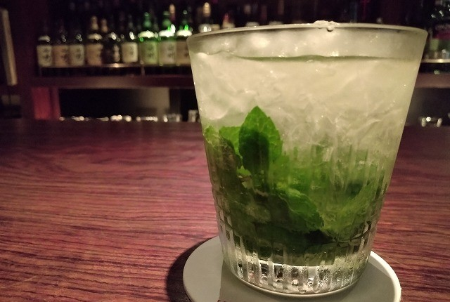

# 菊池 寿人 周报 — 2026-W23

- 周次：2026-W23
- 提交时间：2026-06-04 02:56:51
- 职位：Engineering　Manager

---

◆作業内容

①開発課題整理

＝＝＝筋の悪い案件＝＝＝＝＝＝＝＝＝＝＝＝

正しい情報を、正しく上に伝える事。

ここ忖度したり日和ると簡単にチームが全滅します。

攻めるも守るも、正しい情報の中で行いたい。

飛び越えて話進められると、フォローアップできません。

ご確認ください。

＝＝＝＝＝＝＝＝＝＝＝＝＝＝＝＝＝＝＝＝＝

■最高に最低なので最高にハイな教科書になるんだけれどもね

昔々の先輩達は、駄目案件、駄目プロマネ、駄目SE、駄目プログラマーを実例を徹底的に分解分析して、

・年齢や役職

・経歴や経験

・性別や性格や嗜好

等など、ありとあらゆる要素を排して、徹底的に純粋に何がどう駄目だったかを抽出して教材にすると言う、震え上がる様なレクチャーをしてくれていました。もう何が震えるって、どんなに上の人間が庇おうとしようが、本人が言い訳したくても、どこまでもその原因から人格を排してしまう為、純粋な因果しか発生しない所まで、突き詰めてしまうからなのです。やれ別案件が多忙で～、やれ体調がすぐれず～、やれ家庭に不幸が～など、一ミリも入り込む余地がない、ただただその事象を引き起こしたFunctionとして、駄目な部分を詳らかに大公開してしまうのです。客観的に、神経が露出したかの様な剥き身に、現実という塩やらワサビやらタバスコが振りかけられるので、題材にされた日には、リアルひくひくとしか蠢かない肉塊にしか見えないのですが、とてもとても参考になったものです。何が悪いかが丸わかりだから。ただやってはいけない事をやったら、良くない事が起こるという事実だけが公衆と言う名のチーム内外に知れ渡るだけで、その様な肉塊にならない様に、身を引き締めたものです。唯一、新人だけはその皿の上に乗っからなくてよかったのは幸いでしたが、その新人の担当教育者は皿にあげられてしまう為、それが終わるまで、そして終わっても、ヤラカシタ当事者からすると口をパクパクとする事しか出来なかったのを思い出します。トライルでは、とても参考になるような程度の低い失敗プロジェクト推進が定期的に発生するのですが、先回から続いている怒り、もとい、呆れの原因案件なんて、最っ高にハイな初心者向け戒め教材になるのになぁ、勿体ないなぁ、と、思ってしまいます。頭の中に住んでいる当時の諸先輩達がどんな顔して調理するのか、考えるだけでも、ノスタルジックな気持ちになりますね。議長なのかファシリなのかPMなのか、なんなんですかね。

■業務に特筆するべきものだけコメント多めにします

本当にマルチタスク過ぎですね

下流の調整なんて出来る事知れてるから上流で仕切って欲しい心

ほぼブレーンワーク次第なのでシレっと仕事出来ますけれども、

開発動き出すと最適化しまくってるので、ラフな割り込みは、

そこそこ脳みそ焼けます

●ポイント支払

情報待ち。

●インバウンド向け基幹対応仕様待ち

現状考えうる一番素晴らしい回答。事実上の対応なし。

ただし、ちゃんと未来像があってるのかな。

●免税対応

追加で検討した方がよい状況がでてきました。こういうのが領海侵犯で、その為の知識習得や自分達以外への配慮だと思うんですよね。自分達が欲しい物だけ考えて終わりっていうのは幼いと思うんですよね。あ、これは違う案件の話ですけども。仕様検討中です。

●防犯エリア展開

お待たせしました。確認中です。

・QR印字

考えます。

・保守観点

それでいいなんて、そんな感覚は、死ぬまで一回もねーんです。

口にした途端に、それは墓場にいると思った方がよいのですよ。

・展開チーム

浅い

（固定）

知識がない以前に、仕事としてのノウハウがない。

事に、適切な指導が行えていない。

から、そうなる、当たり前。

●支払併用の動き

テスト中。

・2026リリース

6月リリースは見送りの方向で検討中。

・他一覧に乗っけるか検討中の案件複数

細々やりたい事が届いています。

・各種要望

重たい課題が複数動いている為、そもそものロードマップの組み換え

を行いながらブレーンワークをしている状況です。

ブレーンワークなので真顔で仕事していますが、中々にカオスです。

それはそれで、いつもの事なので気にせず相談してください。

●飲食POS

何がしたいのですか？

・その他、業務関連

割り込みマルチタスクが楽しい世界です。

③各種問合せ業務

・案件相談／概算見積もり

・店舗／コールセンター対応

④各種定例Ｍ

整理中

⑤割込作業

◆来週作業予定【6/8～6/12】

〇社内

今期要望整理

PoC各種

コール状況の棚卸

〇課題・要望の推進

棚卸

〇展開フォロー

成長しないのでもう無理です

〇其の他

なし

■もう夏ですよ

油断して忘れる所でした。

現在、禁酒生活を余儀なくされているのですが、夏本番前に、今年分の最高に最高なモヒートを堪能しておかなければなりませんね。

私信へ返信

>高い

私が飲んだ１杯の珈琲の最高値は7000円です。ちなみに、ブルマンで、コピルアックではございませんよ。

>深い

少なくともマスターの辿った人生が垣間見える様な珈琲に出会った経験が何度かあります。きっとそうなんだと思います。

全体的に

・フロントエンド内の業務応援やフォローなども突発的に発生し、

各自の業務が増加している傾向にあるが、全体で共有して

進めて行く。

・相談が増える中で、やりたい事が出来るかどうかだけ聞かれる、

段取りも無く突然依頼が来る、等、進め方がおかしい部分の改善図りたい。

以上
