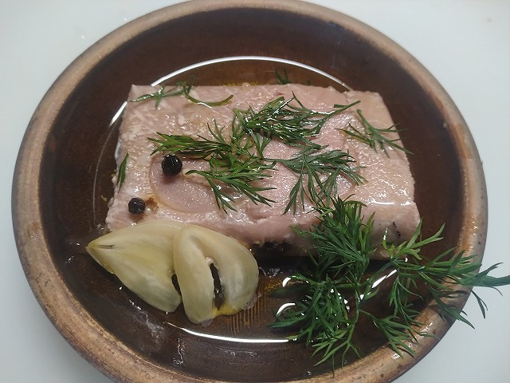
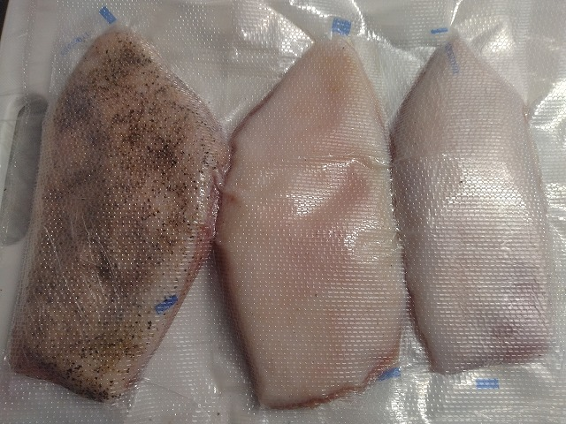

# 菊池 寿人 周报 — 2026-W24

- 周次：2026-W24
- 提交时间：2026-06-11 02:08:04
- 职位：Engineering　Manager

---

◆作業内容

①開発課題整理

＝＝＝筋の悪い案件＝＝＝＝＝＝＝＝＝＝＝＝

正しい情報を、正しく上に伝える事。

ここ忖度したり日和ると簡単にチームが全滅します。

攻めるも守るも、正しい情報の中で行いたい。

飛び越えて話進められると、フォローアップできません。

ご確認ください。

＝＝＝＝＝＝＝＝＝＝＝＝＝＝＝＝＝＝＝＝＝

■やればやる程、世界が広がるの意味

「やった事がある」なんて安易に口に出来る奴は、トンデモなくハードな経験を乗り越え自信を勝ち取った極々一部の奴等か、まったく何も知らないド素人しかない。極論の様に聞こえるかもしれないが、普通に仕事しているだけなら、「やった事がある」と言う言葉の厚みをどの様に増やしてきたか、口に出して説明してみればいい。どれだけの言葉が、「やった事がある」と出た口から、説明できるのか。ピンとこないならもう一つ視点を変えてみようか？その「やった事がある」は自分以外の世間の、誰が、どの様に評価して、お墨付き太鼓判を貰っているのか。そう思えば、自分で考えてやってみただけの事を、「やった事がある」と称するのは、詐称に近く、正当性も価値も不確かなもので胸を張れるなんて、出来る訳が無い事に気が付くだろう。一部天才の話ではなく、私含めた普通のおっさんが生きている間に、完璧な世界にたどり着く訳が無く、今やっている事ですら、もっと良いやり方、改善の余地しかないと思うのが普通だろう。何時まで経っても成長過渡期でしかない我々多くのただのおっさんも「やった事がある」と口にする機会はあるだろうが、「やった事がある」と口にしたそこに、どれだけの経験と覚悟と熱量が伴っているのかをもう一度、考えて欲しい。少し前に戻るが、「やった事がある」と口にしたそれは、何かを成し遂げた経験なのか、ただの独りよがりなのか。世の中の誰にも褒められてもいない「やった事」なんて何の価値もない怖さに気が付くべきだ。もとい、本当の天才なら時代にそぐわなかった不遇があるが、残念ながらそんな奴は四半世紀の社会人人生で見た事ないのでここでは除外させて貰います。さて、出来るだけ早い段階で、確り現実と向き合って、不足を認知するメタ視点が必要なんだよな。自炊しますよ、米炊けるし、焼肉のタレ掛けたら大体美味しいですって奴でも、「料理出来ます」と言えるけど、じゃぁ、高い金払って外食した店の料理長が前述のそれだったら、誰が許してくれんねん。少なくとも金払った奴は絶対許さんだろう事くらいは想像出来る様になって欲しいもんです。若い子、ほんと、今の今が大事。

■業務に特筆するべきものだけコメント多めにします

本当にマルチタスク過ぎですね

下流の調整なんて出来る事知れてるから上流で仕切って欲しい心

ほぼブレーンワーク次第なのでシレっと仕事出来ますけれども、

開発動き出すと最適化しまくってるので、ラフな割り込みは、

そこそこ脳みそ焼けます

●ポイント支払

情報待ち。ないとこれ以上は進みません。

●インバウンド向け基幹対応仕様待ち

こちらも情報待ち。

●免税対応

テスト環境構築できれば一段進みます。

●防犯エリア展開

7月6日から店舗を変えて未スキャン検知の運用が広がります。

・保守観点

それでいいなんて、そんな感覚は、死ぬまで一回もねーんです。

口にした途端に、それは墓場にいると思った方がよいのですよ。

・展開チーム

浅い

（固定）

知識がない以前に、仕事としてのノウハウがない。

事に、適切な指導が行えていない。

から、そうなる、当たり前。

●支払併用の動き

別件対応の為、一時停止。

・2026リリース

6月リリースの動きをかけてます。

・他一覧に乗っけるか検討中の案件複数

細々やりたい事が届いています。

・各種要望

重たい課題が複数動いている為、そもそものロードマップの組み換え

を行いながらブレーンワークをしている状況です。

ブレーンワークなので真顔で仕事していますが、中々にカオスです。

それはそれで、いつもの事なので気にせず相談してください。

・その他、業務関連

割り込みマルチタスクが楽しい世界です。

③各種問合せ業務

・案件相談／概算見積もり

・店舗／コールセンター対応

④各種定例Ｍ

整理中

⑤割込作業

◆来週作業予定【6/15～6/19】

〇社内

今期要望整理

PoC各種

コール状況の棚卸

〇課題・要望の推進

棚卸

〇展開フォロー

成長しないのでもう無理です

〇其の他

なし

■久しぶりに健康意識を持ってしまうと、なまじっか知識がある為・・

興味があると調べ上げては忘れ、調べ上げては工夫し、飽きて違う方法を探す様な事をずっと続けていると、割と知識と結果を伴う体験が溜まるので、大変なことになる。ちょっと健康意識に目覚めたモノの、三食腹いっぱい食べてるのに、尖がり過ぎてカロリーが足りない。蛋白質と食物繊維は十分だけど、糖質と脂質が追い付いていない。今回はまれに来る知識の弊害時期だけど、体が軽いのでしばらくこの状況でデータ取ってみよう。その頃には、自家製パンチェッタや自家製グランチャーレも完成しているだろうから、脂質の未来は明るい。

・中とろの部位で作った自家製シーチキン。上手いが原価が掛かり過ぎ。

・グランチャーレ仕込み中：８日目。胡椒追加／塩追加／ギリギリ塩分の３つに分岐

私信へ返信

>始まって

展開しそうな話がでた時に、また声かけてください

全体的に

・フロントエンド内の業務応援やフォローなども突発的に発生し、

各自の業務が増加している傾向にあるが、全体で共有して

進めて行く。

・相談が増える中で、やりたい事が出来るかどうかだけ聞かれる、

段取りも無く突然依頼が来る、等、進め方がおかしい部分の改善図りたい。

以上
