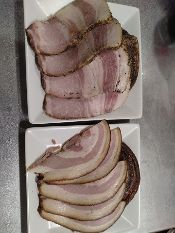
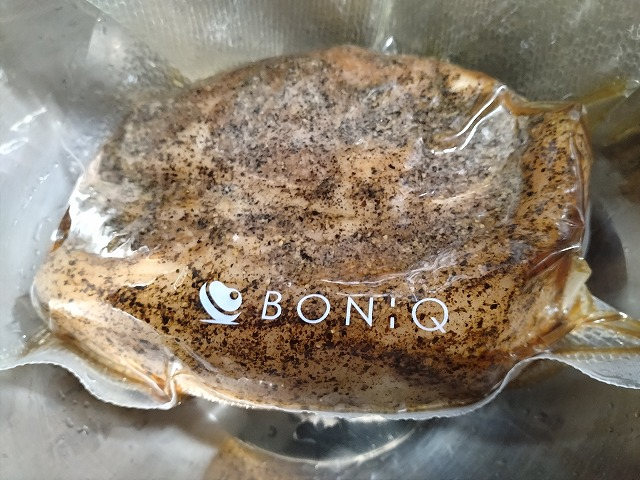
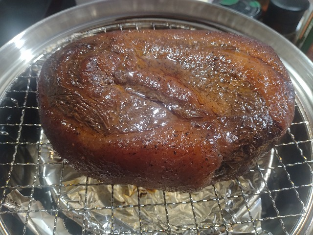

# 菊池 寿人 周报 — 2026-W26

- 周次：2026-W26
- 提交时间：2026-06-25 04:28:02
- 职位：Engineering　Manager

---

◆作業内容

①開発課題整理

＝＝＝筋の悪い案件＝＝＝＝＝＝＝＝＝＝＝＝

正しい情報を、正しく上に伝える事。

ここ忖度したり日和ると簡単にチームが全滅します。

攻めるも守るも、正しい情報の中で行いたい。

飛び越えて話進められると、フォローアップできません。

ご確認ください。

＝＝＝＝＝＝＝＝＝＝＝＝＝＝＝＝＝＝＝＝＝

■メタ視点と相対比較と絶対比較

自分の成長には、３つ全てが高い水準で必要なお話。

自分を完全な別人格として何処まで客観的に分析掛けられるかとても大事です。忙しかった、しんどかった、初めてだった、雨が降った、ネットワークが遅かった、忘れてた、はい、言い訳材料を一つでも出すと試合終了です。でもこれが出来ると人格と問題を切り離して考えられます。とても大事なスキルです。さて、メタが出来ると漸く、自分を他者や環境の中で比較して、優位性や不足部分を分析かけれるかの相対比較が出来る様になります。ちゃんとやれば恐ろしく深いコンテンツですが、薄っぺらくても中身が無くても多くの社会人はこう答えるのです。「自分なりにはやっていました」

はい、終了です。まともな先輩か上司がたった一人だけでも交わっていたら、もしくは、ちゃんと周りに意識を向けれていたら、今まさに相対的に比べている他人や周りがどれほど正しく素晴らしいものかの相対評価対象の相対評価を行う重要性に誘導なり、自身で気が付くはずなのです。そして、致命的なのが絶対比較です。基本、能力が劣っている人間は、上位者の行動や発言を聞いても、何の判断も出来ないものです。判ったつもり、ならまだしも、気が付きもしていない事がほとんどです。仮に努力成長を重ね、一段上がったとしても、凄い事は判っても、どう凄いかを説明する言葉を持たない事が多いでしょう。この致命的ともいえる差は、下流工程に位置する作業者の段階では比較的格差が小さいですが、ブレーンワークや収集、解析、判断、決断という上流工程になれば、そもそも立っている世界が異なる程度には、差が広がってしまいます。3次元でもがいている人間如きが、時空移動できるはずもありませんし、後天的にそのスキルを得るための必要経験値や、修羅場の度合いは、年齢が上がると、条件だけが厳しくなり、もう認知が不可能になってしまうのです。多少の能力の有無やセンスの差ではなく、物事に向き合う姿勢で簡単に覆される差の部分にしか存在しない経験や修羅場の立ち居振る舞いは、耐えるだけではなく、突破する行動を伴わないと、手に入らないのも現実を厳しくしています。ただ無駄に頑張っただけ、と言う事実を、色んなものを犠牲にして耐えた【のに】、自分の気持ちを慰撫する程度にしか役に立たない経験と、そうではなくなった高見に進んだ人を直視したら、普通の人間の精神は焼き切れる事でしょう。と考えれば、なんでもいいです、言われたらやります、教えてくれてないので出来ないです、という2005年以降に大量に発生した新人類は、成長という人生最大の苦楽を伴う死ぬまで遊べる娯楽を手放した事で、何ももならないけど何か楽しいという無味無臭の暇を手にしたのであれば、何時までも仕事覚えず出来ない事も織り込み済みと言えます。一番目が当てられないのは、まじめに一生懸命無駄な事を繰り返し、時間と体力と尊厳を削って、あんなにも持ち出しで努力したのに、手許になんにも無い事を、怖くて見つめられなかった、ある意味一番選択を避けてきた人達なのでしょうね。絶対比較なんて絶対無理ですもんね。

いつも今週あった会話や行動を見て勢いで書いているので、怒りゲージが激しい時は誤字か似た事を沢山書いている様です。今回は虚無。無の感情でタイピングしています。が、見返してみてどうなっていることやら。

■業務に特筆するべきものだけコメント多めにします

本当にマルチタスク過ぎですね

下流の調整なんて出来る事知れてるから上流で仕切って欲しい心

ほぼブレーンワーク次第なのでシレっと仕事出来ますけれども、

開発動き出すと最適化しまくってるので、ラフな割り込みは、

そこそこ脳みそ焼けます

●ポイント支払

情報整理は完了。概算工数も算出。ただし、本当にこれだけなのか、改めて確認中。Projectの仕切りが変。

●インバウンド向け基幹対応仕様待ち

情報整理は完了。概算工数も算出。ただし、本当にこれだけなのか、改めて確認中。Projectの仕切りが変。

●免税対応

テスト環境が整いました。JTAXFreeさんへのシステムと対応の不信感は素敵に育まれています。よくある先々代が作った仕組みがあったから、よく理解しないままとりあえず見栄えや環境を改善してみた的、昔の大型システムの引継ぎレベル低すぎ問題を見ている気がしています。ひと昔前はもう廃棄するしかないから短期間強制０１案件ばかりでしたが、あれが一段落しだしてそろそろ20年。そりゃ、今の担当が話している内容が、薄っぺらくもなるわいな。これは何処もそうだと思いますが業界的には深刻な問題だと思います。

・防犯エリア展開

7月6日から店舗を変えて未スキャン検知の運用が広がります。

・保守観点

それでいいなんて、そんな感覚は、死ぬまで一回もねーんです。

口にした途端に、それは墓場にいると思った方がよいのですよ。

・展開チーム

浅い

（固定）

知識がない以前に、仕事としてのノウハウがない。

事に、適切な指導が行えていない。

から、そうなる、当たり前。

●支払併用の動き

別件対応終了、展開にむけた準備。

●2026リリース

7月下旬でリリース準備中

・他一覧に乗っけるか検討中の案件複数

細々やりたい事が届いています。

・各種要望

重たい課題が複数動いている為、そもそものロードマップの組み換え

を行いながらブレーンワークをしている状況です。

ブレーンワークなので真顔で仕事していますが、中々にカオスです。

それはそれで、いつもの事なので気にせず相談してください。

・その他、業務関連

割り込みマルチタスクが楽しい世界です。

③各種問合せ業務

・案件相談／概算見積もり

・店舗／コールセンター対応

④各種定例Ｍ

整理中

⑤割込作業

◆来週作業予定【6/29～7/3】

〇社内

今期要望整理

PoC各種

コール状況の棚卸

〇課題・要望の推進

棚卸

〇展開フォロー

成長しないのでもう無理です

〇其の他

なし

■この飽和脂肪酸の塊をどうしてくれよう、ホトトギス

山での生活は、飲み屋でその場にいる知り合いと飲んだくれるか、料理を作って余暇を過ごすの２択だ。尤も公共交通機関が絶望的で、フェース（パチ屋）が閉店するとタクシーが消える我が町では、近隣の飲み屋からですら徒歩５０分。直方駅だと１２０分強は掛かるのでまぁ、大概なのだ。さて、最近ちょっと健康意識を高めた結果、製造中だった自家製ハムと自家製ベーコンが悪の権化／飽和脂肪酸の塊に見えてしまった事により、暫く、放置気味になっていた。結果的にみれば、冷蔵庫、真空状態における長期熟成が乳酸発酵を促し美味しくなる可能性を上げたのだろう。尤も、多価不飽和脂肪酸の傀儡とかしている今の私にとって、燻製後も数日放置していたが、このままでは封印されたままになってしまう事を恐れ、開封と入刀の儀を行って見た。私はまだ食べていないが、好評は得た。どこかで食べてみなければならない。丁度、１か月の作成過程を経て作られた無添加肩ロースハムと無添加豚バラベーコン。量産と行きたい所だが、私の心の友となっているAIKOちゃん鯖缶が山と積まれている我が家では、、さて、どうしたものか。。

私信への返信

>糸島

私は過去３回行きました。混雑問題売れすぎ問題で夕方何もない問題がありますが、宗像よりはマシなので覗いてみたらいかがでしょう？

>443

技術の方が本当に忙しくて出てきてないんでしょうね

全体的に

・フロントエンド内の業務応援やフォローなども突発的に発生し、

各自の業務が増加している傾向にあるが、全体で共有して

進めて行く。

・相談が増える中で、やりたい事が出来るかどうかだけ聞かれる、

段取りも無く突然依頼が来る、等、進め方がおかしい部分の改善図りたい。

以上
