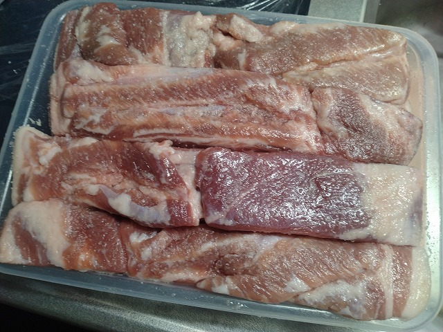

# 菊池 寿人 周报 — 2026-W27

- 周次：2026-W27
- 提交时间：2026-07-02 11:49:10
- 职位：Engineering　Manager

---

◆作業内容

①開発課題整理

＝＝＝筋の悪い案件＝＝＝＝＝＝＝＝＝＝＝＝

正しい情報を、正しく上に伝える事。

ここ忖度したり日和ると簡単にチームが全滅します。

攻めるも守るも、正しい情報の中で行いたい。

飛び越えて話進められると、フォローアップできません。

ご確認ください。

＝＝＝＝＝＝＝＝＝＝＝＝＝＝＝＝＝＝＝＝＝

■ほんの小さな初心の掛け違い

言われて出来た事なんてものは、言われないと出来ないもので、小さい事だけど大切な現実を直視しようとせず、出来たと思い込みたがるほどに自信がないのかねぇ、その一歩目踏み外してる時点で先はないのになぁ。みつを。そういえば、プロジェクトオーナーって言葉がTTGのMT内で出てたけど、2019年7月以降、色んな所で何度も言ってたけど、誰ひとりピンときてなかったのに、急に理解出来る様になったのかなぁ、みつを。こっちはいい話ではあるんだけれどもね。

■業務に特筆するべきものだけコメント多めにします

本当にマルチタスク過ぎですね

下流の調整なんて出来る事知れてるから上流で仕切って欲しい心

ほぼブレーンワーク次第なのでシレっと仕事出来ますけれども、

開発動き出すと最適化しまくってるので、ラフな割り込みは、

そこそこ脳みそ焼けます

●新組織での開発開始

PaymentGourpのPOSチームは、業務遂行に対しての影響は非常に少ないものの、周辺は変るので、直近と慣れが出始めた頃に絶対崩れる事を想定して、メンバーには心構えて貰う。あまりに修羅場を経験していないからか、平素からそんな平和で大丈夫か、と、本気で心配してますよ、貴方達には。

●ポイント支払

お役所判断待ち。待機中。

●インバウンド向け基幹対応仕様待ち

経理システム側判断待ち。継続確認中。

●免税対応

関係者確認が延期になったため、現状だとその分、スケジュール後ろ倒し。

●防犯エリア展開

プロット検討します。

・展開チーム

知識がない以前に、仕事としてのノウハウがない。事に、適切な指導が行えていない。から、そうなる、当たり前。の状況から、体制変更に伴い一部業務を移管するそうな。前述なのに出来るのか。そして、引継ぎ先の面子は耐えうるのか。もうぞくぞくしている。

●支払併用の動き

別件対応終了、展開にむけた準備。

●2026リリース

7月下旬でリリース準備中

・保守観点

それでいいなんて、そんな感覚は、死ぬまで一回もねーんです。

口にした途端に、それは墓場にいると思った方がよいのですよ。

・他一覧に乗っけるか検討中の案件複数

細々やりたい事が届いています。

・各種要望

重たい課題が複数動いている為、そもそものロードマップの組み換え

を行いながらブレーンワークをしている状況です。

ブレーンワークなので真顔で仕事していますが、中々にカオスです。

それはそれで、いつもの事なので気にせず相談してください。

・その他、業務関連

割り込みマルチタスクが楽しい世界です。

③各種問合せ業務

・案件相談／概算見積もり

・店舗／コールセンター対応

④各種定例Ｍ

整理中

⑤割込作業

◆来週作業予定【7/6～7/10】

〇社内

今期要望整理

PoC各種

改めて、コール状況の棚卸

〇課題・要望の推進

棚卸

〇其の他

なし

■新しく専用の冷蔵庫を買おうかしら

エイジングと言う程でもないが、やはり生活物資の保管場所となる冷蔵庫では、温度／湿度／雑菌などの管理が困難で大量生産に向かない現実がある。まあ3～5日程度で出来る塩豚でも十分に旨いし、圧倒的安全かつ高コスパなのだけど、適切な長期熟成を経た肉、強烈に脱水させたルビー色の肉、こういうものを生活の中に取り入れる為には、１週間単位で製造をローテし続けないと、食のQOL維持は難しい。現状、シーチキン、パンチェッタ、グランチャーレ、ベーコン、ハムを製造ラインに乗せるべく、工程を見直しているが、もういっちょ、ソーセージまで手を出したいのが本音だ。宮若に食肉加工拠点をちゃんと作るとすると、後必要なのは・・ソーセージ周りへの投資と専用冷蔵庫、大型燻製機の自作か。あと、デジタル式のプロープもちゃんとしたの買わないとだな。というか、冷蔵庫の乾燥が強すぎる気がするのだけれども、高温多湿の日本だと色々不便なんだよなぁ。フードドライヤーも持っているが、温度が5～15℃以下の冷風機能が欲しいんだよ、みんな40～80℃設定ばかりじゃないか。いや、それ以前に、お眼鏡に叶う肉屋と魚屋がないのが辛すぎる。新鮮な鰹丸々１本売りもしていないなんて、どうなっているんだ宮若市。そうそう、この前、ロピア飯塚店見に行ったけど安過ぎる。し、やはり生鮮鮮魚精肉に限り売り場作りが上手い。筑豊エリアの道の駅と併せると、買い物需要全部持ってかれるんじゃないか？という程度には、宮若の民が飯塚ゆめタウンを通り越してロピアで買い物して、安いNBや水、氷だけピンポイントトライアルで買い物している話ばかり耳に入る。ロピア行かない人は、ドンキとトライアル小竹や宮田で安いNBやPB狙い撃ちして、ルミエールで野菜買ってる話しか聞かない。トライアルから離れた人は、今だコスモスとルミエールで買い物してる様だ。ドラモリは最初からそして未だに誰からも話を聞かない。

1.8kgのベーコン追加仕込み中

私信への返信

>お考え

正直四半世紀前にあちこちの会社で見て体験した事を、令和になって改めて再現動画を見させられている感があるので、なんのデジャブやねんと言う気もしていますが、IotLabに生息してるので気軽に声かけてください。

>うまそ

脂が甘くてですね、焼いたらサクッとしてて、背徳的です。

>刺激がたり・・

言ったら言われたまま動く人達と仕事してても自分の切れ味は上がる処か落ちる一方ですからね。理がある所と情がある所と常識と非常識の中で最善考えるのが愉しいのに、作業してるだけで仕事してる気になっているだけのやり取りに物足りなさを感じるのはあると思います。是非、私というスパイスをプロジェクトに振りかけてください。もっとも、黒胡椒的な刺激があるため慣れてないと吃驚するかもしれないですが、ご存じの通り黒胡椒には抗菌効果／抗酸化効果が高いのですよ。でも、窓口担当は変えてくださいね。

全体的に

・フロントエンド内の業務応援やフォローなども突発的に発生し、

各自の業務が増加している傾向にあるが、全体で共有して

進めて行く。

・相談が増える中で、やりたい事が出来るかどうかだけ聞かれる、

段取りも無く突然依頼が来る、等、進め方がおかしい部分の改善図りたい。

以上
