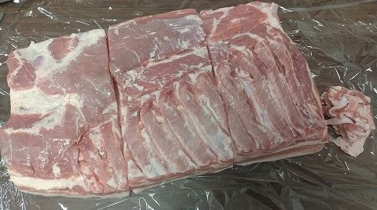
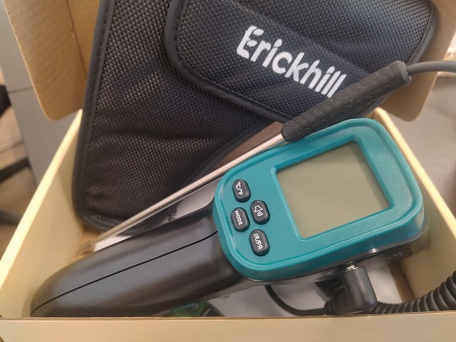

# 菊池 寿人 周报 — 2026-W28

- 周次：2026-W28
- 提交时间：2026-07-08 01:53:40
- 职位：Engineering　Manager

---

◆作業内容

①開発課題整理

＝＝＝筋の悪い案件＝＝＝＝＝＝＝＝＝＝＝＝

正しい情報を、正しく上に伝える事。

ここ忖度したり日和ると簡単にチームが全滅します。

攻めるも守るも、正しい情報の中で行いたい。

飛び越えて話進められると、フォローアップできません。

ご確認ください。

＝＝＝＝＝＝＝＝＝＝＝＝＝＝＝＝＝＝＝＝＝

■たまには

無いも書かないのも良いのではないでしょうか。

■業務に特筆するべきものだけコメント多めにします

本当にマルチタスク過ぎですね

下流の調整なんて出来る事知れてるから上流で仕切って欲しい心

ほぼブレーンワーク次第なのでシレっと仕事出来ますけれども、

開発動き出すと最適化しまくってるので、ラフな割り込みは、

そこそこ脳みそ焼けます

●新組織での開発開始

新会社になったけど、今まで通りの役割のまま。何時頃から謳い文句の通りに業務移行が始まるのだろう。

●新支払メディア相談

要件連携待ち。

●飲食対応

要件連携待ち。

・ポイント支払

お役所判断待ち。待機中。

・インバウンド向け基幹対応仕様待ち

経理システム側判断待ち。継続確認中。

●免税対応

連絡お待ちしています。現状だとその分、スケジュール後ろ倒しのままです。

●防犯エリア展開

プロット検討します。

・展開チーム

知識がない以前に、仕事としてのノウハウがない。事に、適切な指導が行えていない。から、そうなる、当たり前。の状況から、体制変更に伴い一部業務を移管するそうな。前述なのに出来るのか。そして、引継ぎ先の面子は耐えうるのか。もうぞくぞくしている。

●支払併用の動き

別件対応終了、展開にむけた準備。

●2026リリース

7月下旬でリリース準備中。

●Kubernetes絡みのアップデート

　定期的に発生する業務。

●東京短期出張

関係者と確認中。

・保守観点

それでいいなんて、そんな感覚は、死ぬまで一回もねーんです。

口にした途端に、それは墓場にいると思った方がよいのですよ。

・他一覧に乗っけるか検討中の案件複数

細々やりたい事が届いています。

・各種要望

重たい課題が複数動いている為、そもそものロードマップの組み換え

を行いながらブレーンワークをしている状況です。

ブレーンワークなので真顔で仕事していますが、中々にカオスです。

それはそれで、いつもの事なので気にせず相談してください。

・その他、業務関連

割り込みマルチタスクが楽しい世界です。

③各種問合せ業務

・案件相談／概算見積もり

・店舗／コールセンター対応

④各種定例Ｍ

整理中

⑤割込作業

◆来週作業予定【7/13～7/17】

〇社内

今期要望整理

PoC各種

改めて、コール状況の棚卸

〇課題・要望の推進

棚卸

〇其の他

なし

■ぼくのどりーむほーぷをかえして

宮若勤務の喜びになりえた「ドリームホープ」がまさに目の前で分裂崩壊し爆散して焦土化、気鋭の洋野菜達が消えると同時に私の目から光が消えてからもう幾年。後を追うかのように鮮魚【のみ】魅力的だったサンキュー宮若が閉店。悔しくても指を咥えて見るしか出来なかった糸島の「伊都菜彩」、混み過ぎ気持ち悪いねん「宗像」の２大道の駅を羨ましく思いつつ、出来たはいいが、使い辛い位置の「嘉穂テラス」は鮮度は良いがちょっち高い、や、個人的には好きだがこれまた日田彦山線廃線によって行き辛くて仕方ない「歓遊舎ひこさん」、まったく、この辺りが近くにある町は羨ましい限りだ。そう言う見方をすれば、筑豊と呼ばれる広大なエリアには、それなりの規模で充実していて割と魚屋が頑張っとるんかい糸田にある「おじゅごんちからすお」や、似た野菜ばっかりやけどジビエ充実しとるな「おうとう桜街道」、ちょっと小ぶりだが嘉麻にある道の駅「うすい」、同じくらい小ぶりだが、この辺り特有のイートイン付き道の駅、香春にある「わぎえの里」なんかも十分羨ましい。わぎえの里に行くなら豚足も仕入れルートだしね。勿論、福岡県でみれば、有力な野菜王国やフルーツ王国の道の駅もあるが生活圏に無さ過ぎて無縁。結局、路面販売している八百屋が結構散逸して存在し、まぁ、本当に羨ましいったらありゃしない。そこで野菜買える奴が、どこで野菜買うねん、って程には、鮮度が段違いだ。普段食品の買い物をしない人達にはまったく理解出来ないだろうけれど、碌なもんじゃない野菜は、あっという間に傷む。勿論、味なんて期待する価値もない。最近の若い子は知らんかもしれないが、人参特有の何とも言えない独特の味と香気は子供の天敵だった。ピーマンの苦さや、トマトの青臭さなど、何処に行ったのか。品種改良だけにとどまらず、薬品ぶっかけ、放射線照射で発芽を止めるなど狂気染みた行動は、全て家事も碌に出来ないまま大人になった奴等や、まともな食育もないまま、育ってしまった馬鹿舌大人のせいでもあるから私等の親世代～私等年代の罪だろう。品種改良で個性は消えたものの、道の駅や路面販売の野菜達は手間暇が掛かった形の悪い不揃いの野菜達ばかりでも、何にしたって美味しい。生鮮コーナーを猫跨ぎする層は、結局、知ってる人達なんだろうな。ここ最近の筑豊エリアが激戦地化によって、料理上手の知り合いの購買ルートが固定化されつつある。これはスーパーセンタートライアル宮田店として良い話ではない。か、客層を絞り込む割り切りの契機なのかも。

流石、筑豊と言えば屠殺場があったで有名なだけあり、良い精肉店あるじゃん。

ちなみに、片バラ半枚買うつもりだったのに、１本買ってしまったのは、痛恨の極み（悪ノリ）。5468g也。

どっかに無くしてしまった為、赤外線＋物理が使える二刀流プロープを再購入。針が太くて嫌なんだけども。

私信への返信

>連絡します

お待ちしてます

>おもしろ

くしましょうよ

全体的に

・フロントエンド内の業務応援やフォローなども突発的に発生し、

各自の業務が増加している傾向にあるが、全体で共有して

進めて行く。

・相談が増える中で、やりたい事が出来るかどうかだけ聞かれる、

段取りも無く突然依頼が来る、等、進め方がおかしい部分の改善図りたい。

以上
