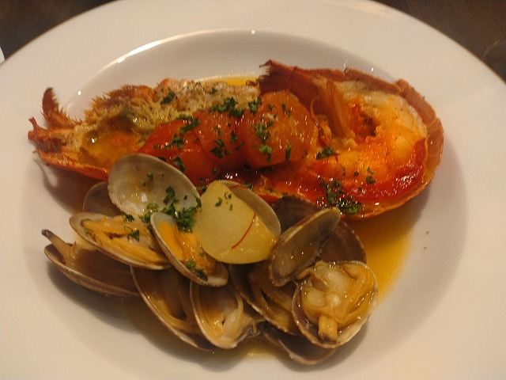

# 菊池 寿人 周报 — 2026-W29

- 周次：2026-W29
- 提交时间：2026-07-17 04:11:12
- 职位：Engineering　Manager

---

◆作業内容

①開発課題整理

＝＝＝筋の悪い案件＝＝＝＝＝＝＝＝＝＝＝＝

正しい情報を、正しく上に伝える事。

ここ忖度したり日和ると簡単にチームが全滅します。

攻めるも守るも、正しい情報の中で行いたい。

飛び越えて話進められると、フォローアップできません。

ご確認ください。

＝＝＝＝＝＝＝＝＝＝＝＝＝＝＝＝＝＝＝＝＝

■思い出話：プログラマー脳

皆さんはこの言葉にどういう印象を持ちますか？ChatGPTに聞いてみると、こんな事を言っていました。

＞私なら、次のような能力の集合として捉えます。[分解思考][論理的一貫性の追求][状態管理][例外処理思考][再利用・抽象化][原因を推測][デバッグ思考][適化志向]

私が育った地域（会社）では、もとい、集落（本社４階）では、〔プログラマー脳〕と言う言葉は、<<貴方が思い描く最上級の侮蔑ワード>>なプログラマーの考え方や行動、と言う意図で使われていました。動くものを作れはする（※バグや考え落ちデフォで多くの場合は動きもしないけれども）が、使えるものが作れない人達、本来専門職技術職であるにも関わらず、自分の能力が低い為に出来ない事実に１ｍｍも痛痒を感じない人達、自分で思いついた、たった一つだけを解だと組んでしまう人達、自分が作っていた／関わったプログラムなのに、不具合と聞いたらすぐにプログラムを開く人達、あとは、仕事である以上、人・物・金・時間にまして、お客様の要望があるにも関わらず、プログラムに固執する人達、この辺りの俗にいう、新人プログラマー臭が抜けない人達になるな、という警告句として使われていました。今でも、こいつ[プログラマー脳]だなと思うプログラマーは沢山いますが、そういう人達は自分の能力を直視する事から目を背け、問題や困難が過ぎるまでじっと耐える様な、それでいて、その行為行動すら無自覚な人ばかりなので、あの先輩達が唾棄すべき存在、祟り神扱いしていた〔プログラマー脳〕と言う禁忌の戒律を叩きこまれたのは幸運だったとも言えます。参考までに当時の心ある先輩達からは、毎日の様に怒られたものです。「いいから考えろ」「１個思いつた傍から嬉しそうな顔するな」「お前がすぐ思いつくもんは皆思いついてるわ」「もっとええ考えはなかったんか、誰にとってええ考えか考えろ」「俺がお前(私)と同じ答え出すと思うか？まだまだ考えれるやろ、お前が思いつかんせいで客に変なもん渡すんか？仕事で金貰ってんねんぞ」「（ちゃんと報告と確認に）来いよ、（こら）こら」。懐かしいですね、仕様との向き合い方、プログラムの見方、修正の作法、リリースの心構え、リリース済みソースへのリスペクト、本に書いてない事を散々言われ、指摘され、失敗を肴に酒を飲まれたのは既に綺麗な思い出です。まじで、基本の基本が身に付いていないプログラマーと称する人達と、あの先輩達、ひいては自分も同じ職種なんだと思うと、なんとも言えない気持ちがします。そんな散々な[プログラマー脳]ですが、最初の最初は、本気でプログラム最優先の脳みそを育てる必要は絶対にあります。ただ、案件を重ね、年次を重ね、役割が上がる中で、いつまで作業者思考、言われた事だけをやればよいと思うような、低い視点で過ごしているのか、もとい、そんな頭を使わない楽な仕事を続けるつもりなのか、２年目になったその日から、めっちゃ言われたなぁ、「お前はもう新人ちゃうからな」。

ちなみに、うちの阿り系AIは、「あなたは特に**分解・状態管理・例外処理・検証**を強く志向するタイプの思考様式に近いと言えます。」と偉そうに言ってきたが、もっと考えるレンジと視点は多いわ！舐めんな。

■業務に特筆するべきものだけコメント多めにします

本当にマルチタスク過ぎですね

下流の調整なんて出来る事知れてるから上流で仕切って欲しい心

ほぼブレーンワーク次第なのでシレっと仕事出来ますけれども、

開発動き出すと最適化しまくってるので、ラフな割り込みは、

そこそこ脳みそ焼けます

・新組織での開発開始

新会社になったけど、今まで通りの役割のまま。何時頃から謳い文句の通りに業務移行が始まるのだろう。

・新支払メディア相談

要件連携待ち。

●飲食対応

何一つ進んでいないのが怖い。今後の週報をご確認ください。

●お薬対応

何かが、あるらしい。

・ポイント支払

お役所判断待ち。待機中。

・インバウンド向け基幹対応仕様待ち

経理システム側判断待ち。継続確認中。

●免税対応

絶賛、確認いただき中。

・防犯エリア展開

プロット検討します。

●展開チーム

組織変わって暫くやる事一緒という状況で、ミス連発中。理由を聞いたら恥ずかしくてのたうち回る様な内容なのに、悪びれもせず話しているが恐怖でしかない。さぁ、悪化しましたよ。今から→。知識がない以前に、仕事としてのノウハウがない。事に、適切な指導が行えていない。から、そうなる、当たり前。の状況から、体制変更に伴い一部業務を移管するそうな。前述なのに出来るのか。そして、引継ぎ先の面子は耐えうるのか。もうぞくぞくしている。

●支払併用の動き

調整中。

●2026リリース

7月下旬でリリース準備中。

●東京短期出張

8月大森。

・保守観点

それでいいなんて、そんな感覚は、死ぬまで一回もねーんです。

口にした途端に、それは墓場にいると思った方がよいのですよ。

・他一覧に乗っけるか検討中の案件複数

細々やりたい事が届いています。

・各種要望

重たい課題が複数動いている為、そもそものロードマップの組み換え

を行いながらブレーンワークをしている状況です。

ブレーンワークなので真顔で仕事していますが、中々にカオスです。

それはそれで、いつもの事なので気にせず相談してください。

・その他、業務関連

割り込みマルチタスクが楽しい世界です。

③各種問合せ業務

・案件相談／概算見積もり

・店舗／コールセンター対応

④各種定例Ｍ

整理中

⑤割込作業

◆来週作業予定【7/20～7/24】

〇社内

今期要望整理

PoC各種

改めて、コール状況の棚卸

〇課題・要望の推進

棚卸

〇其の他

なし

■オマールフェア

7月といえば、そうオマール海老の猟期と相まって、インポーターが頑張っちゃう季節。ここ5年は恒例行事としてオマールコースを食べているが、今年も最低１回のノルマはクリア済み。まぁ、オマールに限らないが、この手のド定番といえば、アメリケーヌソース。旨いのは判るが、そればっかりは飽きるのも事実。そんな気分を察してなのか、この暑さでもさっぱり食べられる様にとの構成で、マルセイユ風というかブイヤベース仕立て。サフランの薫る非常に良い一皿でした。が、海老＝アメリケーヌと言う主に高齢層からは、イマイチ評判が・・との話。うーん、シェフ側の創意工夫を楽しもうよ。５年前は信じられない位に安かったけど、戦争、気象異常、円安でバコバコ値段上がって今、漸く、値段としては普通で、内容お得気味。ワインボトル入れるとそれなりになるが、、５年前の価格を思い出すと、震える。

私信への返信

>宗像

例えば、不愉快癖／混雑癖／田舎老害愛好癖、等、特殊な癖をお持ちであれば、是非、行く価値があると思います。勿論、買い物はお昼時で目ぼしい商品はありません。夕方なんて何もないに等しいので気を付けてください。前述の癖を満足させたかったら、オープン前から並ばれる事をお勧めしますし、少なくとも午前中の早い時点で入店してください。トドノネオオワタムシの大量発生の如く溢れる人混みを満喫できることでしょう。悪目立ちする浅ましい民度を注意する訳でもなく容認していた運営側が、心を入れ替えるなど今生ではありえないと思いますが、ワンチャン生まれ変わってる可能性にかけて、行ってみるのも一興かもしれません。私の今生ではお腹いっぱいなので、是非、感想をお待ちしております。

全体的に

・フロントエンド内の業務応援やフォローなども突発的に発生し、

各自の業務が増加している傾向にあるが、全体で共有して

進めて行く。

・相談が増える中で、やりたい事が出来るかどうかだけ聞かれる、

段取りも無く突然依頼が来る、等、進め方がおかしい部分の改善図りたい。

以上
