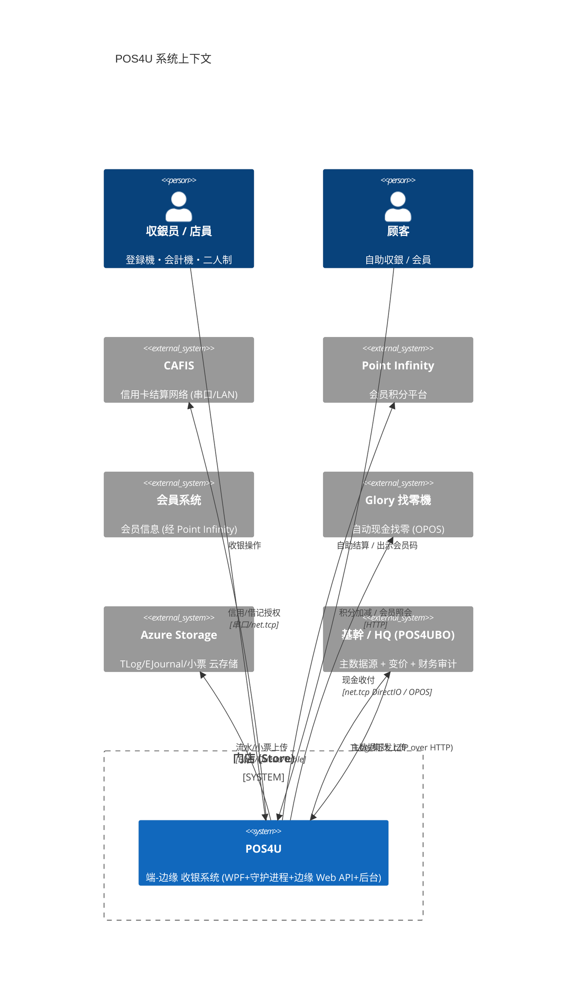

# C4 上下文：端-边缘-云三级与外部系统

> POS4U 是 TRIAL 自社 POS 的**门店收银系统**，采用 **端（Terminal）- 边缘（Store LAN）- 云（Cloud/HQ）** 三级部署，对接 CAFIS、Point Infinity、会員、Azure、基幹（HQ）等外部系统。本篇是最高层的"谁和谁交互"。

## 1. 系统上下文图

## 2. 三级层次

| 级 | 是什么 | 关键构成 | 详见 |
|---|---|---|---|
| **端 Terminal** | 收银机本体 | `POS4U.exe`(WPF) + `TRAN4U.exe`(守护) + `POS4UTwoOperatorsCH.exe`(副屏) + 本地 SQL Server Express 双库 | [02_containers](./02_containers.md) · [04_runtime](./04_runtime_process.md) |
| **边缘 Store LAN** | 门店内服务器 | `POS4ULogicService`（IIS · ASP.NET Web API · 11 Controller）+ 边缘 DB（MTran 共享/採番） | [05_ipc](./05_ipc.md) · [60_services/edge](../60_services/edge-api/index.md) |
| **云 Cloud/HQ** | 总部 | `POS4UBO`（ASP.NET MVC5 后台）+ 中央 SQL Server + Azure Storage + 基幹主数据源 | [06_dataflow](./06_dataflow.md) · [60_services/cloud](../60_services/cloud/index.md) |

终端角色由 `NodeType` 区分——`Application/Source/Common/Common.Const/NodeTypes.cs` 定义 **17** 种：`GoCashRegister`(登録機) · `GoSelf`/`GoFullSelf`/`LaneSelf`(自助) · `CashPaymentStation`/`GoSemiSelfPaymentStation`(会計機) · `TwoOperatorsPOS`(二人制) · `EMoneyChargeStation`(充值机) · `OTCDrugPOS`(医薬品) · `OrderKitchen` · `Mobile` · `LocalPOS` 等。

## 3. 外部系统对接点（店端可核）

| 外部系统 | 店端对接类（可核 file:line） | 备注 |
|---|---|---|
| **CAFIS** | 串口 `Device.CAFISArch/CAFISArchJTC31.cs:19`、LAN `Device.CAFISArchLAN/Device/CAFISArchSaturn1000L.cs:10`；支付方 `Business.Payment/Payment/PaymentCreditLAN.cs` | CAFIS 主机内部 = uncheckable |
| **Point Infinity** | `Device.PointInfinityService/PointInfinityService.cs:15` `: DeviceServiceBase, IPointInfinityService` | 平台内部 = uncheckable |
| **会員** | `POS4ULogicService/Controllers/MemberServiceController.cs:21` → `LogicService.ApiLogic/Member/GetMemberInfoLogic.cs:18`（经 Point Infinity） | 无独立 MemberService 客户端类 |
| **Glory 找零機** | `Device.CashChangerGloryRADRT300/CashChanger.cs:25`、`…RT200/CashChanger.cs:24`（OPOS COM 互操作） | OPOS CCO/固件 = uncheckable |
| **Azure Storage** | `Azure.Logic/AzureStorageInitializer.cs:15`（Blob 容器 + Table）；`Accessor/StorageBlobAccessor.cs:9`/`StorageQueueAccessor.cs:16` | Azure SDK 内部 = uncheckable |
| **基幹 / HQ** | 主数据经 `POS4UBackground/.../MasterSync` 转换下发；集計经 `HeadquartersTransfer.cs` 上传 | HQ 侧 = uncheckable |

## 4. 可信度与核查

- **verified**：三级构成、17 NodeType、各外部系统**店端对接类** file:line 均已核实。
- **uncheckable**：所有外部系统的**内部行为**（CAFIS/Point Infinity/会員/Azure/HQ）；上下文图中的协议标注为对接侧观察，非外部系统契约。

## 5. ST-POS 迁移提示

> ST-POS 重构须保留这些**外部集成边界**（CAFIS/Point Infinity/会員/Azure）；三级拓扑向云原生演进的对照 → [90_traceability](../90_traceability/matrix.md)。仅外链。
