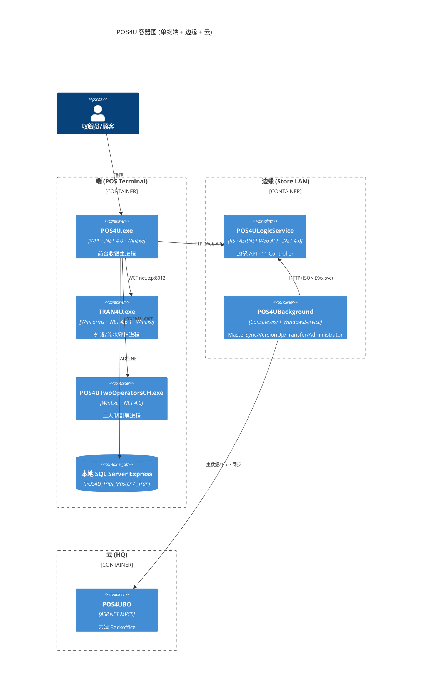
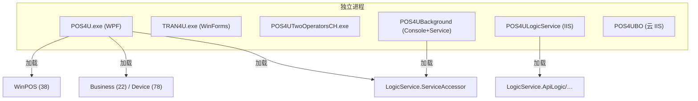

# C4 容器：8 个部署单元

> POS4U 由 8 个部署单元组成——**独立进程**（自有生命周期）与**库集合**（被进程加载）须区分。实测店端 **168** 个 `.csproj`（[真值基线](../00_portal/conventions.md#2-真值基线实测--全体文档共享--勿再推导)）分归其下。

## 1. 容器图

## 2. 独立进程（有自身生命周期）

| # | 部署单元 | 类型 | 证据 | 职责 |
|---|---|---|---|---|
| 1 | **POS4U.exe** | WPF 进程 | `POS4U.csproj` `OutputType=WinExe`；入口 `App.xaml.cs` | 前台收银 UI + WinPOS 引擎宿主 |
| 2 | **TRAN4U.exe** | WinForms 守护进程 | `TRAN4U.csproj` `OutputType=WinExe`；入口 `Program.cs:22`（`Application.Run`，`:53`） | 外设驱动宿主 + WCF 服务端（[05_ipc](./05_ipc.md)） |
| 3 | **POS4UTwoOperatorsCH.exe** | WinForms 进程 | `POS4UTwoOperatorsCH.csproj` `OutputType=WinExe`；由 `App.xaml.cs:87-105` 条件启动 | 二人制副屏（收银校验） |
| 4 | **POS4ULogicService** | IIS Web 应用（w3wp） | `Global.asax.cs:25` `Application_Start`→`:31` `WebApiConfig.Register`；`Web.config` 无 `serviceModel` | 边缘 ASP.NET Web API（11 Controller） |
| 5 | **POS4UBackground** | 控制台 + Windows 服务 | 16 `.csproj`：`Console.MasterSync`/`Console.VersionUp`（`Program.cs`）+ `WindowsService.Administrator`（`ServiceBase.Run`，`Program.cs:58`） | 主数据同步/版本升级/流水转送/监督 |
| 6 | **pos-cloud / POS4UBO** | 云端 IIS（MVC5） | `Application/POS4UCloud/Source/POS4UBO/POS4UBackoffice/` | 总部后台管理（变价/小票底文/终端监控） |

> `POS4UBackground` 是**一组**进程：`WindowsService.Administrator` 常驻，检测到触发后以独立进程（`Verb=RunAs`）拉起 `Console.MasterSync` / `Console.VersionUp`（见 [06_dataflow](./06_dataflow.md)）。

## 3. 库集合（无独立进程，被上述进程加载）

| # | 部署单元 | `.csproj` | 宿主进程 | 说明 |
|---|---|---|---|---|
| 7 | **WinPOS** | 38 | POS4U.exe | 前台应用框架（Command/UI/Observer/Batch…），详见 [20_framework](../20_framework/index.md) |
| 8 | **LogicService** | 6 | POS4ULogicService（服务端逻辑）+ 前台/后台（`ServiceAccessor` 客户端） | ApiLogic/ApiConverter/CommandSales/CommandCommon/Common/ServiceAccessor |

其余库归属见 [code-map](../00_portal/code-map.md)：`Business`(22) · `Device`(78) · `Common`(1) · `Data`(2) · `Azure`(1)。

## 4. 部署单元 → 进程矩阵

## 5. 运行环境（.NET Framework）

- 实测 168 个 `.csproj`：**154 个 `v4.0`**、**14 个 `v4.6.1`**（`grep TargetFrameworkVersion`）。
- 前台 `POS4U`=v4.0，边缘 `POS4ULogicService`=v4.0，`POS4UTwoOperatorsCH`=v4.0；守护 `TRAN4U`=**v4.6.1**。
- ⚠️ 素材曾称"强制 .NET 4.0（Win XP 兼容）"——**部分成立**（主体 v4.0），但并非全体（14 项目 v4.6.1）；无源码依据断言"必须 Win XP"，此结论标 unverified。

## 6. 可信度与核查

- **verified**：8 单元的 OutputType/宿主/入口、.NET 版本分布、16 后台项目均带 file:line。
- **unverified**："Win XP 强制兼容"缺代码依据。
