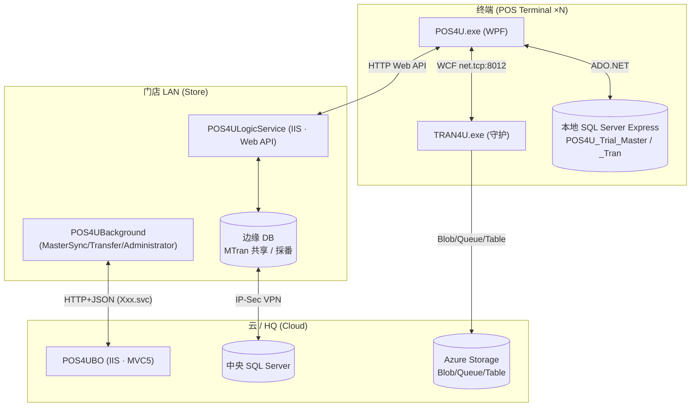
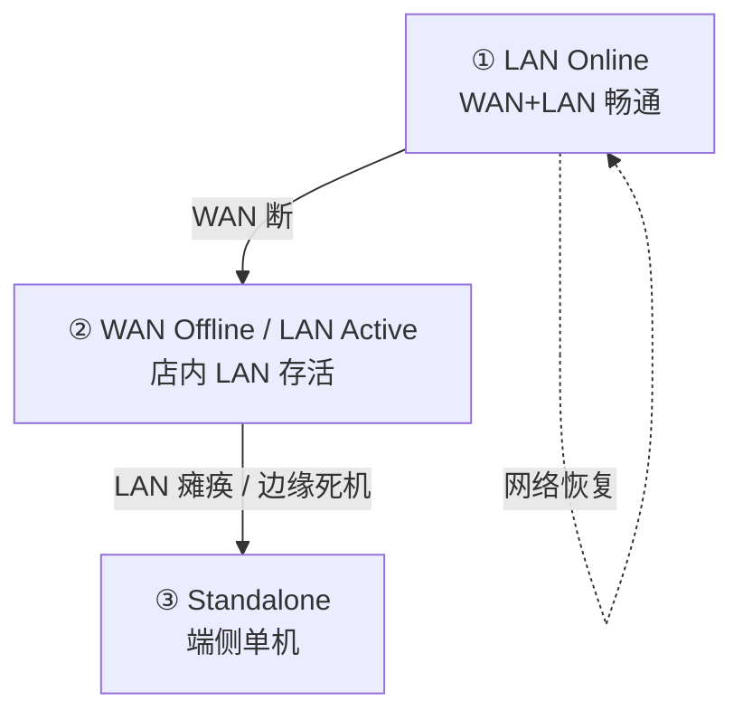

# 部署拓扑：门店 LAN / IIS / SQL Server Express / 三级降级

> 每家门店是一个**自闭环 LAN 单元**：终端本地持全量主数据与流水，边缘服务器承载共享与採番，广域网只做异步同步。这使门店在断网时仍能收银——通过**三级降级**逐级回退。

## 1. 门店 LAN 拓扑



## 2. 数据库：SQL Server Express（**非 SQLite**）

终端本地库连接串（`Application/Source/Data/Data.Container/app.config`）——铁证端侧为 SQL Server Express：

```
POS4U_Trial         Data Source=.\SQLEXPRESS         // :7 / :10
POS4U_Trial_Master  Data Source=(local)\SQLEXPRESS   // :13   主数据库
POS4U_Trial_Tran    Data Source=(local)\SQLEXPRESS   // :16   流水库
```

- **双库分离**：`_Master`（主数据，下发覆盖）+ `_Tran`（交易流水，异步上传）。`Integrated Security=True`（Windows 认证）。
- DB 对象规模（160 表/405 SP/24 视图）见 → [40_data](../40_data/01_overview.md)（不在此重复）。

## 3. 边缘：IIS 承载 ASP.NET Web API（非 WCF）

- `Application/Source/POS4ULogicService/Web.config`：`compilation targetFramework="4.0"`（`:14`），**无 `system.serviceModel` 段**（`serviceModel` 出现 0 次）。
- 启动即注册 Web API：`Global.asax.cs:31` `GlobalConfiguration.Configure(WebApiConfig.Register)`；连接上限 `ServicePointManager.DefaultConnectionLimit=12`（`:29`）。
- 跨机台挂账（MTran）经边缘 API 共享：`LogicService.ServiceAccessor/CartMTranServiceAccessor.cs`、`MTranServiceAccessor.cs`。协议细节 → [05_ipc](./05_ipc.md)。

## 4. 三级降级漏斗



| 级 | 状态 | 有代码依据的机制 | 可信度 |
|---|---|---|---|
| **① LAN Online** | 全通 | 会员积分在线（Point Infinity）；MTran 跨机台（`CartMTranServiceAccessor`）；TLog 准实时上传（`Transfer`） | verified（各构件存在） |
| **② WAN Offline / LAN Active** | 店内 LAN 活 | **会员降级**：进入 `SalesTranStates.ValueCardOffline`（`SalesTranStates.cs:119`；被 `Business.Sales/SalesTran.cs`、`SelfSalesTran.cs`、`Business.Member/MemberObject.cs` 使用），会员卡号存 `OfflinePointCardNo`（`Business.ReSales/ReSalesTran.cs` 等）；边缘採番仍可用 | verified（降级状态/字段存在） |
| **③ Standalone** | 单机 | 完全依赖本地 SQL Server Express 双库结账（§2）；本地採番 | verified（本地双库存在） |

> ⚠️ **降级的"自动检测/触发阈值"（如素材所称"3 次连接超时后转单机"）在源码中未找到**（`grep RetryCount/MaxRetry` 无命中）→ 该触发机制标 **unverified**。本篇只确证"降级**状态与本地能力**存在"，不断言其触发条件。

## 5. 可信度与核查

- **verified**：SQLEXPRESS 双库连接串、IIS Web API（无 serviceModel）、MTran 共享、`ValueCardOffline`/`OfflinePointCardNo` 降级构件均带 file:line。
- **unverified**：降级的触发阈值/自动检测逻辑（可能在 dll 或未在所读文件）。
- **uncheckable**：边缘/云 DB 的物理部署、VPN 拓扑（运维侧，非源码）。
