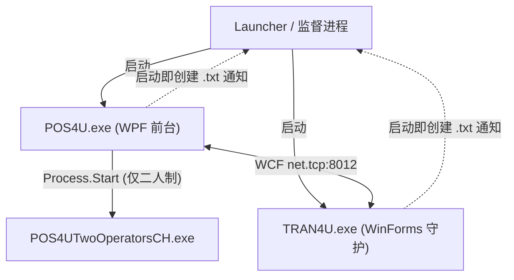
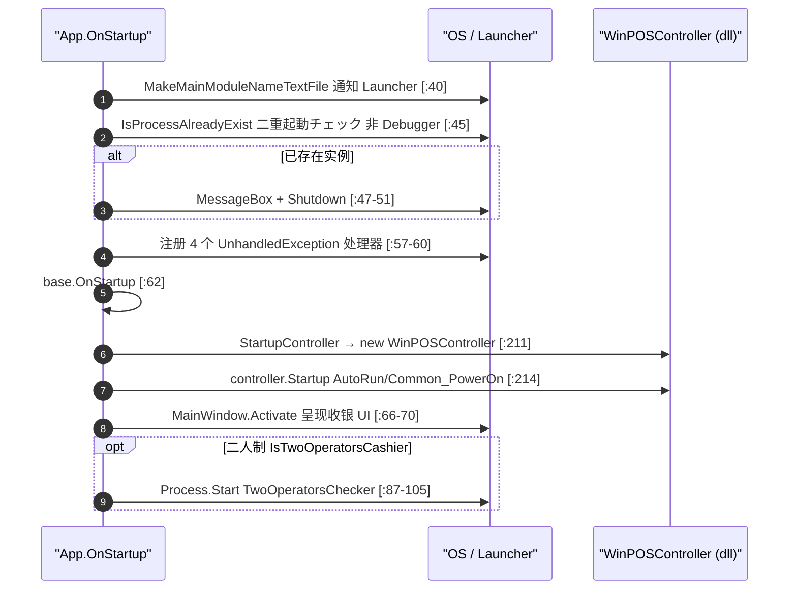

# 运行时：多进程生命周期与启动时序

> 收银终端不是单进程：前台 `POS4U.exe`（WPF）与守护 `TRAN4U.exe`（WinForms）**各自独立启动**，经 WCF 通信；二人制时再拉起副屏进程。本篇讲各进程"如何起、如何崩、如何退"。

## 1. 进程关系（谁拉起谁）

- 两进程启动时都调用 `MakeMainModuleNameTextFile()` 创建 `<自身exe>.txt`，**通知 Launcher 自己已起**（`App.xaml.cs:40` / `TRAN4U/Program.cs:27`，注释「プロセスの起動をLauncherに知らせる」）。
- ⚠️ **订正**：`TRAN4U` 是**独立进程**（由 Launcher/监督进程拉起），**并非** `POS4U` 用 `Process.Start` 启动。`App.xaml.cs:104` 的 `Process.Start` 启动的是**二人制副屏** `TwoOperatorsChecker`（`:87-105`），不是 TRAN4U（素材曾误标）。
- Launcher 的具体实现（是否即 `POS4U.WindowsService.Administrator`）未在所读文件确证 → **unverified**。

## 2. POS4U（WPF）启动时序

入口 `Application/Source/POS4U/App.xaml.cs` 的 `OnStartup`（`:35`）：

关键点：
- **二重起動防止**：`SystemLibrary.IsProcessAlreadyExist()`（`:45`，仅非 `Debugger.IsAttached` 时）→ 已存在则 `Shutdown()`（`:50`）。
- **引擎启动即投递事件**：`controller.Startup(DeviceIds.AutoRun.Id, EventCodes.Common_PowerOn.Code, null)`（`:214`）——用 `Common_PowerOn` 事件驱动初始化（详见 [20_framework/01](../20_framework/01_event_command_observer.md#4-启动即投递第一个-event)）。
- **二人制**：`WinPOSSettingValues.IsTwoOperatorsCashier`（默认 `false`，`WinPOSSettingValues.cs:304`）为真时启动副屏 exe（文件名取自 `TwoOperatorsCheckerFileName`）。

## 3. TRAN4U（WinForms 守护）启动

入口 `Application/Source/TRAN4U/Program.cs` 的 `Main`（`:22`，`[STAThread]`）：

1. `MakeMainModuleNameTextFile()`（`:27`）通知 Launcher。
2. `IsProcessAlreadyExist()` 二重起動チェック（`:35`）。
3. 注册 2 个 `UnhandledException` 处理器（`:42-46`）。
4. `new TRAN4UController()` + `controller.Init()`（`:49-50`）——初始化外设驱动工厂。
5. `Application.Run(controller)`（`:53`）——进入 **WinForms 消息循环，常驻**，并开启 WCF 服务端监听（[05_ipc](./05_ipc.md)）。

## 4. 崩溃处理（UnhandledException）

| 进程 | 处理器 | 行为 |
|---|---|---|
| POS4U | 4 个：`Application.ThreadException`(`:57`)、`AppDomain.UnhandledException`(`:58`)、`Current.DispatcherUnhandledException`(`:59`)、`Dispatcher.CurrentDispatcher.UnhandledException`(`:60`) | 各处理器 `Logger.Fatal(...)` 后 **rethrow**（`:158-203`）——记录后不吞异常 |
| TRAN4U | 2 个：`Application.ThreadException`(`:43`)、`AppDomain.UnhandledException`(`:46`) | 同上：`Logger.Fatal` + rethrow（`:85-102`） |

> 设计取向：**崩溃即记录并抛出**（不静默吞掉），配合 Launcher/监督进程感知并重启——避免"账务进程假死但看似运行"的账实不符。

## 5. 退出

- POS4U `OnExit`（`:122`）：若 `_controller != null` 则 `_controller.Exit()`（`:129`）后置空。
- TRAN4U：`Application.Run` 返回即退出（`:55` 日志「Good-bye」）。

## 6. 可信度与核查

- **verified**：两进程入口、二重起動、UnhandledException 注册与行为、启动事件投递、二人制副屏拉起均带 file:line。
- **unverified**：Launcher 的具体实现身份；监督进程的重启策略（可能在 `WindowsService.Administrator` 或 dll）。
- **uncheckable**：`WinPOSController` / `TRAN4UController.Init` 内部（dll / 依赖设备工厂）。
