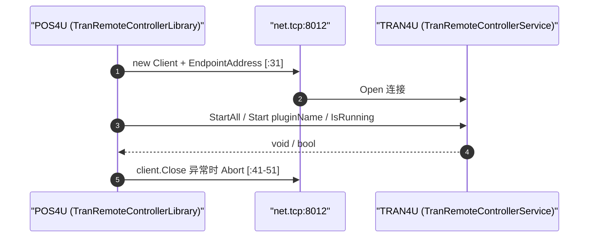

# 进程间通信：WCF net.tcp 与边缘 Web API

> POS4U 有**两条性质不同**的通信轴：① 终端内 `POS4U` ↔ `TRAN4U` 走 **WCF net.tcp**（同机、二进制、低延时）；② 终端/后台 ↔ 边缘 `POS4ULogicService` 走 **ASP.NET Web API（HTTP）**。二者常被混淆——边缘 API **不是 WCF**。

## 1. 轴①：POS4U ↔ TRAN4U（WCF net.tcp）

### 服务契约（5 方法）

`Application/Source/TRAN4U/RemoteController/ITranRemoteControllerService.cs`：`[ServiceContract]`（`:12`）接口，5 个 `[OperationContract]`——围绕 **Tran 插件（外设/流水处理）** 的启停与状态：

| 方法 | 签名 | file:line |
|---|---|---|
| `StartAll()` | `void` | `:19` |
| `StopAll()` | `void` | `:25` |
| `Start(string tranPluginName)` | `void` | `:34` |
| `Stop(string tranPluginName)` | `void` | `:43` |
| `IsRunning(string tranPluginName)` | `bool` | `:55` |

### 端点与端口

- URI 模板 `net.tcp://localhost:{port}/TranRemoteControllerService`——客户端 `TranRemoteControllerLibrary.cs:20`，服务端 `RemoteServiceController.cs:41`。
- **端口 8012 是配置默认值**（非硬编码）：`WinPOSSettingValues.TranRemoteControllerPortNo` 默认 `8012`（`WinPOS/Common/WinPOS.Common/Const/WinPOSSettingValues.cs:27`），亦见 `POS4U/Settings/SettingWinPOS.xml:113 Value="8012"`。
- 服务端 `RemoteServiceController.Open()`（`:31`）：`new ServiceHost(typeof(TranRemoteControllerService), uri)`（`:43`）+ `AddServiceEndpoint(ITranRemoteControllerService, ...)`（`:44`）+ `ServiceMetadataBehavior`（`:45`）+ Mex 端点（`:46`）。

### 绑定参数（客户端与服务端对称一致）

`MakeBindingData()`——客户端 `TranRemoteControllerLibrary.cs:126-148`、服务端 `RemoteServiceController.cs:99-121`，两处**完全相同**：

| 参数 | 值 | 客户端行 | 用意 |
|---|---|---|---|
| `OpenTimeout` / `CloseTimeout` | 30s | `:130` / `:133` | 连接建立/关闭 |
| `SendTimeout` / `ReceiveTimeout` | **5 分钟** | `:131` / `:132` | 找零机排币等长耗时操作不断连（防"钱出去了账卡住"） |
| `MaxBufferSize` / `MaxReceivedMessageSize` | `int.MaxValue` | `:134` / `:135` | 巨型 TLog（上百明细+促销+打印指令）一次序列化 |
| `ReaderQuotas.*` | `int.MaxValue` | `:136-142` | 同上，放开 XML 读取限额 |
| `Security.Mode` | `SecurityMode.None` | `:145` | 同机环回，关加密省 CPU 握手 |

### 调用时序

## 2. 轴②：终端/后台 ↔ 边缘（ASP.NET Web API，**非 WCF**）

- `Application/Source/POS4ULogicService/Global.asax.cs`：`Application_Start`（`:25`）→ `GlobalConfiguration.Configure(WebApiConfig.Register)`（`:31`）——**ASP.NET Web API** 注册。
- `POS4ULogicService/Web.config`：`compilation targetFramework="4.0"`（`:14`），**无 `system.serviceModel`**（`serviceModel` 出现 0 次）→ 非 WCF。
- **11 个 Controller** 均为 `ApiController`（或 `ApiControllerBase : ApiController`），详见 → [60_services/edge](../60_services/edge-api/index.md)。
- ⚠️ **`.svc` 命名陷阱**：Controller 用 `[RoutePrefix("Xxx.svc")]`（WCF 遗留 URL 习惯），客户端（`LogicService.ServiceAccessor`、`POS4UBackground`）以 `HttpWebRequest` + `application/json`（`DataContractJsonSerializer`）调用 `{baseUri}/Xxx.svc/{method}`——**URL 像 WCF，实现是 Web API**。这是素材曾把边缘 API 误标为 WCF 的根源。

## 3. 两轴对照

| | 轴① POS4U↔TRAN4U | 轴② ↔ 边缘 API |
|---|---|---|
| 协议 | WCF `net.tcp`（二进制 SOAP） | HTTP + JSON |
| 范围 | 同机进程间 | 门店 LAN |
| 端口 | 8012（配置） | IIS（HTTP/S） |
| 契约 | `[ServiceContract]` 接口 | `ApiController` + 特性路由 |
| 证据 | `TranRemoteControllerLibrary.cs` / `RemoteServiceController.cs` | `Global.asax.cs:31` / `Web.config` |

## 4. 可信度与核查

- **verified**：WCF 契约 5 方法、端口 8012 配置来源、绑定参数（两端对称）、边缘 Web API（无 serviceModel）+ `.svc` 命名习惯均带 file:line。
- **uncheckable**：`TranRemoteControllerService`（服务实现类，位于 dll？ grep 未见源码）内部；WCF/HttpWebRequest 运行时栈。
