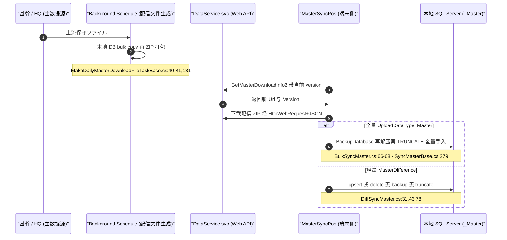
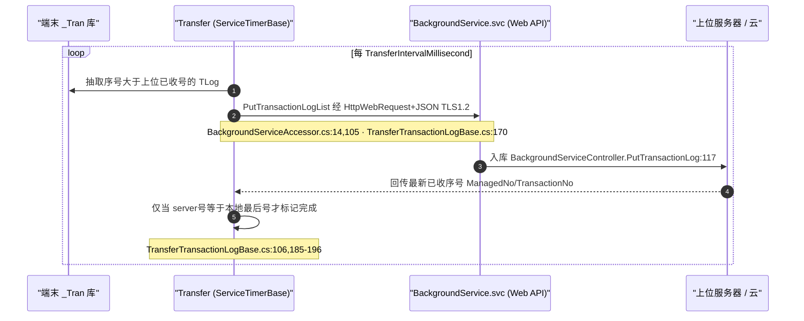

# 数据流：主数据下发 ⇄ TLog 上传（双向）

> 门店与总部间是**双向异步**流：**下行**把主数据（商品/价格/促销）下发到终端本地库；**上行**把交易流水（TLog）保序上传到云端扎账。两向都由 `POS4UBackground` 承担，共用一套 **HttpWebRequest + JSON → `Xxx.svc`（Web API）** 传输栈。

> **本篇订正了 3 处素材失真**（代码核查所得），见 §4。

## 1. 下行：主数据下发（MasterSync）

生产侧（上位）与消费侧（端末）：

- **传输**：`HttpWebRequest` + `application/json`（`DataContractJsonSerializer`），端点 `DataService.svc/{method}`——`ServiceAccessorLibrary.cs:39,43,44`；URI 模板 `DataServiceAccessor.cs:14`。
- **压缩 = ZIP（Ionic.Zip）**：`Library/Compressor.cs:1,17`、`BulkSyncMaster.cs:528`。全树无 `GZipStream/DeflateStream`。
- **目标 = 本地 SQL Server**：`ImportDataLogic.cs:4,91`（`System.Data.SqlClient`，`ExistTargetData`→UPDATE/INSERT）。数据文件为 **TAB 分隔 UTF-16**（`SyncMasterBase.cs:79,84`）。
- **版本驱动**：`GetMasterDownloadInfo2`/`GetMasterUpdateInfo2`（`DataServiceClient.cs:95,313`）。下载失败 5 次指数退避（`:513,528`）。`Download.cs:23-24` 关闭了 SSL 证书校验（回调恒 `true`）。

## 2. 上行：TLog 上传（Transfer）

- **服务端 = 边缘 Web API**：`POS4ULogicService/Controllers/BackgroundServiceController.cs:117 PutTransactionLog`、`:127 PutTransactionLogList`（`ApiControllerBase : ApiController`）。baseUri = `BackgroundSettingValues.TransactionServerAddress`（`TransferTransactionLogBase.cs:53`）。
- **保序（FIFO）**：以 `(ManagedNo, TransactionNo/SeqNo)` 序列对升序推进，只发大于上位已收号者（`TransferTransactionLogBase.cs:106`）。
- **幂等**：靠序列号比对——`LastManagedNo/LastTransactionNo >= 当前行则跳过`（`TransactionLogTransferAccessor.cs:125-130`），端侧严格要求 `last==received`（`:208`）。**无随机 Token**。
- POS 版按自身 `TerminalNo`，OnPremises 版 `TerminalNo=0`（店集約）：`TransferTransactionLogPOS.cs:27` / `TransferTransactionLogOnPremises.cs:26`。

## 3. 旁路：Azure Storage 直传 + 採番回流

- **TLog/EJournal/小票 → Azure Storage**（店端 `Azure.Logic`）：`AzureStorageInitializer.cs:15`（Blob 容器 + Table）；`StorageBlobAccessor.cs:9` / `StorageQueueAccessor.cs:16` / `TransactionLogStorageAccessor.cs:19`。转换 `TranLogService/TranLogServiceConvertTransactionLog.cs:22`。
- **採番回流**：`BusinessCounter` 经边缘 `POSLogicWebServiceController`（`PutBusinessCounter`/`GetBusinessCounter`），批处理入口 `WinPOS/Batch/WinPOS.Batch/BatchPutBusinessCounter.cs:16`（详见 [07 §2](./07_crosscutting.md#2-採番--sequence)）。

## 4. 对素材失真的订正（代码核查所得）

| 素材（01-）旧说 | 代码实况 | 证据 |
|---|---|---|
| Gzip / `Master.db.gz` | **ZIP（Ionic.Zip）** | `Compressor.cs:1,17`；无 GZipStream |
| TLog 经 "WCF `WsPutTransaction`" | **`BackgroundService.svc/PutTransactionLogList`（JSON over HTTP，Web API）** | `BackgroundServiceAccessor.cs:14,105`；`BackgroundServiceController.cs:117` |
| `Guid.NewGuid()` 幂等 Token + `sp_InsertTLog` 查重 | **`(ManagedNo,TransactionNo)` 序列号比对**，无随机 token | `TransactionLogTransferAccessor.cs:208,125-130` |

## 5. 可信度与核查

- **verified**：传输栈、ZIP 压缩、全量/增量导入、保序+幂等序列号、Azure 直传、採番回流均带 file:line。
- **unverified**：全量 vs 增量的**触发排程**（依赖队列/配置）；Transfer 两条流（Local/Cloud）的**激活选择**由拓扑配置决定，未在所读文件确证。
- **uncheckable**：上位/云端服务端入库实现、Azure SDK 内部、`ServiceTimerBase`/`QueueModuleBase`（`Background.Framework` dll）。
