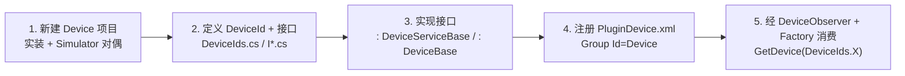

# 新增设备插件（Device）

> **面向**：为 POS4U 接入**新外设或新支付终端**（扫描枪、釣銭機、支付服务、ValueCard 类账户设备等）的集成开发者。
> **前置认知**：POS4U 的 `Device/` 层是"基盘 ↔ 软硬件"的**即插即用（プラグアンドプレイ）通信信道**——每个设备是一个独立 `.csproj` 插件，开发完成后**只改 XML 注册即可切换**，无需改调用侧代码。设备族的整体架构、运行进程（`TRAN4U.exe`）、三个基类的分层，其"家"在 [`50_devices/index.md`](../50_devices/index.md)——本教程只讲**怎么新增一个**，不重述架构。Factory / Observer / EventCode 的机制原理见 [`20_framework/01_event_command_observer.md`](../20_framework/01_event_command_observer.md)。

实测基线 最新发布：`Device/` 下 **78 个 `.csproj`**，其中约 **23 个**带 `Simulator` 后缀（`ls -d Application/Source/Device/*Simulator/ | wc -l` = 23）——**实装与仿真成对**是本层的核心惯例，本教程一并覆盖。

---

## 全景：5 步 + 数据流



> ⚠️ **术语澄清（勿踩坑）**：`POS4U/Settings/` 下有三个 `Plugin*.xml`，职责不同——
> - `PluginDevice.xml` = **设备**注册（本教程唯一涉及）；
> - `PluginWinPOS.xml` = WinPOS 框架件（Command / Observer / Payment / View…）注册；
> - `Plugin.xml`（在 `POS4ULogicService/Settings/`）= **Business 业务模块**加载，与设备无关。
> 三者**不要混填**。

---

## 步骤 1 · 新建 Device 项目（实装 + Simulator 对偶）

1. 在 `Application/Source/Device/` 目录下新建 **Class Library（.NET Framework）** 项目，`TargetFrameworkVersion` = **v4.0**（与既有设备一致，见 `Device.ValueCard.csproj`）。
2. 项目名以 **`Device.` 为前缀**，命名空间 `ForYouApplications.POS4U.Device.<设备名>`。**同时**建仿真项目 `Device.<设备名>Simulator`（命名空间 `...Device.<设备名>Simulator`）。
   - 真实对偶范例：`Application/Source/Device/Device.ValueCard/`（实装）↔ `Application/Source/Device/Device.ValueCardSimulator/`（仿真，含 `ValueCardSimulatorForm` WinForms 仿真窗体）。
3. 从任一既有 Device 项目拷贝 **`AssemblyKey.snk`**，在项目属性 Signing 中启用强命名——设备程序集需强名（注册 XML 里以 `PublicKeyToken=7f613065d93c5dd1` 引用，见 `PluginDevice.xml`）。

> 仿真项目不是可选装饰：`PluginDevice.xml` 的**默认注册项通常指向 Simulator**，实装以注释形式并排备用（见步骤 4），因此**无仿真无法本地跑通**。

---

## 步骤 2 · 定义 DeviceId 与设备接口

**DeviceId**（设备的稳定标识）集中定义在
`Application/Source/Device/Device.DeviceDefine/Const/DeviceIds.cs`——追加一行静态属性：

```csharp
// Application/Source/Device/Device.DeviceDefine/Const/DeviceIds.cs（现有范例 :33 :38）
public static DeviceId<ICashChanger> CashChanger { get; } = new DeviceId<ICashChanger>(nameof(CashChanger));
public static DeviceId<IDevice>       Scanner1    { get; } = new DeviceId<IDevice>(nameof(Scanner1));
```

- 用 **泛型 `DeviceId<T>`**（`T` = 你的设备接口）可让消费侧 `GetDevice` 直接拿到强类型；无专用接口时退回 `DeviceId<IDevice>`。文件现有 39 处 `DeviceId` 定义可作模板。
- `DeviceId` / `DeviceId<T>` / `IDevice` 本体在 **`POS4U.Framework.dll`（无源码）**，属 `uncheckable`——只按现有用法照葫芦画瓢，勿臆断其内部。

**设备接口**放在 `Device.DeviceDefine/<设备族>/I<设备>.cs`，**继承 `IDevice`**：

```csharp
// Application/Source/Device/Device.DeviceDefine/ValueCard/IValueCard.cs:13（真实范例）
public interface IValueCard : IDevice
{
    ResultValue<ValueCardExecuteResult> GetBalance(ValueCardExecuteParameter parameter);
    ResultValue<ValueCardExecuteResult> Deposit(ValueCardExecuteParameter parameter);
    // …
}
```

接口、参数类、结果类都归 `Device.DeviceDefine`（契约库），实装/仿真项目**引用 `Device.DeviceDefine`** 即可。

---

## 步骤 3 · 实现接口（实装类 + Simulator 类）

同一接口做**两份实现**，分别继承框架基类：

| 角色 | 基类 | 真实锚点 |
|---|---|---|
| 实装 | `DeviceServiceBase` | `Application/Source/Device/Device.ValueCard/ValueCard.cs:21` → `class ValueCard : DeviceServiceBase, IValueCard` |
| 仿真 | `DeviceBase` | `Application/Source/Device/Device.ValueCardSimulator/ValueCardSimulator.cs:11` → `class ValueCardSimulator : DeviceBase, IValueCard` |

- 两个基类 `DeviceBase` / `DeviceServiceBase` 均在 **`POS4U.Framework.dll`（无源码 → `uncheckable`）**；它们与 `PosForNet` 等其它设备基座的分层"家"在 [`50_devices/index.md`](../50_devices/index.md#0-架构分层)。
- 与真实硬件/外部服务通信（串口、OPOS/OCX、TCP、HTTP Web Service 等）的具体做法按设备族选型，参见 [`50_devices`](../50_devices/index.md) 各族文档，不在本教程展开。

---

## 步骤 4 · 在 `PluginDevice.xml` 注册

编辑 `Application/Source/POS4U/Settings/PluginDevice.xml`，在 `<Group Id="Device">` 下追加 `<Plugin>`。`Id` 必须等于步骤 2 的 **DeviceId 名**：

```xml
<!-- Application/Source/POS4U/Settings/PluginDevice.xml（真实 Scanner1 范式）-->
<Group Id="Device">
  <!-- IdはDeviceId -->
  <Plugin
    Id="Scanner1"
    Assembly="Device.ScannerSimulator, Version=1.0.0.0, Culture=neutral, PublickeyToken=7f613065d93c5dd1"
    Class="ForYouApplications.POS4U.Device.ScannerSimulator.TECPackageScannerSimulator"/>
  <!--<Plugin
    Id="Scanner1"
    Assembly="Device.Scanner4DotNet, Version=1.0.0.0, ..."
    Class="ForYouApplications.POS4U.Device.Scanner.Scanner4DotNet"/>-->
</Group>
```

- **实装 ↔ Simulator 通过 XML 注释切换**：默认放开仿真行、注释掉实装行；上线时对调。这正是"改配置即换设备"的即插即用体现。
- `Assembly` 填程序集名 + 强名 token；`Class` 填**全限定类名**（含命名空间）。
- **谁装载这个 XML**：由 `Application/Source/POS4U/App.config` 的 `PluginFiles` 键声明——实测值
  `Plugin.xml,PluginWinPOS.xml,PluginDevice.xml,PluginCAFISArchLAN.xml`（`App.config:11`）。新设备落进 `PluginDevice.xml` 即被 POS4U 加载，**无需改 App.config**。
  （双人副屏 `POS4UTwoOperatorsCH` 另用 `PluginDeviceCH.xml`，见其 `App.config`。）

---

## 步骤 5 · 经 `DeviceObserver` + `Factory` 消费

设备**不被直接 new**，而是经框架 `Factory` 按 `DeviceId` 解析。统一消费入口是
`Application/Source/WinPOS/Observer/WinPOS.Observer/DeviceObserver.cs`：

```csharp
// DeviceObserver.cs:925-928（真实解析逻辑）
private T GetDevice<T>(DeviceId<T> id)
{
    return Factory.CreatePlugin(FrameworkPluginIds.DeviceManager).GetDevice(id);
}

// 使用（DeviceObserver.cs:262 / :486 / :1093 等）
this.GetDevice(DeviceIds.Scanner1);
this.GetDevice(DeviceIds.CashChanger);
```

- `DeviceObserver` 依设备的可用状态（哪个 `State`/`TranType` 下启用扫描枪、釣銭機、LED…）驱动设备，其状态映射表见文件头部 `_enableMsr` / `_enableGuidanceLED` 等字典（`DeviceObserver.cs:29-` 起）。新设备若需随状态启停，在此登记；纯请求式设备（如支付服务）则在对应 `Business.*` 的 Command/Tran 内 `GetDevice(...)` 调用。
- **`DeviceObserver` 本身**也是一个插件，注册在
  `Application/Source/POS4U/Settings/PluginWinPOS.xml` 的 `<Group Id="Observer">` 中
  （`Id="DeviceObserver"`，`Class="ForYouApplications.POS4U.WinPOS.Observer.DeviceObserver"`，`PluginWinPOS.xml:1975-1977`）——新增设备通常**复用**它，无需另建 Observer。
- `Factory` / `FrameworkPluginIds.DeviceManager` 是框架级机制（在 `POS4U.Framework.dll`，`uncheckable`）；其 Observer / Command / EventCode 协作原理见 [`20_framework/01_event_command_observer.md`](../20_framework/01_event_command_observer.md)。

---

## 运行宿主（TRAN4U）

设备驱动的**实际运行进程是 `TRAN4U.exe`**（WinForms 守护进程），前台 `POS4U.exe`（WPF）经 **WCF net.tcp** 跨进程调用——此拓扑是设备层的架构事实，其"家"在 [`50_devices/index.md`](../50_devices/index.md)，本教程不重述。相关配置 `SettingWinPOSDevice.xml` 被 `TRAN4U.csproj` 以链接方式纳入（`TRAN4U.csproj:170-171`）。新增设备一般无需改 TRAN4U 项目本身，仅需完成上述 1–5 步。

---

## 检查清单

- [ ] 项目名 `Device.<X>` + `Device.<X>Simulator` 成对，均 `.NET Framework v4.0`、已强名（`AssemblyKey.snk`）。
- [ ] `DeviceIds.cs` 追加 `DeviceId<T>`；接口 `I<X> : IDevice` 落在 `Device.DeviceDefine`。
- [ ] 实装 `: DeviceServiceBase`、仿真 `: DeviceBase`，同实现 `I<X>`。
- [ ] `PluginDevice.xml` 的 `<Group Id="Device">` 内注册，`Id` == DeviceId 名，实装/仿真注释切换。
- [ ] 消费处经 `GetDevice(DeviceIds.X)`（`Factory.CreatePlugin(FrameworkPluginIds.DeviceManager)`），不直接 `new`。

---

## 可信度与核查

- **verified（回代码核实）**：`DeviceIds.cs` 定义范式、`IValueCard:IDevice`、`ValueCard:DeviceServiceBase` / `ValueCardSimulator:DeviceBase`、`PluginDevice.xml` 的 `Group/Plugin` 结构与 Scanner1 实/仿并排、`App.config` PluginFiles 装载 `PluginDevice.xml`、`DeviceObserver.GetDevice`=`Factory.CreatePlugin(FrameworkPluginIds.DeviceManager).GetDevice(id)`、`DeviceObserver` 在 `PluginWinPOS.xml` Observer 组注册。
- **uncheckable**：`DeviceId<T>` / `IDevice` / `DeviceBase` / `DeviceServiceBase` / `Factory` / `FrameworkPluginIds.DeviceManager` 均在 `POS4U.Framework.dll`（无源码），只据现有用法示范，不断言内部实现。
- **unverified**：VS 里的逐个"右键 Add"操作叙事（IDE 步骤，非代码事实）。

> **迁移提示（ST-POS）**：ST-POS（KugelPOS 系）的设备接入范式与此不同（详见后端仓库设备网关文档），本页仅为 POS4U AS-IS 对照，不代表 ST-POS 现状。
