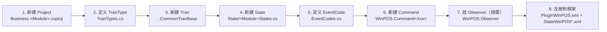

# 新建一个 Business 业务模块

> **本文体裁**：how-to（操作教程）。目标读者：要在 **POS4U 现行框架**内新增一类「取引（Tran）」及其画面机能的开发者。
>
> **verification 说明**：本文整篇标 `unverified`，因为多数步骤是 Visual Studio 的**操作动线**（右键新建工程、复制文件、编辑 XML），无法回代码核实。**但凡本文引用的类名 / 命名空间 / 路径 / EventCode / XML 结构，全部已对 最新发布 逐一核实**（见文末 §9）。
>
> **机制不复述**：本文只讲「怎么做」。四要素为何这样运作、状态机三层如何串接、基类闸门语义——**详见 [20_framework](../20_framework/index.md)**，本文只给链接，不重述。

---

## 0. 先决条件与「东西在哪」（**已订正 12- 的过时路径**）

POS4U 一个业务模块 = **一个「取引类型」（TranType）+ 它的状态机（State）+ 触发它的事件（EventCode）+ 执行逻辑（Command）+ 副作用观察者（Observer）**，最后通过 XML 注册进框架。这些要素分散在固定目录里：

| 要素 | 真实位置（最新发布） | 说明 |
|---|---|---|
| 业务取引类 | `Application/Source/Business/Business.<Module>/` | 当前 **22** 个 `Business.*` 模块，Sales / Return / EMoney / Point … |
| 取引类型常量 | `Application/Source/Common/Common.Const/TranTypes.cs` | **29** 个 `TranType` 静态常量 |
| 事件码常量 | `Application/Source/Common/Common.Const/EventCodes.cs` | 每条 `new EventCode(名称, 数字ID)` |
| 状态常量 | `Application/Source/Common/Common.Const/State/*.cs` | 每个 TranType 一个 `*States.cs` |
| 命令（Command） | `Application/Source/WinPOS/Command/WinPOS.Command<Xxx>/` | 12 个 CommandXxx 工程 |
| 观察者（Observer） | `Application/Source/WinPOS/Observer/WinPOS.Observer/` | `EventObserver.cs` 等 |
| 组件注册 | `Application/Source/POS4U/Settings/PluginWinPOS.xml` | Command / 引擎组件的插件登记 |
| 状态×命令白名单 | `Application/Source/POS4U/Settings/StateWinPOS*.xml` | 某状态下允许执行哪些 Command |

> ⚠️ **对 12-gitlab-wiki 的订正（迁移时踩到的系统性过时）**：旧 wiki 把常量目录写成 `Bussiness/Common/EventCodes.cs`、`Business/Common/Common.Const`、`Business/Common/Commom.Const/State`（含 `Bussiness`/`Commom` 拼写错误）。**这些前缀全部过时**——常量实际不在 `Business/` 下，而在**顶层 `Common/Common.Const/`**。旧 wiki 又把事件文件称作 `Event.cs`，**实际文件名是 `EventCodes.cs`**（无 `Event.cs`）。本文以下一律用已核实的真实路径。
>
> 框架基类（`TranBase` / `CommandBase` / `EventCode` / `TranType` / `TranState` / `IObserver` / `Factory`）本身**无源码**，封装在 `POS4U.Framework.dll` 中（标 `uncheckable`）——语义详见 [20_framework/04_base_classes.md](../20_framework/04_base_classes.md)。

**动手前先读**：[Event → Command → Observer 引擎](../20_framework/01_event_command_observer.md) 与 [三层状态机](../20_framework/02_state_machine.md)。

---

## 端到端步骤总览



---

## 1. 新建 Project（`Business.<Module>` 工程）

在解决方案的 `Business/` 目录下新建一个 **Class Library (.NET Framework)** 工程：

1. 右键 `Business` 解决方案文件夹 → **Add → New Project** → **Visual C# → Class Library (.NET Framework)**。
2. 工程名沿用现有命名 `Business.<Module>`（如 `Business.Sales`）；`Location` 落到 `项目根/Business/`。
3. **目标框架 = .NET Framework 4**（`<TargetFrameworkVersion>v4.0</TargetFrameworkVersion>`，与 `Application/Source/Business/Business.Sales/Business.Sales.csproj` 一致）。
4. **强命名签名（必做）**：从任一既有工程拷贝 `AssemblyKey.snk` 到新工程 → Project Properties → **Signing → Sign the assembly → 选 AssemblyKey.snk**。POS4U 全部程序集走强命名（`PublicKeyToken=7f613065d93c5dd1`，见 `PluginWinPOS.xml` 每条 `<Plugin>`）。
5. 命名空间约定 `ForYouApplications.POS4U.Business.<Module>`，`AssemblyName = Business.<Module>`（对照 `Business.Sales.csproj` 的 `RootNamespace` / `AssemblyName`）。

> 该步骤为 IDE 操作，`unverified`；框架版本 / 命名空间 / 签名 token 三项已核实。

---

## 2. 定义 TranType（`Common/Common.Const/TranTypes.cs`）

打开 `Application/Source/Common/Common.Const/TranTypes.cs`，仿照既有常量新增一个静态 `TranType`：

```csharp
// ForYouApplications.POS4U.Common.Const
public static class TranTypes
{
    public static TranType Sales     { get; } = new TranType(nameof(Sales));      // TranTypes.cs:14
    public static TranType SelfSales { get; } = new TranType(nameof(SelfSales));  // TranTypes.cs:19
    // ↓ 新增你的取引类型：
    public static TranType Demo      { get; } = new TranType(nameof(Demo));
}
```

- `TranType` 来自框架 dll（`using ForYouApplications.POS4U.Framework;`，见 `TranTypes.cs:1`）。
- 当前共 **29** 个 TranType 常量（`grep -c "public static TranType" TranTypes.cs`）。TranType 是三层状态机的**第一层** → [20_framework/02 §1](../20_framework/02_state_machine.md)。

---

## 3. 新建 Tran（继承 `CommonTranBase`）

取引类是模块的核心，放在第 1 步新建的 `Business.<Module>` 工程里。业务取引统一继承 **`CommonTranBase`**：

- 基类：`Application/Source/Business/Business.BusinessCommon/CommonTranBase.cs:19`
  ```csharp
  public abstract class CommonTranBase : TranBase, IDisposable   // TranBase 来自框架 dll
  ```
- 参考实现：`Application/Source/Business/Business.Sales/SalesTran.cs:25`
  ```csharp
  public class SalesTran : CommonTranBase, IPaymentTran, IMemberTran
  ```

**必做：重写 `TranType` 属性**，返回第 2 步定义的常量（`SalesTran.cs:56-58`）：

```csharp
public override TranType TranType
{
    get { return TranTypes.Demo; }   // 对应你在 TranTypes.cs 新增的常量
}
```

> `CommonTranBase` 用 `this.TranType.Id` 去 `Factory.CreatePlugin(...)` 定位 TranLogMaker 等按取引类型分派的插件（`CommonTranBase.cs:104,138,174`）——所以 `TranType` 重写不可省。若新模块与销售高度同构，也可继承 `SalesTran` 复用其明细/支付逻辑（旧 wiki 的 Demo 示例即如此）；否则继承 `CommonTranBase` 从零搭。
>
> 状态迁移（`this.ChangeState(...)`）在 **Tran 内部**发生 → 语义见 [20_framework/02 §4 迁移钩子](../20_framework/02_state_machine.md)。

---

## 4. 新建 State（`Common/Common.Const/State/<Module>States.cs`）

在 `Application/Source/Common/Common.Const/State/` 下新建 `<Module>States.cs`（每个取引类型一个状态文件，如 `SalesTranStates.cs` / `ReturnTranStates.cs` / `EMoneyChargeTranStates.cs`）：

```csharp
// ForYouApplications.POS4U.Common.Const  (using ...Framework;)
public static class DemoTranStates
{
    // 参照 SalesTranStates.cs:14,19,29 ...
    public static TranState Neutral      { get; } = new TranState(StatePrefixes.DemoTran, nameof(Neutral), false, true);
    public static TranState EnteringItem { get; } = new TranState(StatePrefixes.DemoTran, nameof(EnteringItem), true, true);
    public static TranState Fixed        { get; } = new TranState(StatePrefixes.DemoTran, nameof(Fixed), false, true);
}
```

- `TranState` 构造：`(前缀, 状态名, bool, bool)`——前缀取自 `StatePrefixes`（`State/StatePrefixes.cs`），最终状态 Id 形如 `SalesTran_Neutral`（这正是 XML 里引用状态的写法，见第 8 步）。两个 bool 的语义属框架 dll，见 [20_framework/02 §2](../20_framework/02_state_machine.md)，本文不臆断。
- 实证锚点：`Application/Source/Common/Common.Const/State/SalesTranStates.cs:14`（`Neutral`）等。State 是三层状态机的**第二层**。

---

## 5. 定义 EventCode（`Common/Common.Const/EventCodes.cs`）

在 `Application/Source/Common/Common.Const/EventCodes.cs` 里为新机能定义事件码：

```csharp
// ForYouApplications.POS4U.Common.Const
public static EventCode Sales_ChangePrice { get; } = new EventCode(nameof(Sales_ChangePrice), 10);  // EventCodes.cs:21
public static EventCode Sales_Total       { get; } = new EventCode(nameof(Sales_Total), 32);        // EventCodes.cs:38
// ↓ 新增：
public static EventCode Demo_DoSomething  { get; } = new EventCode(nameof(Demo_DoSomething), 9999);
```

- `new EventCode(名称, 数字ID)` 的**第二个参数是数字事件码，全局不可重复**（旧 wiki 反复强调「イベントコードの番号は他と被らないように」——此约束已核实指向该数字参数）。
- 命名习惯：`<模块>_<动作>`（`Sales_ChangePrice` / `Sales_Total`）。
- EventCode 引擎机制（谁投递、谁消费）→ [20_framework/01](../20_framework/01_event_command_observer.md)。

---

## 6. 新建 Command（`WinPOS/Command/WinPOS.Command<Xxx>/`）

Command 承载具体逻辑，放进对应的 `WinPOS.Command<Xxx>` 工程（销售类进 `WinPOS.CommandSales`，共 12 个 CommandXxx 工程）。参考 `Application/Source/WinPOS/Command/WinPOS.CommandSales/Sales_ChangePrice.cs`：

```csharp
// ForYouApplications.POS4U.WinPOS.CommandSales
public class Sales_ChangePrice : CommandSalesBase<StringInputData>   // Sales_ChangePrice.cs:12
{
    public Sales_ChangePrice()
        : base(EventCodes.Sales_ChangePrice)                         // 构造里绑定第 5 步的 EventCode
    { }

    protected override bool OnExecute(string deviceId, StringInputData inputData,
                                      UserData userData, SalesTran tran)   // Sales_ChangePrice.cs:30
    {
        // ... 操作 tran，返回 成功/失败
    }
}
```

- **约定：Command 类名 == 绑定的 EventCode 名**（`Sales_ChangePrice` ↔ `EventCodes.Sales_ChangePrice`）。旧 wiki「基本的には追加したイベントと同一の名称にする」已核实。
- 基类继承链（均从代码核实）：
  `Sales_ChangePrice` → `CommandSalesBase<TInput>`（`WinPOS.CommandSales/CommandSalesBase.cs:16`）→ `CommandWinPOSBase<TInput>`（`WinPOS.CommandCommon/CommandWinPOSBase.cs:12`：`CommandBase<TInput>, ICommandWinPOS`）→ `CommandBase<TInput>`（框架 dll）。
- 基类构造统一收 `EventCode` 参数（`CommandWinPOSBase.cs:18`）；执行前的 SignIn / Error 闸门在基类里（`CommandWinPOSBase.cs:88,96`）→ 详见 [20_framework/01 §3](../20_framework/01_event_command_observer.md)。为你的模块建一个 `CommandDemoBase<TInput>`（仿 `CommandSalesBase`）承接 `OnExecute(... DemoTran tran)` 的强类型转发是惯例做法。

---

## 7. 挂 Observer（按需）

若新机能需要「状态达成 → 触发副作用 / 追加事件」的闭环，实现 `IObserver` 放进 `Application/Source/WinPOS/Observer/WinPOS.Observer/`。参考 `EventObserver.cs:16`：

```csharp
// ForYouApplications.POS4U.WinPOS.Observer
public class EventObserver : IObserver
{
    void IObserver.Update(POSData posData)                 // EventObserver.cs:22
    {
        var state = posData.CurrentTran.CurrentState;
        if (state == CashInOutTranStates.Fixed /* ... */)
        {
            var eventManager = Factory.CreatePlugin(WinPOSFrameworkPluginIds.EventManager);
            eventManager.AcceptInterruptEvent(DeviceIds.AutoRun.Id,
                EventCodes.MainMenu_ChangeDisplayBack.Code, bool.TrueString);   // 追加新事件 → 闭环
        }
    }
}
```

- Observer 读 `CurrentTran.CurrentState`，据状态触发副作用，甚至经 `EventManager` 追加下一个 Event，形成 **State → 副作用 → Event** 闭环 → 机制详见 [20_framework/01 §6](../20_framework/01_event_command_observer.md)。
- 简单模块可复用既有 `EventObserver` / `PrintObserver` 等，不必新建。

---

## 8. 注册到框架（两个 XML）

代码写完还**不会生效**，必须在 `Application/Source/POS4U/Settings/` 下登记。

### 8.1 注册 Command 插件 —— `PluginWinPOS.xml`

仿 `Sales_ChangePrice` 的登记块（`PluginWinPOS.xml:1031-1033`）追加一条：

```xml
<Plugin
  Id="Demo_DoSomething"
  Assembly="WinPOS.CommandSales"
  Class="ForYouApplications.POS4U.WinPOS.CommandSales.Demo_DoSomething"/>
```

- `Id` == Command 类名 == EventCode 名（三者同名是全链路串接的约定）。
- `Assembly` 填 Command 所在程序集名；`Class` 填全限定类名。
- 框架引擎组件（`StateEventConverter` / `EventManager` / `DeviceManager` 等）也在同一文件登记（`PluginWinPOS.xml:3-14`）→ 注册机制见 [20_framework/01 §5](../20_framework/01_event_command_observer.md)。

### 8.2 配置「哪个状态可执行该 Command」—— `StateWinPOS*.xml`

在状态×命令白名单里把新 Command 挂到允许它的状态下。参考 `StateWinPOSSales.xml`：

```xml
<State>
  <TranType Id="Sales">                                   <!-- 对应 TranTypes.Sales -->
    <State Ids="SalesTran_Neutral,SalesTran_Fixed,SalesTran_Canceled">   <!-- 状态 Id = 前缀_状态名 -->
      <Command Id="Sales_ChangePrice"/>                   <!-- 该状态下放行的 Command -->
      <Command Id="Demo_DoSomething"/>                    <!-- 新增 -->
    </State>
  </TranType>
</State>
```

- 实证锚点：`Application/Source/POS4U/Settings/StateWinPOSSales.xml:1-25`。`State Ids` 用的正是第 4 步 `TranState` 生成的 `前缀_状态名`（`SalesTran_Neutral`）。
- **注意分工**：`StateWinPOSSales.xml` 只管销售取引；跨取引/通用的状态-命令配置在 `StateWinPOS.xml`（旧 wiki「其他的配置一般都在 StateWinPOS.xml」已核实——两文件确实并存于 `POS4U/Settings/`）。
- 这是三层状态机的**第三层：State × 可接受 Command 白名单** → [20_framework/02 §3](../20_framework/02_state_machine.md)。

> 至此：**EventCode（谁触发）→ PluginWinPOS.xml（Command 实体登记）→ StateWinPOS*.xml（哪个状态放行）** 三处的 `Id` 全部对齐，机能才在运行时被引擎接起来。

---

## 9. 可信度与核查

| 类别 | 级别 | 依据 |
|---|---|---|
| 路径 / 目录布局 | **verified** | 已 `ls`/`grep` 核对 最新发布（见下锚点） |
| 类名 / 继承 / 命名空间 | **verified** | `CommonTranBase.cs:19`、`SalesTran.cs:25,56`、`CommandSalesBase.cs:16`、`CommandWinPOSBase.cs:12` |
| EventCode / TranType / State 写法 | **verified** | `EventCodes.cs:21,38`、`TranTypes.cs:14`、`SalesTranStates.cs:14` |
| XML 注册结构 | **verified** | `PluginWinPOS.xml:1031-1033`、`StateWinPOSSales.xml:1-25` |
| **IDE 操作动线**（右键新建、签名、复制文件） | **unverified** | 来自 `12-gitlab-wiki`，属界面操作，代码不可核实 |
| 框架基类内部实现 | **uncheckable** | `POS4U.Framework.dll` 无源码 → [20_framework/04](../20_framework/04_base_classes.md) |
| `TranState` 两个 bool 参数语义 | **未断言** | 未核实，交由框架文档，本文不臆测 |

> 因主体为操作叙事，整篇 frontmatter 标 `verification: unverified`；但每一处引用的类/EventCode/路径/XML 均真实且已核实。核查证据总账：[`../../90-verification/reverse-docs-vs-code-audit-2026-07-14.md`](../../90-verification/reverse-docs-vs-code-audit-2026-07-14.md)。

---

## 10. ST-POS 迁移提示

> ST-POS（KugelPOS 系）与 POS4U 是**不同代码体系**，其「新建业务/微服务」的做法与本文无对应关系。相关 AS-IS→重构对照请走 ST-POS 侧仓库文档，本层不展开、仅外链。
