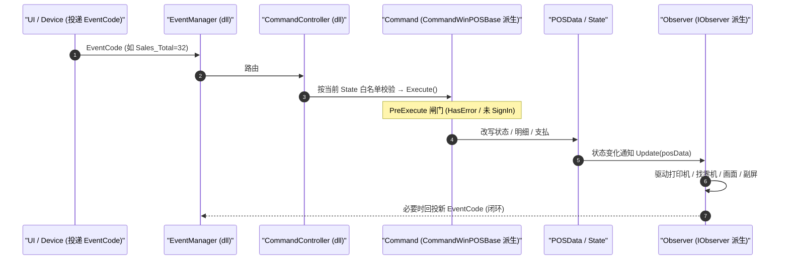

# Event → Command → Observer 引擎

> POS4U 前台的中枢：UI/设备把操作抽象为 **EventCode**，`EventManager` 投递，`CommandController` 路由到 **Command** 执行，命令改写全局 **POSData** 状态，**Observer** 响应状态变化去驱动外设/画面，并可再投递新 Event 形成闭环。
> ⚠️ **调度核心（`EventManager`/`CommandController`/`StateEventConverter`/`Factory`）无源码，在 `WinPOS.Framework.dll`（uncheckable）**；本篇核实的是**使用层**（EventCode 常量、命令基类、观察者、XML 注册）。

## 1. 四要素

| 要素 | 是什么 | 代码证据 | 可核性 |
|---|---|---|---|
| **Event** | `EventCode`：一次操作意图（`nameof` + 数值 code） | `Application/Source/Common/Common.Const/EventCodes.cs`：**429** 个 `public static EventCode` | 使用层 verified；`EventCode` 类型 uncheckable |
| **Command** | 执行业务，一命令绑定一 EventCode | `Application/Source/WinPOS/Command/WinPOS.CommandCommon/CommandWinPOSBase.cs:12` | verified；`CommandBase<T>` 基类 uncheckable |
| **Observer** | 观察 `POSData` 状态变化并副作用 | `Application/Source/WinPOS/Observer/WinPOS.Observer/*.cs` | verified；`IObserver`/`Observer` 基类 uncheckable |
| **调度器** | `EventManager`/`CommandController`/`StateEventConverter` | 仅见于 `ControllerWinPOS.xml` 注册、`.dll` 引用 | **uncheckable（dll）** |

## 2. EventCode：429 个事件常量

`EventCodes.cs` 集中定义全部事件，构造形如 `new EventCode(nameof(X), <int>)`：

```
Sales_CancelSpecifiedLine = 6      // Application/Source/Common/Common.Const/EventCodes.cs:14
Sales_ChangePrice         = 10     // :20
Sales_Total               = 32     // :38  取引確定
Common_PowerOn                     // 启动事件（见 §4）
```

- 命名规约 **`<域>_<动作>`**（`Sales_` / `Common_` / `Device_` / `PaymentService_` / `MainMenu_` …），与 [状态前缀 `StatePrefixes`](./02_state_machine.md#1-第一层trantype29-个) 平行。
- `EventCode` 类型本体在 `POS4U.Framework`（`using ForYouApplications.POS4U.Framework;`，`EventCodes.cs:1`）→ uncheckable。

## 3. Command 基类：绑定、闸门、执行

`CommandWinPOSBase<TInput>` 是前台所有命令的中间基类（边缘侧另有 `CommandLogicServiceBase`，见 [60_services](../60_services/edge-api/index.md)）：

- 继承链：`CommandWinPOSBase<TInput> : CommandBase<TInput>, ICommandWinPOS`（`...CommandWinPOSBase.cs:12`）；`CommandBase<T>` 在 dll（uncheckable）。全树仅 **2** 处直接继承 `CommandBase<T>`（前台此类 + 边缘 `CommandLogicServiceBase.cs:14`）。
- **事件绑定**：构造 `CommandWinPOSBase(EventCode eventCode) : base(eventCode)`（`:18-21`）——每个命令实例携带其 EventCode。
- **执行闸门** `PreExecute`（`:81-101`）在 `Execute`（`sealed override`，`:54-62`）之前拦截：
  - `errorReporter.HasError && !CanAcceptWithinError` → 拒绝（`:86-89`）；
  - `!cashier.IsSignIn && !CanAcceptWithoutSignIn` → 拒绝（`:94-97`）。
  - 即"错误中 / 未签到"时，除白名单命令外一律不执行。`CanAcceptWithinError`（`:27`）、`CanAcceptWithoutSignIn`（`:35`）由各命令自行声明。

## 4. 启动即投递第一个 Event

前台入口 `App.xaml.cs`（→ 详见 [10_architecture/04](../10_architecture/04_runtime_process.md)）在初始化控制器后立即投递开机事件：

```
this._controller = new WinPOSController();                                     // Application/Source/POS4U/App.xaml.cs:211
this._controller.Startup(DeviceIds.AutoRun.Id, EventCodes.Common_PowerOn.Code, null);  // :214
```

`WinPOSController` 定义在 `WinPOS.Framework.dll`（uncheckable）；此处证明"引擎以 EventCode 驱动"这一契约。

## 5. 引擎组件的注册（配置可核）

启动时加载的引擎插件在 `ControllerWinPOS.xml` 的 `<Startup>` 列出（均 `IsSingleton="True"`）：

```
StateEventConverter · CommandController · EventManager · RJManager · DiscountManager
· TaxManager · PaymentManager · DeviceManager · PointManager · MessageDialogInfoCreator …
                                          // Application/Source/POS4U/Settings/ControllerWinPOS.xml:4-30
```

每个插件的实现程序集/类在 `PluginWinPOS.xml` 声明，指向 **`WinPOS.Framework`** 程序集（无源码）：

```
Id="EventManager"  Class="ForYouApplications.POS4U.WinPOS.Framework.EventManager"       // Application/Source/POS4U/Settings/PluginWinPOS.xml
Id="StateEventConverter" Class="...WinPOS.Framework.StateEventConverter"
Id="DeviceManager" Class="...WinPOS.Framework.WinPOSDeviceManager"
```

## 6. Observer：状态 → 副作用 → 新 Event（闭环）

`WinPOS.Observer` 项目内的具体观察者（源码可核）：`DeviceObserver` · `PrintObserver` · `EventObserver` · `FaceMeDeviceObserver` · `LDSPObserver` · `SelfFraudDetectionObserver` · `AttendantPCObserver` · `TempValueCleaner` · `TimerScheduler`（`Application/Source/WinPOS/Observer/WinPOS.Observer/`）。

`EventObserver` 是闭环的典型：观察到某些 Tran 进入 `Fixed`/`Canceled` 后，回投一个新 Event：

```csharp
public class EventObserver : IObserver                                  // ...EventObserver.cs:16
void IObserver.Update(POSData posData) {                                // :20
    var state = posData.CurrentTran.CurrentState;                       // :22
    if (state == CashInOutTranStates.Fixed || … ) {                     // :24-35
        var eventManager = Factory.CreatePlugin(WinPOSFrameworkPluginIds.EventManager);  // :37
        eventManager.AcceptInterruptEvent(DeviceIds.AutoRun.Id,
            EventCodes.MainMenu_ChangeDisplayBack.Code, bool.TrueString);// :38
    }
}
```

`IObserver` / `Factory` / `EventManager` 在 dll（uncheckable）；`EventObserver` 的挂接与判断逻辑源码可核。

## 7. 整体时序



> 状态白名单（"当前 State 接受哪些 Command"）见 → [`02_state_machine.md`](./02_state_machine.md)。

## 8. 可信度与核查

- **verified**：429 EventCode、命令基类闸门、Observer 闭环、XML 注册均带 file:line。
- **uncheckable**：`EventManager`/`CommandController`/`StateEventConverter`/`Factory`/`WinPOSController` 及 `EventCode`/`CommandBase`/`IObserver` 基类——全部在 `.dll`，`class` 在源码树命中数=0。
