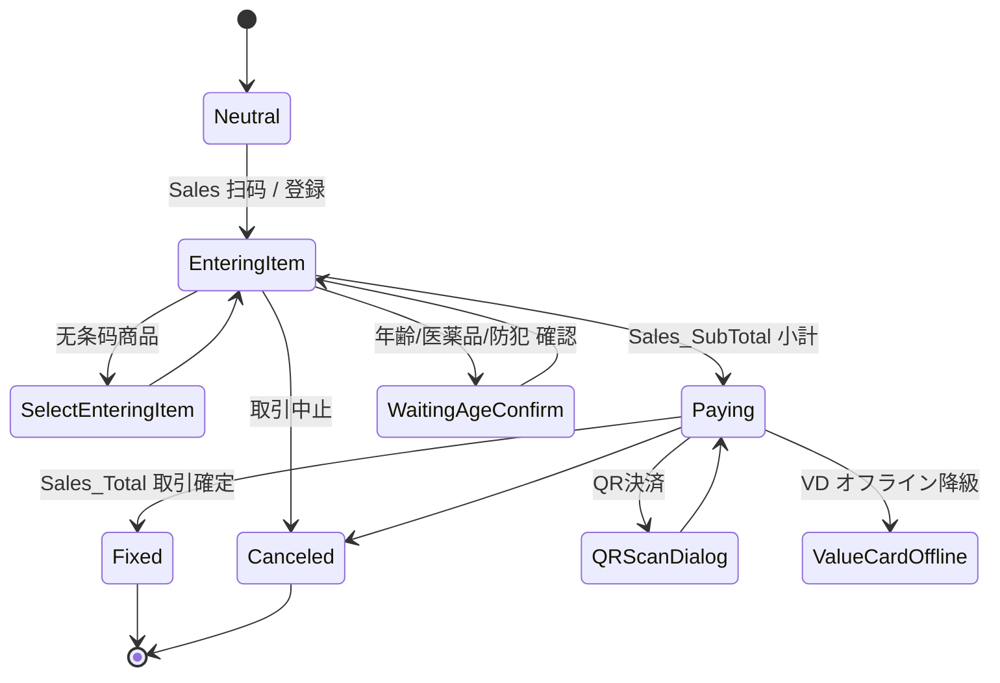

# 三层状态机：TranType → State → Command

> POS4U 用一套**声明式**状态机约束收银台：交易种类 **TranType** 决定画面与状态族，当前 **State** 决定"此刻允许哪些 Command"，命令执行后改写状态。非法状态下的 Event 被引擎丢弃。
> 状态**节点**（枚举）与**准入白名单**（XML）源码可核；**引擎读取执行 XML 的 `StateEventConverter` 无源码（dll）→ uncheckable**。

## 1. 第一层：TranType（29 个）

`Application/Source/Common/Common.Const/TranTypes.cs` 定义 **29** 个 `public static TranType`：

```
Sales · SelfSales · Return · ReSales · Void · MTranDelete           // 销售族
OpenCount · CloseCount · CashIn · CashOut · EntryCalculatedCash · EntryNonCash  // 金钱管理
CashChangerRecover · CashChangerReplenish · CashChangerExchangeMoney  // 找零机
EMoneyCharge · EMoneyChargeVoid · EMoneyChargeEmployee · EMoneyChargeSelfSales  // 电子钱包充值
PaymentStation · MainMenu · Lock · DeviceSetting · EJournalSearch · EvidenceReceipt · OrderKitchen  // 其它
PowerOn · SignIn · SignOut                                          // 系统（非交易）
```

`TranType` 类型本体在 dll（`class TranType` 源码命中=0）→ uncheckable；常量清单可核。TranType → 画面映射见 → [`03_ui_mapping.md`](./03_ui_mapping.md)。

## 2. 第二层：State（前缀 + 枚举）

每个 State 命名为 **`<Prefix>_<StateName>`**。前缀集中在 `Application/Source/Common/Common.Const/State/StatePrefixes.cs`（约 30 个，如 `SalesTran_`、`Payment_`、`LineItem_`、`CloseCountTran_`…，`:16-330`），与 TranType 对应。

状态族按交易分文件放在 `Application/Source/Common/Common.Const/State/`（31 个 `*States.cs`）。以销售为例，`SalesTranStates.cs` 恰为 **28** 个状态 = **18 个 `TranState` + 10 个 `State`**（与 [真值基线](../00_portal/conventions.md#2-真值基线实测--全体文档共享--勿再推导)一致）：

| 类型 | 代表状态（file:line 于 `SalesTranStates.cs`） |
|---|---|
| `TranState`（18） | `Neutral`(:13) · `EnteringItem`(:18) · `SelectEnteringItem`(:23) · `Paying`(:28) · `Fixed`(:33) · `Canceled`(:38) · `SavedMTran`(:44) · 中間取引系 7 个(:49-104) · `GetCashChangerStatus`(:114) · `WaitingMsrRead`(:129) |
| `State`（10） | `WaitingAgeConfirm`(:89) · `WaitingDrugConfirm`(:94) · `WaitingPreventionConfirm`(:99) · `ItemCancel`(:109) · `ValueCardOffline`(:119) · `CashChanger_ErrorDisconnect`(:124) · `WaitingFaceMe`(:134) · `FaceMeSecondCheckPinInput`(:139) · `QRScanDialog`(:144) · `WaitingDrugVerify`(:149) |

- 构造签名可见：`new TranState(prefix, name, bool, bool)` / `new State(prefix, name, bool)`；两个布尔标志的**语义在 dll**（uncheckable）。
- `TranState` 与 `State` 的**区别**：源码只见 `TranState` 用于"主干交易状态"、`State` 用于"临时/确认子状态"（从用法归纳）；类定义在 dll，无法核实其继承/差异 → 该判断标 unverified。
- 其它状态族计数（`SelfStates`=39、`CloseCountTranStates` 等）见 [真值基线](../00_portal/conventions.md#2-真值基线实测--全体文档共享--勿再推导)；完整状态字典 → [40_data/枚举](../40_data/06_enums_constants.md)（不在此重复）。

## 3. 第三层：State × 可接受 Command 白名单

准入控制定义在 `Application/Source/POS4U/Settings/StateWinPOSSales.xml`（1596 行）。每个 `<State Ids="...">` 节点（一个节点可覆盖多状态，逗号分隔）内列出该状态**允许的 `<Command Id="..."/>`**：

```xml
<State Ids="SalesTran_Neutral,SalesTran_Fixed,SalesTran_Canceled">   <!-- StateWinPOSSales.xml:4 -->
  <Command Id="Sales_PriceLookup"/>
  <Command Id="Sales_SubTotal"/>
  <Command Id="Member_MemberBarcodeScan"/>
  ...
</State>
<State Ids="SalesTran_EnteringItem"> ... </State>                     <!-- :50 -->
```

- 全局命令（任何状态可接受）在 `StateWinPOS.xml` 的 `<Anytime>` 段（`StateWinPOS.xml:4-30`，如 `Common_Clear`、`Device_Error`、`Common_PrintReceipt`）。
- 变体：`StateWinPOSReSales.xml`（打ち直し）、`POS4UTwoOperatorsCH/Settings/StateWinPOSSalesCH.xml`（二人制副屏）。

## 4. 迁移串接：Before / After 钩子

状态转移时的**自动命令串接**定义在 `Application/Source/POS4U/Settings/StateEventWinPOS.xml`（236 行），结构为 `TranType → State → Command(Before/After)`：

```xml
<Root>
  <TranType Id="SelfSales">                                          <!-- StateEventWinPOS.xml:3 -->
    <State Id="SalesTran_ItemReference">
      <Command Before="Common_SignInAttendant"
               After="SelfSales_ChangePriceBttonEnable" />           <!-- :5-6 -->
    </State>
  </TranType>
</Root>
```

即"在 `SelfSales` 交易的 `SalesTran_ItemReference` 状态，执行前先跑 `Common_SignInAttendant`、执行后跑 `SelfSales_ChangePriceBttonEnable`"。

> **迁移边可核性**：状态**准入**（§3）与**串接钩子**（§4）都是声明式 XML（可核）；但"命令执行后当前状态被设成哪个值"由各 Command 类（部分源码可核）与 `StateEventConverter`（dll）共同完成——**后者 uncheckable**。

## 5. 销售交易主干（示意）



> 图为**业务主干示意**，状态节点均取自 `SalesTranStates.cs`（可核）；迁移方向的权威定义分散在 `StateWinPOSSales.xml`（准入）+ `StateEventWinPOS.xml`（串接）+ 各 Command，非从单一文件逐边核实（迁移边整体 → 部分 unverified）。销售域业务规则见 → [30_domain/sales](../30_domain/sales.md)。

## 6. 可信度与核查

- **verified**：29 TranType、SalesTranStates 28 节点、StatePrefixes、StateWinPOSSales / StateEventWinPOS 的结构与代表条目均带 file:line。
- **unverified**：`TranState` vs `State` 的语义差异、状态迁移的逐边方向（依赖 dll 内 `StateEventConverter` 执行）。
- **uncheckable**：`TranType`/`State`/`TranState` 类型本体、`StateEventConverter` —— 均在 `.dll`。
