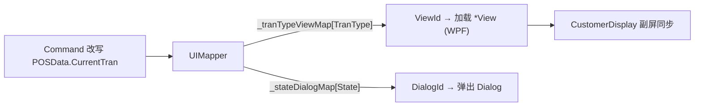

# UI 映射：TranType → View / State → Dialog

> 前台画面不由业务代码 `new` 出来，而是由 `UIMapper` 按**当前交易种类（TranType）**决定主画面（View）、按**当前状态（State）**决定弹窗（Dialog）。这把"业务状态"与"WPF 画面"解耦。

## 1. UIMapper：两张映射字典

`Application/Source/WinPOS/UI/WinPOS.UI.UIMapper/UIMapper.cs`：`public class UIMapper : IUIMapper`（`:20`）持有两个只读字典：

### TranType → ViewId（26 项，`:25-53`）

```csharp
private readonly Dictionary<TranType, ViewId> _tranTypeViewMap = new() {
    { TranTypes.MainMenu,      ViewIds.MainMenu },       // :27
    { TranTypes.Sales,         ViewIds.Sales },          // :38
    { TranTypes.Return,        ViewIds.Sales },          // :39  返品复用 Sales 画面
    { TranTypes.SelfSales,     ViewIds.SelfSales },      // :40
    { TranTypes.ReSales,       ViewIds.Sales },          // :47  打ち直し复用 Sales 画面
    { TranTypes.Void,          ViewIds.Void },           // :48
    ...  // 共 26 项
};
```

- **`Return` / `ReSales` 与 `Sales` 共用 `ViewIds.Sales`**（`:39` / `:47`）——返品、打ち直し不另建画面。
- 26 个 TranType 映射到 24 个 `ViewId`（`ViewIds.cs`：24 个 `public static ViewId`）。

### State → DialogId（`:58+`）

```csharp
private readonly Dictionary<State, DialogId> _stateDialogMap = new() {
    { OpenCountTranStates.WaitingForConfirm,  DialogIds.MessageDialog },            // :60
    { OpenCountTranStates.CashChangerAmountNonConfirm, DialogIds.OpenCountReexecuteDialog }, // :61
    { CloseCountTranStates.WaitingForConfirm, DialogIds.MessageDialog },            // :62
    ...
};
```

- 大量 `Waiting*Confirm` 状态映射到 `DialogIds.MessageDialog`；特殊状态映射专用弹窗。
- `DialogIds.cs`：34 个 `public static DialogId`。

## 2. ViewId / View 项目对应

`ViewId` 类型源码可核（`Application/Source/WinPOS/UI/WinPOS.UI.UICommon/Const/Class/ViewId.cs`），常量在 `ViewIds.cs`。每个 View 对应一个 `WinPOS/UI/WinPOS.UI.*View` 项目（[framework/index §2](./index.md#2-winpos-38-个-csproj-项目地图) 的 UI/ 20 项）：

| ViewId 例 | View 项目 | 用途 |
|---|---|---|
| `Sales` | `WinPOS.UI.SalesView` | 登録機收银主画面 |
| `SelfSales` | `WinPOS.UI.SelfSalesView` | 自助收银画面 |
| `PaymentStation` | `WinPOS.UI.PaymentStationView` | 会計機 |
| `MainMenu` | `WinPOS.UI.MainMenuView` | 主菜单 |
| `EMoneyCharge` 系 | `WinPOS.UI.EMoneyView` / `EMoneySelfSalesView` / `EMoneyEmployeeView` / `EMoneyChargeVoidView` | 电子钱包充值 |
| 副屏 | `WinPOS.UI.CustomerDisplay` | 客显 |

> `View` 与 `POSData` 的绑定基础设施（`UIBaseForm` 等）在 dll（uncheckable，见 [01 §5 插件注册](./01_event_command_observer.md#5-引擎组件的注册配置可核)）。

## 3. UIMapper 项目的其它映射器

同项目 `WinPOS.UI.UIMapper` 内（1 类 1 文件）：

- `GuidanceMapper.cs` —— 语音/操作引导映射（配合 `POS4U/VoiceGuidances/`）。
- `MessageDialogInfoCreator.cs` / `MessageDialogLibrary.cs` —— 消息弹窗内容构建（配合 [多语言 Message.*.xml](../10_architecture/07_crosscutting.md#4-多语言-i18n)）。

## 4. 画面切换时序（示意）



## 5. 可信度与核查

- **verified**：`UIMapper` 两字典（TranType→View 26 项、State→Dialog）、`ViewIds`(24)/`DialogIds`(34) 计数、Return/ReSales 复用 Sales 画面均带 file:line。
- **uncheckable**：`IUIMapper` 契约本体、`UIBaseForm` 等画面基础设施在 dll。
