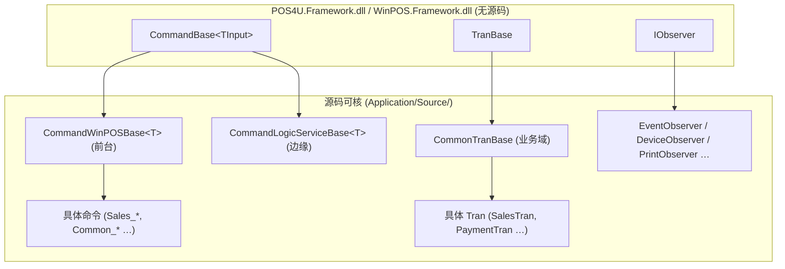

# 框架基类：TranBase / CommandBase / Observer（**无源码 · uncheckable**）

> ⚠️ **本篇整体 `verification: uncheckable`。** POS4U 引擎的全部基类与调度核心**没有源码**，以编译好的 `.dll` 引用进各项目。本篇**不断言任何基类内部实现**，只列可核的**使用层证据**（谁继承它、在哪调用它）。这是 [conventions 原则 8](../00_portal/conventions.md#1-九条硬原则) 的直接落实。

## 1. 四个框架程序集

`Application/Source/POS4U/POS4U.csproj` 的 `<Reference>` 引用 4 个框架程序集（均 `PublicKeyToken=7f613065d93c5dd1`）：

| 程序集 | 引用方式 | 物理文件 |
|---|---|---|
| `POS4U.Framework` | Reference | ✅ 存在 `Application/POS4UCloud/ExternalModule/Framework/POS4U.Framework.dll`（132608 B） |
| `POS4U.Framework.Library` | Reference | ✅ 存在 同目录 |
| `WinPOS.Framework` | Reference，`HintPath=..\..\ExternalModule\WinPOS.Framework.dll` | ❌ **该 dll 不在仓库树内**（仅有引用声明） |
| `WinPOS.Framework.Library` | Reference | ❌ 不在仓库树内 |

> 对全部下列类名执行 `grep -rn "class X" --include='*.cs'`，**命中数均为 0** —— 证明它们不在源码，只在 dll。

## 2. 基类清单与使用层证据

| 基类 / 类型 | 推定所在 | 使用层证据（源码可核 file:line） | 可核实 / 不可核实 |
|---|---|---|---|
| `CommandBase<TInput>` | `POS4U.Framework` | 全树仅 2 处继承：`WinPOS.CommandCommon/CommandWinPOSBase.cs:12`、`LogicService.CommandCommon/CommandLogicServiceBase.cs:14` | ✅ 继承点、构造传 `EventCode`、`Execute` 被 `sealed override`（`CommandWinPOSBase.cs:54`） ❌ `Execute` 基类实现、命令注册/路由 |
| `TranBase` | `POS4U.Framework` | `Business.BusinessCommon/CommonTranBase.cs:19`：`CommonTranBase : TranBase, IDisposable`（业务域各 Tran 的共同父） | ✅ 业务 Tran 都经 `CommonTranBase` ❌ 状态持有、生命周期 |
| `IObserver` / `Observer` | `POS4U.Framework` | `WinPOS.Observer/EventObserver.cs:16`：`EventObserver : IObserver`，`void IObserver.Update(POSData)`(:20) | ✅ 具体 Observer 与 `Update` 签名 ❌ 观察者注册、通知调度 |
| `EventCode` | `POS4U.Framework` | `Common.Const/EventCodes.cs`：429 个 `new EventCode(nameof, code)` | ✅ 事件常量清单 ❌ `EventCode` 结构/相等语义 |
| `State` / `TranState` | `POS4U.Framework` | `Common.Const/State/*.cs`：`new TranState(prefix,name,bool,bool)` / `new State(prefix,name,bool)` | ✅ 状态常量、构造签名 ❌ 两 bool 语义、`State` vs `TranState` 差异 |
| `TranType` | `POS4U.Framework` | `Common.Const/TranTypes.cs`：29 个 | ✅ 清单 ❌ 类型内部 |
| `WinPOSController` | `WinPOS.Framework` | `POS4U/App.xaml.cs:211` `new WinPOSController()`；`:214` `.Startup(...)` | ✅ 实例化+启动入口 ❌ 生命周期编排 |
| `EventManager` / `CommandController` / `StateEventConverter` / `WinPOSDeviceManager` | `WinPOS.Framework` | `POS4U/Settings/PluginWinPOS.xml`（Class 全名）；`ControllerWinPOS.xml:4-30`（启动注册） | ✅ 注册配置 ❌ 全部调度逻辑 |
| `Factory` | `WinPOS.Framework` | `EventObserver.cs:37` `Factory.CreatePlugin(WinPOSFrameworkPluginIds.EventManager)` | ✅ 插件获取调用点 ❌ 插件容器实现 |
| `BusinessCounter` / `NumberingCount` | `POS4U.Framework` | `CommonTranBase.cs:246-247`、`Business.Sales/MTranObject.cs:666`（採番调用） | ✅ 采番调用点、[持久化侧 SP](../10_architecture/07_crosscutting.md#2-採番--sequence) ❌ 采番算法 |
| `CheckDigitManager` / `CheckDigitM10W31` | `POS4U.Framework` | `Business.Sales/MTranObject.cs:668`、`Business.InputConverter/BarcodeConverter/*.cs`（校验位） | ✅ 校验位使用点 ❌ M10W31 算法 |
| `SecurityUtility.AesDecrypt` | 框架 | `Device.ValueCard/ValueCard.cs:361`、`Device.RetailMediaService/RetailMediaServiceCommon.cs:60` | ✅ 凭据解密调用点 ❌ 加解密实现 |

## 3. 继承层次（使用层视角）

## 4. 核查结论

- **能证明的**：这些基类**存在**、被谁继承/调用、构造与关键 `override` 的签名。
- **不能证明的**：任何基类**内部实现**（`Execute`/`Update`/调度/采番/校验位算法）。
- **对 ST-POS 的意义**：内製化必须**重新定义**这些契约（不能复用 dll）；本篇的使用层证据是"契约表面"的最完整可核清单。逐项对照 → [90_traceability](../90_traceability/matrix.md)。
