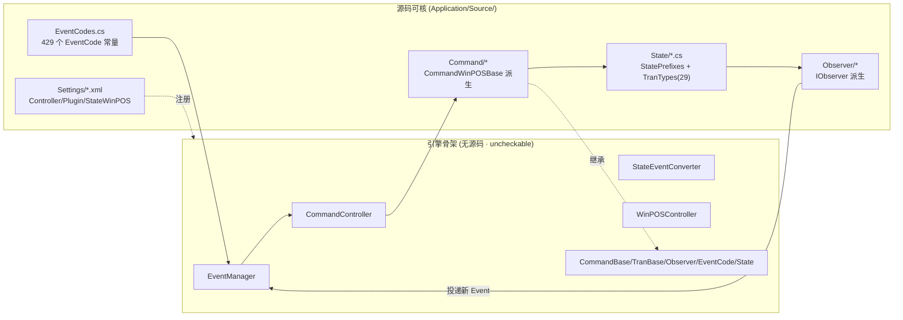

# WinPOS 前端应用框架（`Application/Source/WinPOS/`）

> POS4U 前台收银主进程（`POS4U.exe`，WPF）的应用框架层。业务不写在 UI 里，而是被 **Event → Command → Observer → State** 引擎统一编排。本层解释"引擎怎么运作/为何这样组织"；具体业务规则在 [30_domain](../30_domain/index.md)，数据字典在 [40_data](../40_data/01_overview.md)。

## 1. 定位

`WinPOS/` 是 POS4U 前台的**应用框架**：把收银台的一切操作（扫码、改价、支付、挂账、精算…）抽象为**事件（Event）**，由**命令（Command）**执行，命令改变**全局状态（POSData / State）**，**观察者（Observer）**响应状态变化去驱动打印机、找零机、画面与副屏。

- 前台主进程 `POS4U.exe`（WPF，`OutputType=WinExe`）引用 4 个框架程序集：`POS4U.Framework` / `POS4U.Framework.Library` / `WinPOS.Framework` / `WinPOS.Framework.Library`（`Application/Source/POS4U/POS4U.csproj` 的 `<Reference>`，`PublicKeyToken=7f613065d93c5dd1`）。
- **引擎的编排骨架（`EventManager` / `CommandController` / `StateEventConverter` / `WinPOSController` 及 `CommandBase` / `TranBase` / `Observer` / `EventCode` / `State` / `TranState` 基类）全部无源码，位于 `WinPOS.Framework.dll` / `POS4U.Framework.dll`**（`class X` 在源码树内 grep 命中数=0）→ 标 **uncheckable**，详见 [`04_base_classes.md`](./04_base_classes.md)。本体系只核实"使用层"（枚举常量、XML 配置、派生类）。

## 2. WinPOS 38 个 `.csproj` 项目地图

> 实测 `find Application/Source/WinPOS -name '*.csproj'` = **38**（与 [conventions 真值基线](../00_portal/conventions.md#2-真值基线实测--全体文档共享--勿再推导)一致）。按 7 个子目录分组。

| 子目录 | 数量 | 项目（去 `WinPOS.` 前缀） | 角色 |
|---|---|---|---|
| **Command/** | 12 | CommandCommon · CommandSales · CommandReSales · CommandEntryNonCash · CommandCashInOut · CommandOpenCount · CommandCloseCount · CommandMainMenu · CommandPaymentStation · CommandPaymentService · CommandEMoney · CommandCashChanger | 各业务的命令实现（继承 `CommandWinPOSBase`） |
| **UI/** | 20 | UICommon · UIMapper · UILibrary(见 Library) · POSControl · SalesView · SelfSalesView · ReSalesView · CashChangerView · CashInOutView · OpenCountView · CloseCountView · MainMenuView · PaymentStationView · EntryNonCashView · EvidenceReceiptView · OrderKitchenView · CustomerDisplay · EMoneyView · EMoneySelfSalesView · EMoneyEmployeeView · EMoneyChargeVoidView | WPF 画面/副屏/映射 |
| **Observer/** | 1 | Observer | 具体观察者集合（Device/Print/Event/FaceMe/LDSP/SelfFraudDetection/AttendantPC…） |
| **Library/** | 1 | Library.UILibrary | UI 公用库 |
| **Common/** | 1 | Common | 前端公共常量（含 `WinPOSSettingValues`） |
| **Background/** | 1 | Background | 前台内的后台线程处理 |
| **Batch/** | 2 | Batch · BatchLibrary | 与 `TRAN4U` 的 IPC 客户端（`TranRemoteControllerLibrary`）等批处理 |

> UI 项目数 = 20（`WinPOS.UI.UILibrary` 归入 Library/ 目录，故 UI/ 目录下 20 项 + Library/ 目录 1 项）。`WinPOS.UI.MainMenuView` 为双层目录（`WinPOS/UI/WinPOS.UI.MainMenuView/WinPOS.UI.MainMenuView/`）。

## 3. 引擎五要素与本层文件

| 文件 | 主题 | 可信度 |
|---|---|---|
| [`01_event_command_observer.md`](./01_event_command_observer.md) | Event→Command→Observer 引擎；429 EventCode；插件注册 | verified（使用层）+ uncheckable（调度核心） |
| [`02_state_machine.md`](./02_state_machine.md) | 三层状态机 TranType→State→Command；StateWinPOS.xml 白名单 | verified（节点/白名单）+ uncheckable（迁移语义） |
| [`03_ui_mapping.md`](./03_ui_mapping.md) | UIMapper：TranType→View、State→Dialog | verified |
| [`04_base_classes.md`](./04_base_classes.md) | TranBase / CommandBase / Observer 基类 | **uncheckable（dll）** |
| [`05_conventions.md`](./05_conventions.md) | MVC 分层 · 1 Class 1 File · StyleCop · POS4U.ruleset | verified |

## 4. 可信度与核查

- **verified**：38 项目计数、429 EventCode、Command/Observer 派生、Settings XML 均亲核（file:line 见各篇）。
- **uncheckable**：引擎调度核心与全部框架基类在 `.dll`（无源码）。`WinPOS.Framework.dll` 的 `HintPath` 为 `Application/Source/ExternalModule/WinPOS.Framework.dll`，但该 dll 物理文件不在仓库树内（仅 `POS4U.Framework.dll` / `POS4U.Framework.Library.dll` 存在于 `Application/POS4UCloud/ExternalModule/Framework/`）。

## 5. ST-POS 迁移提示

> ⚠️ WinPOS 引擎的价值在于**"配置驱动的状态×命令白名单"**这一约束模型（见 02），而非其 WPF/OPOS 实现。ST-POS 重构对照见 → [90_traceability](../90_traceability/matrix.md)。仅外链，不在此展开。
