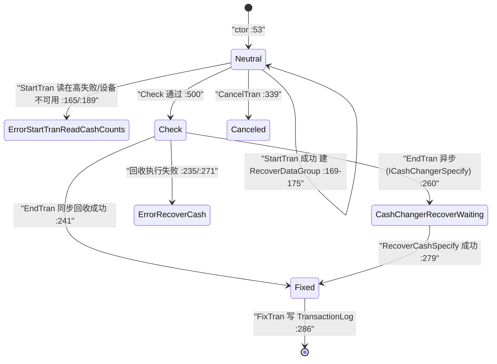

# 找零机管理域（Business.CashChanger）

> `verification: verified`——5 个事务类 + 4 个 DataGroup 的类结构、状态节点、TranLogType 绑定、金额/枚数校验规则、设备调用序列、在高登録 SP 写入均已逐条回代码 `file:line` 核实（最新发布）。核查边界：`TranBase`（Framework，无源码）与找零机设备驱动 `ICashChanger` 的内部实现标 `uncheckable`。

## 1. 模块定位

封装**自动找零机（つり銭機）现金操作**的清点类业务事务，共 4 类操作 + 1 类在高登録：

- **回收（Recover）**：把找零机内超量现金取出（残置枚数以上）。有 v1（[`CashChangerRecoverTran.cs:15`](Application/Source/Business/Business.CashChanger/CashChangerRecoverTran.cs)）与 v2（[`CashChangerRecoverTranVer2.cs:17`](Application/Source/Business/Business.CashChanger/CashChangerRecoverTranVer2.cs)）两代实现。
- **补充（Replenish）**：向找零机投入现金（[`CashChangerReplenishTran.cs:15`](Application/Source/Business/Business.CashChanger/CashChangerReplenishTran.cs)）。
- **两替（ExchangeMoney）**：一次操作内同时补充+回收，用于换零（[`CashChangerExchangeMoneyTran.cs:18`](Application/Source/Business/Business.CashChanger/CashChangerExchangeMoneyTran.cs)）。
- **在高登録（EntryCalculatedCash）**：读取找零机在高 + 手输钱箱（ドロア）枚数，计算过不足并落库（[`EntryCalculatedCashTran.cs:13`](Application/Source/Business/Business.CashChanger/EntryCalculatedCashTran.cs)）。

系统角色：这些事务同 `Business.Sales` 等一样继承 `CommonTranBase`（→ 详见 [业务通用域](../30_domain/business_common.md)），确定时经 `FixTran()` 写入 TransactionLog；**其现金移动数据是开闭店精算「あるべき現金 vs 現金在高」计算的输入**（在高登録 SP 落库，→ 详见 [开闭店精算域](../30_domain/open_close.md)）。

- 命名空间：`ForYouApplications.POS4U.Business.CashChanger`
- 依赖（`Business.CashChanger.csproj`）：`Common.Const`、`Data.Accessor`、`Data.Container`、`Device.DeviceCommon`、`Device.DeviceDefine`、`WinPOS.Common`、`Business.BusinessCommon`、`Business.Operator`。

## 2. 代码结构

10 个 `.cs`（实测 `wc -l` 合计 2693 行）。事务类 + 数据组：

| 类 | file:line | 基类/接口 | TranType | TranLogType（来源） |
|---|---|---|---|---|
| `CashChangerRecoverTran`（v1） | [`:15`](Application/Source/Business/Business.CashChanger/CashChangerRecoverTran.cs) | `CommonTranBase` | `CashChangerRecover` | 静态 `TranLogTypes.CashChangerRecover`（:43） |
| `CashChangerRecoverTranVer2` | [`:17`](Application/Source/Business/Business.CashChanger/CashChangerRecoverTranVer2.cs) | `CommonTranBase` | `CashChangerRecover` | **动态** `_logType`（由 `SetTranLogType` 外部注入，:79/:386） |
| `CashChangerReplenishTran` | [`:15`](Application/Source/Business/Business.CashChanger/CashChangerReplenishTran.cs) | `CommonTranBase` | `CashChangerReplenish` | **动态** `_logType`（:44/:179） |
| `CashChangerExchangeMoneyTran` | [`:18`](Application/Source/Business/Business.CashChanger/CashChangerExchangeMoneyTran.cs) | `CommonTranBase` | `CashChangerExchangeMoney` | 静态 `TranLogTypes.CashChangerExchangeMoney`（:66） |
| `EntryCalculatedCashTran` | [`:13`](Application/Source/Business/Business.CashChanger/EntryCalculatedCashTran.cs) | `CommonTranBase` | `EntryCalculatedCash` | 静态 `TranLogTypes.EntryCalculatedCash`（:41） |
| `CashChangerRecoverDataGroup` | [`:13`](Application/Source/Business/Business.CashChanger/CashChangerRecoverDataGroup.cs) | — | — | 在高/回收/回收后预览三份 DataSet |
| `CashChangerReplenishDataGroup` | [`:11`](Application/Source/Business/Business.CashChanger/CashChangerReplenishDataGroup.cs) | — | — | 在高/补充/补充后预览 |
| `CashChangerExchangeMoneyDataGroup` | [`:12`](Application/Source/Business/Business.CashChanger/CashChangerExchangeMoneyDataGroup.cs) | — | — | 在高 + 补充/回收 + 双预览 |
| `EntryCalculatedCashDataGroup` | [`:14`](Application/Source/Business/Business.CashChanger/EntryCalculatedCashDataGroup.cs) | — | — | 找零机在高 + 钱箱枚数/本数 + 过不足计算 |

关键点：

- **TranLogType 两种绑定方式**：v1 Recover / ExchangeMoney / EntryCalculatedCash 走**静态**常量；v2 Recover / Replenish 用 `private TranLogType _logType` 由 UI 命令层 `SetTranLogType()` 注入——因为回收/补充按「対ドロア」与否可映射到不同码（`CashChangerReplenishFromDrawer=807` / `CashChangerRecoverToDrawer=808`，见 [`TranLogTypes.cs:187/192`](Application/Source/Common/Common.Const/TranLogTypes.cs)）。TranLogType 数值码：Recover=803 / Replenish=806 / EntryCalculatedCash=809 / ExchangeMoney=810（[`TranLogTypes.cs:167/182/197/202`](Application/Source/Common/Common.Const/TranLogTypes.cs)）。
- **金种固定为日元 10 档**：10000/5000/2000/1000/500/100/50/10/5/1（如 [`CashChangerRecoverTranVer2.cs:34-46`](Application/Source/Business/Business.CashChanger/CashChangerRecoverTranVer2.cs)、[`CashChangerExchangeMoneyTran.cs:181`](Application/Source/Business/Business.CashChanger/CashChangerExchangeMoneyTran.cs)）。
- **`CashChangerExchangeMoneyTran.cs:18` 使用全角空格**（`public　class`），grep 常规空格无法命中，实体确存在（原稿此注记正确，保留）。
- v1 `CashChangerRecoverTran` 极薄（103 行，`EndTran` 仅置 Fixed + `FixTran`，无设备调用）；实际带设备编排的是 v2（543 行）。两代并存属演进痕迹，v2 顶部 `// TODO:UncertainCashCount(在高未確定フラグ)は未実装。`（[`:19`](Application/Source/Business/Business.CashChanger/CashChangerRecoverTranVer2.cs)）。

## 3. 状态机

各事务状态常量集中于 `Application/Source/Common/Common.Const/State/`。节点全部实测：

| 事务 | 状态文件 | 节点（含错误态） |
|---|---|---|
| Recover | [`CashChangerRecoverTranStates.cs`](Application/Source/Common/Common.Const/State/CashChangerRecoverTranStates.cs) | Neutral/Fixed/Canceled/Check/CashChangerRecoverWaiting + 5 错误态（ErrorRecoverCash/ErrorStartTranReadCashCounts/ErrorEndTranReadCashCounts/ErrorCancelTranReadCashCounts/ErrorReadCashCounts）（:17-63） |
| Replenish | [`CashChangerReplenishTranStates.cs`](Application/Source/Common/Common.Const/State/CashChangerReplenishTranStates.cs) | Neutral/Fixed/Canceled + ErrorReadCashCounts/ErrorBeginReplenish/ErrorEndReplenish/ErrorCanceled/ErrorStartTranReadCashCounts（:17-52） |
| ExchangeMoney | [`CashChangerExchangeMoneyTranStates.cs`](Application/Source/Common/Common.Const/State/CashChangerExchangeMoneyTranStates.cs) | Neutral/Entering/Fixed/Canceled/Check + 8 错误态（:13-73） |
| EntryCalculatedCash | [`EntryCalculatedCashTranStates.cs`](Application/Source/Common/Common.Const/State/EntryCalculatedCashTranStates.cs) | Neutral/Fixed/Canceled + ErrorStartTranReadCashCounts/ErrorEndTranReadCashCounts/ErrorCancelTranReadCashCounts（:17-42） |

`TranState` 构造第 3/4 参标记 `isError`/正常态（如 `new TranState(..., true, false)` 为错误态）。以 v2 Recover 为主线的迁移（`file:line` 均在 `CashChangerRecoverTranVer2.cs`）：

> 注：`StartTran`/`Check`/`CancelTran`/`ReadCashCounts` 为模块自定义方法（**非** `CommonTranBase` 契约），由 WinPOS 命令层调用；仅 `EndTran` 是 `override`。错误态多数不置 `SetError` 而是「出再実行確認ダイアログ」故 `return true`（如 [`:192`](Application/Source/Business/Business.CashChanger/CashChangerRecoverTranVer2.cs)）。

## 4. 业务规则

| 规则 | 代码证据 | 说明 |
|---|---|---|
| **BR-CHANGER-001** 回收额输入校验 | [`CashChangerRecoverTran.cs:70-101`](Application/Source/Business/Business.CashChanger/CashChangerRecoverTran.cs) | 非空 → `decimal.TryParse` → 小数位 ≤ `FrameworkLibrarySettingValues.CurrencyDecimalDigits` → 0 < amount ≤ `SettingValues.SystemLimitTotalAmount`；违反置 `ErrorInputRangeOver` |
| **BR-CHANGER-002** 回收后枚数不得为负 | [`CashChangerRecoverTranVer2.cs:202-207`](Application/Source/Business/Business.CashChanger/CashChangerRecoverTranVer2.cs)、[`:477`](Application/Source/Business/Business.CashChanger/CashChangerRecoverTranVer2.cs) | `PreviewCount` 任一金种 `Count<0` → `ErrorOverRecoverCount` |
| **BR-CHANGER-003** 回收金额为 0 禁止确定 | [`CashChangerRecoverTranVer2.cs:218-223`](Application/Source/Business/Business.CashChanger/CashChangerRecoverTranVer2.cs) | `RecoverTotalAmount==0` → `ErrorNotRecovered` |
| **BR-CHANGER-004** 回收庫（超量箱）未清空阻断 | [`CashChangerRecoverTranVer2.cs:178-184`](Application/Source/Business/Business.CashChanger/CashChangerRecoverTranVer2.cs) | StartTran 时若 `OverCount` 有余额 → `ErrorNotRecoveredRecoveryBox` |
| **BR-CHANGER-005** 紙幣回收须勾选回收庫 | [`CashChangerRecoverTranVer2.cs:491-498`](Application/Source/Business/Business.CashChanger/CashChangerRecoverTranVer2.cs) | 有 ≥1000 円回收 + 回收庫有钱 + 未勾 `IsRecoveryBox` → `ErrorNeedRecoverRecoveryBox` |
| **BR-CHANGER-006** 残置枚数来自主数据 | [`CashChangerRecoverTranVer2.cs:417-455`](Application/Source/Business/Business.CashChanger/CashChangerRecoverTranVer2.cs) | `DenominationSet()` 读 `CashDenominationMasterAccessor.GetCashDenominationMaster`，回收枚数=庫内枚数−残置枚数（不足则 0） |
| **BR-CHANGER-007** 两替补充=回收金额一致校验 | [`CashChangerExchangeMoneyTran.cs:170-178`](Application/Source/Business/Business.CashChanger/CashChangerExchangeMoneyTran.cs)、[`:411-416`](Application/Source/Business/Business.CashChanger/CashChangerExchangeMoneyTran.cs) | 除 `ReasonCode=="03"` 外，`ReplenishTotalAmount != RecoverTotalAmount` → `ErrorNotMatchRecoverCount`；`"03"` 免校验（金额可不等） |
| **BR-CHANGER-008** 两替理由必填 | [`CashChangerExchangeMoneyTran.cs:524-539`](Application/Source/Business/Business.CashChanger/CashChangerExchangeMoneyTran.cs) | `SetReason` 以 `:` 分割，`ReasonType=ReasonExchangeMoney`（码 "5"）；空 → `ErrorInvalidReasonCode` |
| **BR-CHANGER-009** 补充为 0 禁确定 | [`CashChangerReplenishTran.cs:115-120`](Application/Source/Business/Business.CashChanger/CashChangerReplenishTran.cs) | `ReplenishTotalAmount==0` → `ErrorNotReplenish` |
| **BR-CHANGER-010** 在高登録过不足计算 | [`EntryCalculatedCashDataGroup.cs:241-247`](Application/Source/Business/Business.CashChanger/EntryCalculatedCashDataGroup.cs) | `DifferenceCash = CashTotal − CalculatedCashTotal`；`CashTotal = CashInDrawer + CashInChanger`；找零机合计含回收庫（`CashChangerRecoveryBox`，:107-118） |
| **BR-CHANGER-011** 在高登録设备存在性 | [`EntryCalculatedCashTran.cs:73-77`](Application/Source/Business/Business.CashChanger/EntryCalculatedCashTran.cs) | 找零机与钱箱皆未接续 → `ErrorDeviceNotConnect`；找零机切断时自动重连（`InitDevice`，:85-88） |

确定动作统一走 `CommonTranBase.FixTran()`（[`CommonTranBase.cs:101`](Application/Source/Business/Business.BusinessCommon/CommonTranBase.cs)）→ `TransactionLogAccessor.InsertTransactionLog` + 电子ジャーナル生成。**在高登録额外**经 `EntryCalculatedCashDataGroup.SetCalculatedCash()`（[`:394`](Application/Source/Business/Business.CashChanger/EntryCalculatedCashDataGroup.cs)）调 `TotalAccessor.SetCalculatedCashTotal` → SP `dbo.usp_SetCalculatedCashTotal`（[`TotalAccessor.cs:83`](Application/Source/Data/Data.Accessor/TotalAccessor.cs)）落库。

> 合规背景：找零机回收/补充/两替产生现金移动痕迹，用于开闭店时「あるべき現金」与实点现金对账（过不足管理），属日本零售现金管理惯例；未见证据关联特定法规，故不断言。

## 5. 关键接口与契约

- **基类**：`CommonTranBase`（[`CommonTranBase.cs:19`](Application/Source/Business/Business.BusinessCommon/CommonTranBase.cs)，`abstract ... : TranBase, IDisposable`）。抽象成员 `TranType`/`TranLogType` 由各事务 override；`CurrentState`/`MainTranState`/`TranState`/`SetError` 继承自 `TranBase`（Framework，**uncheckable**）。
- **设备契约**：`ICashChanger`（`Device.DeviceCommon`），经 `Factory.CreatePlugin(FrameworkPluginIds.DeviceManager).GetDevice(DeviceIds.CashChanger)` 取得。调用面（业务侧消费，实现在设备层）：`ReadCashCounts()`、`RecoverCash(dict, exitType[, isRecoveryBox])`、`BeginReplenishCash()`/`EndReplenishCash()`、`CancelDeposit()`、`ExcuteDataEvent()`、`DepositCountData`；异步变体 `ICashChangerSpecify.MakeDispenseCashInfo()`/`RecoverCashSpecify()`/`DispenseCashInfo`（[`CashChangerRecoverTranVer2.cs:226-268`](Application/Source/Business/Business.CashChanger/CashChangerRecoverTranVer2.cs)）→ 详见 [50_devices/找零机](../50_devices/cash_changer.md)。
- **数据契约**：`CashCountDataSet`（在高：`CashCount` 正常庫 + `OverCount` 回收庫）、`DepositCountDataSet`（`DepositCount` 明细行 + `DepositAmount` 合计）——皆 `Device.DeviceDefine.CashChanger` 定义。
- **搬送先枚举**：`CashChangerRecoverCashDeviceExitTypes`（`Default` / `RecoveryBox`），初值由 `DeviceSettingValues.CashChangerRecoverCashCurrentExit` 决定（[`CashChangerRecoverTranVer2.cs:55-62`](Application/Source/Business/Business.CashChanger/CashChangerRecoverTranVer2.cs)）。

## 6. 数据依赖

- **写 TransactionLog**（所有事务确定时）→ 详见 [40_data/交易表](../40_data/03_tran_tables.md)。
- **在高登録 SP**：`dbo.usp_SetCalculatedCashTotal`（写）、`usp_GetCashTotal` / `usp_GetCalculatedCashTotal`（`EntryCalculatedCashDataGroup.Initialize` 读，[`:516`](Application/Source/Business/Business.CashChanger/EntryCalculatedCashDataGroup.cs)）→ 详见 [40_data/存储过程](../40_data/05_stored_procedures.md)。
- **主数据**：残置枚数 via `CashDenominationMasterAccessor`（`CashDenominationMasterTableAdapter`）；不复制字典 → [40_data](../40_data/06_enums_constants.md)。
- **TranLogType / ReasonType 常量码** → 详见 [40_data/枚举与常量](../40_data/06_enums_constants.md)。

## 7. 设备依赖（强）

全模块以找零机设备为核心，另在高登録涉及钱箱（`ICashDrawer`，`DeviceIds.CashDrawer`）。所有硬件语义（在高读取、纸币/硬币搬送、回收庫、预入金）由设备驱动实现 → 详见 [50_devices/找零机（驱动侧）](../50_devices/cash_changer.md)，本篇不复制。

## 8. 参与的端到端流程

- 开闭店精算中的找零机清点与在高登録 → 详见 [开闭店・日次流程](../70_flows/open_close_daily.md)。

## 9. 可信度与核查

- **verified**：5 事务类 + 4 DataGroup 结构、TranType/TranLogType（含静态 vs 动态 `_logType`）绑定与数值码、全部状态节点、BR-CHANGER-001~011 校验规则、`FixTran`→TransactionLog、在高登録 `usp_SetCalculatedCashTotal` 落库路径，均实测 `file:line`（最新发布）。
- **uncheckable**：`TranBase`（`CurrentState`/`SetError`/状态骨架，Framework `POS4U.Framework.dll` 无源码）；`ICashChanger`/`ICashChangerSpecify` 设备驱动内部（在高读取算法、搬送控制）。
- 订正原稿：①原 §4 仅结构级，现补全金额/枚数/回收庫/两替一致性等 11 条规则；②补记 TranLogType 静态 vs 动态两路绑定与 803/806/807/808/809/810 数值码；③原 §8 链接 `open_close_count.md` 不存在，更正为 `open_close_daily.md`；④明确 v1 Recover 为薄壳、v2 才带设备编排。

## 10. ST-POS 迁移提示

> ST-POS 后端无直接对应的找零机清点事务模型（现金硬件语义不在云端后端）。对照仅供参考（外链）。
