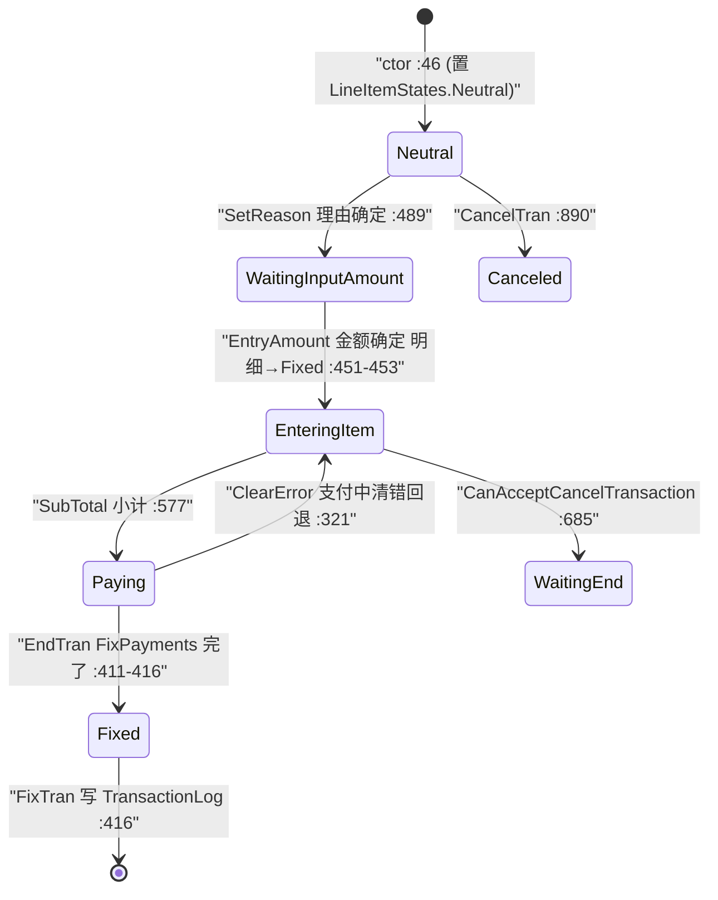

# 入出金域（Business.CashInOut）

> `verification: verified`——`CashInOutTran` 及其明细/接口的结构、状态节点、方向→TranLogType 映射、金额/理由校验规则、与支付管道（`IPaymentTran`/`PaymentObject`）的挂接、`FixTran` 落库路径均逐条回代码 `file:line` 核实（最新发布）。核查边界：`TranBase`（Framework，无源码）与 `Business.Payment` 支付管道内部标 `uncheckable`。

## 1. 模块定位

营业中钱箱**入金 / 出金**事务（`入金`＝补充零钱等；`出金`＝提取营业款/杂费支付）。核心特征：`CashInOutTran` **同时** `: CommonTranBase, ICashInOutTran, IPaymentTran`（[`CashInOutTran.cs:19`](Application/Source/Business/Business.CashInOut/CashInOutTran.cs)），即入出金复用与销售相同的**支付对象管道**——`EndTran` 走 `PaymentObject.FixPayments()` + `DispenseChange()`（[`:399-418`](Application/Source/Business/Business.CashInOut/CashInOutTran.cs)），把现金落位/找零交给支付域处理，而非自建现金逻辑。

系统角色：与找零机域并列的现金调整入口；其金额进入开闭店「入金 / 出金」合计（`EntryCalculatedCashDataGroup.CashInAmount/CashOutAmount`，→ 详见 [找零机域](../30_domain/cash_changer.md) 与 [开闭店精算域](../30_domain/open_close.md)）。

- 命名空间：`ForYouApplications.POS4U.Business.CashInOut`
- 依赖（`Business.CashInOut.csproj`）：`Business.BusinessCommon`、`Business.Payment`、`Common.Const`、`Data.Accessor`、`Data.Container`、`Framework`（`Business.Member`/`Device.*` 见 csproj 引用，本类未直接消费设备符号）。

## 2. 代码结构

5 个 `.cs`（`wc -l` 合计 1313 行；`CashInOutTran.cs` 921 行为主体）：

| 类型 | file:line | 说明 |
|---|---|---|
| `CashInOutTran` | [`:19`](Application/Source/Business/Business.CashInOut/CashInOutTran.cs) | `[Serializable]`；`: CommonTranBase, ICashInOutTran, IPaymentTran`；持 `PaymentObject`（:29）与 `List<ICashInOutLineItem>`（:24） |
| `ICashInOutTran` | [`:11`](Application/Source/Business/Business.CashInOut/ICashInOutTran.cs) | 事务契约：状态判定属性 + `StartTran`/`EntryAmount`/`SetReason`/`SubTotal`/`EndPayments`/`EndTran` 等 |
| `CashInOutLineItem` | [`:9`](Application/Source/Business/Business.CashInOut/CashInOutLineItem.cs) | `: ICashInOutLineItem`；字段 `LineKeyNo`/`ReasonType`/`ReasonCode`/`ReasonName`/`Amount` + 4 态判定 |
| `ICashInOutLineItem` | [`:8`](Application/Source/Business/Business.CashInOut/ICashInOutLineItem.cs) | 明细契约接口 |

方向→日志类型映射（[`CashInOutTran.cs:240-252`](Application/Source/Business/Business.CashInOut/CashInOutTran.cs)）：`TranType==TranTypes.CashIn` → `TranLogTypes.CashIn`（码 **813**），否则 `TranLogTypes.CashOut`（码 **814**，[`TranLogTypes.cs:217/222`](Application/Source/Common/Common.Const/TranLogTypes.cs)）。默认 `_tranType = TranTypes.CashIn`（:39），由 `StartTran(tranType, isNeedUpdateMaster)` 覆写（:298-304）。

明细以行为单位：`TotalAmount = Σ(已 Fixed 明细.Amount)`（:187-193），`TotalQuantity = 已 Fixed 明细数`（:198-204）。

## 3. 状态机

- **事务态** `CashInOutTranStates`（10 节点，[`CashInOutTranStates.cs:13-58`](Application/Source/Common/Common.Const/State/CashInOutTranStates.cs)）：Neutral / EnteringItem / Paying / Fixed / Canceled / WaitingInputAmount / WaitingInputPayment / WaitingForCancelTransaction / WaitingEnd / WaitingUpdateMaster。
- **明细态** `CashInOutLineItemStates`（4 节点，[`CashInOutLineItemStates.cs:13-28`](Application/Source/Common/Common.Const/State/CashInOutLineItemStates.cs)）：Neutral / Entering / Fixed / Canceled。

> 注（代码事实）：①构造器把 `CurrentState` 置为 `CashInOutLineItemStates.Neutral`（明细态前缀，非事务态前缀，[`:46`](Application/Source/Business/Business.CashInOut/CashInOutTran.cs)）——两态前缀不同，属既存写法。②`IsEnteringItem` 实际判定 `CashInOutTranStates.Neutral == CurrentState`（[`:88-94`](Application/Source/Business/Business.CashInOut/CashInOutTran.cs)），与状态名 `EnteringItem` 不字面对应，读码需留意。③`EndTran` 中 `FixPayments()` 被连续调用两次（:399、:406），第二次为幂等确认。

## 4. 业务规则

| 规则 | 代码证据 | 说明 |
|---|---|---|
| **BR-CIO-001** 方向决定日志类型与找零方向 | [`CashInOutTran.cs:244-250`](Application/Source/Business/Business.CashInOut/CashInOutTran.cs)、[`:714-723`](Application/Source/Business/Business.CashInOut/CashInOutTran.cs) | `PaymentParameter` 的 `isCashIn` = `(TranType==CashIn)`；入金/出金共用同一支付参数构造 |
| **BR-CIO-002** 金额下限/类型校验 | [`CashInOutTran.cs:781-813`](Application/Source/Business/Business.CashInOut/CashInOutTran.cs) | 非空 → `decimal.TryParse` → `amount>0`（否则 `ErrorItemPriceMinUnder`）→ `amount ≤ SettingValues.SystemLimitTotalAmount`（否则 `ErrorInputRangeOver`） |
| **BR-CIO-003** 合计上限校验 | [`CashInOutTran.cs:820-829`](Application/Source/Business/Business.CashInOut/CashInOutTran.cs) | `totalAmount > SystemLimitTotalAmount` → `ErrorItemQuantityMaxOver`（`EntryAmount`/`SetReason` 均先校验） |
| **BR-CIO-004** 理由码长度 | [`CashInOutTran.cs:845-849`](Application/Source/Business/Business.CashInOut/CashInOutTran.cs) | `reasonCode` 去尾空格长度 ≤ `SettingValues.CashInOutReasonCodeLength`，超出 `ErrorInputRangeOver` |
| **BR-CIO-005** 理由区分按方向 | [`CashInOutTran.cs:853-857`](Application/Source/Business/Business.CashInOut/CashInOutTran.cs) | 入金→`ReasonTypes.ReasonCashIn`（码 "1"/"入金"）；出金→`ReasonCashOut`（码 "2"/"支払"，[`ReasonTypes.cs:18/23`](Application/Source/Common/Common.Const/ReasonTypes.cs)） |
| **BR-CIO-006** 理由主数据缺失仅告警 | [`CashInOutTran.cs:859-869`](Application/Source/Business/Business.CashInOut/CashInOutTran.cs) | `ReasonMasterAccessor.GetReasonCodeMasterRow` 查主数据，缺失→`Warning WarningNotExistingCodeInReasonCodeMaster` 后仍登録（不阻断） |
| **BR-CIO-007** 小计前须有已确定明细 | [`CashInOutTran.cs:552-568`](Application/Source/Business/Business.CashInOut/CashInOutTran.cs) | `SubTotal`：无 Fixed 明细或当前明细 `IsEntering` → `ErrorTranState` |
| **BR-CIO-008** 行订正可撤销/复原 | [`CashInOutTran.cs:504-541`](Application/Source/Business/Business.CashInOut/CashInOutTran.cs) | `CancelSpecifiedLine`：已 Canceled → 复原为 Fixed；否则置 Canceled |
| **BR-CIO-009** 完了条件 | [`CashInOutTran.cs:147-171`](Application/Source/Business/Business.CashInOut/CashInOutTran.cs) | `IsEndTransaction`：`PaymentParameter` 非空 且 收付差额 ≤0 且 支付项 ≥1 |

确定动作经 `CommonTranBase.FixTran()`（[`CommonTranBase.cs:101`](Application/Source/Business/Business.BusinessCommon/CommonTranBase.cs)）→ `TransactionLogAccessor.InsertTransactionLog` + 电子ジャーナル。

> ⚠️ 代码异常（原样记录，非本文虚构）：[`CashInOutTran.cs:861`](Application/Source/Business/Business.CashInOut/CashInOutTran.cs) `if (rows == null && rows.Length < 0)` 条件恒不可达（`rows==null` 与访问 `rows.Length` 矛盾，且 `Length<0` 永假），BR-CIO-006 的告警分支实际不会进入。重构时应重写为「主数据无匹配行」判定。

> 合规背景：入出金理由码 + 金额进入日次现金对账（过不足）；未见证据关联特定法规，故不断言。

## 5. 关键接口与契约

- **`ICashInOutTran`**（[`ICashInOutTran.cs:11`](Application/Source/Business/Business.CashInOut/ICashInOutTran.cs)）：状态判定属性组（`IsEnteringItem`/`IsWaitingInputAmount`/`IsPaying`/`IsFixed`/`IsWaitingUpdateMaster`）+ 操作方法（`StartTran`/`EntryAmount`/`SetReason`/`CancelSpecifiedLine`/`SubTotal`/`EndPayments`/`EndTran`/`SetSelectedLineItem`/`UpDownSelectedLineItem`/`CanNonExchangeTicket`/`CanAcceptCancelTransaction`/`UpdateWaitingUpdateMaster`）。
- **`ICashInOutLineItem`**（[`ICashInOutLineItem.cs:8`](Application/Source/Business/Business.CashInOut/ICashInOutLineItem.cs)）：`LineKeyNo`/`ReasonType`/`ReasonCode`/`ReasonName`/`Amount` + `IsNeutral`/`IsEntering`/`IsFixed`/`IsCanceled` + `SetLineItemState`。
- **`IPaymentTran` + `PaymentObject`**（定义于 `Business.Payment`）：入出金复用支付管道——`AddPayment(PaymentTypes.CashInOut.Code, ...)`（[`:345`](Application/Source/Business/Business.CashInOut/CashInOutTran.cs)）、`ExecutePayment(...)` 包装状态迁移（:902-920）、`FixPayments`/`CancelPayments`/`DispenseChange`。支付内部实现 → 详见 [支付域](../30_domain/payment.md)。
- **基类**：`CommonTranBase`（[`CommonTranBase.cs:19`](Application/Source/Business/Business.BusinessCommon/CommonTranBase.cs)）；`CurrentState`/`MainTranState`/`TranState`/`SetError`/`AddMessage` 继承自 `TranBase`（Framework，**uncheckable**）。

## 6. 数据依赖

- **写 TransactionLog**（确定时，经 `FixTran`）→ 详见 [40_data/交易表](../40_data/03_tran_tables.md)。
- **理由主数据**：`ReasonMasterAccessor.GetReasonCodeMasterRow`（`ReasonMasterTableAdapter`，[`ReasonMasterAccessor.cs:29`](Application/Source/Data/Data.Accessor/ReasonMasterAccessor.cs)）读 ReasonMaster（不复制字典）。
- **TranLogType（CashIn=813/CashOut=814）与 ReasonType 常量码** → 详见 [40_data/枚举与常量](../40_data/06_enums_constants.md)。

## 7. 设备依赖

本类不直接消费设备符号；现金落位/找零由支付管道 `PaymentObject.DispenseChange()` 间接经找零机/钱箱执行 → 详见 [50_devices/找零机](../50_devices/cash_changer.md)、[找零机域](../30_domain/cash_changer.md)。

## 8. 参与的端到端流程

- 营业中现金调整、及其在日次精算中的入金/出金合计 → 详见 [开闭店・日次流程](../70_flows/open_close_daily.md)。
- 复用的支付/找零链路 → 详见 [支付・找零流程](../70_flows/payment_change.md)。

## 9. 可信度与核查

- **verified**：`CashInOutTran` 类声明 + 三接口、方向→TranLogType（813/814）映射、10 事务态 / 4 明细态、BR-CIO-001~009 校验规则、`IPaymentTran`/`PaymentObject` 挂接点、`FixTran`→TransactionLog，均实测 `file:line`（最新发布）。
- **uncheckable**：`TranBase`（状态骨架/`SetError`，Framework `POS4U.Framework.dll` 无源码）；`Business.Payment` 支付管道内部实现（`FixPayments`/`DispenseChange` 的现金落位算法）。
- 订正原稿：①原 §1 称「与支付链挂钩」，现明确为**复用同一 `PaymentObject` 支付管道**（`EndTran` 走 `FixPayments`+`DispenseChange`）；②补全金额/理由/明细/小计等 9 条规则与 813/814 数值码；③记录 `:861` 恒假条件异常；④补记构造器用明细态前缀、`IsEnteringItem` 判 `Neutral` 等既存写法陷阱；⑤原链接 `open_close_count.md` 不存在，更正为 `open_close_daily.md`。

## 10. ST-POS 迁移提示

> ST-POS 后端现金入出金处理独立实现，且不复用 POS4U 的 `PaymentObject` 管道。对照仅供参考（外链）。
