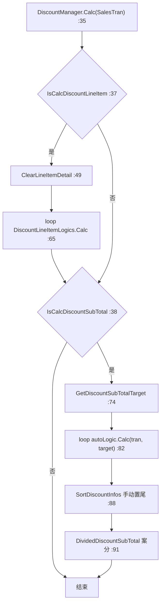

# 折扣·促销域（Business.Discount）

## 1. 模块定位

折扣 / 促销引擎。`DiscountManager` 编排**两阶段**计算——先「明细级折扣（LineItem）」、后「小计级折扣（SubTotal）」——并由**主数据驱动的插件式装配**决定加载哪些折扣逻辑、按什么优先级执行。案分（Apportionment）算法把小计折扣公平摊回各明细。

- 命名空间：`ForYouApplications.POS4U.Business.Discount`
- 实现契约 `IDiscountManager`（定义在 [`Business.Sales/Discount/IDiscountManager.cs`](Application/Source/Business/Business.Sales/Discount/IDiscountManager.cs)）。
- 主数据表 `DiscountTypeMaster`（优先级 / 排他）驱动装配，见 §4。

## 2. 代码结构

实测 `Application/Source/Business/Business.Discount/`：**39 个 `.cs`**（不含 `Properties/AssemblyInfo.cs`）。核心：[`DiscountManager.cs:19`](Application/Source/Business/Business.Discount/DiscountManager.cs) `public sealed class DiscountManager : IDiscountManager`（423 行）、[`DiscountCommonLogic.cs:16`](Application/Source/Business/Business.Discount/DiscountCommonLogic.cs) `public static class`（595 行）。

`LineItem/` 6 类促销 + `SubTotal/` 2 类。各 Logic 类的 `DiscountType.Code`（实测 `grep "return DiscountTypes."` + [`Common.Const/DiscountTypes.cs`](Application/Source/Common/Common.Const/DiscountTypes.cs)）：

| DiscountType 常量 | Code | Logic 类（`OnCalc` 派生） | 目录 |
|---|:---:|---|---|
| `ManualDiscountLineItem` | `1` | `DiscountManualLineItemLogic` | `LineItem/Manual/` |
| `ManualDiscountSubTotal` | `2` | `DiscountManualSubTotalLogic` | `SubTotal/Manual/` |
| `DiscountMixMatch` | `5` | `DiscountMixMatchLogic` | `LineItem/MixMatch/` |
| `DiscountGroupSet` | `6` | `DiscountGroupSetLogic` | `LineItem/GroupSet/` |
| `DiscountMarkDown` | `9` | `DiscountMarkDownLogic` | `LineItem/MarkDown/` |
| `DiscountAutoItem` | `10` | `DiscountAutoLineItemLogic` | `LineItem/Auto/` |
| `DiscountFanCoupon` | `11` | `DiscountFanCouponLogic` | `LineItem/FanCoupon/` |

> `SubTotal/DiscountAutoSubTotalLogicBase.cs:14` 为 `abstract class`，**无 concrete 派生**——自动小计折扣未实装（见 §4 BR-004）。

## 3. 状态机

无独立 TranState。折扣计算是否触发受 `SalesTran.CurrentState` 门控（见 BR-002）；折扣自身以「明细折扣 Info / 小计折扣 Info」数据形态挂载在明细上，非状态迁移。

## 4. 业务规则（BR）

- **BR-DISCOUNT-001（两阶段编排 `Calc`）**：[`DiscountManager.cs:35`](Application/Source/Business/Business.Discount/DiscountManager.cs)。① 明细阶段：`ClearLineItemDetail`（`:49`）后循环 `DiscountLineItemLogics.Calc`（`:65-68`）。② 小计阶段：`GetDiscountSubTotalTarget`（`:74`）→ 循环 `DiscountAutoSubTotalLogicBase.Calc`（`:82`）→ `SortDiscountInfos`（把手动小计折扣排到最后，`:88`）→ `DividedDiscountSubTotal`（案分，`:91`）。
- **BR-DISCOUNT-002（触发状态门控：明细折扣白名单 7 态）**：`IsCalcDiscountLineItem`（[`:177`](Application/Source/Business/Business.Discount/DiscountManager.cs)）仅在 `CurrentState` ∈ {`Neutral`(`:179`), `EnteringItem`(`:180`), `SelectEnteringItem`(`:181`), `Paying`(`:182`), `ItemReference`(`:183`), `SelfStates.EnteringBarCode`(`:184`), `MemberStates.WaitingClearMemberCofirm`(`:185`)} 时为真——**共 7 态**。小计折扣 `IsCalcDiscountSubTotal`（`:204`）仅 `Paying`（`:206`）。两者均在 `PaymentObject.HasPayments`（`:190` / `:212`）为真时**立即锁定不再重算**（防找零倒挂 / 账务浮动）。
  - ⚠️ **订正基线**：`05_discount.md` §2.1 只列 2 态（`EnteringItem` / `Paying`）、`subsystem_promotion_spec_analysis_report.md` §1.2 列 4 态；实测明细折扣白名单**为 7 态**。
- **BR-DISCOUNT-003（主数据驱动 + 优先级排序装配）**：`UpdateCompanyDiscountLogic`（[`:264`](Application/Source/Business/Business.Discount/DiscountManager.cs)）读 `DiscountMasterAccessor.GetDiscountTypeMasterRows(...).OrderBy(Priority).ThenBy(DiscountTypeCode)`（`:280`）——Priority 数值越小越先算。按 `CompanyCode` 缓存装配结果。CSV 行的 `DiscountTypeCode` 与插件的 `DiscountType.Code` 匹配才被实例化（`:291-300`）。
- **BR-DISCOUNT-004（`DiscountTypeMaster` 优先级 / 排他表）**：表定义 [`dbo.DiscountTypeMaster.Table.sql`](Application/Database/01_Tables/dbo.DiscountTypeMaster.Table.sql)（列：`CompanyCode` / `StoreCode` / `DiscountTypeCode`(PK) / `Description` / `Priority` / `IsSubTotalDiscountTarget` / `ExcludeTargets`）。种子数据 [`DiscountTypeMaster.csv`](Application/Database/05_ImportData/DiscountTypeMaster.csv)（`06_ImportData_Prod` 内容相同）实测 **20 行 = 2 社（`CompanyCode` 1/2）× 10 种**（下表以 `CompanyCode=1` 列示，`CompanyCode=2` 同）：

  | Code | Description（CSV 原文） | Priority | ExcludeTargets | 对应 Logic 类 |
  |:---:|---|:---:|:---:|---|
  | `8` | マニュアル１数量値下げ | 0 | `1,4,8` | ⚠️ CSV 有行、无 code=8 类 |
  | `1` | マニュアルアイテム値引き | 1 | `1,4,8,9` | `DiscountManualLineItemLogic` |
  | `9` | マークダウン値引 | 1 | `9` | `DiscountMarkDownLogic` |
  | `11` | ファン推進クーポン値下げ | 1 | `11` | `DiscountFanCouponLogic`（202607 新增种子行） |
  | `4` | 商品階層値引き | 2 | `1,4,8` | ⚠️ CSV 有行、无 code=4 类 |
  | `5` | ミックスマッチ値引き | 2 | `5,6` | `DiscountMixMatchLogic` |
  | `6` | グループセット値引き | 2 | `5,6` | `DiscountGroupSetLogic` |
  | `10` | 単品自動値下げ | 3 | `10` | `DiscountAutoLineItemLogic` |
  | `2`（小计） | マニュアル小計値引き | 0 | `3` | `DiscountManualSubTotalLogic` |
  | `3`（小计） | 自動小計値引き | 1 | `2,3` | ⚠️ 仅 abstract base，未实装 |

  排他判定 `DiscountCommonLogic.IsExcludeDiscount`（明细 [`:25`](Application/Source/Business/Business.Discount/DiscountCommonLogic.cs)、小计 `:570`）：若明细已挂高优先级折扣且其 code ∈ 当前折扣的 `ExcludeTargets`，则当前折扣不应用。
  - ⚠️ **重要发现（代码 vs 种子不对齐）**：`DiscountTypes.cs` 只定义常量 **1,2,5,6,9,10,11**；CSV 种子含 **1,2,3,4,5,6,8,9,10,11**（202607 新增 code 11）。故：code `3`（自動小計）无 concrete 类＝未实装；code `4`（商品階層）/`8`（マニュアル１数量）有 CSV 行但 `Business.Discount` 无对应 `DiscountType` 类（不会被装配）；code `11`（FanCoupon）有类且 **202607 起已入种子 CSV**（此前"有类无行"，现已对齐）。实际激活取决于 `Plugin.xml` 注册 + 企业主数据。基线 `mixmatch` 报告的优先级表按 CSV 逐值正确，但未指出 code 4/8 无实现类。
- **BR-DISCOUNT-005（Mix&Match：仅 Price / Set 实装，Amount 未实装）**：类型常量 [`DiscountMixMatchTypes.cs`](Application/Source/Common/Common.Const/DiscountMixMatchTypes.cs)：`Amount`="0"、`Price`="1"、`Set`="3"（无 "2"）。[`DiscountMixMatchLogic.OnCalc:48`](Application/Source/Business/Business.Discount/LineItem/MixMatch/DiscountMixMatchLogic.cs) 仅分派 `Price`（`:68`→`CalcMixMatchTypePrice:147`）与 `Set`（`:72`→`CalcMixMatchTypeSet:264`）——**无 `Amount` 分支**。
  - Price：商品按 `MMTargetUnitPrice` 降序（`:160`）、阶梯按 `DiscountSetCount` 降序（`:164`）；`targetTotalAmt <= DiscountSetPrice` 判「越促销越贵」不成立而 break（`:191`）；`IsSplitPrice` 溢出均摊 `splitPrice = Round(DiscountSetPrice / DiscountSetCount)`（`:210`，`:232-254`）。
  - Set：`while(hasData)` 多套循环（`:281`），按 `SetQuantity` 逐组配额，`targetTotalAmt <= mixMatchPrice` 不成立 break（`:325`）。
  - 尾数拆行：不满整行时 `CopyUtility.DeepCopy` 深拷贝拆为两明细行（`ApplyDiscountMixMatchInfo:406`）。
- **BR-DISCOUNT-006（小计折扣案分 `DividedDiscountSubTotal`）**：[`DiscountCommonLogic.cs:496`](Application/Source/Business/Business.Discount/DiscountCommonLogic.cs)。① 第一轮按 `TargetUnitPrice / targetAmount * discountAmount` 以 **`RoundToFloor`（向下取整）** 分摊（`:515`）；② 残差 `restAmount` 按 `SortDividedDetails`（单价降序 → `KeyNo` 升序，`:548`）逐项以 `minDivided * Quantity` 补足，直至 `restAmount == 0`（`:522-538`）。结果写 `LineItemDiscountData.TotalDiscountSubTotalDivided`。
  - ⚠️ **订正基线**：`05_discount.md` §3.1 称「残余差额加算在价格最高的那个商品行上」——实为**按单价降序逐项补足**（非全部堆到单行）。
  - 对照：Mix&Match 用另一套 `DiscountDivided`（`:438`），取整为 **`RoundAwayFromZero`（四舍五入）**（`:448`），残差可拆行；与小计案分的 floor + 不拆行策略本质不同。

## 5. 关键接口与契约

- `IDiscountManager`（`Business.Sales/Discount/IDiscountManager.cs`）：`DiscountManager` 实现。
- 抽象基类：`DiscountLineItemLogicBase`（明细）、`DiscountSubTotalLogicBase`（小计，`:13` abstract）、`DiscountAutoSubTotalLogicBase`（`:14` abstract）。手动折扣另实现 `IDiscountManualLineItem` / `IDiscountManualSubTotal`。
- 插件组：`DiscountPluginGroupIds.DiscountLineItemLogic` / `DiscountSubTotalLogic`（装配见 `:277-278`）；具体类注册在 [`POS4ULogicService/Settings/Plugin.xml`](Application/Source/POS4ULogicService/Settings/Plugin.xml)。

## 6. 数据依赖

读 `DiscountTypeMaster`、`DiscountMixMatchMaster` / `DiscountMixMatchDetailMaster` / `DiscountMixMatchSetItemMaster`、`DiscountManualMaster`、`DiscountAutoItemMaster` 等主数据（经 `SalesTranRepository` / `DiscountMasterAccessor`）。折扣结果挂 `LineItemDiscountData` / `TranDiscountData`。表字典 → 详见 [40_data/枚举与常量](../40_data/06_enums_constants.md)（不复制）。

## 7. 设备依赖

无直接设备依赖（改价 / 折扣码从画面输入，经 `Business.InputConverter` 转事件）。

## 8. 参与的端到端流程

扫码即自动特价 / Mix&Match、结账小计折扣 / 案分 → 详见 [销售端到端流程](../70_flows/sale_end_to_end.md)（不复制）。折扣后净价供 [税额域](../30_domain/tax.md) 与 [积分域](../30_domain/point.md) 消费。

## 9. 可信度与核查

- **verified**（最新发布 实测）：`DiscountManager` 两阶段（`:35`）、明细触发 7 态白名单（`:177-185`）、优先级排序（`:280`）、`DiscountTypes.cs` 7 常量与 class→code 映射、CSV 20 行(2社×10种)priority/exclusion、表 schema、Mix&Match 仅 Price/Set（`OnCalc:48`）、案分 `RoundToFloor` + 残差补足机制（`:496-538`）。
- **uncheckable**：`Factory` / `PluginGroupId<T>` / `CompanyDiscountLogic` 依赖的 `POS4U.Framework` 内部实现不断言；具体类 → 插件组注册在 `Plugin.xml`（配置）。
- 核查基线：`05_discount.md`、`mixmatch/mixmatch_promotion_spec_and_implementation.md`、`promotion/subsystem_promotion_spec_analysis_report.md`。本篇订正：触发态数（7 非 2/4）、案分残差机制、code 常量 vs 种子差异；并注 promotion 报告的字段名（`MixMatchCount` / `MixMatchAmount` / `MixMatchTypeCode`）为示意，实际字段为 `DiscountSetCount` / `DiscountSetPrice` / `MixMatchType`。

## 10. ST-POS 迁移提示

> ST-POS（KugelPOS）折扣编排见 ADR-0006 统一折扣编排架构，为独立实现（非本模块移植）。对照仅供参考，详见 → ST-POS discount / mix-match 相关文档（外链，不在本体系展开）。
