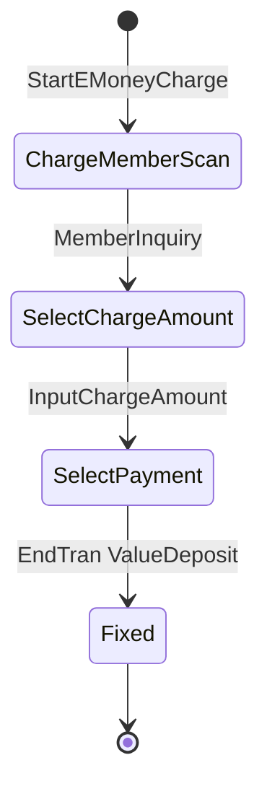

# 电子货币充值域（Business.EMoney）

## 1. 模块定位

电子货币（Value 卡 / プリカ）**充值**与**充值取消**。高度专注：全模块仅 2 个交易类。充值把现金 / 卡等支付转为 Value 卡余额（`ValueDeposit`），取消走赤黒（`ValueDepositCancel`）。

- 命名空间：`ForYouApplications.POS4U.Business.EMoney`
- 上游依赖：`Business.Member`（`MemberObject` / Value 卡入金）、`Business.Payment`（`PaymentObject`）、`Business.Sales` / `Business.ReSales`（`ReadReceiptObject`）、`Business.BusinessCommon`（`CommonTranBase`）、`Data.Accessor` / `Data.Container`、`Device.DeviceDefine`。

## 2. 代码结构

实测 `Application/Source/Business/Business.EMoney/`：**2 个 `.cs`**（不含 `Properties/AssemblyInfo.cs`）。

| 类 | file:line | 行数 | 实现接口 |
|---|---|---:|---|
| `EMoneyChargeTran` | [`EMoneyChargeTran.cs:19`](Application/Source/Business/Business.EMoney/EMoneyChargeTran.cs) | 1134 | `CommonTranBase`, `IPaymentTran`, `IMemberTran`, `IPaymentTranForCAFISArchNoOperation`, `IPaymentTranForCAFISArchLAN`, `IPaymentTranForPaymentService` |
| `EMoneyChargeVoidTran` | [`EMoneyChargeVoidTran.cs:17`](Application/Source/Business/Business.EMoney/EMoneyChargeVoidTran.cs) | 546 | `CommonTranBase`, `IMemberTran`, `IPaymentTran` |

充值 4 模式（`EMoneyChargeTran`）：`StartEMoneyCharge`（普通，`:512`）、`StartEmployeeMode`（员工，`:456`）、`StartSelfSalesMode`（自助，`:491`）、`StartEMoneyInquiry`（余额照会，`:524`）。

## 3. 状态机

`EMoneyChargeTranStates` / `EMoneyChargeVoidTranStates`（状态常量在 `Common` / 框架侧）。充值：`ChargeMemberScan → SelectChargeAmount → SelectPayment → Fixed`。取消：`ReceiptInfo → DisplayInquiryMemberResult → SelectPayment → Fixed`（或任意态 `CancelTran → Canceled`）。

## 4. 业务规则（BR）

- **BR-EMONEY-001（TranType / TranLogType）**：充值 `TranLogType` = `EMoneyCharge`（练习 `TrainingEMoneyCharge`）/ 余额照会 `EMoneyInquiry`（[`EMoneyChargeTran.cs:64/68`](Application/Source/Business/Business.EMoney/EMoneyChargeTran.cs)）。取消 `TranType` = `TranTypes.EMoneyChargeVoid`（[`EMoneyChargeVoidTran.cs:51`](Application/Source/Business/Business.EMoney/EMoneyChargeVoidTran.cs)）、`TranLogType` = `EMoneyChargeVoid`（`:40`）。常量值（[`TranLogTypes.cs`](Application/Source/Common/Common.Const/TranLogTypes.cs)）：`EMoneyCharge`=**801**（`:142`，"プリカチャージ"）、`TrainingEMoneyCharge`=811（`:207`）、`EMoneyInquiry`=804（`:172`）、`EMoneyChargeVoid`=**816**（`:147`，"プリカチャージ取消"）。
- **BR-EMONEY-002（充值确定＝`ValueDeposit`）**：`EMoneyChargeTran.EndTran`（[`:724`](Application/Source/Business/Business.EMoney/EMoneyChargeTran.cs)）→ `ChangeMember(m => m.ValueDeposit(ChargeAmount, BusinessDate, GetTransactionData()))`（`:735`）。`ValueDeposit` 实现在 [会员域 `MemberObject.cs:566`](../30_domain/member.md)。
- **BR-EMONEY-003（充值金额多层校验）**：`InputChargeAmount` 依次校验——格式且 > 0、支付方式单次上限（`ErrorValueDepositUnitLimit` `:557`）、Value 卡余额上限（`GetValueCardMaxAmount` `:1078`，默认 **250000** `:1081`）、充值积分有效性。
- **BR-EMONEY-004（充值取消＝赤黒 / `ValueDepositCancel`）**：`EMoneyChargeVoidTran.LocalReadTranDataSet` 校验原交易 `transactionType == TranLogTypes.EMoneyCharge.Number`（`:480`），练习交易不可取消（`:482`）；`EndTran` 若非信用卡支付则 `ChangeMember(m => m.ValueDepositCancel(...))`。取消理由三属性：
  - **`ReasonType` = `ReasonTypes.ReasonMinusTrade.Code`**（[`EMoneyChargeVoidTran.cs:103`](Application/Source/Business/Business.EMoney/EMoneyChargeVoidTran.cs)）
  - `ReasonCode` = `"07"`（`:108`）
  - `ReasonDescription` = `"従業員"`（`:113`）
  - ⚠️ **订正基线**：01- 原稿曾把 `ReasonType` 记为 `"07"`——那其实是 `ReasonCode` 的值。`ReasonType` 实为 `ReasonTypes.ReasonMinusTrade.Code`（本篇已核代码）。
- **BR-EMONEY-005（可用支付动态判定）**：`CanAddPayments` 按设备可用性（`CashChanger` / `CAFISArch` / `CAFISArchLAN` / `PaymentService`）× 模式（普通 / 员工 / 自助）动态生成可用支付列表。

## 5. 关键接口与契约

- `IPaymentTran` / `IMemberTran`（后者见 [会员域 §5](../30_domain/member.md)）+ 三个 CAFIS 支付接口（`IPaymentTranForCAFISArch*` / `ForPaymentService`）。
- 基类 `CommonTranBase`（`Business.BusinessCommon` / 框架），提供 `TranType` / `TranLogType` / `EndTran` / `FixTran` 骨架。

## 6. 数据依赖

读原充值交易（`ReadReceiptObject.TranDataSet`）、`SettingMaster`（`ValueCardMaxAmount` 等）；Value 卡余额经 `MemberObject`。枚举 / 常量 → 详见 [40_data/枚举与常量](../40_data/06_enums_constants.md)（不复制）。

## 7. 设备依赖

- 支付设备：`CashChanger`（找零机）、`CAFISArch` / `CAFISArchLAN`（借记 / 信用 LAN）、`PaymentService`（信用）。
- Value 卡入金 / 余额经 Point Infinity（Device 层，见 [会员域 §7](../30_domain/member.md)）。
- 物理设备动作 → 详见 [50_devices](../50_devices/index.md)（不复制）。

## 8. 参与的端到端流程

充值 / 充值取消（普通 / 员工 / 自助）流程；与 [会员域](../30_domain/member.md)、[支付域](../30_domain/payment.md) 协同 → 详见 [销售端到端流程](../70_flows/sale_end_to_end.md)（不复制）。

## 9. 可信度与核查

- **verified**（最新发布 实测）：2 类行数（1134 / 546）、4 充值模式行号、`EndTran → ValueDeposit`（`:735`）、`TranLogTypes` 值（801/811/804/816）、`ReasonType = ReasonTypes.ReasonMinusTrade.Code`（`:103`）、`ValueCardMaxAmount` 默认 250000（`:1081`）。
- **uncheckable**：`CommonTranBase`、`IPaymentTran` 系接口、CAFIS 设备协议定义在 `POS4U.Framework` / Device 编译产物内的部分不断言。
- 核查基线报告：`business_emoney_analysis.md`。本篇确认其已订正的 `ReasonType`（非 `"07"`）。

## 10. ST-POS 迁移提示

> ST-POS（KugelPOS）的电子货币 / SU-PAY 处理见 ADR-0014：自社账户基盤（SU-PAY）走 backend、第三者 tender 走 device。为独立实现，非本模块移植。对照仅供参考，详见 → ST-POS emoney / su-pay 相关文档（外链，不在本体系展开）。
