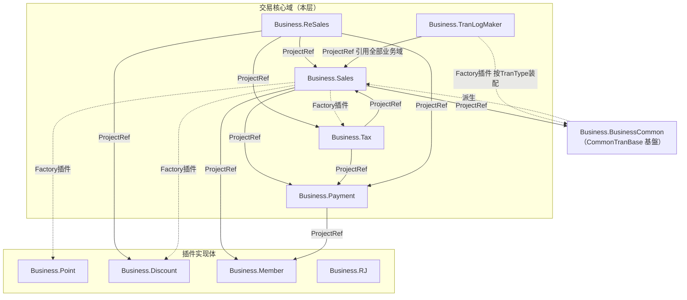
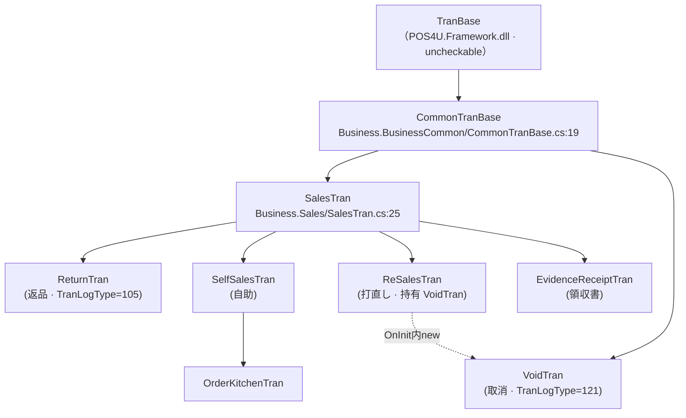

# 交易核心域索引（`Business.*`）

> POS4U 店舗端的**业务域**全部位于 `Application/Source/Business/` 下，实测 **22 个模块**（`ls Application/Source/Business/Business.*/`）。本层每篇对应一个模块，按 [conventions §7](../00_portal/conventions.md) 10 节模板组织。本页是路由入口 + 依赖关系。
>
> 计数口径：`find <module> -name '*.cs' | wc -l`（含 `Properties/AssemblyInfo.cs`）与逐文件 `wc -l` 累加，实测 最新发布。

---

## 1. 22 模块总表

| 模块 | 代码路径 | 规模（.cs / 行） | 一句职责 | 文档 |
|---|---|---|---|---|
| **Business.Sales** | `Application/Source/Business/Business.Sales/` | 53 / 11354 | 销售交易主引擎；`SalesTran` 状态机、商品明细、会员/年龄确认、离线降级 | ✅ [sales.md](./sales.md) |
| **Business.Payment** | `Application/Source/Business/Business.Payment/` | 49 / 8411 | 多渠道混合支付；`PaymentObject` 排序结算、找零、CAFIS 卡机 | ✅ [payment.md](./payment.md) |
| **Business.ReSales** | `Application/Source/Business/Business.ReSales/` | 6 / 2296 | 一括取消（Void）/ 部分打直し（ReSales）/ 领収书；引用原小票 | ✅ [resales.md](./resales.md) |
| **Business.Tax** | `Application/Source/Business/Business.Tax/` | 8 / 922 | 内税/外税、軽減税率、税额案分与端数处理（`ITaxManager` 实装） | ✅ [tax.md](./tax.md) |
| **Business.TranLogMaker** | `Application/Source/Business/Business.TranLogMaker/` | 57 / 6035 | 内存交易对象 → `TranDataSet`（TLog）本地落盘前的组装 | ✅ [tran_log_maker.md](./tran_log_maker.md) |
| Business.BusinessCommon | `Application/Source/Business/Business.BusinessCommon/` | 21 / 1577 | 交易基盤：`CommonTranBase`（`FixTran` = TLog 落盘入口） | ✅ [business_common.md](./business_common.md) |
| Business.Discount | `Application/Source/Business/Business.Discount/` | 40 / 4681 | 值引/割引编排（含 Mix&Match `IDiscountManager` 实装） | ✅ [discount.md](./discount.md) |
| Business.Member | `Application/Source/Business/Business.Member/` | 11 / 2970 | 会员卡/积分账户联机（`MemberObject`、锁定/更新） | ✅ [member.md](./member.md) |
| Business.Point | `Application/Source/Business/Business.Point/` | 20 / 2081 | 积分计算引擎（`IPointManager` 实装、Point Infinity） | ✅ [point.md](./point.md) |
| Business.RJ | `Application/Source/Business/Business.RJ/` | 99 / 18747 | 小票/电子日记账（Receipt/Journal）排版与打印 —— 最大模块 | ✅ [rj.md](./rj.md) |
| Business.Report | `Application/Source/Business/Business.Report/` | 20 / 4063 | 各类报表（精算/売上フラッシュ/CAFIS 日计等） | ✅ [report.md](./report.md) |
| Business.CashChanger | `Application/Source/Business/Business.CashChanger/` | 10 / 2730 | Glory/ECS 自动找零机控制、回收/补充/两替 | ✅ [cash_changer.md](./cash_changer.md) |
| Business.InputConverter | `Application/Source/Business/Business.InputConverter/` | 24 / 4793 | 输入解析（条码/键盘 → 事件与商品检索） | ✅ [inputconverter.md](./inputconverter.md) |
| Business.EMoney | `Application/Source/Business/Business.EMoney/` | 3 / 1717 | 电子马内（プリカ）充值/照会/充值取消 | ✅ [emoney.md](./emoney.md) |
| Business.RetailMedia | `Application/Source/Business/Business.RetailMedia/` | 12 / 1866 | 零售媒体（クーポン/広告推荐） | ✅ [retail_media.md](./retail_media.md) |
| Business.CashInOut | `Application/Source/Business/Business.CashInOut/` | 5 / 1370 | 入金/出金（现金出纳） | ✅ [cash_in_out.md](./cash_in_out.md) |
| Business.MainMenu | `Application/Source/Business/Business.MainMenu/` | 8 / 1295 | 主菜单/机能选择 | ✅ [main_menu.md](./main_menu.md) |
| Business.PaymentStation | `Application/Source/Business/Business.PaymentStation/` | 5 / 1203 | 支付机（セミセルフ会计机）交易 | ✅ [payment_station.md](./payment_station.md) |
| Business.CloseCount | `Application/Source/Business/Business.CloseCount/` | 2 / 892 | 精算（关店清点） | ✅ [open_close.md](./open_close.md) |
| Business.EntryNonCash | `Application/Source/Business/Business.EntryNonCash/` | 3 / 527 | 现金外在高登录 | ✅ [entry_non_cash.md](./entry_non_cash.md) |
| Business.Operator | `Application/Source/Business/Business.Operator/` | 7 / 324 | 操作员（签到/签退/权限） | ✅ [operator.md](./operator.md) |
| Business.OpenCount | `Application/Source/Business/Business.OpenCount/` | 2 / 215 | 开设（开店点检） | ✅ [open_close.md](./open_close.md) |

> 全模块合计 **22 项**，均已建成域文档（**21 篇** + 本索引；`OpenCount`/`CloseCount` 合并于 `open_close.md`）。本批由本作者建成 5 篇（Sales/Payment/ReSales/Tax/TranLogMaker）；其余 16 篇由并行会话建成（本索引在共享工作树中统一收录，各篇 `verification` 级别以其自身 frontmatter 及 [90_traceability](../90_traceability/verification-status.md) 为准）。

---

## 2. 模块依赖图

依赖分两类：**编译时**（`.csproj` `<ProjectReference>`，实线）与**运行时插件**（`Factory.CreatePlugin(...)` 按插件 id 动态加载，虚线）。POS4U 用后者实现"接口在 `Business.Sales` 定义、实现体在独立模块"的反转依赖——`Business.Sales.csproj` **不**引用 `Business.Point`/`Business.Discount`/`Business.Tax`，而是通过插件在运行时装配。证据：各模块 `Business.<M>.csproj`。

> `Business.TranLogMaker.csproj` 引用了 17 个 `Business.*` 模块（几乎全部业务域），因其需为每种交易/明细/支付/会员/折扣组装对应的 `*Maker`。详见 [tran_log_maker.md §2](./tran_log_maker.md)。

### 继承主干（交易类）

> `SalesTran : CommonTranBase, IPaymentTran, IMemberTran`；`VoidTran : CommonTranBase, IMemberTran, IPaymentTran`（**不**继承 `SalesTran`）。`ReSalesTran`/`EvidenceReceiptTran` 继承 `SalesTran`。`OrderKitchenTran : SelfSalesTran`（非直接继承 `SalesTran`）。

---

## 3. 交易类型与日志种别（跨模块锚点）

各交易类通过 `TranType`（`Common.Const/TranTypes.cs`）与 `TranLogType`（`Common.Const/TranLogTypes.cs`）标识自己。这两个枚举是本层各篇的公共锚点，权威定义与全量取值 → [40_data/06_enums_constants.md](../40_data/06_enums_constants.md)。核心取值（实测 `TranLogTypes.cs`）：

| TranLogType | Number | 家文档 |
|---|---|---|
| NormalSales | 101 | [sales.md](./sales.md) |
| NormalReturn | 105 | [sales.md](./sales.md)（`ReturnTran`） |
| NormalVoid | 121 | [resales.md](./resales.md)（`VoidTran`） |
| NormalEvidenceReceipt | 161 | [resales.md](./resales.md) |
| EMoneyChargeVoid | 816 | [tran_log_maker.md](./tran_log_maker.md) |

> ⚠️ 上游 01- 稿曾把这些编号写错（return 篇注 `NormalReturn=121 / EMoneyChargeVoid=125 / NormalVoid=122`）。实测：`NormalReturn=105`、`NormalVoid=121`、`EMoneyChargeVoid=816`，`122` 实为 `CanceledVoid`，`125` 不存在。详见 [tran_log_maker.md §4](./tran_log_maker.md) 与 [90-verification](../90_traceability/verification-status.md)。

---

## 4. 可信度

- **verified**：22 模块的路径/规模（`find`+`wc -l`）、依赖边（`.csproj <ProjectReference>`）、继承主干（class 声明 file:line）均实测。
- **uncheckable**：`TranBase`/`State`/`TranState` 等框架基类定义在 `POS4U.Framework.dll`（无源码）；本层只核到"派生类存在"。
- 状态机**迁移边**由 `Application/Source/POS4U/Settings/StateWinPOS*.xml` + Command 类驱动，各篇状态节点已核，迁移边逐条另核。
