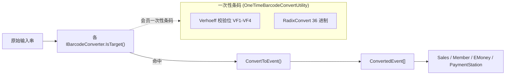

# 输入转换域（Business.InputConverter）

## 1. 模块定位

将收银台的原始输入串（扫码枪条码、QR 码、会员一次性条码等）识别并转换为系统内部**事件（`ConvertedEvent`）**，供上层业务（Sales/Member/EMoney/PaymentStation）消费。它是「物理输入 → 业务事件」的**唯一入口适配层**，采用**策略模式**：每种条码格式一个独立转换器，统一实现 `IBarcodeConverter` 契约。

- 命名空间：`ForYouApplications.POS4U.Business.InputConverter`
- 上游依赖（`Business.InputConverter.csproj`）：`Business.Sales`、`Business.EMoney`、`Business.PaymentStation`、`Business.BusinessCommon`、`Data.Accessor`、`Data.Container`、`Device.DeviceDefine`、`Common.Const`。
- `IBarcodeConverter` / `BarcodeConvertType` / `POSData` / `ConvertedEvent` / `IEventConverter` / `ResultValue<T>` 均定义在 `POS4U.Framework` DLL（无源码 → 见 §9 uncheckable）。

## 2. 代码结构

实测 `Application/Source/Business/Business.InputConverter/`：14 个条码转换器 + 5 个 InputData 数据类 + 常量 1 + 工具类（含子类）。

### 2.1 14 个条码转换器（`BarcodeConverter/`）

类型常量集中定义于 [`Const/BarcodeConvertTypes.cs`](Application/Source/Business/Business.InputConverter/Const/BarcodeConvertTypes.cs)（80 行，14 个 `BarcodeConvertType` 静态属性 L13–L78）。每个转换器实现 `IBarcodeConverter`（示例：[`BarcodeItemCodeConverter.cs:11`](Application/Source/Business/Business.InputConverter/BarcodeConverter/BarcodeItemCodeConverter.cs)）。

| # | 转换器类 | 类型常量声明 | 用途（源码 doc-comment 原文） |
|---|---|---|---|
| 1 | `BarcodeCustomerModeConverter` | `BarcodeConvertTypes.cs:13` | 顧客操作時用 |
| 2 | `BarcodeDynamicPricingConverter` | `BarcodeConvertTypes.cs:18` | ダイナミックプライシング（含 26 桁，见 §4） |
| 3 | `BarcodeItemCodeConverter` | `BarcodeConvertTypes.cs:23` | 商品コード（前导零补全，见 §4） |
| 4 | `BarcodeItemListConverter` | `BarcodeConvertTypes.cs:28` | 商品売価一括取得 |
| 5 | `BarcodeLogicServiceConverter` | `BarcodeConvertTypes.cs:33` | LogicService |
| 6 | `BarcodeMarkDownConverter` | `BarcodeConvertTypes.cs:38` | マークダウン（売変/値下げ） |
| 7 | `BarcodeMemberScanConverter` | `BarcodeConvertTypes.cs:43` | 会員操作用（一次性条码，见 §4） |
| 8 | `BarcodeNonBarcodeItemListConverter` | `BarcodeConvertTypes.cs:48` | バーコードなし商品 |
| 9 | `BarcodeOrderKitchenItemListConverter` | `BarcodeConvertTypes.cs:53` | オーダーキッチン商品 |
| 10 | `BarcodeItemWithQuantityConverter` | `BarcodeConvertTypes.cs:58` | 数量指定商品 |
| 11 | `BarcodeCartTerminalNoScanConverter` | `BarcodeConvertTypes.cs:63` | GOカート端末番号 |
| 12 | `BarcodeBestBeforeConverter` | `BarcodeConvertTypes.cs:68` | **26 桁 Jan** バーコード（賞味期限） |
| 13 | `BarcodeNonPLUFoodConverter` | `BarcodeConvertTypes.cs:73` | フードパーク決済用（美食广场） |
| 14 | `BarcodeQRConverter` | `BarcodeConvertTypes.cs:78` | IncommQR 決済 |

> 另有一份内容相同的重复文件：`OneTimeBarcodeConvertUtility.cs` 同时存在于模块根目录与 `Utility/` 子目录，两者均为 972 行（实测 `wc -l`）。属技术债，非两套逻辑。

### 2.2 InputData 数据类（`InputData/`）

转换后的结构化载荷：`BarcodeInputDataWithQuantity`、`MarkDownInputData`、`MemberOneTimeInputData`、`PriceReferenceListInputData`、`PriceReferenceListInputOriginalData`。

### 2.3 一次性条码工具 `OneTimeBarcodeConvertUtility`

[`OneTimeBarcodeConvertUtility.cs:14`](Application/Source/Business/Business.InputConverter/OneTimeBarcodeConvertUtility.cs) `public class OneTimeBarcodeConvertUtility`（972 行）。含两个嵌套算法类：`Verhoeff`（校验位，`:431` `private static class Verhoeff`）与 `RadixConvert`（进制转换）。会员号 → 一次性条码的生成/解析在此闭环。

## 3. 状态机

本模块为**无状态转换层**，不持有 TranState/State；转换结果以事件形式交由持有状态机的业务 Tran（如 `Business.Sales`）驱动。

## 4. 业务规则（BR）

- **BR-INPUTCONV-001（商品条码前导零标准化）**：`BarcodeItemCodeConverter` 按长度（6/7→补 8 位、9/10/11→补 12 位、12→补 13 位、13→按前缀 `00000`/`00` 去零）标准化 JAN。判定与转换逻辑见 [`BarcodeItemCodeConverter.cs:171`（IsTargetInternal）](Application/Source/Business/Business.InputConverter/BarcodeConverter/BarcodeItemCodeConverter.cs) 及 `GetConvertedBarcode`。
- **BR-INPUTCONV-002（26 桁动态定价条码）**：`BarcodeDynamicPricingConverter` 对 `barcode.Length == 26` 的条码作特殊解析——取前 13 位为商品码（[`:90`](Application/Source/Business/Business.InputConverter/BarcodeConverter/BarcodeDynamicPricingConverter.cs)），并从 `Substring(13,2)` / `Substring(19,2)` 解析制造月/有效期月（[`:150-158`](Application/Source/Business/Business.InputConverter/BarcodeConverter/BarcodeDynamicPricingConverter.cs)）。判定入口 [`:62` `if (barcode.Length == 26)`](Application/Source/Business/Business.InputConverter/BarcodeConverter/BarcodeDynamicPricingConverter.cs)。
  - 另有 `BarcodeBestBeforeConverter`，其类型常量 doc-comment 明记为「26 桁 Jan バーコードコンバーター」（[`BarcodeConvertTypes.cs:66`](Application/Source/Business/Business.InputConverter/Const/BarcodeConvertTypes.cs)），负责賞味期限系 26 桁条码；两者均处理 26 位输入但语义不同。
- **BR-INPUTCONV-003（会员一次性条码 18 位判定）**：`BarcodeMemberScanConverter.IsTarget` 以「长度 18 且含大写字母」判定一次性会员条码（正则 `^.*[A-Z].*`），命中后调用 `OneTimeBarcodeConvertUtility` 解析。
- **BR-INPUTCONV-004（一次性条码多重校验 + 时效）**：生成时拼接 `会员号(16)+随机(2)+时间戳(6)+VF1..VF4` 共 28 位，经 `Scramble` 加密后 `RadixConvert.ToString(...,36,true)` 转 36 进制取末 18 位（[`OneTimeBarcodeConvertUtility.cs:82-100`](Application/Source/Business/Business.InputConverter/OneTimeBarcodeConvertUtility.cs)）；解析时逐一校验 VF1–VF4（Verhoeff）并检查有效期（先 5 分钟粒度、失败再退 1 小时粒度）。校验位算法来源为 Verhoeff（doc-comment 标注 Wikipedia，[`:427`](Application/Source/Business/Business.InputConverter/OneTimeBarcodeConvertUtility.cs)）。

## 5. 关键接口与契约

- `IBarcodeConverter`（Framework DLL）：`BarcodeConvertType`（属性）+ `IsTarget(eventCode, deviceId, barcode, posData)` + `ConvertToEvent(...)` → `ResultValue<ConvertedEvent[]>`。契约形态见 [`BarcodeItemCodeConverter.cs:11-45`](Application/Source/Business/Business.InputConverter/BarcodeConverter/BarcodeItemCodeConverter.cs)。
- 产出事件通过 `EventCodes.*`（`Common.Const`）标识，如会员一次性条码命中后发 `Member_MemberOneTimeBarcodeScan`。

## 6. 数据依赖

主要读配置（`Data.Accessor` 的 SettingMaster，用于一次性条码基准时间等），基本不直接写事务表。枚举/常量（`EventCodes`、`BarcodeConvertType`）→ 详见 [40_data/枚举与常量](../40_data/06_enums_constants.md)。

## 7. 设备依赖

仅依赖 `Device.DeviceDefine`（设备常量，用于识别扫描源 deviceId），不直接驱动物理设备。

## 8. 参与的端到端流程

商品扫描录入、会员一次性条码识别 → 详见 [销售端到端流程](../70_flows/sale_end_to_end.md)（不复制）。

## 9. 可信度与核查

- **verified**：14 个转换器、`BarcodeConvertTypes.cs` 14 常量（L13–L78）、`OneTimeBarcodeConvertUtility.cs` 972 行含 `Verhoeff`（:431）、DynamicPricing 26 桁分支（:62/:90/:150）、`BarcodeItemCodeConverter : IBarcodeConverter`（:11）均经 最新发布 实测。
- **uncheckable**：`IBarcodeConverter`、`BarcodeConvertType`、`POSData`、`ConvertedEvent`、`IEventConverter`、`ResultValue<T>` 定义在 `POS4U.Framework` DLL（无源码），本篇不断言其内部实现。
- 核查基线报告：`business_inputconverter_analysis.md`（注：该报告 `IsTarget`/`ConvertToEvent` 中的印字符号、行数为示意，符号以代码为准）。

## 10. ST-POS 迁移提示

> ST-POS（KugelPOS）的条码/输入处理为独立实现，非本模块移植。对照仅供参考，详见 → ST-POS `services/cart` barcode 相关文档（外链，不在本体系展开）。
