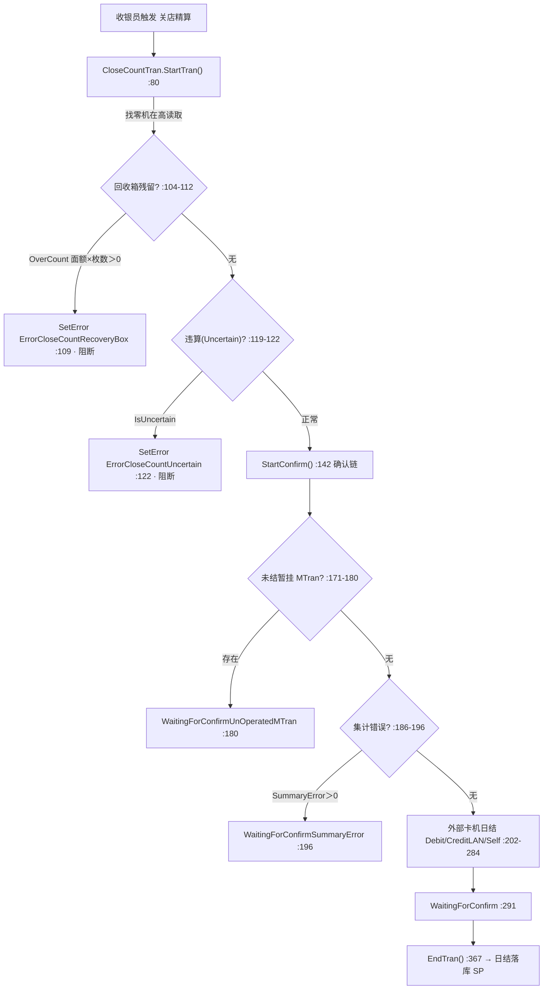

# 开闭店点检·日结精算域（Business.OpenCount + Business.CloseCount）

## 1. 模块定位

门店的「财务守门员」：开店时清点备用金并推进营业日，关店时执行多重合规拦截 + 找零机实物清点 + 外部卡机日结对账，最终落库日结数据并关停终端营业状态。两个 Business 模块共用 `Business.BusinessCommon.CommonTranBase` 基类与 `Business.CashChanger`（找零机在高读取）。

- 命名空间：`ForYouApplications.POS4U.Business.OpenCount` / `...Business.CloseCount`
- 依赖：OpenCount → `Business.BusinessCommon`、`Business.CashChanger`、`Device.DeviceCommon/DeviceDefine`、`Common.Const`；CloseCount → 同上再 + `Data.Accessor`、`Data.Container`。
- 交易类型：`TranLogTypes.OpenCount = 201`（[`TranLogTypes.cs:97`](Application/Source/Common/Common.Const/TranLogTypes.cs)，显示名「開設」:331）、`TranLogTypes.CloseCount = 202`（[`:102`](Application/Source/Common/Common.Const/TranLogTypes.cs)，显示名「精算」:332）。**是 201/202，不是 301/302。**

## 2. 代码结构

| 类 | file:line | 基类 | TranLogType |
|---|---|---|---|
| `OpenCountTran` | [`OpenCountTran.cs:19`](Application/Source/Business/Business.OpenCount/OpenCountTran.cs) | `CommonTranBase` | `OpenCount`（return @ :47） |
| `CloseCountTran` | [`CloseCountTran.cs:19`](Application/Source/Business/Business.CloseCount/CloseCountTran.cs) | `CommonTranBase` | `CloseCount`（return @ :47） |

- `OpenCountTran`（179 行）关键成员：`StartTran()`(:70)、`EndTran()`(:112)、`CheckCashCount()`(:141)、属性 `ChangeReserve`(:54)/`CashChangeReserve`(:59)/`CashChangerCashCount`(:64)。
- `CloseCountTran`（856 行）关键成员：`StartTran()`(:80)、`StartConfirm(string)`(:142)、`InitDebitDeviceAndSummary()`(:298)、`SummaryForDebitNoOperation()`(:314)、`SummaryForDebitNoOperationRetry()`(:342)、`EndTran()`(:367)；结果载体属性 `CalculatedCash`(:54)、`CAFISArchResult`(:64)、`CAFISArchLANResult`(:69)、`PaymentServiceResult`(:74)。

## 3. 状态机

状态节点定义于 `Common/Common.Const/State/OpenCountTranStates.cs`、`CloseCountTranStates.cs`（`CloseCountTranStates` 实测 28 个状态，见 [真值基线 §2](../00_portal/conventions.md)）。

## 4. 业务规则（BR / 合规）

- **BR-OC-001（开店备用金一致性）**：`OpenCountTran.StartTran()` 从找零机读取在高（`CashCount + OverCount` 求和）作为期望备用金；若断线则自动重连，失败报 `ErrorDeviceNotConnect`（[`OpenCountTran.cs:85`](Application/Source/Business/Business.OpenCount/OpenCountTran.cs)）。`EndTran()` 复核实物在高，`change != CashChangeReserve` 时报 `ErrorOpenCountAmountDiffer` 并拒绝确定（[`OpenCountTran.cs:126-131`](Application/Source/Business/Business.OpenCount/OpenCountTran.cs)）；`GoSemiSelfRegister` 节点走豁免分支。
- **BR-CC-001（回收箱物理清空校验 · 阻断）**：`StartTran()` 读取找零机溢出回收箱，`OverCount.Any(x => x.Denomination * x.Count > 0)` 为真即报 `ErrorCloseCountRecoveryBox` 阻断（[`CloseCountTran.cs:104-112`](Application/Source/Business/Business.CloseCount/CloseCountTran.cs)，SetError @ :109）。
- **BR-CC-002（账务违算锁定 · 阻断）**：`CashChangerCommon.IsUncertain(...)` 检出物理卡币违算状态即报 `ErrorCloseCountUncertain` 阻断（[`CloseCountTran.cs:119-122`](Application/Source/Business/Business.CloseCount/CloseCountTran.cs)）。
- **BR-CC-003（暂挂共享购物车防漏审计）**：`StartConfirm()` 对 `CloseCountConfirmTypes.UnOperatedMTran` 分支调用 `MTransactionManagementAccessor.GetMTransactionUnoperatedDataTable(...)`，存在未结暂挂单则转 `WaitingForConfirmUnOperatedMTran` 强制确认（[`CloseCountTran.cs:171-180`](Application/Source/Business/Business.CloseCount/CloseCountTran.cs)）。同链另有 `UnOperatedUnknownStatusTran`(:156-165) 与 `SummaryError`(:186-196) 分支。
  > 订正：素材 `06_open_close_count.md` 把 MTran 阻断标为 L155-168，实测 L155-168 是 `UnknownStatusTran` 分支，MTran 分支在 :171-180（以本篇为准）。
- **BR-CC-004（外部卡机日结严格对账）**：日结前对借记（`DisconnectedDeveiceDebit` :202）、CAFIS-LAN 信用（`DisconnectedDeveiceCAFISArchLAN` :235）、决済服务自助模式（`DisconnectedDeveiceCreditModeSelf` :247）、`CreditPaymentServiceSummary`(:217) 分别发集计请求并等待卡机物理扎账/打印确认，对应 `WaitingForConfirmBy*Summary*` 状态。

## 5. 关键接口与契约

- `StartTran → StartConfirm →（各 WaitingForConfirm 确认）→ EndTran` 为关店主流程契约；`InitDebitDeviceAndSummary` / `SummaryForDebitNoOperation(Retry)` 为卡机集计的重试子流程。
- 找零机在高数据经 `Business.CashChanger` / `Device` 侧的 `ReadCashCounts()` 提供 → 详见 [找零机域](../30_domain/cash_changer.md)。

## 6. 数据依赖

- 日结落库存储过程（实测存在于 `Application/Database/04_StoredProcedures/`）：`usp_BOUpdateBusinessStateForExecuteCloseCount`、`usp_BOInsertDailyPosSalesTotalForExecuteCloseCount`、`usp_BOGetBusinessStateForExecuteCloseCount`、`usp_SetDailyPosSalesTotal`；开店取上日精算日 `usp_GetLastCloseBusinessDate`。
- 相关表（实测表名）：`dbo.BusinessState`、`dbo.StoreInformationMaster`、`dbo.DailyPosSalesTotal`。
  > 订正：素材写作 `T_BusinessState` / `M_StoreInformation`，实测无此前缀；正确表名为 `BusinessState` / `StoreInformationMaster`。
- SP 与表字典 → 详见 [40_data 存储过程](../40_data/05_stored_procedures.md)（不复制）。

## 7. 设备依赖

强依赖找零机（现金在高读取、回收箱、违算传感）与外部卡机（Stera / CAFIS-LAN / CT-6100 日结）→ 详见 [50_devices](../50_devices/index.md)。

## 8. 参与的端到端流程

开店 → 营业 → 关店日结的完整生命周期 → 详见 [开闭店精算流程](../70_flows/open_close_count.md)（不复制）。

## 9. 可信度与核查

- **verified**：两 Tran 类声明/基类/TranLogType（201/202）、OpenCount 备用金差异阻断（:126-131）、CloseCount 四类阻断/确认（RecoveryBox :104-112、Uncertain :119-122、MTran :171-180、卡机日结 :202-284）、日结 SP 与三张表的存在性均经 最新发布 / `Application/Database/` 实测。
- **uncheckable**：`CommonTranBase` 的祖先 `TranBase`、`Factory.CreatePlugin`、找零机设备接口内部实现位于 `POS4U.Framework` / 设备 DLL；日结 SP 的内部 SQL 逻辑本篇未逐行展开（仅确认文件存在），细节见 40_data。
- 核查基线：`2_business_specs/06_open_close_count.md`（本篇已订正其 MTran 行号与表名两处偏差）。

## 10. ST-POS 迁移提示

> ST-POS 的开闭店/日结在后端 `terminal` / 精算相关服务重构，模型不同。对照仅供参考（外链，不在本体系展开）。
