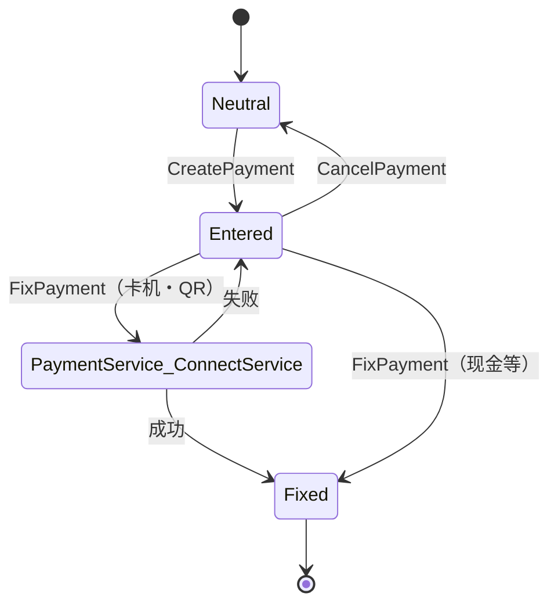

# 支付处理域（Business.Payment）

## 1. 模块定位

`Business.Payment` 负责一笔交易的**多渠道混合支付**：现金、信用卡（含 CAFIS LAN）、借记/银联、QR 码、积分、储值卡、各类券等，通过"接口契约 + 抽象基类 + 插件工厂"实现松耦合扩展。

- **系统角色**：`SalesTran` 持有一个 `PaymentObject`（经 `IPaymentTran` 契约），`PaymentObject` 维护多笔 `PaymentBase` 子类并执行应付/实收/找零的排序结算。
- **上下游**（`Business.Payment.csproj <ProjectReference>`）：仅依赖 `Business.Member`（积分支付需会员）+ `Common.Const`/`Data.*`/`Device.*`/`WinPOS.Common`。被 `Business.Sales`/`Business.ReSales`/`Business.Tax` 引用。
- **规模**（实测）：**49** 个 `.cs`、**8411** 行；核心 `PaymentObject.cs` **793** 行。

---

## 2. 代码结构

### 2.1 核心类

| 类 | 路径:行 | 行数 | 职责 |
|---|---|---|---|
| `PaymentObject` | `Application/Source/Business/Business.Payment/PaymentObject.cs` | 793 | 组合支付容器；排序、计算、找零、确定 |
| `PaymentBase` | `Application/Source/Business/Business.Payment/Payment/PaymentBase.cs:13` | 203 | 支付抽象基类（模板方法） |
| `PaymentManager` | `Application/Source/Business/Business.Payment/PaymentManager.cs:42` | 45 | 按 paymentTypeCode 经插件工厂创建支付实例 |
| `CashChangerReexecute` | `Application/Source/Business/Business.Payment/CashChangerReexecute.cs:230` | 336 | 釣銭机操作员手动再执行（回收/找零重试） |

### 2.2 支付类清单（26 类 = 3 抽象 + 23 具象）

`Payment/` 目录共 **26** 个类：**3 个抽象基类** + **23 个具象支付类**（`grep "abstract class"` 实测）。继承树：

```
PaymentBase (abstract, PaymentBase.cs:13)
├── PaymentCAFISArchLANBase (abstract, :15)   CAFIS LAN 卡机基类
│   ├── PaymentCreditLAN        信用卡(LAN)
│   ├── PaymentDebitLAN         借记卡(LAN)
│   └── PaymentUnionPayLAN      银联(LAN)
├── PaymentQRBase (abstract, :18)             QR 决済基类
│   ├── PaymentAlipay / PaymentDocomo / PaymentPayPay / PaymentRakutenPay / PaymentWeChatPay
├── PaymentCash (concrete)                    现金（本身可实例化，又作基类）
│   ├── PaymentCashChanger      Glory/ECS 找零机
│   └── PaymentCashInOut        入出金
└── (直接派生 PaymentBase) PaymentAccountsReceivable / PaymentBeerTicketBarCode /
    PaymentCashInput / PaymentCredit / PaymentDebit / PaymentOfflineCredit /
    PaymentPoint / PaymentPointPaymentStation / PaymentTicket / PaymentTrialCoupon /
    PaymentValueCard / PaymentValueCardPaymentStation
```

> QR 5 类各仅 **23** 行（逻辑集中在 `PaymentQRBase`，364 行）——复用范式。较大具象类：`PaymentDebit`(596)、`PaymentCreditLAN`(481)、`PaymentValueCard`(474)、`PaymentCashChanger`(436)、`PaymentCredit`(434)。
>
> `PaymentManager.CreatePayment(code)` 经框架插件工厂 `Factory.CreatePlugin(PaymentPluginGroupIds.Payment, id)` 返回 `PaymentBase`（`PaymentManager.cs:42`）——**非反射**；`Factory` 内部在 `POS4U.Framework`（uncheckable）。

### 2.3 `PaymentBase` 关键成员（`PaymentBase.cs`）

| 成员 | 行 | 说明 |
|---|---|---|
| `PaymentType`（abstract） | 23 | 支付种别 |
| `PaymentState`（type `State`） | 28 | 支付状态（默认 `PaymentStates.Neutral`；无独立名为 `State` 的属性） |
| `CanOverDeposit` | 43 | 允许溢收 |
| `CanChange` | 48 | 允许找零 |
| `DepositAmount` / `PaymentAmount` / `ChangeAmount` | 53 / 68 / 73 | 预存 / 实付 / 找零 |
| `CanCancel` | 78 | 可否取消（CAFIS 成功后置 false，见 §4） |
| `CreatePayment`（abstract） | 129 | 创建支付、解析输入 |
| `VerifyCalcPayment`（abstract） | 156 | 校验 |
| `CalcPayment`（abstract） | 163 | 计算金额 |
| `FixPayment`（virtual） | 170 | 确定（默认返回 false，子类覆写连接设备） |

---

## 3. 状态机（PaymentStates = 24）

实测 `Application/Source/Common/Common.Const/State/PaymentStates.cs` 共 **24** 个 `State`：`Neutral`(17)/`Entered`(24)/`Fixed`(29)/`Canceled`(34)、找零机 `CashChanger_Deposit`(39)/`CashChanger_ErrorBeginDeposit`(44)/`CashChanger_ErrorFixDeposit`(49)、`ValueCard_Unfinished`(55)、借记 `Debit_Deposit`(60)/`Debit_Error`(65)/`Debit_Error_Attendant`(70)/`Debit_Error_Attendant_WithoutCancelAttendant`(76)、`ErrorValueDepositError_WithoutCancelAttendant`(83)、`PaymentService_ConnectService`(88)、CAFIS `CAFISArchLAN_WaitingPayment`(93)/`CAFISArchLANError_Attendant`(98)/`CAFISArchLANError_WithoutCancelAttendant`(103)、`PaymentService_WaitingCancel`(108)/`PaymentServiceError_Attendant`(113)/`PaymentServiceError_WithoutCancelAttendant`(118)、QR `QR_Activate`(123)/`QR_Deactivate`(128)/`QR_PreAuth`(133)/`QR_Cancel`(138)。



> 迁移边由 Command/`StateWinPOS*.xml` 驱动，逐条另核。

---

## 4. 业务规则（BR / 合规）

### BR-PAY-001 混合支付排序结算（SortPaymens）

计算应付/找零并非按录入顺序，而是按 `PaymentObject.SortPaymens` 的四级排序（`PaymentObject.cs:781-791`）：

```csharp
private PaymentBase[] SortPaymens(IEnumerable<PaymentBase> payments)
{
    var sortedPayments =
        payments
        .OrderBy(p => !p.CanOverDeposit ? 0 : 1)
        .ThenBy(p => !p.CanChange ? 0 : 1)
        .ThenByDescending(p => p.PaymentType != PaymentTypes.Cash ? p.FaceAmount ?? p.DepositAmount : decimal.MinValue)
        .ThenBy(p => p.KeyNo);
    return sortedPayments.ToArray();
}
```

1. **不能溢收**的支付优先（防止券套现找零）；2. **不能找零**的其次；3. 非现金按面额降序扣减；4. **现金恒最后**（`decimal.MinValue`），只有现金触发排钞找零。`CalcPayments`（`:765-774`）按此序对每笔 `CalcPayment(ref balance)`。

> ⚠️ **订正 01-**：`02_payment.md` 将 `SortPaymens` 定位 `L777-791`——方法体实为 **781-791**。

### BR-PAY-002 找零排出重试与容灾放行（DispenseChange）

- **代码**：`PaymentObject.DispenseChange()`（方法体 `PaymentObject.cs:528`，含 doc 注释起 525，闭合 627）。
- **重试次数可配**：默认 `cashChangerDispenseChangeRetryCount = 3`（`:560`），由设置 `SettingMasterKeys.CashChangerDispenseChangeRetryCount` 覆盖（读取 `:569`/`:572`）；退避时间 `cashChangerDispenseChangeRetryTime`（默认 1000ms，`:561`/`:570`/`:573`）由 `CashChangerDispenseChangeRetryTime` 控制（设置名与 01- 一致）。
- **循环 `while (count >= 0)`（`:580`）**：默认 3 时实际执行 **4 次**（1 初次 + 3 重试），退避 `Thread.Sleep`（`:592`）。
- **容灾放行**：重试耗尽后**不作废交易**，仅记录 `errorInfo.CashChangerErrorStateId = CashChangerErrorStates.ErrorDispenseChange.Id`（`:599`）并继续（注释 `:598`「失敗しても取引の処理自体は止めないで先に進ませる」）。

> ⚠️ **订正 01-**：`02_payment.md` 称"3 次失败后即打开钱箱人工找零"。实测 `cashDrawer.OpenDrawer()`（`:623`）位于**独立块**（`:607-626`），触发条件是 `DeviceSettingValues.IsAutoOpenCashDrawer.Value || (cashChanger==null && 含现金)`——**与重试耗尽无因果**。操作员主导的手动再找零在 `CashChangerReexecute.RetryDispenseChange`（`CashChangerReexecute.cs:230`，分派 `:189-194`），该文件无 `OpenDrawer`。次数"3"是**可配默认**、循环产生 **4 次**尝试。

### BR-PAY-003 CAFIS 卡机扣款成功后禁止撤销（CanCancel=false）

- **规则**：CAFIS 卡机（信用/银联/借记 LAN）划款成功后，前台该笔支付 `CanCancel` 立即置 `false`，收银员不能再"清除支付/整单作废"擦除已物理划款的交易——必须走标准退货逆转（防套现）。
- **代码**：`PaymentCAFISArchLANBase.cs:308-313`：
  ```csharp
  else if (this.CAFISArchResult.ControlInfo.Result == CAFISArchLANProcResults.Success.Code)
  {
      // クレジット支払が正常に完了したら、取引から削除できないようにします。
      this.CanCancel = false;
      this.PaymentState = PaymentStates.Fixed;
  }
  ```
  默认 `CanCancel=true` 在 `SetValues()`（`:393`）。

### BR-PAY-004 退货时卡机原路逆转

信用/银联 LAN 的退货须原路冲正（禁止现金垫付退还），此约束在**退货侧** `VoidTran` 实施——详见 [resales.md BR-RESALES-001](./resales.md)（本篇不复述）。

---

## 5. 关键接口与契约

- `IPaymentTran`（`Application/Source/Business/Business.Payment/IPaymentTran.cs`，37 行）：`PaymentObject` 属性、`AddPayment(code, inputs)`、`ChangePayment<T>(...)`。`SalesTran`/`VoidTran` 实现之。
- 扩展契约：`IPaymentTranForPaymentService`（40 行）、`IPaymentTranForCAFISArchLAN`（40 行）、`IPaymentTranForCAFISArchNoOperation`（40 行）——CAFIS/支付服务专用。
- 产出：各支付明细最终由 `Business.TranLogMaker` 的 `PaymentMaker`/`CAFISArchLAN*Maker`/`DebitMaker` 等组装进 `TranDataSet` → [tran_log_maker.md](./tran_log_maker.md)。

---

## 6. 数据依赖

- **支付种别**：`Application/Source/Common/Common.Const/PaymentTypes.cs` 定义 **23 金种**（`PaymentType` 实例，code）：Cash`01`/Credit`02`/ECash`03`/ExchangeTicket`04`/Point`05`/ValueCard`06`/AccountsReceivable`07`/PointPaymentStation`08`/ValueCardPaymentStation`09`/TrialCoupon`10`/CashInput`11`/CreditLAN`12`/Debit`20`/DebitLAN`21`/UnionPayLAN`23`/OfflineCredit`24`/BeerTicketBarCode`31`/CashInOut`32`/PayPay`50`/RakutenPay`51`/Docomo`52`/Alipay`53`/WeChatPay`54`。
- 支付配置读 `PaymentMaster`；金额/找零写入交易表 → [40_data](../40_data/06_enums_constants.md)（不复制字典）。

> 计数辨析：**23 金种**（`PaymentTypes.cs`）≠ **26 支付类**（`Payment/` 目录）≠ **23 具象类**。三者是不同代码空间（如 `ECash "03"` 无独立具象类、`PaymentCashChanger` 是 `PaymentCash` 子类）。

---

## 7. 设备依赖

- **Glory/ECS 釣銭机**：`PaymentCashChanger`、`DispenseChange`（net.tcp DirectIO 驱动）。
- **CAFIS 卡机**（Saturn1000L/CT5100/CT6100）：`PaymentCAFISArchLANBase` 族，经 `PaymentService`。
- **QR 扫码枪**：`PaymentQRBase` 族。

驱动细节 → [50_devices/index.md](../50_devices/index.md)（不复制）。

---

## 8. 参与的端到端流程

- 混合支付/找零 → [70_flows/payment_mixed.md](../70_flows/payment_mixed.md)
- CAFIS 卡机结算时序 → [70_flows/cafis_credit.md](../70_flows/cafis_credit.md)
- 销售全流程（支付段）→ [70_flows/sale_end_to_end.md](../70_flows/sale_end_to_end.md)

---

## 9. 可信度与核查

- **verified**：文件/行数、`PaymentTypes=23`、`PaymentStates=24`、26 类（3 抽象+23 具象）继承树、`SortPaymens` 排序、`DispenseChange` 重试逻辑、CAFIS `CanCancel=false` 均实测。
- **uncheckable**：`PaymentBase` 的框架侧（`Factory`/`State` 基类）、`CAFISArchLANProcResults` 等在 `POS4U.Framework.dll`；CAFIS 网络行为为外部系统。
- **本篇订正的 01- 偏差**：① `SortPaymens` L777→781-791；② 找零重试"3 次即开钱箱"实为**可配 3 + 实执 4 次**、`OpenDrawer` 属独立自动开抽屉块（非重试兜底）。

---

## 10. ST-POS 迁移提示

> ST-POS 的支付编排（su-pay/电子マネー/QR）走 kugelpos 支付服务与 ADR-0014 的 device↔backend 分层，与本 AS-IS 排序结算模型不同——评估见 `stpos-trec-docs` e-money/ADR-0014（只外链）。
