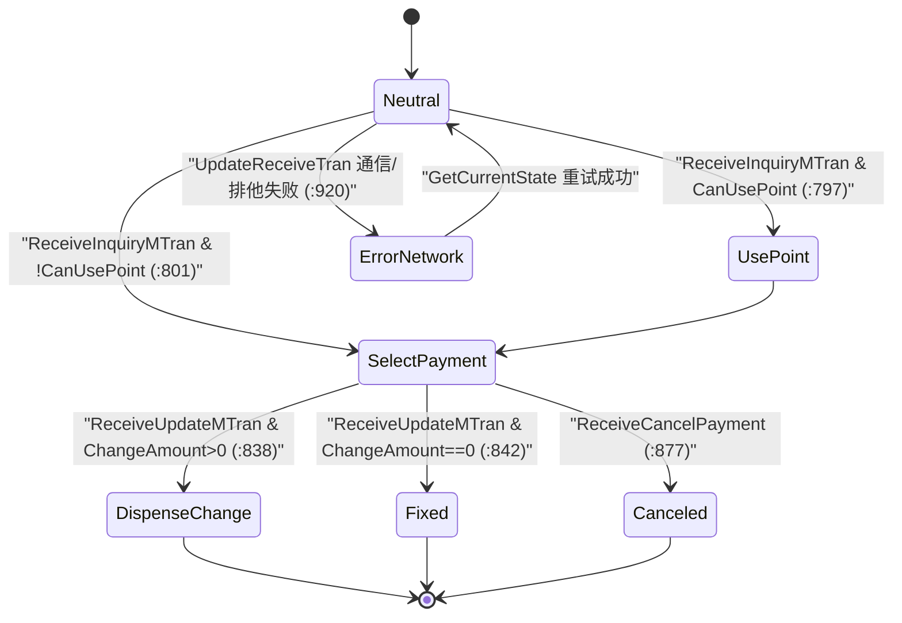

# 支付站·半自助结算域（Business.PaymentStation）

> `verification: verified`——5 源码文件（~1203 loc）逐 `file:line` 核实：`PaymentStationTran` 全体（含状态判定、支付编排、边缘 LogicService 事务往返、レシート排版）、`PaymentStationPrintInfo`、扩展方法、常量、14 状态节点。**`uncheckable`**：`TranBase`/`PaymentObject`/`PaymentBase`（Framework 及 Business.Payment 内部）、`ILogicServiceClient` 边缘 WebAPI 服务端实现。

## 1. 模块定位

半自助（セミセルフ）收银形态下的**支付机/结算台（Payment Station）**支付事务：有人「登録機」完成扫码，顾客在独立「支払機」完成支付。`PaymentStationTran` 实现 `IPaymentTran`，覆盖正常结算、取消（支付中止/取引中止）与训练模式，全程与边缘 `LogicService`（购物车中间取引真相源）往返同步。

- 命名空间：`ForYouApplications.POS4U.Business.PaymentStation`
- 依赖（实测 `.csproj`）：`Common.Const`、`Data.Accessor`、`Data.Container`、`Data.DataSetExtensions`、`Device.DeviceCommon`、`Device.DeviceDefine`、`LogicService.ServiceAccessor`、`Business.BusinessCommon`、`Business.Member`、`Business.Payment`、`Business.RJ`。

## 2. 代码结构

| 类型 | file:line | 说明 |
|---|---|---|
| `PaymentStationTran` | [`PaymentStationTran.cs:23`](Application/Source/Business/Business.PaymentStation/PaymentStationTran.cs) | `: CommonTranBase, IPaymentTran`（1068 loc，本域核心） |
| `PaymentStationPrintInfo` | [`PaymentStationPrintInfo.cs:12`](Application/Source/Business/Business.PaymentStation/PaymentStationPrintInfo.cs) | 支付机印字信息载体：`TransactionNo`/`GenerateDateTime`/`IsPrint`/`HasData` + `SetPrintInfo`(:39) |
| `UserDataExtensionMethods` | [`ExtensionMethods/UserDataExtensionMethods.cs:12`](Application/Source/Business/Business.PaymentStation/ExtensionMethods/UserDataExtensionMethods.cs) | `GetPaymentStationPrintInfo`（懒创建扩展对象，:19） |
| `PaymentStationExtensionUserObjectIds`（internal） | [`Const/PaymentStationExtensionUserObjectIds.cs:12`](Application/Source/Business/Business.PaymentStation/Const/PaymentStationExtensionUserObjectIds.cs) | 扩展对象槽定义 |

### 2.1 `PaymentStationTran` 关键成员

**TranLogType（按状态派发，:56）**：`Fixed`/`DispenseChange` → `PaymentStation` 或 `TrainingPaymentStation`（:62）；`Canceled` → `CanceledPaymentStation` 或 `TrainingCanceledPaymentStation`（:66）；否则 `None`（:69）。`TranType` 恒 `PaymentStation`（:80）。

**金额与支付计算属性（已核实）**：

- `TotalAmountWithTaxes`(:184) = `_tranModel.TotalAmount`。
- `ScanningStationPaymentsAmount`(:200) = 仅**登録機**可支付的 `ExchangeTicket`+`TrialCoupon` 金额之和（其余在支付机支付，:209-212）。
- `Balance`(:219) = `TotalAmountWithTaxes − ScanningStationPaymentsAmount − PaymentObject.PaymentsAmount`。
- `BeforePoint`(:235)/`CourtesyLevel`(:253)/`ValueAmount`(:278) 取自 `_tranModel.PointCardInfo`/`PrepayedCardInfo`。
- `CanAddPayments`(:313) 从配置 `SettingValues.PaymentStationCanAddPayments` 逗号分隔解析（**配置驱动**）。
- `CanUsePoint`(:332)：`BeforePoint<=0` 或 `CourtesyLevel` 为奇数时不可用点。
- `CanCustomerOperate`(:124)：多种网络/更新错误状态、钱箱错误、设备错误、或「仅现金支付且钱箱未接续」时返 false（:130-165）。
- `AttendantMode`(:92)/`BeforeAttendantMode`(:116)：係員模式（`None`/`CallAttendant`/`Attendant`/`UnAvailable`/`Cancellation`），`CanCustomerOperate==false` 时隐式回 `CallAttendant`（:98-100）。

**主要方法**：

| 方法 | file:line | 行为 |
|---|---|---|
| `InquiryMTran(input)` | :500 | 中间取引问合せ → `LogicServiceClient.SalesLoadMTransactionManagement` → `ReceiveInquiryMTran` |
| `AddPayment` / `ChangePayment<T>` | :524 / :543 | `IPaymentTran` 实现，经 `ExecutePayment` 包裹操作 `PaymentObject` |
| `EndTran`（override） | :356 | 汇总 point/cash/value 三种支付额（仅接受 `PointPaymentStation`/`Cash`/`ValueCardPaymentStation`，:364-379）→ `SalesTotal` → `ReceiveUpdateMTran` |
| `CancelTran` | :398 | 取引中止：钱箱预り取消 → `SalesCancelTransaction` → `ReceiveCancelMTran` |
| `CancelPayment` | :759 | 支付中止：钱箱预り取消 → `LogicServiceClient.CancelPayment` → `ReceiveCancelPayment` |
| `GetCurrentState` | :413 | 网络失配重试枢纽：`CommonGetCurrentState` 后按 `PaymentStationAccessType`×`LSSalesTranStates` 决定重发 `InquiryMTran`/`EndTran`/`CancelPayment`/`CancelTran` 或走对应 Receive |
| `ChangeAttendantMode(id)` | :565 | 5 种係員模式切换 |
| `InquiryReceipt` | :602 | レシート问合せ + 排版（页眉/页脚 message master、收入印紙 bitmap :655、注文番号レシート :683、训练横幅 :736） |
| `Receive{InquiryMTran/UpdateMTran/CancelPayment/CancelMTran}` | :780/:812/:860/:887 | 各往返结果处理，驱动状态迁移 + `FixTran` |
| `UpdateReceiveTran` | :914 | 统一解析服务端 `AcceptEventModelResult`：网络/排他失败置 `ErrorNetwork`，成功则反序列化 `EntryTransactionModel` 到 `_tranModel`（:959） |
| `ExecutePayment(func)` | :969 | 构造 `PaymentParameter`（额 = Total−ScanningStation），执行支付操作并按 `PaymentState.IsOperating` 更新 `CurrentState` |
| `GetLogicServiceClient` | :1001 | `DeviceManager.GetDevice(DeviceIds.LogicServiceClient)`——边缘客户端**以设备插件形式**注入 |

> 关键发现（原稿缺）：本模块是**边缘 LogicService 的客户端**，正常/取消/状态查询全部经 `ILogicServiceClient` 往返；采用「本地发起 → 若服务端状态失配则依 `LSSalesTranStates` 幂等重发」的容错模式（`GetCurrentState:449-490`）。支付确定后 `ReceiveUpdateMTran` 依 `PaymentObject.ChangeAmount>0` 决定 `DispenseChange`（找零）或 `Fixed`，再 `FixTran` 落日志并 `DispenseChange()` 出找零（:836-850）。

## 3. 状态机

`PaymentStationTranStates.cs`（`Common/Common.Const/State/`，前缀 `PaymentStationTran`）实测 **14 个 `TranState`**：
`Neutral`(:17)、`UsePoint`(:22)、`SelectPayment`(:27)、`Fixed`(:32)、`Canceled`(:37)、`ErrorNetwork`(:42)、`ErrorIllegalUpdateMTranShortBalance`(:47)、`ErrorIllegalUpdateMTranValueUnkonwn`(:52)、`ErrorIllegalUpdateMTranValuePaid`(:57)、`ErrorIllegalUpdateMTranOther`(:62)、`WaitingCancelPaymentCofirm`(:67)、`WaitingCancelTransactionCofirm`(:72)、`WaitingCashChangerInitConfirm`(:77)、`DispenseChange`(:82)。

核心迁移（自 `PaymentStationTran` 代码核实）：

> 图内标签为核实到的迁移触发点；`ErrorIllegalUpdateMTran*` 系列由 `SetErrorIllegalUpdateMTran`(:1011) 按服务端 ErrorCode（1890 ポイント残高不足 / 2004 VD 残高不足 等）分派。

## 4. 业务规则

- **BR-PAYSTATION-001（登録機/支払機支付分工）**：登録機仅可支付 `ExchangeTicket`（引换券）与 `TrialCoupon`（お試し引換券），其余在支付机支付（`ScanningStationPaymentsAmount:209-212`）；不足额 `Balance` 据此计算。
- **BR-PAYSTATION-002（支付机可用金种配置驱动）**：`CanAddPayments` 取自 `SettingValues.PaymentStationCanAddPayments`（:318），非硬编码。
- **BR-PAYSTATION-003（积分利用限制）**：非会员/持点为 0，或**优待ランク为奇数**时禁止用点（`CanUsePoint:337,343`）。
- **BR-PAYSTATION-004（顾客可操作性闸门）**：网络/更新错误、钱箱错误、任一设备错误、或「仅现金且钱箱未接续」时 `CanCustomerOperate==false`，自动进入係員呼出（`AttendantMode:98`）。
- **BR-PAYSTATION-005（幂等重发容错）**：服务端未返状态视为排他错误，置 `ErrorNetwork`；`GetCurrentState` 依 `LSSalesTranStates` 判断服务端实际进度后幂等重发对应操作（:449-490）。
- **BR-PAYSTATION-006（支付确定即找零）**：`ReceiveUpdateMTran` 成功后 `FixTran` 落日志、`SetPrintInfo` 暂存印字、`PaymentObject.DispenseChange()` 出找零（:845-850）。

## 5. 关键接口与契约

- `IPaymentTran`（[`Business.Payment/IPaymentTran.cs:12`](Application/Source/Business/Business.Payment/IPaymentTran.cs)）：`PaymentObject` get + `AddPayment` + `ChangePayment<TPayment>`——`PaymentStationTran` 实现，接入统一支付处理链 → 详见 [支付域](../30_domain/payment.md)。
- 继承 `CommonTranBase.FixTran` 落取引日志/电子ジャーナル → [业务公共基盘域](../30_domain/business_common.md)。
- 边缘 `ILogicServiceClient`（`LogicService.ServiceAccessor`）：`SalesLoadMTransactionManagement`/`SalesTotal`/`SalesCancelTransaction`/`CancelPayment`/`CommonGetCurrentState`/`GetReceiptData` 等。
- レシート/注文番号排版 → [收据·日志域](../30_domain/rj.md)。

## 6. 数据依赖

支付确定经 `FixTran` 写 `TransactionLog`/`EJournal`（→ BusinessCommon）；`InquiryReceipt` 读 `MessageMaster`（页眉/页脚/注文番号 message，`GetReceiptMessageRows`）；购物车中间取引状态在边缘 LogicService 侧。TranLogType（PaymentStation 系四种）→ [40_data/枚举与常量](../40_data/06_enums_constants.md)。

## 7. 设备依赖

钱箱（`CashChanger`：预り/找零/取消，`CashChangerCancelDeposit`）、`POSPrinter`（レシート）、`LogicServiceClient`（以设备插件形式的边缘客户端）→ 详见 [50_devices](../50_devices/index.md)。`收入印紙` bitmap 与 `RevenueStampFilePath` 配置相关（`InquiryReceipt:659`）。

## 8. 参与的端到端流程

半自助结算：登録機扫码 → 中间取引问合せ → 顾客在支付机选金种/用点 → `SalesTotal` 确定 → 找零 → レシート → 详见 [销售端到端流程](../70_flows/sale_end_to_end.md)。

## 9. 可信度与核查

- **verified（file:line）**：`PaymentStationTran` 的 TranLogType 派发、全部金额/可操作性属性、支付/取消/状态往返方法、Receive 处理、`ExecutePayment`、`InquiryReceipt` 排版、`PaymentStationPrintInfo`、扩展/常量、14 状态节点，均实测于 最新发布（本次由 `unverified` 升级）。§3 mermaid 迁移边带触发点 file:line。
- **uncheckable**：`TranBase`（Framework DLL）；`PaymentObject`/`PaymentBase`/各 `PaymentXxx`（`Business.Payment` 内部实现）；`ILogicServiceClient` 边缘 WebAPI 服务端逻辑。

> 原稿订正：`Data.DataSetExtensions` 依赖漏列；原稿仅列 4 分支 TranLogType 与「未深度核查」，本次补全金额计算/係員模式/幂等重发/找零等业务规则并升级为 verified。

## 10. ST-POS 迁移提示

> ST-POS 后端有独立的半自助/结算相关设计（参见团队内部 features 文档）。对照仅供参考（外链）。
