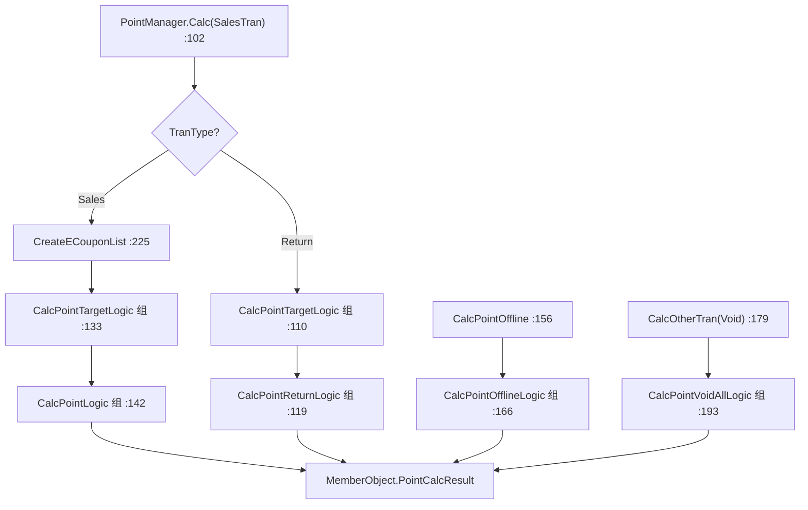

# 积分计算域（Business.Point）

## 1. 模块定位

积分计算引擎。`PointManager` 是**门面（Facade）**，本身不含算法，而是按交易类型（销售 / 返品 / 一括取消）与在线 / 离线，把计算委派给**插件组（Plugin Group）**——采用**策略模式 + 插件式装配**。计算结果写入 `MemberObject.PointCalcResult`（属 [会员域](../30_domain/member.md)）。

- 命名空间：`ForYouApplications.POS4U.Business.Point`
- 上游依赖（`PointManager.cs:5-14` using）：`Business.Member`（`MemberObject` / `PointCalcResult` / `IMemberTran`）、`Business.RetailMedia`、`Business.Sales`、`Business.BusinessCommon`、`Data.Accessor` / `Data.Container`、`POS4U.Framework` / `Framework.Library`。
- 实现契约 `IPointManager`（定义在 [`Business.Sales/Point/IPointManager.cs`](Application/Source/Business/Business.Sales/Point/IPointManager.cs)）。

## 2. 代码结构

实测 `Application/Source/Business/Business.Point/`：**19 个 `.cs`**（不含 `Properties/AssemblyInfo.cs`；含则 20）。基线报告「19 个文件」以不含 AssemblyInfo 计，与实测一致。

### 2.1 门面 `PointManager`

[`PointManager.cs:21`](Application/Source/Business/Business.Point/PointManager.cs) `public class PointManager : IPointManager`（264 行）。

| 方法 | file:line | 职责 |
|---|---|---|
| `ChangedMember(SalesTran)` | `PointManager.cs:27` | 会员变更时预热个别电子券缓存 |
| `ChangedLineItem(SalesTran, LineItemBase)` | `PointManager.cs:68` | 商品变更时预热电子券缓存 |
| `Calc(SalesTran)` | `PointManager.cs:102` | 主入口，按 `TranType` 分派插件组 |
| `CalcPointOffline(IMemberTran)` | `PointManager.cs:156` | 离线降级计算，派发 `CalcPointOfflineLogic` |
| `CalcOtherTran(CommonTranBase)` | `PointManager.cs:179` | 非销售取引（Void）→ `CalcPointVoidAllLogic` |
| `GetSettingMasterKeys(...)` | `PointManager.cs:208` | 取 5 个积分设定值（见 §5） |
| `CreateECouponList(SalesTran)` | `PointManager.cs:225` | 生成行级电子券积分列表 |

### 2.2 计算插件（`PointLogic/`、`PointTargetLogic/`）

`PointLogic/` 11 个文件（含抽象基类 [`CalcPointLogicBase.cs:16`](Application/Source/Business/Business.Point/PointLogic/CalcPointLogicBase.cs) `public abstract class`，抽象方法 `Calc(IMemberTran)` `:43`）：

| 类 | 语义（doc-comment / 命名） |
|---|---|
| `CalcNormalPointLogic` | 通常ポイント |
| `CalcSpecificPointLogic` | 特定倍率ポイント |
| `CalcRankPointLogic` / `CalcRankPointOfflineLogic` | 優待倍率ポイント（在线 / 离线） |
| `CalcMediaPointLogic` | メディア倍率ポイント |
| `CalcECouponPointLogic` | 電子クーポンポイント |
| `CalcMemberECouponPointLogic` | 個別電子クーポンポイント（含 try-catch，见 §4） |
| `CalcRMPointLogic` | RM 系ポイント |
| `CalcReturnPointLogic` | 返品時ポイント |
| `CalcVoidAllPointLogic` | 一括取消時ポイント |

`PointTargetLogic/` 3 个：抽象基类 [`CalcPointTargetLogicBase.cs:14`](Application/Source/Business/Business.Point/PointTargetLogic/CalcPointTargetLogicBase.cs) + `CalcNormalTargetLogic`（通常对象额）+ `CalcPaymentTargetLogic`（支付对象额）。另有 `Model/SpecificPointTarget.cs`、`Consts/CalcPointPluginGroupIds.cs`、`ExtensionMethods/`×2。

## 3. 状态机

无。`PointManager` 无状态；分派完全由 `TranType`（`Calc:107`）与在线 / 离线入口方法决定。积分对象额（`DealTargetAmount`）等状态承载在 `PointCalcResult`（见 [会员域 §4](../30_domain/member.md)）。

## 4. 业务规则（BR）

- **BR-POINT-001（`Calc` 按 `TranType` 三分派）**：[`PointManager.cs:102`](Application/Source/Business/Business.Point/PointManager.cs)。销售分派：`CreateECouponList`（`:130`）→ `CalcPointTargetLogic`（`:133`）→ `CalcPointLogic`（`:142`）；返品分派：`CalcPointTargetLogic`（`:110`）→ `CalcPointReturnLogic`（`:119`）；Void 经 `CalcOtherTran` → `CalcPointVoidAllLogic`（`:193`）。每个插件先 `Init` 再 `Calc`。
- **BR-POINT-002（电子券积分加算 `CreateECouponList`）**：[`PointManager.cs:225-262`](Application/Source/Business/Business.Point/PointManager.cs)。逐行过滤已取消明细 `LineItemStates.Canceled`（`:231`）与积分禁止品 `IsPointProhibition()`（`:237`）；`GetPointECouponMasterRow(itemCode)`（`:243`）命中后 `AddPoint * Quantity`（`:248`）；`IsExcludeNormalPoint`（`:254`）标志该行是否排除普通积分。
- **BR-POINT-003（离线降级 `CalcPointOffline`）**：[`PointManager.cs:156`](Application/Source/Business/Business.Point/PointManager.cs)。仅 `CommonTranBase` 生效（`:158`），派发 `CalcPointOfflineLogic` 插件组（`:166`）；离线优待积分实现为 `CalcRankPointOfflineLogic`。收银侧的 `ValueCardOffline` 状态迁移、`OfflinePointCardNo` 暂存、`CanPointUpdateErrorContinue` 放行逻辑在 `Business.Sales` 编排 → 详见 [销售端到端流程](../70_flows/sale_end_to_end.md)（不复制）。
- **BR-POINT-004（极简异常策略：全模块仅 2 处 try-catch）**：实测 `grep catch` 只有 [`ExtensionMethods/SalesTranRepositoryExtensionMethods.cs:177`](Application/Source/Business/Business.Point/ExtensionMethods/SalesTranRepositoryExtensionMethods.cs) 与 [`PointLogic/CalcMemberECouponPointLogic.cs:41`](Application/Source/Business/Business.Point/PointLogic/CalcMemberECouponPointLogic.cs)，两处均 `catch (Exception) { Logger.Error(...) }` **吞异常**。`PointManager.Calc` 本身无 try-catch，任一插件抛出即中断后续插件，异常上抛调用方。

## 5. 关键接口与契约

- `IPointManager`（[`Business.Sales/Point/IPointManager.cs`](Application/Source/Business/Business.Sales/Point/IPointManager.cs)）：`PointManager` 实现。
- **插件组 ID**（[`Consts/CalcPointPluginGroupIds.cs`](Application/Source/Business/Business.Point/Consts/CalcPointPluginGroupIds.cs)，共 **5** 个）：`CalcPointLogic`（`:17`）、`CalcPointTargetLogic`（`:22`）、`CalcPointReturnLogic`（`:27`）、`CalcPointOfflineLogic`（`:32`）、`CalcPointVoidAllLogic`（`:37`）。具体 `Calc*Logic` 类 → 插件组的绑定不在类内（`CalcPointLogicBase` 无 Group 属性），而是在 [`POS4ULogicService/Settings/Plugin.xml`](Application/Source/POS4ULogicService/Settings/Plugin.xml) 注册。
- 积分设定键（`GetSettingMasterKeys` `:213-217`）：`PointBaseAmount`、`PointCalcRoundType`、`PointNormalRate`、`IsPointCalcAmountWithNoTaxes`、`IsPointCalcRateGroupCheck`。

## 6. 数据依赖

经 `SalesTranRepository` 读 `PointECouponMaster` / `PointMemberECouponMaster` / `PointMemberECouponDetailMaster`（缓存于 `TranMasterDataSet`，`PointManager.cs:39-42` Clear、`:51/:82` 预热）与 `SettingMaster`。不直接写库；结果写入 `MemberObject.PointCalcResult`。字段字典 → 详见 [40_data 枚举与常量](../40_data/06_enums_constants.md)（不复制）。

## 7. 设备依赖

积分中心（Point Infinity）通信在 **Device 层**（`Device.PointInfinityService`），本模块经 `MemberObject`（`Business.Member`）间接触发，不直接驱动设备 → 详见 [会员域 §7](../30_domain/member.md) 与 [50_devices](../50_devices/index.md)。

## 8. 参与的端到端流程

小计 / 结账时算积分、返品时扣积分、离线降级补录 → 详见 [销售端到端流程](../70_flows/sale_end_to_end.md)、[返品·取消流程](../70_flows/return_void.md)（不复制）。RM 系积分由 [零售媒体域](../30_domain/retail_media.md) 供给。

## 9. 可信度与核查

- **verified**（最新发布 实测）：`PointManager`（`:21`，264 行，全方法行号）、`CreateECouponList`（`:225`）、`CalcPointOffline`（`:156`）、仅 2 处 try-catch（`:177` / `:41`）、5 个插件组 ID、5 个设定键、文件数 19（不含 AssemblyInfo）。
- **uncheckable**：`IPointManager` 若部分定义在 `POS4U.Framework` / `Factory` / `PluginGroupId<T>` 编译产物内的实现不断言；具体类 → 插件组的注册在 `Plugin.xml`（配置，非源码逻辑）。
- 核查基线报告：`business_point_exception_analysis.md`（其行数已按代码订正；本篇进一步确认 `Calc` 三分派与插件组名）。

## 10. ST-POS 迁移提示

> ST-POS（KugelPOS）积分为独立的 point vendor + `PointCalcResult` 实现（HTTP 调用外部积分系统）。对照仅供参考，详见 → ST-POS `services/cart` 积分相关文档（外链，不在本体系展开）。
