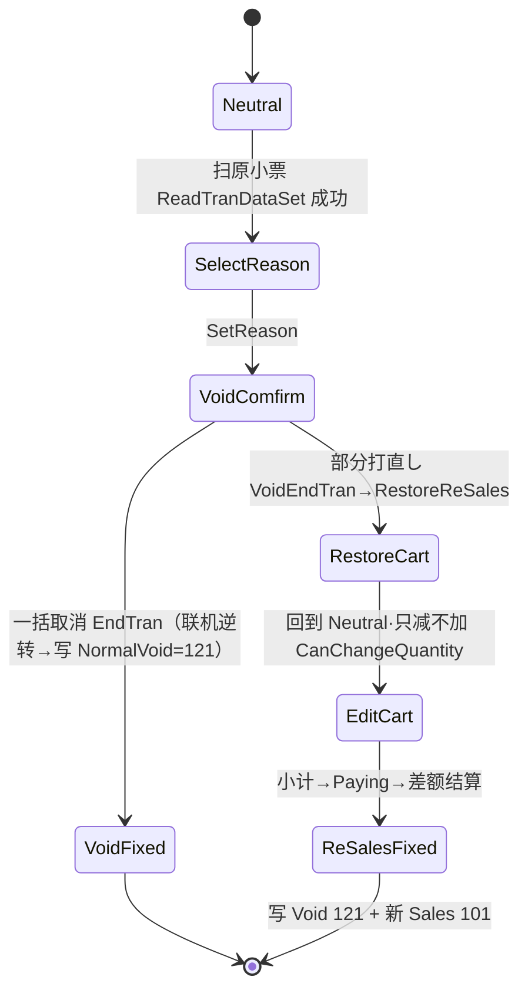

# 取消・返品域（Business.ReSales）

## 1. 模块定位

`Business.ReSales` 处理**引用原小票**的售后逆向交易：一括取消（Void，整单作废）、部分打直し（ReSales，部分退货重售）、领収书发行（EvidenceReceipt）。它读回原交易 TLog、执行积分/储值卡联机逆转、并生成对冲交易日志。

- **与 `Business.Sales` 的 `ReturnTran` 的区分**：`ReturnTran`（在 [sales.md](./sales.md)）= 手动录入退货商品的**返品**（TranLogType `NormalReturn=105`）；本模块 = 扫原小票的**取消**（`NormalVoid=121`）。两套独立机制。
- **上下游**（`Business.ReSales.csproj`）：依赖 `Business.Sales`、`Business.Payment`、`Business.Tax`、`Business.Discount`、`Business.Member`、`Business.BusinessCommon`。
- **规模**（实测）：**6** 个 `.cs`、**2296** 行。

---

## 2. 代码结构

| 类 | 路径:行 | 行数 | 职责 |
|---|---|---|---|
| `VoidTran` | `Application/Source/Business/Business.ReSales/VoidTran.cs:21` | 841 | 一括取消；`: CommonTranBase, IMemberTran, IPaymentTran`（**不**继承 SalesTran） |
| `ReSalesTran` | `Application/Source/Business/Business.ReSales/ReSalesTran.cs:18` | 576 | 部分打直し；`: SalesTran`，内部持有 `VoidTran` |
| `EvidenceReceiptTran` | `Application/Source/Business/Business.ReSales/EvidenceReceiptTran.cs:20` | 334 | 领収书发行；`: SalesTran` |
| `ReadReceiptObject` | `Application/Source/Business/Business.ReSales/ReadReceiptObject.cs` | 407 | 原小票条码解析 + 原 TLog 读取校验 |
| `ReSalesLibrary` | `Application/Source/Business/Business.ReSales/ReSalesLibrary.cs:13` | 101 | 支付渠道 Void/ReSales/现金振替 支持矩阵（static） |

> **复合结构**：`ReSalesTran` 本质是一笔新销售（继承 `SalesTran`），内部持有 `VoidTran` 实例（字段 `ReSalesTran.cs:56`，在 `OnInit()` 经 `CreateTran<VoidTran>()` 实例化，`:555`）。打直し = 先用内嵌 `VoidTran` 作废原单，再作为新 `SalesTran` 重新结算差额。

---

## 3. 状态机

实测状态节点（`Application/Source/Common/Common.Const/State/`）：

- **`VoidTranStates`（7）**：`Neutral`(17)/`Fixed`(22)/`Canceled`(27)/`SelectReason`(32)/`VoidComfirm`(37，原文拼写)/`SelectCashTransferable`(42)/`WaitingCancelTransactionCofirm`(47)。
- **`ReSalesTranStates`（4）**：`Neutral`(17)/`RestoreMemberError`(22)/`RestoreFatalError`(27)/`WaitingCancelTransactionCofirm`(32)。
- **`EvidenceReceiptTranStates`（10）**：`Neutral`/`Fixed`/`Canceled`/`ReceiptConfirm`/`WaitingCancelTransactionConfirm`/`WaitingRecoverConfirm`/`SumReceiptScan`/`SumReceiptConfirm`/`ItemSelect`/`SpecifyReceiptConfirm`（17-62）。
- **`ReturnTranStates`（1）**：`SelectReason`(17)（供 `Business.Sales/ReturnTran` 用）。



> 迁移边由 Command/`StateWinPOS*.xml` 驱动，逐条另核。

---

## 4. 业务规则（BR / 合规）

### BR-RESALES-001 卡机原路逆转防套现（CAFIS 未连接拦截）

- **规则**：原小票含 `CreditLAN`/`UnionPayLAN`，作废时若 CT-6100 卡机未连接则报错中断，禁止退现金（防信用卡套现）。
- **代码**：`VoidTran.cs` 的 `LocalReadTranDataSet` 内，条件 `:369`，块 `:368-386`，报错 `MessageIds.ErrorNotFoundCAFISArchLAN`（`:375`；错误 id 在 `Common/Common.Const/MessageIds.cs:6836`）。
- 一括取消结账 `EndTran()` 的联机逆转见 BR-RESALES-004。

### BR-RESALES-002 部分打直し「只减不加」（CanChangeQuantity）

- **规则**：打直し不是重新扫码，而是把原单明细载回内存；修改后数量**不得大于**原 TLog 对应行数量（防退货通道塞货）。
- **代码**：`ReSalesTran.CanChangeQuantity`（`:450-475`）：
  ```csharp
  if (lineItemData.Quantity < quantity)          // ReSalesTran.cs:461
  {
      this.SetError(MessageIds.ErrorCannotAddQuantity);  // :463  (MessageIds.cs:1472)
      return false;
  }
  ```
  `EvidenceReceiptTran.CanChangeQuantity` 同款约束（`:188-213`，条件 `:202`，报错 `:204`）。

### BR-RESALES-003 理由码「08」互斥（P 卡漏扫补录）

- **规则**（`ReSalesTran.SetReason`，`:131-155`）：
  | 场景 | 约束 | 报错 id | 位置 |
  |---|---|---|---|
  | 仅 1 商品且数量 1、理由**不含** `08` | 单件退货应走一括取消，禁止打直し | `ErrorCannotReSalesDuetoItemCount`（1526） | `:137-143`（报错 `:141`） |
  | 原单**已含会员**且理由**含** `08` | 已扫过卡不可能"漏扫补录"，禁选 08 | `ErrorCannotReSalesDuetoReasonCode`（1532） | `:146-149`（报错 `:149`） |
- P 卡补登入口 `CheckCanMemberLogin()`（`:533-549`）仅在**理由=08 且尚无会员**时放行。

> ⚠️ **订正 01-**：`03_resales.md` 称 `ErrorCannotReSalesDuetoReasonCode` 亦由"打直し时仍未刷会员卡"触发——**不准确**：该错误的**唯一**触发是"原单已含会员 + 理由 08"（`:149`）；单件必须含 08 的约束是经 `ErrorCannotReSalesDuetoItemCount` 反向实施。且报错行是 `:149`（非 01- 所注 `:151`）。

### BR-RESALES-004 积分排他锁 + 逆向扣减（异常安全）

`VoidTran.EndTran()`（`:602-722`）以 `try`(`:616`)/`finally`(`:711-721`) 包裹积分逆转，保证锁必释放：

1. `MemberObject.LockInquiry(...)` 排他锁定（`:623`，`IsNeedUpdatePoint` 且无 CAFIS 结果时）；
2. `PaymentObject.FixPayments()` 逆转非现金支付（`:635`）；
3. `MemberObject.Update(..., PointServiceDealDiv.Return, ...)` 联机核销原累积积分（`:677`，`PointServiceDealDiv.Return` 在 `:686`）；
4. `finally` 内 `MemberObject.UnLockUpdate(...)` 解锁（`:717`）。

> ⚠️ **订正 01-**：`03/04-return` 将 `EndTran` 定位 `L579-699`、try/finally `L597-698`——实测 **`EndTran` L602-722、try `L616`、finally `L711-721`**。

### BR-RESALES-005 单件例外（须走一括取消）

原小票仅 1 商品且数量 1 时禁止 ReSales（等同整单作废）。除 `ReSalesTran.cs:137-143` 外，`VoidTran.cs` 亦有拦截：块 `:415-436`（报错 `ErrorCannotReSalesDuetoItemCount` `:432`）。

> ⚠️ **订正 01-**：`03_resales.md` 将 VoidTran 侧单件拦截定位 `L392-413`——实测 **L415-436**（报错 `:432`）。

### BR-RESALES-006 支付渠道 Void / ReSales / 现金振替 支持矩阵

`ReSalesLibrary`（`ReSalesLibrary.cs:38-69`，static 构造）定义三集合：

- `_canVoidPayments`（**17**，`:38-58`）：Cash / ExchangeTicket / Point / ValueCard / AccountsReceivable / CashInput / **Credit / CreditLAN** / Debit / DebitLAN / UnionPayLAN / PayPay / RakutenPay / Docomo / OfflineCredit / Alipay / WeChatPay。
- `_canReSalesPayments`（**10**，`:60-69`）= `_canVoidPayments` **+ TrialCoupon**，再**移除** Debit / DebitLAN / UnionPayLAN / PayPay / RakutenPay / Docomo / Alipay / WeChatPay。
- `_canCashTransferable`（`:28-31`）：仅 `ExchangeTicket`（可转现金退还）。

| 支付渠道 | Void 支持 | ReSales 支持 | 备注 |
|---|:---:|:---:|---|
| Cash / CashInput | ✓ | ✓ | |
| ExchangeTicket（商品券） | ✓ | ✓ | 唯一可现金振替 |
| Point / ValueCard / AccountsReceivable | ✓ | ✓ | 联机逆转 |
| **Credit / CreditLAN**（信用卡） | ✓ | **✓** | — |
| OfflineCredit | ✓ | ✓ | |
| TrialCoupon（お試し引換券） | **✗** | ✓ | 仅 ReSales |
| Debit / DebitLAN（借记） | ✓ | ✗ | |
| UnionPayLAN（银联） | ✓ | ✗ | |
| PayPay/RakutenPay/Docomo/Alipay/WeChatPay（QR） | ✓ | ✗ | QR 需整单原路逆转 |

拦截报错：`ErrorCannotVoidDuetoPayment`（MessageIds.cs:1514）、`ErrorCannotReSalesDuetoPayment`（1520）。访问器 `CanVoid`(`:76`)/`CanReSales`(`:86`)/`CanCashTransferable`(`:96`)。

> ⚠️ **订正 01-（重要）**：`02_return_rules` 与 `03_resales` 的矩阵均称 **Credit/CreditLAN 部分退货(ReSales)不支持**——**与代码相反**。实测 `_canReSalesPayments` 仅移除 Debit/DebitLAN/UnionPayLAN + 5 个 QR 码，**保留 Credit/CreditLAN/OfflineCredit**（`ReSalesLibrary.cs:62-69`）。

### BR-RESALES-007 原小票读取校验（ReadReceiptObject）

| 校验 | 规则 | 代码 |
|---|---|---|
| 条码解析 | 日期8 + 店铺码(len=StoreCode) + 终端4 + 收据号(len=CounterCodes.ReceiptNo) | `ScanReceiptBarcode` `:65-105`（date `:71-76`/store `:78-83`/terminal `:85-90`/receiptNo `:92-97`） |
| 退货时效 | 原销售日 ≥ `AddMonths(-1)`（1 个日历月，非固定 30 天） | `VerifyInputDate` `:222-243`（`limitDate` `:235`，`if (date < limitDate) return false` `:236-240`） |
| 跨店限制 | 仅允许原销售店退货（`ownStoreCode != input → false`） | `VerifyStoreCode` `:251-266`（`:259-263`） |
| 防重复作废 | `if (rsTranLog.IsVoided) return false` | `ReadTranDataSet` `:141-144` + `LocalReadTranDataSet` `:191-194` |

### BR-RESALES-008 领収书二重发行防止（EvidenceReceipt）

- 基础交易须为 `NormalSales`/`TrainingSales`（非销售一律拒发）；模式（练习/正常）须匹配；同一交易**不得重复发行**（`IsEvidenceReceiptIssued` 拦截）；部分发行数量不得超原销售数量（`CanChangeQuantity` `:188-213`）。（规格来源 `05_return_evidence_and_receipt`，代码锚 `EvidenceReceiptTran.ReadTranDataSet`）

---

## 5. 关键接口与契约

- `VoidTran`/`ReSalesTran` 均实现 `IPaymentTran`/`IMemberTran`（结算与会员逆转）。
- **日志产出**：一括取消经 `VoidTranLogMaker` 写 `NormalVoid(121)`；打直し的新销售经 `ReSalesTranLogMaker`（**空壳，继承 `SalesTranLogMaker`**）写 `NormalSales(101)`，其内嵌 Void 半程经 `VoidTranLogMaker` 写 `121`。领収书经 `EvidenceReceiptTranLogMaker`。详见 → [tran_log_maker.md §5](./tran_log_maker.md)。

---

## 6. 数据依赖

- **读**：原交易 TLog（本地 SQL Server 未命中则经 `LogicServiceClient` 从云端 API 取回 XML）。
- **写**：作废/新销售交易日志落盘；`VoidTranLogMaker` 复制原明细并重构外键 `TransactionNo`、标记 `SalesHeaderRow.IsCanceled` → [tran_log_maker.md §4](./tran_log_maker.md)。
- 交易表结构 → [40_data/03_tran_tables.md](../40_data/03_tran_tables.md)（不复制）。

---

## 7. 设备依赖

- CAFIS 卡机（原路逆转，BR-RESALES-001）；Glory 釣銭机（现金退还排钞）；小票打印（打直し合并打印：作废小票暂存缓冲 `SetTempPrintInfos`，新单结算时 `CanPrint=true` 合并输出，详见 `Business.RJ`）→ [50_devices/index.md](../50_devices/index.md)。

---

## 8. 参与的端到端流程

- 一括取消 / 部分打直し 端到端 → [70_flows/return_void.md](../70_flows/return_void.md)
- 积分逆向扣减时序 → [70_flows/point_reverse.md](../70_flows/point_reverse.md)
- 打直し小票合并打印 → [70_flows/resales_receipt_merge.md](../70_flows/resales_receipt_merge.md)

---

## 9. 可信度与核查

- **verified**：6 文件/2296 行、类继承、4 组状态计数、各 BR 代码锚点、支付支持矩阵均实测 最新发布（错误 id 逐条回 `MessageIds.cs`）。
- **uncheckable**：`CommonTranBase`/`SalesTran` 的框架侧基类；云端 TLog 取回为外部 API 行为；状态迁移边逐条另核。
- **本篇订正的 01- 偏差**：① `VoidTran.EndTran` L579-699→L602-722；② VoidTran 单件拦截 L392-413→L415-436；③ **Credit/CreditLAN 部分退货"不支持"实为"支持"**；④ 理由 08 的 `ReasonCode` 报错触发条件与行号（`:149`）。

---

## 10. ST-POS 迁移提示

> ST-POS 部分返品采用**赤黒方式**（红黑冲正的独立退货交易模型，ADR-0015），与 POS4U「Void 原单 + 重生成新单」的复合机制不同。迁移设计 → `stpos-backend-kugelpos` ADR-0015 / `stpos-trec-docs` 部分返品（只外链）。
