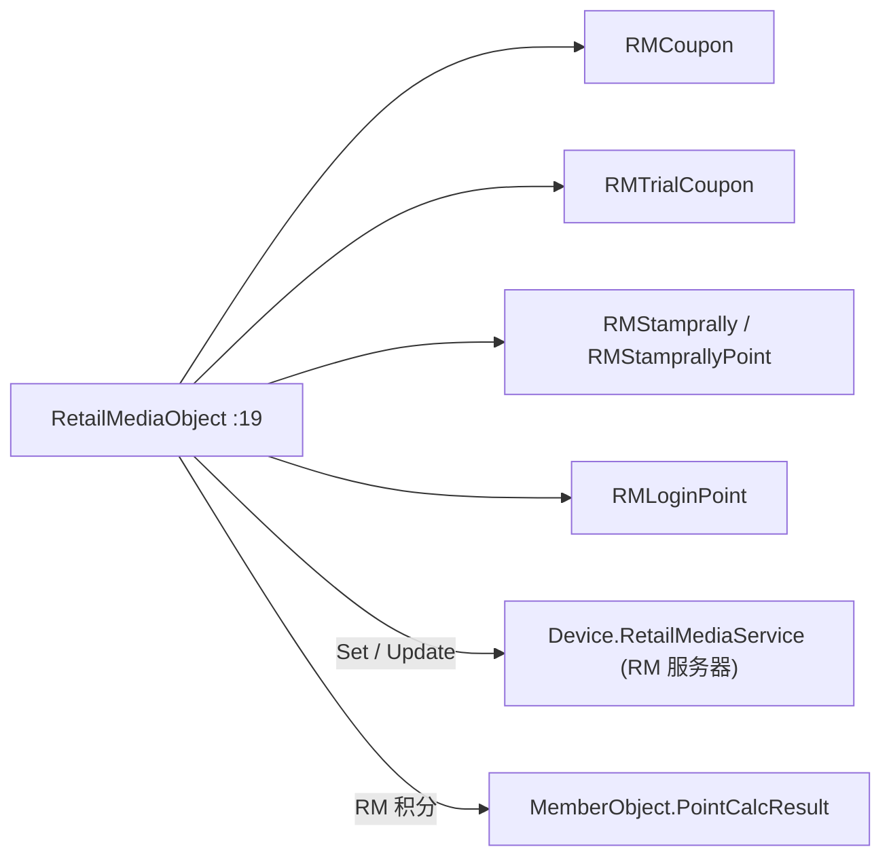

# 零售媒体域（Business.RetailMedia）

## 1. 模块定位

RetailMedia（RM）＝零售媒体权益：处理 **RM クーポン / トライアルクーポン / スタンプラリー / ログインポイント** 四类会员营销权益。以 `RetailMediaObject` 为门面，向 RM 服务器（通信在 Device 层）取得 / 更新权益，并把 RM 系积分并入 `PointCalcResult`（[会员域](../30_domain/member.md)）。

- 命名空间：`ForYouApplications.POS4U.Business.RetailMedia`
- 实现契约 `IRetailMedia`（定义在 [`Business.Sales/RetailMedia/IRetailMedia.cs`](Application/Source/Business/Business.Sales/RetailMedia/IRetailMedia.cs)）。
- RM 系积分（`RMCouponPoint` / `RMLoginPoint` / `RMStamprallyPoint`）供给 [积分域](../30_domain/point.md) 的 `CalcRMPointLogic`。

## 2. 代码结构

实测 `Application/Source/Business/Business.RetailMedia/`：**11 个 `.cs`**（不含 `Properties/AssemblyInfo.cs`），共约 1830 行。

### 2.1 门面 `RetailMediaObject`

[`RetailMediaObject.cs:19`](Application/Source/Business/Business.RetailMedia/RetailMediaObject.cs) `public class RetailMediaObject : IRetailMedia`（1172 行）。关键方法：

| 方法 | file:line | 职责 |
|---|---|---|
| `SetSelfRMCouponPoint` / `SetSelfRMTrialCoupon` / `SetSelfRMStamprallyPoint` | `:143` / `:155` / `:167` | 自助端权益取得 |
| `SetRMCouponPoint` / `SetRMLoginPoint` / `SetRMStamprallyPoint` / `SetRMTrialCoupon` | `:196` / `:213` / `:179` / `:230` | 通常端权益取得 |
| `UpdateRecommendationCouponApply` / `UpdateStamprallyApply` / `UpdateTrialCouponApply` | `:246` / `:271` / `:300` | 权益确定回写 RM 服务器 |
| `UseRMTrialCoupon(LineItems)` | `:323` | トライアルクーポン引换使用 |
| `RestoreRetailMedia(...)` | `:397`（`TempMTranDataSet`）/ `:495`（`TranDataSet`） | RM 状态复元（两路） |
| `ClearRetailMedia()` | `:580` | 清空 RM 状态 |

### 2.2 RM 实体 / Parameter 类

| 类 | 行数 | 语义 |
|---|---:|---|
| `RMCoupon` / `RMCouponParameter` | 61 / 46 | RM 优惠券 |
| `RMTrialCoupon` / `RMTrialCouponParameter` | 39 / 33 | トライアルクーポン（引换券） |
| `RMStamprally` / `RMStamprallyParameter` | 67 / 90 | スタンプラリー（含嵌套 `RMStamprallyTargetJan` `:55` / `:63`） |
| `RMStamprallyPoint` | 122 | スタンプラリー積分 |
| `RMLoginPoint` / `RMLoginPointParameter` | 36 / 40 | ログインポイント |

另有 `ExtensionMethods/SalesTranExtensionMethods.cs`（124 行）。

## 3. 状态机

无 TranState。RM 权益的「待更新」以布尔 flag 表达：`NeedUpdateRecommendationCouponApply`（`:70`）、`NeedUpdateTrialCouponApply`（`:86`）、`NeedUpdateStamprallyApply`（`:102`），结账时据此回写 RM 服务器。

## 4. 业务规则（BR）

- **BR-RETAILMEDIA-001（四类 RM 权益）**：クーポン（`RMCoupon`）/ トライアルクーポン（`RMTrialCoupon`）/ スタンプラリー（`RMStamprally` + `RMStamprallyPoint`）/ ログインポイント（`RMLoginPoint`），各有对应 `Set*` 取得与 `Update*` 回写方法（见 §2.1）。
- **BR-RETAILMEDIA-002（RM 积分并入 `PointCalcResult`）**：RM 系积分记入 [会员域 `PointCalcResult`](../30_domain/member.md)（`RMCouponPoint` / `RMLoginPoint` / `RMStamprallyPoint`）。其中 `RMStamprallyPoint` 是否计入电子券合计取决于 `IsRMStamprallyUpdateOffline`（[`PointCalcResult.cs:74`](Application/Source/Business/Business.Member/PointCalcResult.cs)）——离线未回写则不计入 `ECouponPointTotal`。
- **BR-RETAILMEDIA-003（トライアルクーポン引换）**：`UseRMTrialCoupon(LineItems)`（`:323`）对购物车明细应用引换；`TrialCouponLineTotal`（`:118`）、`TrialCouponUseCount`（`:129`）汇总使用额与次数。
- **BR-RETAILMEDIA-004（RM 状态复元两路）**：中断交易复元 `RestoreRetailMedia(SalesTran, TempMTranDataSet)`（`:397`）；从既存交易复元 `RestoreRetailMedia(SalesTran, TranDataSet)`（`:495`）。

## 5. 关键接口与契约

- `IRetailMedia`（[`Business.Sales/RetailMedia/IRetailMedia.cs`](Application/Source/Business/Business.Sales/RetailMedia/IRetailMedia.cs)）：`RetailMediaObject` 实现。
- RM 设备服务接口 `IRetailMediaService`（[`Device.DeviceDefine/RetailMediaService/IRetailMediaService.cs`](Application/Source/Device/Device.DeviceDefine/RetailMediaService/IRetailMediaService.cs)）——RM 服务器通信契约。

## 6. 数据依赖

RM 权益经 RM 服务器 API 取得（非本地主数据）；结果暂存于 `RetailMediaObject` 各集合并随交易持久化。枚举 / 常量 → 详见 [40_data/枚举与常量](../40_data/06_enums_constants.md)（不复制）。

## 7. 设备依赖

- **RM 服务器通信在 Device 层**：[`Device.RetailMediaService/RetailMediaServiceConnection.cs`](Application/Source/Device/Device.RetailMediaService/RetailMediaServiceConnection.cs)（+ `RetailMediaServiceCommon.cs`）。本模块经该服务收发 RM 权益，不直接持有网络实现 → 详见 [50_devices](../50_devices/index.md)（不复制）。

## 8. 参与的端到端流程

会员刷卡后取得 RM 券 / 积分 / 印章、结账时引换与回写 → 详见 [销售端到端流程](../70_flows/sale_end_to_end.md)（不复制）。与 [会员域](../30_domain/member.md)、[积分域](../30_domain/point.md) 协同。

## 9. 可信度与核查

- **verified**（最新发布 实测）：11 个文件、`RetailMediaObject`（`:19`，1172 行）与上表方法行号、四类 RM 实体、`IRetailMedia` 位置、RM 服务器通信在 `Device.RetailMediaService`、RM 积分并入 `PointCalcResult`。
- **unverified / uncheckable**：本模块**无专门基线分析报告**（结构与行号直接对代码核实）；RM 服务器 API 报文语义、券种详细业务规则超出源码 doc-comment 的部分未验证（标 unverified）；`Device.RetailMediaService` 内网络协议细节属 Device 层，本篇不展开。

## 10. ST-POS 迁移提示

> ST-POS（KugelPOS）目前无对应的 RetailMedia 模块。对照仅供参考，若后续引入需独立设计，详见 → ST-POS 促销 / 会员相关文档（外链，不在本体系展开）。
