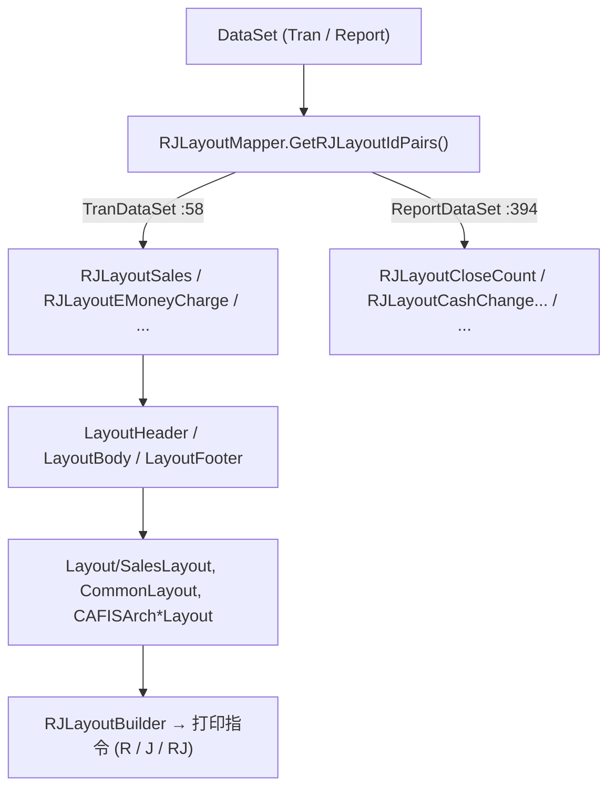

# 收据·日志排版域（Business.RJ）

## 1. 模块定位

RJ = **Receipt & Journal**。负责把交易数据集 / 报告数据集渲染为打印指令（客户联 R、日志 J、双通道 RJ）。核心是**模板方法 + 策略**：`RJLayoutMapper` 按交易/报告类型路由到具体 `RJLayout*` 布局，布局类在 `LayoutHeader/Body/Footer` 中调用 `Layout/*` 逻辑类拼装打印行。

- 命名空间：`ForYouApplications.POS4U.Business.RJ`
- 上游依赖（`Business.RJ.csproj`）：`Data.Container`（TranDataSet/ReportDataSet）、`Data.Accessor`、`Device.DeviceCommon`、`Device.DeviceDefine`、`WinPOS.Common`、`Common.Const`。
- 印字文言/符号的唯一真相源是配置文件 [`POS4ULogicService/Settings/MessageRJ.xml`](Application/Source/POS4ULogicService/Settings/MessageRJ.xml)（见 §4）。

## 2. 代码结构

实测 `Application/Source/Business/Business.RJ/`：顶层布局类 `RJLayout*.cs`（约 47 个）+ `Layout/` 逻辑类（约 52 个，含 `CAFISArch/`、`CAFISArchLAN/` 子目录）+ `Const/`（`RJLayoutIds.cs`、`RJMessageIds.cs`）。

### 2.1 路由器 `RJLayoutMapper`

[`RJLayoutMapper.cs:17`](Application/Source/Business/Business.RJ/RJLayoutMapper.cs) `public class RJLayoutMapper : IRJLayoutMapper`（543 行）。三个路由方法：

| 方法 | file:line | 职责 |
|---|---|---|
| `GetRJLayoutIdPairs(DataSet)` | `RJLayoutMapper.cs:34` | 公有入口，按 DataSet 实际类型分派 |
| `GetRJLayoutIdPairs(TranDataSet)` | `RJLayoutMapper.cs:58` | 交易类（销售/退货/充值/…）→ 布局 ID 列表 |
| `GetRJLayoutIdPairs(ReportDataSet)` | `RJLayoutMapper.cs:394` | 报告类（精算/在高/…）→ 布局 ID 列表 |
| `NeedReceiptNo(DataSet)` | `RJLayoutMapper.cs:24` | 是否需要采番收据号 |

### 2.2 布局逻辑类 `SalesLayout`

[`Layout/SalesLayout.cs:18`](Application/Source/Business/Business.RJ/Layout/SalesLayout.cs) `public static class SalesLayout`（**2487 行**，实测 `wc -l`）。暴露 **8 个 public static 方法**（其中 `AddLineItems` 有 `TranDataSet` / `ReportDataSet` 两个重载）+ 4 个 private static 辅助方法：

| public 方法 | file:line |
|---|---|
| `AddLineItems(RJLayoutBuilder, TranDataSet)` | `SalesLayout.cs:49` |
| `AddLineItems(RJLayoutBuilder, ReportDataSet)`（重载） | `SalesLayout.cs:427` |
| `AddSalesReceiptBarcode` | `SalesLayout.cs:555` |
| `AddPayments` | `SalesLayout.cs:578` |
| `AddPrintMemberPointInfo` | `SalesLayout.cs:1271` |
| `AddSummaryDiscountInfo` | `SalesLayout.cs:1843` |
| `AddTaxFreeDetailInfo` | `SalesLayout.cs:1956` |
| `AddTaxFreeTotalInfo` | `SalesLayout.cs:2073` |

> private：`AddPrintTaxSummaryInfo`(:2238)、`IsReducedTax`(:2291)、`GetSamePaymentInfo`(:2304)、`IsLogicServicePaymentStation`(:2324)。
> （基线报告曾示意「6 方法」，实测为 8 个 public，此处以代码为准。）

## 3. 状态机

无状态机。布局渲染是纯函数式拼装（数据集 → 打印行），设备通道以 `RJDeviceType`（R/J/RJ）区分而非状态。

## 4. 业务规则（BR）

- **BR-RJ-001（商品名按字节截断，Journal=23 / Receipt=22）**：常量定义于 [`SalesLayout.cs:23` `RJJournalItemDescriptionByteLength = 23`](Application/Source/Business/Business.RJ/Layout/SalesLayout.cs) 与 [`:28` `RJReceiptItemDescriptionByteLength = 22`](Application/Source/Business/Business.RJ/Layout/SalesLayout.cs)；另有商品券名 16（`:33`）、啤酒券条码名 22（`:38`）。截断由 `StringUtility.SubstringSpecifyBytes(...)` 执行（如 `:306`、`:316`）。
- **BR-RJ-002（印字符号以 `MessageRJ.xml` 为准）**：明细行的标记符号取自配置，**不是**基线报告示意代码里的 `☆/●/軽`。权威值：

| 语义 | Message Id | 实际符号 | 位置 |
|---|---|---|---|
| 积分禁止 | `RJ_PointProhibitionMark` | **ﾋ** | `MessageRJ.xml:88` |
| 电子优惠券 | `RJ_ECouponMark` | **★** | `MessageRJ.xml:93` |
| 会员电子优惠券 | `RJ_MemberECouponMark` | **&gt;** | `MessageRJ.xml:95` |
| 轻减税率（一般） | `RJ_TaxMarkReduced` | **\*** | `MessageRJ.xml:362` |
| 轻减·外税 | `RJ_TaxMarkReducedExcluded` | `*ｿ` | `MessageRJ.xml:10` |
| 轻减·内税 | `RJ_TaxMarkReducedIncluded` | `*ｳ` | `MessageRJ.xml:11` |
| 外税 / 内税 / 非课税 | `RJ_TaxMarkExcluded` / `Included` / `Exempt` | `外` / `内` / `非` | `MessageRJ.xml:12-14` |
| RM 优惠券 | `RJ_RMCouponMark` | `R` | `MessageRJ.xml:63` |
| RM 试用引换券 | `RJ_RMTrialCouponMark` | `試` | `MessageRJ.xml:151` |

  > ⚠️ 上表纠正了基线报告 `AddLineItems` 示意代码中的符号（该报告用 `☆`/`●`/`軽`，与配置不符）。凡涉及具体印字符号，一律回 `MessageRJ.xml` 核对。

- **BR-RJ-003（R/J 双通道分离打印）**：同一交易可分别向客户联（R）、日志（J）或双通道（RJ）输出不同内容（如 JAN 明细仅入 J、数量×单价仅入 R）。通道由 `RJDeviceType` 指定，`RJLayoutBuilder.AddPrintData(...)` 逐行落通道。

## 5. 关键接口与契约

- `IRJLayoutMapper`（`RJLayoutMapper` 实现）：交易/报告 → `RJLayoutIdPair[]`。
- `RJLayoutBuilder`（`WinPOS.Common` / Framework 侧）：打印行构建器，本模块通过它产出最终打印指令。
- 布局 ID 常量：`Const/RJLayoutIds.cs`；消息 ID 常量：`Const/RJMessageIds.cs`。

## 6. 数据依赖

只读 `Data.Container` 的 `TranDataSet` / `ReportDataSet`（由上游业务构建），读 `Data.Accessor` 配置。不直接写库。数据集字段字典 → 详见 [40_data 概览](../40_data/01_overview.md)（不复制）。

## 7. 设备依赖

依赖 `Device.DeviceCommon`、`Device.DeviceDefine`（打印机/设备常量）。物理打印动作由设备层执行 → 详见 [50_devices](../50_devices/index.md)。

## 8. 参与的端到端流程

销售完成后打印、精算报告打印 → 详见 [销售端到端流程](../70_flows/sale_end_to_end.md)、[开闭店精算流程](../70_flows/open_close_count.md)（不复制）。报告类布局与 [报表域](../30_domain/report.md) 协同。

## 9. 可信度与核查

- **verified**：`RJLayoutMapper`（:17，543 行，三路由 :34/:58/:394）、`SalesLayout`（:18，2487 行，8 个 public 方法）、字节截断常量（:23/:28/:33/:38）、`MessageRJ.xml` 全部符号行号均经 最新发布 实测。
- **uncheckable**：`RJLayoutBuilder`、`RJDeviceType` 等若定义在 `POS4U.Framework` / `WinPOS.Common` 编译产物内的部分，不断言其内部实现。
- 核查基线报告：`business_rj_analysis.md`（其示意代码中的印字符号已被本篇按 `MessageRJ.xml` 订正）。

## 10. ST-POS 迁移提示

> ST-POS 的小票/收据模板为独立体系。对照仅供参考，详见 → ST-POS receipt/journal 相关文档（外链，不在本体系展开）。
