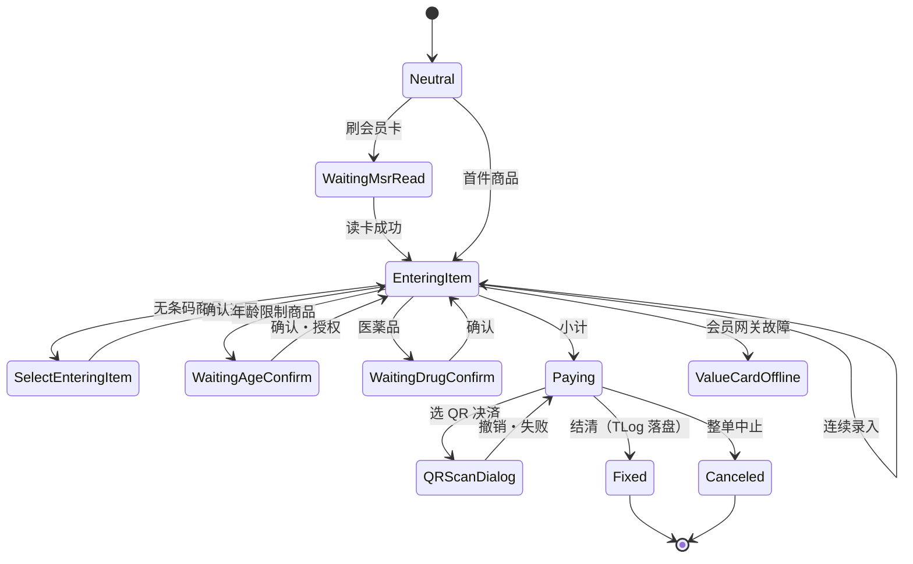

# 销售交易域（Business.Sales）

## 1. 模块定位

`Business.Sales` 是 POS4U 店舗端的**销售交易主引擎**：驱动一笔销售从空闲、商品录入、会员/年龄确认、促销与税额重算、进入结算、到最终确定（TLog 落盘）的全生命周期。它是收银前台一切"卖东西"场景的状态与数据中心。

- **系统角色**：`SalesTran` 承载交易内存状态，向下经 `SalesTranRepository` 检索价格、经 `IPaymentTran`/`IMemberTran` 契约挂接支付与会员，向上被 WinPOS 的 Command/Observer/State 引擎驱动。
- **上下游**（编译时 `Business.Sales.csproj <ProjectReference>`）：依赖 `Business.BusinessCommon`（基类）、`Business.Member`、`Business.Operator`、`Business.Payment`；折扣/积分/税则通过 `Factory.CreatePlugin` 运行时装配（见 §5）。
- **规模**（实测）：**53** 个 `.cs`、**11354** 行；核心类 `SalesTran.cs` 单文件 **2263** 行。

> 术语：POS4U = 現行 TRIAL 自社 POS（本文档对象）；不与 ST-POS 混用（见 [glossary](../00_portal/glossary.md)）。

---

## 2. 代码结构

### 2.1 交易类继承主干

| 类 | 路径:行 | 行数 | 职责 |
|---|---|---|---|
| `SalesTran` | `Application/Source/Business/Business.Sales/SalesTran.cs:25` | 2263 | 销售交易核心；`: CommonTranBase, IPaymentTran, IMemberTran` |
| `SelfSalesTran` | `Application/Source/Business/Business.Sales/SelfSalesTran.cs:20` | 1360 | 自助结账；`: SalesTran, IPaymentTranForPaymentService` |
| `ReturnTran` | `Application/Source/Business/Business.Sales/ReturnTran.cs:14` | 149 | 返品交易；`: SalesTran`（TranLogType=105，见 §3.3） |
| `OrderKitchenTran` | `Application/Source/Business/Business.Sales/OrderKitchenTran.cs:18` | 640 | 厨房订单；`: SelfSalesTran`（**非直接继承 SalesTran**） |

> `SalesTran.TranType` = `TranTypes.Sales`（`SalesTran.cs:58`）；`TranLogType` 在 `Fixed` 时返回 `NormalSales(101)`/训练模式 `TrainingSales(103)`（`SalesTran.cs:64-70`）。基类 `CommonTranBase` 在 `Business.BusinessCommon/CommonTranBase.cs:19`（`: TranBase, IDisposable`；`TranBase` 为框架 dll，uncheckable）。

### 2.2 商品明细（LineItem）族

明细采用模板方法 + PLU/非 PLU 分型。继承链（均在 `Application/Source/Business/Business.Sales/LineItem/`）：

```
LineItemBase (abstract, LineItemBase.cs:18, 478 行)
└── LineItemPLUBase (abstract, LineItemPLUBase.cs:15, 126 行)
    ├── LineItemPLU              (LineItemPLU.cs:16, 135 行)         普通 PLU 商品
    ├── LineItemPLUBook          (LineItemPLUBook.cs:16, 371 行)     书籍（ISBN/税特例）
    ├── LineItemPLUMagazine      (LineItemPLUMagazine.cs:15, 204 行) 杂志
    ├── LineItemNonPLU           (LineItemNonPLU.cs:19, 170 行)      非 PLU（部门直入）
    └── LineItemOrderKitchenBase (abstract, LineItemOrderKitchenBase.cs:13, 165 行)
        ├── LineItemPLUOrderKitchen    (LineItemPLUOrderKitchen.cs:11, 86 行)
        └── LineItemNonPLUOrderKitchen (LineItemNonPLUOrderKitchen.cs:11, 104 行)
```

> ⚠️ **订正 01- 造假**：上游 `business_sales_analysis.md` 曾把 `LineItemPLUBook.cs` 写成 **14083** 行——实测 **371** 行（`wc -l`）。`LineItemNonPLU` 实为 `: LineItemPLUBase`（非独立分支）。
>
> 明细状态 `LineItemStates`（`Application/Source/Common/Common.Const/State/LineItemStates.cs`）共 **5**：`Neutral`(17)/`Fixed`(22)/`Canceled`(27)/`WaitingISBN`(32)/`WaitingCCodeAndPrice`(37)。后两者服务于书籍/杂志录入。

### 2.3 其它关键类

| 类 | 路径:行 | 行数 | 职责 |
|---|---|---|---|
| `RestoreTranObject` | `Application/Source/Business/Business.Sales/RestoreTranObject.cs` | 1116 | 从 TLog 恢复交易（会员/明细/折扣/支付/优惠券），供打直し/暂挂恢复 |
| `MTranObject` | `Application/Source/Business/Business.Sales/MTranObject.cs` | 743 | 中间交易（暂挂/跨机台 Hold&Recall）保存/读取/删除 |
| `SelfFraudDetectionObject` | `Application/Source/Business/Business.Sales/SelfFraudDetection/SelfFraudDetectionObject.cs` | 361 | 自助结账防舞弊检测 |
| `SalesTranRepository` | `Application/Source/Business/Business.Sales/SalesTranRepository.cs:15` | 141 | 价格检索仓储（`: IDisposable`） |
| `LineItems` | `Application/Source/Business/Business.Sales/LineItems.cs` | 207 | 明细集合；`HasAgeConfirmationItems()` 等聚合判定 |

---

## 3. 状态机

### 3.1 `SalesTranStates` = 28 个节点

实测 `Application/Source/Common/Common.Const/State/SalesTranStates.cs` 共 **28** 个状态 = **18 `TranState` + 10 `State`**（两者基类均在框架 dll，uncheckable；此处核到"节点定义存在"）。

> ⚠️ **订正 01- 造假**：上游 `01_sales.md` 称"17 个核心业务状态"——实测 **28**。

**18 个 `TranState`（可作为交易主状态）**：

| 状态 | 行 | 语义 |
|---|---|---|
| `Neutral` | 13 | 空闲/初始 |
| `EnteringItem` | 18 | 明细登録中 |
| `SelectEnteringItem` | 23 | 无条码商品选择中 |
| `Paying` | 28 | 支付中 |
| `Fixed` | 33 | 交易确定 |
| `Canceled` | 38 | 交易中止 |
| `SavedMTran` | 44 | 已存中间交易（仅 LogicService 现金结算用） |
| `WaitingCancelTransactionCofirm` | 49 | 中止确认待ち（原文拼写如此） |
| `ItemReference` | 54 | 价格照会 |
| `SendMTransaction` | 59 | 中间交易送信 |
| `WaitingInquiryCanAcceptMTransaction` | 64 | 受付可否问询待ち |
| `WaitingReInquiryCanAcceptMTransaction` | 69 | 受付可否再问询待ち |
| `WaitingRequestGetMTransaction` | 74 | 取得请求待ち |
| `NotFoundInquiryCanAcceptMTransaction` | 79 | 无可受付会计机 |
| `FailedRequestGetMTransaction` | 84 | 取得请求送信失败 |
| `SavedMTransactionList` | 104 | 中间交易保留列表 |
| `GetCashChangerStatus` | 114 | セミセルフ会计机釣銭机状态取得 |
| `WaitingMsrRead` | 129 | MSR 刷卡待ち |

**10 个 `State`（阻塞/子状态）**：

| 状态 | 行 | 语义 |
|---|---|---|
| `WaitingAgeConfirm` | 89 | 年龄确认待ち（见 §4 BR-SALES-001） |
| `WaitingDrugConfirm` | 94 | 医薬品确认待ち |
| `WaitingPreventionConfirm` | 99 | 防犯商品确认待ち |
| `ItemCancel` | 109 | 商品取消（见 §4 BR-SALES-004） |
| `ValueCardOffline` | 119 | VD/会员系统离线降级（见 §4 BR-SALES-002） |
| `CashChanger_ErrorDisconnect` | 124 | 釣銭机切断错误（前缀 `StatePrefixes.Payment`） |
| `WaitingFaceMe` | 134 | 顔认证结果待ち |
| `FaceMeSecondCheckPinInput` | 139 | 顔认证二段阶 PIN 输入 |
| `QRScanDialog` | 144 | QR 决済扫码待ち |
| `WaitingDrugVerify` | 149 | 医薬品确认待ち（第二种） |

### 3.2 主流程迁移（happy path）

> 迁移**边**由 WinPOS Command 类 + `Application/Source/POS4U/Settings/StateWinPOS*.xml` 驱动（非本模块），逐条另核；下图为主干示意，节点已 verified。



### 3.3 `ReturnTran`（返品）—— 与 Business.ReSales 的区分

`ReturnTran`（`ReturnTran.cs`）是 `SalesTran` 的子类，代表**不引用原小票、直接录入退货商品**的返品交易：

- 构造即置 `IsAgeConfirmation=true`/`IsDrugConfirmed=true`/`IsPreventionConfirmed=true`（`ReturnTran.cs:22-24`），并进入 `ReturnTranStates.SelectReason`（`:29`）。
- `TranType`=`TranTypes.Return`（`:40`）；`TranLogType`：`Fixed`→`NormalReturn(105)`/`TrainingReturn(107)`，`Canceled`→`CanceledReturn(106)`/`TrainingCanceledReturn(108)`（`:47-62`）。
- `SetReason(input)` 解析 3 位理由（`ReasonType`=1 位 + `ReasonCode`=2 位，`:95-107`）；积分区分 `PointServiceDealDiv.Return`（`:82-88`）。

> **与 `Business.ReSales` 的关键区别**：`ReturnTran`（本模块）= 手动录入退货的**返品**（105）；而引用原小票的**一括取消/打直し**是 `VoidTran`/`ReSalesTran`（`NormalVoid=121`）→ 详见 [resales.md](./resales.md)。二者是两套独立机制。

---

## 4. 业务规则（BR / 合规）

### BR-SALES-001 年龄确认商品的挂起与授权

- **规则**：小计（`SubTotal`）时若购物车含需年龄确认的商品且未确认，则拦截，要求先完成年龄确认。
- **代码**：`SalesTran.cs:1946-1951`：
  ```csharp
  if (this.LineItems.HasAgeConfirmationItems() && !this.IsAgeConfirmation)
  {
      this.SetError(MessageIds.ErrorNeedApprovalAgeConfirmation);
      return false;
  }
  ```
- **确认渠道**：`AgeConfirmType`（`SalesTran.cs:226`）取值来自 `Application/Source/Common/Common.Const/AgeConfirmTypes.cs`，共 **5 种**：`FaceMe`"1"(11) / `Employee`"2"(16) / `Attendant`"3"(21) / `Remote`"4"(26) / `KeyCodeEmployee`"5"(31)（类型定义 `Common.Const/Class/AgeConfirmType.cs`）。
- **授权方法**：`ApprovalAgeConfirmation(string ageConfirmType)`（`:1288`，`FaceMe`/`Remote` 走客側自助确认路径）、`ApprovalAgeConfirmation(bool)`（`:1317`）、`ClearAgeConfirmType()`（`:1325`）、`CustomerApprovalAgeConfirmation(bool)`（`:1339`，副屏顾客触按）。相关状态 `WaitingAgeConfirm`（§3.1）。
- **合规背景**：日本青少年保护/酒类烟草销售需年龄确认。

> ⚠️ **订正 01- 造假**：上游 `01_sales.md` 称年龄触发依赖商品属性 `IsAgeLimitProhibition`——该标识符在 pos-store 全代码库 **grep 命中 = 0**（虚构）。真实触发是 `LineItems.HasAgeConfirmationItems()` 聚合判定。

### BR-SALES-002 会员/储值卡系统离线降级（ValueCardOffline）

- **规则**：会员/VD 网关联机失败（`ErrorValueCardOffline`）时不得阻塞结账；系统保留会员卡号到离线字段并强制初始化会员对象，允许无积分抵扣完成现金结算。
- **代码**：`SalesTran.cs:754-770`：命中 `MessageIds.ErrorValueCardOffline.Id` 时，将 `MemberObject.TempPointCardNo` 存入 `OfflinePointCardNo`（`:759`），随后 `new MemberObject()` 重置（`:766`）。
- **相关成员**：`OfflinePointCardNo`（`:261`）、`CanPointUpdateErrorContinue`（`:292`）、`HasOfflinePointCardNo`（`:304-313`）。状态节点 `ValueCardOffline`（§3.1）。

### BR-SALES-003 清除会员时物理排卡

- **规则**：`ClearMember()` 清除会员或作废时，强制物理弹出 MSR 读卡器内残留磁卡。
- **代码**：`ClearMember()`（`SalesTran.cs:819-839`）末尾调用 `MemberLibrary.TryEjectCard()`（`:838`）；离线以外场景亦排卡（`:784`），另见 `:1236`/`:1278`。

### BR-SALES-004 商品取消（直前取消 / 指定取消）的乒乓与差异化落盘

- **规则**：取消行采用**乒乓翻转**（再取消=恢复 `Fixed`），已取消行排除出折扣/税额基数；本地 BI 保留取消行（`IsCanceled=1`）用于审计，云端上报过滤取消行，顾客小票不印取消行、日记账保留并印"直前/指定取消"标志。
- **代码锚点**：`LineItemBase.Cancel(SalesTran)` 乒乓翻转；`SalesTran.ChangeLineItem<T>` 以 `CopyUtility.DeepCopy` 备份 + `finally` 内 `ReCalcSalesTran()` 重算。UI 层按有无置数分派 `EventCodes.Sales_ItemCancel`（直前）/`Sales_CancelSpecifiedLineByItem`（指定）。
- **详见流程**：→ [70_flows/item_cancel.md](../70_flows/item_cancel.md)（端到端：UI→Command→重算→本地/云端双轨→打印差异，不在此复述）。

### BR-SALES-005 医薬品/防犯品确认

- **规则**：医薬品、须防犯确认的商品分别需 `IsDrugConfirmed`（`SalesTran.cs:241`）/`IsPreventionConfirmed`（`:251`）为真方可推进；对应状态 `WaitingDrugConfirm`/`WaitingDrugVerify`/`WaitingPreventionConfirm`（§3.1）。

---

## 5. 关键接口与契约

`Business.Sales` 定义业务接口，实现体在独立模块经 `Factory.CreatePlugin(SalesPluginIds.*)` 运行时装配（插件 id 见 `Application/Source/Business/Business.Sales/Const/SalesPluginIds.cs`）：

| 接口 | 路径:行 | 实现模块 | 用途 |
|---|---|---|---|
| `IPointManager` | `Point/IPointManager.cs`（42 行） | `Business.Point` | 积分计算/离线积分 |
| `IDiscountManager` | `Discount/IDiscountManager.cs`（51 行） | `Business.Discount` | 明细/小计折扣、Mix&Match |
| `ITaxManager` | `Tax/ITaxManager.cs`（45 行） | `Business.Tax` | 税额计算（→ [tax.md](./tax.md)） |
| `IRetailMedia` | `RetailMedia/IRetailMedia.cs`（150 行） | `Business.RetailMedia` | クーポン/广告 |

- **支付契约**：`SalesTran : IPaymentTran`（`Business.Payment/IPaymentTran.cs`）——组合支付、AddPayment/ChangePayment（→ [payment.md](./payment.md)）。
- **会员契约**：`SalesTran : IMemberTran`（`Business.Member/IMemberTran.cs`）。
- **TLog 产出**：`SalesTran` 经基类 `CommonTranBase.FixTran()`（`Business.BusinessCommon/CommonTranBase.cs:101`）触发 `Factory.CreatePlugin(...TranLogMaker, TranType.Id)` 组装 `TranDataSet`（→ [tran_log_maker.md](./tran_log_maker.md)）。

---

## 6. 数据依赖

- **读**：价格/商品主数据经 `SalesTranRepository`（PLU、部门、书籍等）；主数据快照表见 → [40_data/03_tran_tables.md](../40_data/03_tran_tables.md)。
- **写**：确定时产出 `TranDataSet` 由 `TransactionLogAccessor.InsertTransactionLog` 落盘 SQL Server（SQLEXPRESS）交易表（五元组联合主键 CompanyCode/StoreCode/TerminalNo/ManagedNo/TransactionNo）。
- **枚举/常量**：`TranTypes`/`TranLogType`/`SalesTranStates`/`AgeConfirmTypes` 等 → [40_data/06_enums_constants.md](../40_data/06_enums_constants.md)。

> 表结构/字段字典不在此复制，统一见 40_data。

---

## 7. 设备依赖

- **MSR 读卡器**：`MemberLibrary.TryEjectCard()` 物理排卡（BR-SALES-003）。
- **客側副屏**：年龄确认/顾客触按（`CustomerApprovalAgeConfirmation`）。
- **QR 扫码枪**：`QRScanDialog` 状态下的扫码支付（结算侧见 [payment.md](./payment.md)）。
- **Glory/ECS 釣銭机**：`GetCashChangerStatus`/`CashChanger_ErrorDisconnect` 状态经支付侧驱动。

设备驱动族（78 项目）详见 → [50_devices/index.md](../50_devices/index.md)（本篇不复制驱动细节）。

---

## 8. 参与的端到端流程

- 销售全流程（扫码→小计→支付→落盘）→ [70_flows/sale_end_to_end.md](../70_flows/sale_end_to_end.md)
- 年龄确认（自助/係員/Attendant 遠隔）→ [70_flows/age_confirm.md](../70_flows/age_confirm.md)
- 商品取消（直前/指定）→ [70_flows/item_cancel.md](../70_flows/item_cancel.md)
- 暂挂/跨机台 Hold&Recall（MTran）→ [70_flows/hold_recall.md](../70_flows/hold_recall.md)

---

## 9. 可信度与核查

- **verified**：文件/行数（`find`+`wc -l`）、类继承（class 声明 file:line）、`SalesTranStates=28`、`AgeConfirmTypes=5`、各 BR 的代码锚点均实测 最新发布。
- **uncheckable**：`TranBase`/`State`/`TranState`/`CommandBase` 等框架基类定义在 `POS4U.Framework.dll`（无源码）；状态**迁移边**在 `StateWinPOS*.xml` + Command 类，逐条另核。
- **本篇订正的 01- 造假**：① `LineItemPLUBook` 14083 行 → 371 行；② "17 状态" → 28；③ 虚构属性 `IsAgeLimitProhibition`（不存在）→ 真实为 `LineItems.HasAgeConfirmationItems()`。

---

## 10. ST-POS 迁移提示

> ST-POS（新内製 POS，本工作区其它子仓库）状态控制以 kugelpos `cart` 服务的状态机为准，与本文档 AS-IS 无直接对应。年龄确认/离线降级/商品取消乒乓等 BR 迁移评估 → 见 ST-POS 侧 `stpos-trec-docs/12-backend/features/`（只外链，不在此展开）。
