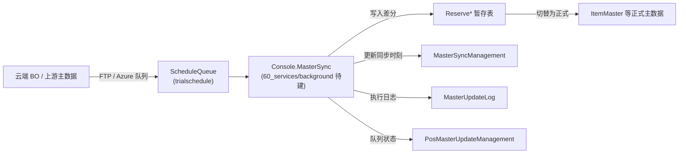

# 主数据同步机制概览（DB 侧）

> 本篇只给**数据库侧的同步骨架**：管理表、Reserve 暂存、队列/日志表。**同步进程的执行逻辑**（消费队列、拉取文件、切换）属后台服务 [`Console.MasterSync`](../60_services/background/) 职责——归 **60_services/background**（待建），本篇只链接、不复制。

## 1. 数据流（概念）

> 运维流程（全量取込 / 差分 `MasterSyncDiff` 排程 / `trialschedule` 队列消息 / Azure・FTP 取込步骤）实测记录于部署说明 [`database/ReadMe.txt`](database/ReadMe.txt)（含 `{"ScheduleName":"MasterSyncDiff","CompanyCode":..,"StoreCode":..}` 队列消息样例）。

## 2. 同步管理表（实测字段）

### 2.1 `MasterSyncManagement`（Master 库 · 同步时刻台账）

[`dbo.MasterSyncManagement.Table.sql`](Application/Database/01_Tables/dbo.MasterSyncManagement.Table.sql)，PK = `CompanyCode / StoreCode / MasterID`：

| 字段 | 类型 | 说明 |
|---|---|---|
| `MasterID` | nvarchar(30) | 主数据种类标识（PK③） |
| `AllMasterDateTime` | datetime2 NULL | **全量**同步时刻 |
| `DiffMasterDateTime` | datetime2 NULL | **差分**同步时刻 |
| `ReserveMasterDateTime` | datetime2 NULL | **预约**同步时刻 |
| `LastUpdateDateTime` | datetime2 NOT NULL | 最终更新 |

> 三个 `*MasterDateTime` 列直接印证 **全量 / 差分 / 预约** 三种同步模式。

### 2.2 `PosMasterUpdateManagement`（Tran 库 · 队列驱动状态）

[`dbo.PosMasterUpdateManagement.Table.sql`](Application/Database/01_Tables/dbo.PosMasterUpdateManagement.Table.sql)，PK = `CompanyCode / StoreCode / MasterSyncType`：

| 字段 | 类型 | 说明 |
|---|---|---|
| `MasterSyncType` | nvarchar(20) | 同步种类（PK③） |
| `Status` | int | 处理状态 |
| `Processor` | nvarchar(100) NULL | 处理者 |
| `QueueName` | nvarchar(100) NULL | 关联队列名 |
| `UpdateDateTime` | datetime2 | 更新时刻 |

### 2.3 `MasterUpdateLog`（Tran 库 · 执行日志）

[`dbo.MasterUpdateLog.Table.sql`](Application/Database/01_Tables/dbo.MasterUpdateLog.Table.sql)，PK = `VMName / SeqNo / ThreadId / TimeStamp`（`SeqNo` 为 `IDENTITY(1,1)`）：

`VMName`(执行机) · `ScheduleName` · `TaskName` · `IsSuccess`(bit) · `ErrorMessage`(nvarchar max) —— 记录每次同步任务的成败与错误，供运维排查。

## 3. Reserve 暂存表（差分先落暂存，再切替）

差分同步先写入 `Reserve*` 表，校验后再切换为正式主数据（见 §1 流程）：

- `ReserveMasterSyncItemMasterManagement`（[表](Application/Database/01_Tables/dbo.ReserveMasterSyncItemMasterManagement.Table.sql)，附加索引 `zz_IDX_ReserveMasterSyncItemMasterManagement_1.sql`）
- `ReserveNonBarcodeOtherItemManagement` · `ReserveNonBarcodeOtherItemMaster` · `ReserveNonBarcodeOtherItemCategoryMaster` · `ReserveItemImageMaster`

配套 SP：`usp_UpdateReserveMasterSyncItemMasterManagement`（属 [05_stored_procedures §1.1 的 8 个漏计 SP](./05_stored_procedures.md) 之一）。BO 侧下发履历落 `BOReceiveMasterHistory`。

## 4. 相关对象汇总

| 类别 | 对象 | 家文档 |
|---|---|---|
| 管理表 | `MasterSyncManagement`·`PosMasterUpdateManagement`·`MasterUpdateLog` | [03_tran_tables](./03_tran_tables.md) |
| Reserve 暂存 | `Reserve*`（5 表） | [02](./02_master_tables.md)/[03](./03_tran_tables.md) |
| 队列/排程 | `ScheduleQueue`·`ScheduleLog` | [03_tran_tables](./03_tran_tables.md) |
| Sync SP | `usp_*Sync*`（实测 4）+ `usp_UpdateReserve*` | [05_stored_procedures](./05_stored_procedures.md) |
| 执行进程 | `Console.MasterSync` | **[60_services/background](../60_services/background/)（待建）** |

## 5. 可信度与核查

- **verified**（DB 侧）：4 张管理表 + 5 张 Reserve 表 + Sync SP + 三同步模式（`*MasterDateTime` 列）均带 `file:line`；`ReadMe.txt` 运维流程可核（ASCII 片段 `MasterSyncDiff`/`trialschedule` 可辨）。
- **待建/外部**：`Console.MasterSync` 进程的消费循环、切替事务边界属后台服务实现，归 [60_services/background](../60_services/background/)；本篇不复制其逻辑。
- 素材参考：`01-trialpos-docs/.../data_synchronization.md`。

## 6. ST-POS 迁移提示

> 🔀 POS4U 的"Reserve 暂存 + 切替 + 队列驱动"主数据同步，对应 ST-POS 的 `master-data` 服务同步链路（含 `master-data-service-sync`）；语义映射外链团队内部设计库，不在本体系。
