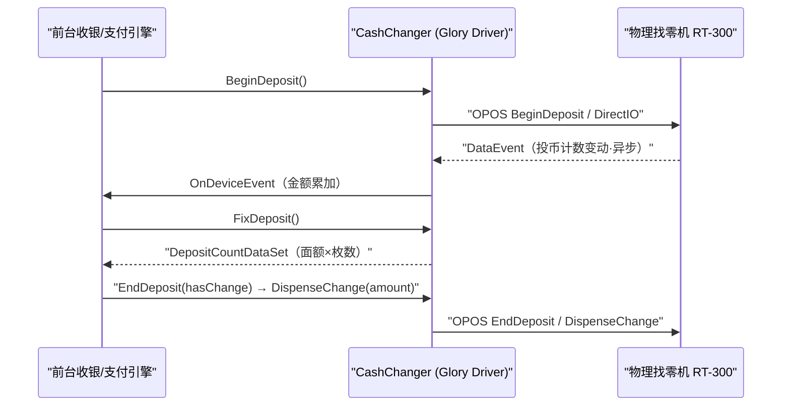

# 现金处理设备族（自动找零机 + 钱箱）

## 1. 定位与成员（10 模块）

自动找零机是门店现金流转与自助结算的核心外设。ST-POS4U 支持 **Glory（RAD-RT300 / RAD-RT200 / RAD262）**、**ECS7**、**VT280**、**LAUREL(ローレル) LADYf** 多品牌找零机，外加两类钱箱（`CashDrawer`）。全部实现契约层的 `ICashChanger` / `ICashDrawer`（`Application/Source/Device/Device.DeviceDefine/CashChanger/ICashChanger.cs`、`.../CashDrawer/ICashDrawer.cs`）。

| 模块 | 类型 | 主类 / 证据 |
|---|---|---|
| Device.CashChangerGloryRADRT300 | 实装 | `CashChanger : DeviceBase, ICashChanger, ICashChangerEx, ICashChangerSpecify`（`CashChanger.cs:25`） |
| Device.CashChangerGloryRADRT200 | 实装 | `CashChanger`（`RADRT200Define.cs` 命令集） |
| Device.CashChangerRAD262 | 实装 | `CashChanger`（`Device.CashChangerRAD262/CashChanger.cs`） |
| Device.CashChangerECS7 | 实装 | `CashChanger : DeviceBase, ICashChanger`（`CashChanger.cs:19`） |
| Device.CashChangerVT280 | 实装 | `CashChanger`（`Device.CashChangerVT280/CashChanger.cs`） |
| Device.CashChangerLADYf | 实装 | LAUREL(ローレル) 釣銭機（`CashChangerLADYf.cs:16-18`） |
| Device.CashChangerSimulator | Simulator | `CashChangerSimulator : DeviceBase, ICashChanger`（`CashChangerSimulator.cs:13`）+ `CashChangerSimulatorForm` |
| Device.CashDrawerM8500 | 实装 | `CashDrawerM8500 : DeviceBase, ICashDrawer`（`CashDrawerM8500.cs:13`「ドロア制御クラス」） |
| Device.CashDrawer4DotNet | 实装 | `CashDrawer4DotNet : PosForNetDeviceBase<CashDrawer>, ICashDrawer`（`CashDrawer4DotNet.cs:13`） |
| Device.CashDrawerSimulator | Simulator | `CashDrawerSimulator`（`Device.CashDrawerSimulator/`）+ `CashDrawerSimulatorForm` |

> Glory 各机种共用几乎同构的文件骨架（`CashChanger.cs` / `ErrorDataSet*` / `OcxForm*` / `<机种>Define.cs`），差异集中在 `*Define.cs` 的命令码/面额/回收模式。

## 2. 物理链路：OPOS OCX + DirectIO

Glory / ECS 找零机走 **OPOS（OLE for Retail POS）** OCX 控件（ActiveX `AxOPOSCashChanger`），经生命周期 `Open → ClaimDevice → DeviceEnabled` 建链（`Device.CashChangerECS7/CashChanger.cs:217/230/254`），高级功能通过 `DirectIO` 下发（`Device.CashChangerGloryRADRT300/CashChanger.cs:1840` `ExecuteDirectIO`）。

命令码在 `RADRT300Define.cs` 集中定义（复算/回收等；素材已提取 `CHAN_DI_RESET`=1、`CHAN_DI_SEISA`=12、`CHAN_DI_BEGINDEPOSIT`=14 等，型号别命令值以 `RADRT300Define.cs` / `RADRT200Define.cs` 为准）。

`ICashChanger` 生命周期契约（`Init/Release/SetEnable/SetDisable/IsEnable/IsInitialized`）与投币/找零方法（`BeginDeposit/FixDeposit/EndDeposit/DispenseChange`）见契约层 `ICashChanger.cs`。

## 3. 违算（不确定状态）检测

现金管理最忌 **违算（Variance）**——系统记账与机内实际枚数不符。契约方法 `GetUncertainState()`（`ICashChanger.cs:130-133`，`0=違算無し / 非0=有り`）供前台判定。Glory RT-300 通过解析精算 Buffer 的位掩码实现，标志枚举 `UncertainStatesBitIndexBill/Coin` 定义于 `RADRT300Define.cs`（素材实测 `L278-L336`）。检出违算时前台弹警告、上报 LogicWebService、禁用投币滑轨转人工/电子支付降级。

## 4. 故障退避：net.tcp 5 分钟超时（关键）

找零机全回收/清箱精盘的物理传输可耗时 2–4 分钟，远超 WCF 默认 1 分钟超时。前台 `POS4U` 与 `TRAN4U`（驱动守护进程）间的 WCF **net.tcp** 绑定把收发超时调优为 **5 分钟**：

- `SendTimeout = new TimeSpan(0, 5, 0)`（`Application/Source/WinPOS/Batch/WinPOS.Batch/TranRemoteControllerLibrary.cs:131`）
- `ReceiveTimeout = new TimeSpan(0, 5, 0)`（同文件:132）
- `OpenTimeout`/`CloseTimeout` = 30 秒（同文件:130/133）

耗时的 `RecountCash`（精算重数）等设计为异步指令，结果经 `StatusUpdateEvent` 回调，避免前台 UI 卡死（素材 01_cash_changer §4）。

## 5. 可信度与核查

- **verified**：模块清单、主类声明与接口实现、OPOS 建链/DirectIO 调用点、net.tcp 5min 超时四行、`GetUncertainState` 契约，均带 `file:line`。
- **uncheckable**：`DeviceBase` 内部（`POS4U.Framework.dll` 无源码）；OPOS OCX 运行期与 Glory 固件精算传感物理行为；素材中 Glory 命令码数值以各机种 `*Define.cs` 为最终真值（本文只锚定文件，未逐值誊抄）。

> **ST-POS 迁移提示**（薄）：找零机驱动归 `stpos-device-kugelpos` 设备网关，不在后端。
