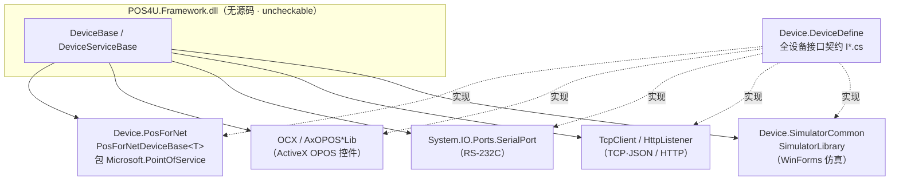

# 设备驱动族总表（`Application/Source/Device/` · 78 模块）

> POS4U 的外设驱动层。全部驱动运行在 **`TRAN4U.exe`（WinForms 守护进程）**，前台 `POS4U.exe`（WPF）经 **WCF net.tcp** 跨进程调用（→ 详见 [`code-map`](../00_portal/code-map.md)）。本表覆盖 `Device/` 下**实测 78 个 `.csproj`**（`find Application/Source/Device -name *.csproj | wc -l` = 78），逐族详见各家文档。

## 0. 架构分层（三个基类 + 一个契约库）

- **契约层** `Device.DeviceDefine`：集中定义 `IDevice` 派生的全部设备接口（`ICashChanger` / `IPOSPrinter` / `IMSR` / `IPackageScanner` / `IPaymentService` / `IPointService` / `IValueCard` …）与常量，物理实装与 Simulator 都实现同一接口，前台对二者无感（`Application/Source/Device/Device.DeviceDefine/CashChanger/ICashChanger.cs` 等）。
- **框架基类** `DeviceBase` / `DeviceServiceBase`：全代码库 grep 无源码（`grep -rn "class DeviceBase" --include=*.cs` = 0）→ 位于 `Application/POS4UCloud/ExternalModule/Framework/POS4U.Framework.dll`，标 **uncheckable**。
- **POS for .NET 基类** `PosForNetDeviceBase<T> : DeviceBase`（`Application/Source/Device/Device.PosForNet/PosForNetDeviceBase.cs:12`），封装 `Microsoft.PointOfService.PosExplorer`（同文件:23/110），是全部 `*4DotNet` 设备的父类。
- **物理链路**：OPOS OCX（`AxOPOS*Lib` ActiveX）、串口（`SerialPort`）、TCP/JSON（`TcpClientWrapper`）、HTTP（`HttpListener`/HttpClient）。

## 1. 族分布（合计 = 78）

| 族 | 家文档 | 实装 | Simulator | 基盤/库 | 小计 |
|---|---|--:|--:|--:|--:|
| 现金处理（找零机+钱箱） | [cash_changer.md](./cash_changer.md) | 8 | 2 | 0 | 10 |
| 决済端末（CAFIS / JET-S 信用卡） | [payment_terminal.md](./payment_terminal.md) | 5 | 3 | 0 | 8 |
| 打印机 | [printer.md](./printer.md) | 4 | 1 | 1 | 6 |
| 扫描 / 键盘 | [scanner.md](./scanner.md) | 6 | 1 | 0 | 7 |
| 自助结算 / 客面副屏 | [self_checkout.md](./self_checkout.md) | 3 | 0 | 0 | 3 |
| 会员 / 积分 / 预付卡 / 工资扣款 | [member_point_devices.md](./member_point_devices.md) | 5 | 4 | 0 | 9 |
| 其余（基盤·MSR·客显·外部服务·セルフ制御） | [others.md](./others.md) | 18 | 12 | 5 | 35 |
| **合计** | | **49** | **23** | **6** | **78** |

> 类型定义：**实装**=对接物理设备/外部系统的驱动；**Simulator**=WinForms 高拟真仿真（`*SimulatorForm.Designer.cs`）；**基盤/库**=契约/共通/基类库，非设备本身。

## 2. 全 78 模块明细（路径均相对 `Application/Source/Device/`）

### 2.1 现金处理族（10）→ [cash_changer.md](./cash_changer.md)

| 模块 | 类型 | 一句职责 | csproj |
|---|---|---|---|
| Device.CashChangerGloryRADRT300 | 实装 | Glory RAD-RT300 自动找零机（OPOS OCX + DirectIO） | `…RADRT300/…RADRT300.csproj` |
| Device.CashChangerGloryRADRT200 | 实装 | Glory RAD-RT200 自动找零机 | `…RADRT200/…RADRT200.csproj` |
| Device.CashChangerRAD262 | 实装 | Glory RAD262 自动找零机 | `…RAD262/…RAD262.csproj` |
| Device.CashChangerECS7 | 实装 | ECS7 自动找零机（`CashChanger.cs:19` OPOS） | `…ECS7/…ECS7.csproj` |
| Device.CashChangerVT280 | 实装 | VT280 自动找零机 | `…VT280/…VT280.csproj` |
| Device.CashChangerLADYf | 实装 | LAUREL(ローレル) 找零机（`CashChangerLADYf.cs:16-18`） | `…LADYf/…LADYf.csproj` |
| Device.CashChangerSimulator | Simulator | 找零机族 WinForms 仿真（`CashChangerSimulator.cs:13`） | `…Simulator/…Simulator.csproj` |
| Device.CashDrawerM8500 | 实装 | M8500 钱箱（`CashDrawerM8500.cs:13` OCX） | `…M8500/…M8500.csproj` |
| Device.CashDrawer4DotNet | 实装 | 钱箱（POS for .NET，`CashDrawer4DotNet.cs:13`） | `…4DotNet/…4DotNet.csproj` |
| Device.CashDrawerSimulator | Simulator | 钱箱 WinForms 仿真 | `…Simulator/…Simulator.csproj` |

### 2.2 决済端末族（8）→ [payment_terminal.md](./payment_terminal.md)

| 模块 | 类型 | 一句职责 | csproj |
|---|---|---|---|
| Device.CAFISArchLAN | 实装 | CAFIS Arch LAN 卡机（Saturn1000L·TCP/JSON·`SendSync`/`SendASync`） | `…CAFISArchLAN/…CAFISArchLAN.csproj` |
| Device.CAFISArch | 实装 | CAFIS Arch 串口卡机基盤（`CAFISArchRS232CBase.cs:16` RS-232C） | `…CAFISArch/…CAFISArch.csproj` |
| Device.CAFISArchService | 实装 | CAFIS 设备宿主包装（`CAFISArchService.cs:14` `IWindowHolder`） | `…CAFISArchService/…CAFISArchService.csproj` |
| Device.CT5100 | 实装 | JET-S CT5100 信用卡端末（`CT5100.cs:12` 串口） | `…CT5100/…CT5100.csproj` |
| Device.CT6100_ModeSelf | 实装 | JET-S CT6100 信用卡端末·セルフ模式（`CT6100ModeSelf.cs:13-14`） | `…CT6100_ModeSelf/…CT6100_ModeSelf.csproj` |
| Device.CAFISArchLANSimulator | Simulator | CAFIS LAN 卡机 WinForms 仿真（`CAFISArchLANSimulator.cs:11`） | `…CAFISArchLANSimulator/…CAFISArchLANSimulator.csproj` |
| Device.CAFISArchSimulator | Simulator | CAFIS 串口卡机 WinForms 仿真 | `…CAFISArchSimulator/…CAFISArchSimulator.csproj` |
| Device.CT6100_ModeSelfSimulator | Simulator | CT6100 セルフ模式 WinForms 仿真 | `…CT6100_ModeSelfSimulator/…CT6100_ModeSelfSimulator.csproj` |

### 2.3 打印机族（6）→ [printer.md](./printer.md)

| 模块 | 类型 | 一句职责 | csproj |
|---|---|---|---|
| Device.POSPrinterSS900 | 实装 | TEC SS900/SS950 小票打印机（`POSPrinterTECSS900.cs:24` `AxOPOSPrinter`） | `…SS900/`**`…POSPrinterTECSS900.csproj`** ⚠️ |
| Device.POSPrinterFP2000 | 实装 | 富士通 FP2000 小票打印机（`POSPrinterFP2000.cs:17`） | `…FP2000/…FP2000.csproj` |
| Device.POSPrinterPosiflex | 实装 | Posiflex 打印机（POS for .NET，`POSPrinterPosiflex.cs:19`） | `…Posiflex/…Posiflex.csproj` |
| Device.POSPrinter4DotNet | 实装 | 打印机（POS for .NET，`POSPrinter4DotNet.cs:16`） | `…4DotNet/…4DotNet.csproj` |
| Device.POSPrinterLibrary | 基盤/库 | 打印数据编集共通库（ESC 能力剔除·`PrintDataLibrary.cs:56`） | `…POSPrinterLibrary/…POSPrinterLibrary.csproj` |
| Device.POSPrinterSimulator | Simulator | 打印机 WinForms 仿真 + 小票预览（`RecieptViewer.cs`） | `…POSPrinterSimulator/…POSPrinterSimulator.csproj` |

### 2.4 扫描 / 键盘族（7）→ [scanner.md](./scanner.md)

| 模块 | 类型 | 一句职责 | csproj |
|---|---|---|---|
| Device.ScannerMagellan1100i | 实装 | Datalogic Magellan1100i 扫描枪（`ScannerMagellan1100i.cs:16` OCX） | `…Magellan1100i/…Magellan1100i.csproj` |
| Device.ScannerM11 | 实装 | M11 扫描枪（`ScannerM11.cs:17` OCX FrmOcx） | `…ScannerM11/…ScannerM11.csproj` |
| Device.ScannerM8750 | 实装 | TEC M8750 扫描枪 + パッケージスキャナー（`TECPackageScanner.cs:19`） | `…ScannerM8750/…ScannerM8750.csproj` |
| Device.Scanner4DotNet | 实装 | 扫描枪（POS for .NET，`Scanner4DotNet.cs:15`；TEC IS910/QT100） | `…Scanner4DotNet/…Scanner4DotNet.csproj` |
| Device.KeyboardScanner | 实装 | 键盘楔入式扫描（`FujitsuKeyboardScanner.cs:17` `IKeyboardDevice`；Denso/M9000 变体） | `…KeyboardScanner/…KeyboardScanner.csproj` |
| Device.PosKeyboardTECM8000 | 实装 | POS 键盘（POS for .NET，`PosKeyboardTECM8000.cs:14`） | `…PosKeyboardTECM8000/…PosKeyboardTECM8000.csproj` |
| Device.ScannerSimulator | Simulator | 扫描枪 + パッケージスキャナー WinForms 仿真（`ScannerSimulator.cs:11`） | `…ScannerSimulator/…ScannerSimulator.csproj` |

### 2.5 自助结算 / 客面副屏族（3）→ [self_checkout.md](./self_checkout.md)

| 模块 | 类型 | 一句职责 | csproj |
|---|---|---|---|
| Device.SelfCheckoutTECSS900 | 实装 | TEC SS900 自助结算一体机制御（`DeviceSelfCheckoutBase.cs:10` + SelfCover） | `…SelfCheckoutTECSS900/…SelfCheckoutTECSS900.csproj` |
| Device.SelfCheckoutTECM8500 | 实装 | TEC M8500 自助结算一体机制御（`DeviceSelfCheckoutBase.cs:10`） | `…SelfCheckoutTECM8500/…SelfCheckoutTECM8500.csproj` |
| Device.SecondDisplayM8750 | 实装 | 客面副屏制御（`SecondDisplayM8750.cs:14` 「客面制御クラス」；M9000CH 变体） | `…SecondDisplayM8750/…SecondDisplayM8750.csproj` |

### 2.6 会员 / 积分 / 预付卡 / 工资扣款族（9）→ [member_point_devices.md](./member_point_devices.md)

| 模块 | 类型 | 一句职责 | csproj |
|---|---|---|---|
| Device.PointService | 实装 | 积分服务（`PointService.cs:21`；CRM 连携·`Proxy/CRMWebServers.cs`） | `…PointService/…PointService.csproj` |
| Device.PointInfinityService | 实装 | PointInfinity 积分服务（`PointInfinityService.cs:12-14`） | `…PointInfinityService/…PointInfinityService.csproj` |
| Device.ValueCard | 实装 | 预付 value card（`ValueCard.cs:19`；TLS1.2 SOAP·`Tls12SoapPost`） | `…ValueCard/…ValueCard.csproj` |
| Device.SalaryDeductionService | 实装 | 给与天引き決済（`SalaryDeductionService.cs:13`「給料天引き用通信デバイス」） | `…SalaryDeductionService/…SalaryDeductionService.csproj` |
| Device.CRM | 实装 | CRM 会员服务（`CRM.cs:20`「CRMサービス」） | `…CRM/…CRM.csproj` |
| Device.PointServiceSimulator | Simulator | 积分服务 WinForms 仿真 | `…PointServiceSimulator/…PointServiceSimulator.csproj` |
| Device.PointInfinityServiceSimulator | Simulator | PointInfinity 服务 WinForms 仿真 | `…PointInfinityServiceSimulator/…PointInfinityServiceSimulator.csproj` |
| Device.ValueCardSimulator | Simulator | value card WinForms 仿真 | `…ValueCardSimulator/…ValueCardSimulator.csproj` |
| Device.SalaryDeductionSimulator | Simulator | 给与天引き WinForms 仿真 | `…SalaryDeductionSimulator/…SalaryDeductionSimulator.csproj` |

### 2.7 其余族（35）→ [others.md](./others.md)

**基盤 / 共通 / 库（6）**

| 模块 | 类型 | 一句职责 | csproj |
|---|---|---|---|
| Device.DeviceDefine | 基盤/库 | 全设备接口契约（`I*.cs`）+ 常量集中定义 | `…DeviceDefine/…DeviceDefine.csproj` |
| Device.DeviceCommon | 基盤/库 | 设备共通常量/工具（`KeyCreator.cs:12`·OposConst·DeviceSettingValues） | `…DeviceCommon/…DeviceCommon.csproj` |
| Device.PosForNet | 基盤/库 | POS for .NET 基类 `PosForNetDeviceBase<T>`（`…:12`） | `…PosForNet/…PosForNet.csproj` |
| Device.SimulatorCommon | 基盤/库 | 仿真器共通库 `SimulatorLibrary`（FlashWindowEx 报警等） | `…SimulatorCommon/…SimulatorCommon.csproj` |
| Device.TLS12ConnectLibrary | 基盤/库 | TLS1.2 强制连接库（`Tls12Client.cs:8` `DefaultTlsClient`） | `…TLS12ConnectLibrary/…TLS12ConnectLibrary.csproj` |
| Device.LogicServiceClient | 实装 | 边缘 LogicService 客户端（`LogicServiceClient.cs:20`「ロジックサービスクライアント」） | `…LogicServiceClient/…LogicServiceClient.csproj` |

**MSR カード读取（6）**

| 模块 | 类型 | 一句职责 | csproj |
|---|---|---|---|
| Device.MSRTECSS900 | 实装 | TEC SS900 磁条读卡（`MSRTECSS900.cs:18` `IMSR,IMSREx`；ICT3K5_6240 DLL） | `…MSRTECSS900/…MSRTECSS900.csproj` |
| Device.MSRTECSS950 | 实装 | TEC SS950 磁条读卡变体（**无自有源码**·仅引用 MSRTECSS900 项目） | `…MSRTECSS950/…MSRTECSS950.csproj` |
| Device.MSRPosiflex | 实装 | Posiflex 磁条读卡（`MSRPosiflex.cs:15` `IMSR` OCX） | `…MSRPosiflex/…MSRPosiflex.csproj` |
| Device.MSR4DotNet | 实装 | 磁条读卡（POS for .NET，`MSR4DotNet.cs:15` `IMSR`） | `…MSR4DotNet/…MSR4DotNet.csproj` |
| Device.MSRSimulator | Simulator | 磁条读卡 WinForms 仿真 | `…MSRSimulator/…MSRSimulator.csproj` |
| Device.MSRTECSS900Simulator | Simulator | TEC SS900 磁条读卡 WinForms 仿真 | `…MSRTECSS900Simulator/…MSRTECSS900Simulator.csproj` |

**客向表示 / 报知（7）**

| 模块 | 类型 | 一句职责 | csproj |
|---|---|---|---|
| Device.LineDisplay4DotNet | 实装 | 客面行显 VFD（POS for .NET，`LineDisplay4DotNet.cs:15` `ILineDisplay`） | `…LineDisplay4DotNet/…LineDisplay4DotNet.csproj` |
| Device.GuidanceLED | 实装 | 引导 LED（`GuidanceLED.cs:14` `IGuidanceLED`） | `…GuidanceLED/…GuidanceLED.csproj` |
| Device.LaneLight | 实装 | 通道/报警灯（`LaneLight.cs:14` `ILaneLight`） | `…LaneLight/…LaneLight.csproj` |
| Device.BeepSound | 实装 | 蜂鸣/语音引导（`BeepSoundBase.cs:15` `IBeepSound`；WavePlayer） | `…BeepSound/…BeepSound.csproj` |
| Device.LineDisplaySimulator | Simulator | 客面行显 WinForms 仿真 | `…LineDisplaySimulator/…LineDisplaySimulator.csproj` |
| Device.GuidanceLEDSimulator | Simulator | 引导 LED WinForms 仿真 | `…GuidanceLEDSimulator/…GuidanceLEDSimulator.csproj` |
| Device.LaneLightSimulator | Simulator | 通道灯 WinForms 仿真 | `…LaneLightSimulator/…LaneLightSimulator.csproj` |

**决済 / コード系服务 · 外部連携（10）**

| 模块 | 类型 | 一句职责 | csproj |
|---|---|---|---|
| Device.IncommQRApiService | 实装 | InComm QR 決済服务（`IncommQRApiService.cs:19`「IncommQR決済サービス」） | `…IncommQRApiService/…IncommQRApiService.csproj` |
| Device.ManjyuApiService | 实装 | Manjyu API 決済服务（`ManjyuApiService.cs:7`「ManjyuApiサービス」） | `…ManjyuApiService/…ManjyuApiService.csproj` |
| Device.RetailMediaService | 实装 | 零售媒体（优惠券/スタンプラリー）服务（`RetailMediaService.cs:13`） | `…RetailMediaService/…RetailMediaService.csproj` |
| Device.OrderKitchenApiService | 实装 | 厨房下单 API 服务（`OrderKitchenApiService.cs:11` `IOrderKitchenApiService`） | `…OrderKitchenApiService/…OrderKitchenApiService.csproj` |
| Device.FaceMeService | 实装 | 顔認証（年龄确认）服务（`FaceMeService.cs:78`「顔認証サービスクラス」） | `…FaceMeService/…FaceMeService.csproj` |
| Device.IncommApiServiceSimulator | Simulator | InComm QR 服务 WinForms 仿真 | `…IncommApiServiceSimulator/`**`…IncommQRApiServiceSimulator.csproj`** ⚠️ |
| Device.ManjyuApiServiceSimulator | Simulator | Manjyu API 服务 WinForms 仿真 | `…ManjyuApiServiceSimulator/…ManjyuApiServiceSimulator.csproj` |
| Device.RetailMediaSimulator | Simulator | 零售媒体服务 WinForms 仿真 | `…RetailMediaSimulator/…RetailMediaSimulator.csproj` |
| Device.OrderKitchenApiServiceSimulator | Simulator | 厨房下单服务 WinForms 仿真 | `…OrderKitchenApiServiceSimulator/…OrderKitchenApiServiceSimulator.csproj` |
| Device.FaceMeSimulator | Simulator | 顔認証服务 WinForms 仿真 | `…FaceMeSimulator/…FaceMeSimulator.csproj` |

**セルフ制御 / 状态 · POS↔TRAN 中継（6）**

| 模块 | 类型 | 一句职责 | csproj |
|---|---|---|---|
| Device.SelfApiConnectionService | 实装 | 本地 Self API 数据请求服务（`SelfApiConnectionService.cs:15`；Manjyu 无码商品） | `…SelfApiConnectionService/…SelfApiConnectionService.csproj` |
| Device.SelfFraudDetection | 实装 | 自助不正检知（`SelfFraudDetection.cs:15`「セルフ不正検知デバイス」） | `…SelfFraudDetection/…SelfFraudDetection.csproj` |
| Device.StateManagementService | 实装 | 状态管理服务（`StateManagementService.cs:7`「状態管理サービス」·年龄确认状态） | `…StateManagementService/…StateManagementService.csproj` |
| Device.MTranService | 实装 | 中间取引服务·Cloud（`MTranServiceCloud.cs:14`；`HttpListener` 支付站中継） | `…MTranService/…MTranService.csproj` |
| Device.SelfFraudDetectionSimulator | Simulator | 自助不正检知 WinForms 仿真 | `…SelfFraudDetectionSimulator/…SelfFraudDetectionSimulator.csproj` |
| Device.StateManagementSimulator | Simulator | 状态管理服务 WinForms 仿真 | `…StateManagementSimulator/…StateManagementSimulator.csproj` |

## 3. csproj ↔ 目录名不一致（实测·勿踩坑）

| 目录 | 实际 csproj 名 | 备注 |
|---|---|---|
| `Device.IncommApiServiceSimulator/` | `Device.IncommQRApiServiceSimulator.csproj` | 目录漏 `QR`，csproj 有 |
| `Device.POSPrinterSS900/` | `Device.POSPrinterTECSS900.csproj` | 目录用 `SS900`，csproj 用 `TECSS900`（内含 `POSPrinterTECSS900.cs` + `POSPrinterTECSS950.cs`） |

## 4. 可信度与核查

- **verified**：78 个 `.csproj` 计数、模块归族、各主类声明/摘要注释的 `file:line`、接口实现关系、通信链路（`SerialPort`/`TcpClientWrapper`/`HttpListener`/`AxOPOS*`）均直接读代码确认。
- **uncheckable**：`DeviceBase` / `DeviceServiceBase` 内部实现在 `POS4U.Framework.dll`（无源码）；OPOS 运行期行为、厂商固件/CAFIS 专网协议内部；物理硬件动作时延。
- `Device.MSRTECSS950` 无自有 `.cs`（仅 `Properties/AssemblyInfo.cs`），编译产物依赖对 `Device.MSRTECSS900` 的 `ProjectReference`。

> **ST-POS 迁移提示**（薄·仅指向）：ST-POS(KugelPOS) 外设不在后端处理，独立设备网关仓库 `stpos-device-kugelpos`（C# / .NET Framework 4.8 / OPOS・POS for .NET / OWIN セルフホスト）承接本层职责。
