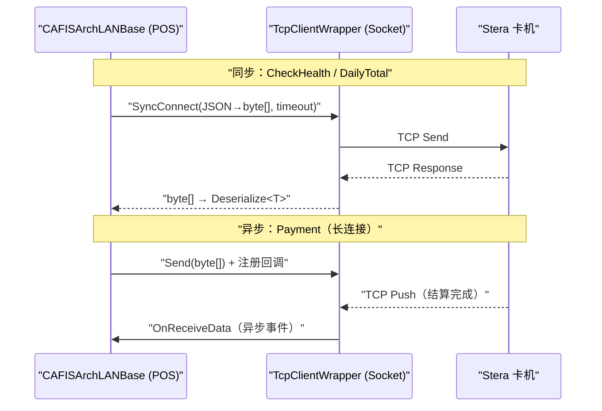

# 决済端末族（CAFIS Arch 卡机 + JET-S 信用卡端末）

## 1. 定位与成员（8 模块）

非现金支付（信用卡 / 借记卡 / 电子货币 / 银联 / 扫码）依赖专用卡机。本族对接两代产品线：

- **CAFIS Arch（Stera / Saturn1000L）** —— 经 **CAFIS**（Credit And Finance Information System）协议连结。分**串口(RS-232C)** 老机与 **LAN(TCP/JSON)** 新机两代。
- **JET-S CT5100 / CT6100** —— 串口连结的信用卡端末，CT6100 有セルフ（自助）模式版本。

| 模块 | 类型 | 主类 / 证据 | 链路 |
|---|---|---|---|
| Device.CAFISArchLAN | 实装 | `CAFISArchSaturn1000L : CAFISArchLANBase, ICAFISArchLANDevice`（`CAFISArchSaturn1000L.cs:10`） | TCP / JSON |
| Device.CAFISArch | 实装 | `CAFISArchBase : DeviceBase`（`CAFISArchBase.cs:10`）→ `CAFISArchRS232CBase : CAFISArchBase`（`CAFISArchRS232CBase.cs:16`） | 串口 RS-232C |
| Device.CAFISArchService | 实装 | `CAFISArchService : DeviceBase, IWindowHolder, ICAFISArchLAN`（`CAFISArchService.cs:14`） | 设备宿主包装 |
| Device.CT5100 | 实装 | `CT5100 : DeviceBase, IPaymentService`（`CT5100.cs:14`，「CT 5100 (JET S) クレジット端末」`:12`） | 串口 |
| Device.CT6100_ModeSelf | 实装 | `CT6100ModeSelf : DeviceBase, IPaymentServiceModeSelf`（`CT6100ModeSelf.cs:17`，セルフ前提 `:13-14`） | 串口 |
| Device.CAFISArchLANSimulator | Simulator | `CAFISArchLANSimulator : ICAFISArchLANDevice`（`CAFISArchLANSimulator.cs:11`）+ `Form` | — |
| Device.CAFISArchSimulator | Simulator | `CAFISArchSimulator`（`Device.CAFISArchSimulator/`）+ `Form` | — |
| Device.CT6100_ModeSelfSimulator | Simulator | `CT6100ModeSelfSimulator`（`Device.CT6100_ModeSelfSimulator/`）+ `Form` | — |

> 契约层 `ICAFISArchLAN.cs` 声明 `CheckHealth()` / `Payment(信用/借记/电子货币/银联 各 Request)` 等；CT5100/CT6100 走通用 `IPaymentService` / `IPaymentServiceModeSelf`（`Application/Source/Device/Device.DeviceDefine/PaymentService/`）。

## 2. CAFIS LAN：TCP + JSON 报文总线

前台不直连卡机，而是经 `TRAN4U.exe` 内的 `CAFISArchSaturn1000L` 与卡机建立 TCP 套接字。发送封装在 `TcpClientWrapper`（`TcpClientWrapper.cs:15`「CAFIS Arch に接続する…TcpClient…管理」；`Connect()` `:143`，内部 `TcpClient`/`NetworkStream`）。

`CAFISArchLANBase` 提供两种发包模式（`CAFISArchLANBase.cs:9`）：

| 模式 | 实现 | 用途 |
|---|---|---|
| 同步 `SendSync<T>` | `CAFISArchLANBase.cs:48` → `TcpClientWrapper.SyncConnect(sendBytes, timeout)`（`:65` / `TcpClientWrapper.cs:325`） | 心跳 `CheckHealth`、日计 `DailyTotal` 等短交互 |
| 异步 `SendASync` | `CAFISArchLANBase.cs:81` → 带回调的长连接（`:91` `new TcpClientWrapper(OnReceiveData, OnCommunicationError)`） | 支付 `Payment`（刷卡/输密/专网结算时长不可预测） |

`Saturn1000L` 的业务方法用法：`CheckHealth` 走同步（`CAFISArchSaturn1000L.cs:20` `SendSync<CAFISArchCheckHealthResult>`）；`Payment`/`GetLastTransaction`/`Cancel` 走异步（同文件 `:51`/`:69`/`:86` `SendASync`）。超时用设定值 `CAFISArchLANSettingValues.CAFISArchLANTimeoutDefault/Short`（同文件多处引用）。

## 3. 交易完整性容灾

- **直前交易回查 `GetLastTransaction`**：TCP 断链导致 POS 未收到扣款结果时，重新握手后查询卡机侧上一笔是否落盘，防「一卡双扣」/「已扣未记账」（`CAFISArchSaturn1000L.cs:69` `SendASync(GetLastTransactionRequest…)`）。
- **交易强制中止 `Cancel`**：顾客改用现金时发 `CAFISArchDeviceCancelRequest` 打断读卡（`CAFISArchSaturn1000L.cs:86`，用短超时 `TimeoutShort`）。

## 4. CAFIS 串口老机 / JET-S 端末

- `Device.CAFISArch` 是**串口(RS-232C)** 代际：`CAFISArchRS232CBase.cs:37` 持有 `SerialPort`，`:73` `new SerialPort(portName, baudrate, …)`，配 `CAFISArchSaturn1000Lane.cs` Lane 逻辑与 `CAFISArchReceiveBuffer` 收信缓冲。
- `Device.CT5100` / `Device.CT6100_ModeSelf` 走串口链路层状态机（`Logic/SerialPortCommunicateLogic.cs` + `Logic/State/*` STX/ETX/BCC/EOT 链路阶段），CT5100 用 `SerialPortCommunicateLogic`（`CT5100.cs:96`）。

## 5. 可信度与核查

- **verified**：模块与主类/接口、TCP 同步/异步发包实现行、`TcpClientWrapper` 机制、串口老机 `SerialPort`、CT5100/CT6100 类与串口逻辑，均带 `file:line`。
- **uncheckable**：`DeviceBase` 内部（`POS4U.Framework.dll`）；CAFIS/SMCC 专网协议与卡机固件；`CAFISArchLANTimeoutDefault` 的运行期具体秒数（取自设定，随部署变）。

> **ST-POS 迁移提示**（薄）：卡机/CAFIS 对接归 `stpos-device-kugelpos` 设备网关。
