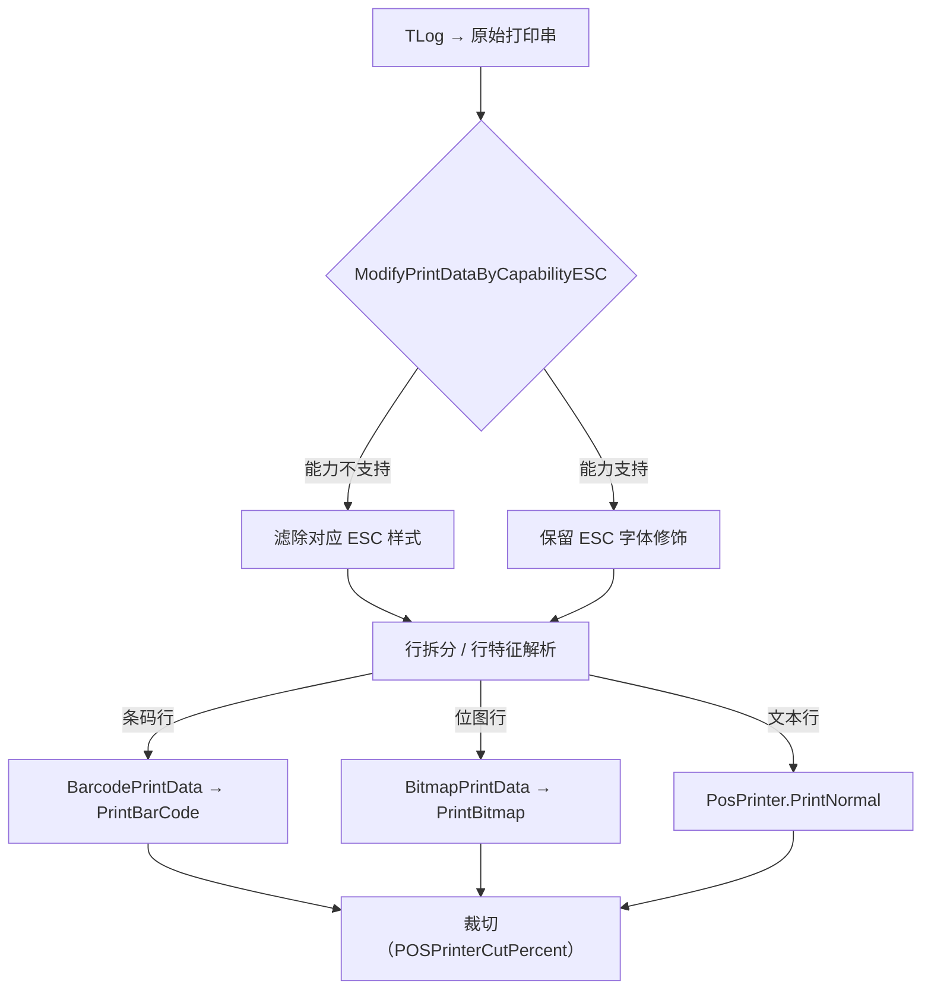

# 打印机族（POSPrinter · ESC/POS 小票）

## 1. 定位与成员（6 模块）

小票打印经标准 **OPOS `PosPrinter`**，发送文本流 + 内嵌 **ESC/POS 转义序列** 控制字体缩放/加粗/旋转/裁切。全部实现契约 `IPOSPrinter`（`Application/Source/Device/Device.DeviceDefine/POSPrinter/IPOSPrinter.cs`）。

| 模块 | 类型 | 主类 / 证据 | 链路 |
|---|---|---|---|
| Device.POSPrinterSS900 | 实装 | `POSPrinterTECSS900 : DeviceBase, IPOSPrinter`（`POSPrinterTECSS900.cs:24`），字段 `AxOPOSPrinter`（`:62`，`using AxOPOSPRINTERLib` `:8`） | OPOS OCX |
| Device.POSPrinterFP2000 | 实装 | `POSPrinterFP2000 : DeviceBase, IPOSPrinter`（`POSPrinterFP2000.cs:17`）+ `FrmOcx` | 富士通 FP2000（OCX） |
| Device.POSPrinterPosiflex | 实装 | `POSPrinterPosiflex : PosForNetDeviceBase<PosPrinter>, IPOSPrinter`（`POSPrinterPosiflex.cs:19`） | POS for .NET |
| Device.POSPrinter4DotNet | 实装 | `POSPrinter4DotNet : PosForNetDeviceBase<PosPrinter>, IPOSPrinter`（`POSPrinter4DotNet.cs:16`） | POS for .NET |
| Device.POSPrinterLibrary | 基盤/库 | `static class PrintDataLibrary`（`PrintDataLibrary.cs:12`）+ `BarcodePrintData` / `BitmapPrintData` / `RJPrintBuffer` | 共通编集 |
| Device.POSPrinterSimulator | Simulator | `POSPrinterSimulator` + `RecieptViewer.cs`（小票预览）+ `Code128TypeCBarcodePainter` | — |

> `Device.POSPrinterSS900` 目录内 csproj 名为 **`Device.POSPrinterTECSS900.csproj`**（目录↔csproj 不一致），且含 `POSPrinterTECSS900.cs` + `POSPrinterTECSS950.cs` 两机种。

## 2. 打印数据编集：ESC 能力剔除（家逻辑核心）

不同打印机字库/主板指令集不同。`PrintDataLibrary` 在发送前按硬件上报的 Capability 动态剔除不支持的转义串，避免吐出乱码原始字符。核心方法 `ModifyPrintDataByCapabilityESC(...)`（`Application/Source/Device/Device.POSPrinterLibrary/PrintDataLibrary.cs:56`）按 `capRecUnderline/Italic/Bold/DHigh/DWide/DWideDHigh` 逐项 `Replace(...Esc, string.Empty)`。

- **条码 / 位图**：`BarcodePrintData.cs` / `BitmapPrintData.cs` 解析行特征（`RJEscapeSequences.Barcode/Bitmap`），映射码制（EAN/JAN8·UPCE·EAN/JAN13·Code128）后调 OPOS `PrintBarCode` / `PrintBitmap`（素材 03_printer §3，行特征/映射表以 `PrintDataLibrary.cs` 为准）。
- **裁切**：切刀百分比取自设定 `SettingMasterKeys.POSPrinterCutPercent`（默认 90% 半切，防小票掉落——素材 03_printer §3.3；具体默认值随主档配置，标 unverified/配置依赖）。

## 3. 会员积分小票区块

交易小票底部动态渲染会员积分区块（会员卡号脱敏、今回取得/取引前/取引后残高），离线降级时屏蔽余额并加粗印「※オフラインのため…後日反映」免责文案（素材 03_printer §4；积分计算 → 详见 [会员/积分设备](./member_point_devices.md)）。

## 4. 可信度与核查

- **verified**：模块清单、各主类声明与集成方式（OCX `AxOPOSPrinter` / POS for .NET / static 库）、`ModifyPrintDataByCapabilityESC` 位置，均带 `file:line`。
- **uncheckable / 配置依赖**：`DeviceBase` 内部（`POS4U.Framework.dll`）；OPOS 运行期打印行为；裁切默认百分比、码制映射细节以 `PrintDataLibrary.cs` 与 `SettingMaster` 主档为最终真值。

> **ST-POS 迁移提示**（薄）：打印驱动归 `stpos-device-kugelpos` 设备网关；小票版式/消息在后端另有归口。
