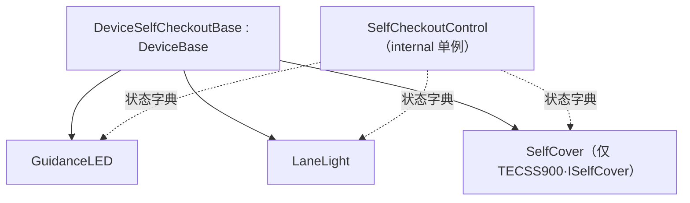

# 自助结算 / 客面副屏族（SelfCheckout + SecondDisplay）

## 1. 定位与成员（3 模块）

自助结算（Self-Checkout）一体机把引导灯、通道灯、防盗覆盖检知等聚合为一台整机制御；客面副屏用于向顾客展示交易内容。

| 模块 | 类型 | 主类 / 证据 |
|---|---|---|
| Device.SelfCheckoutTECSS900 | 实装 | `DeviceSelfCheckoutBase : DeviceBase`（`DeviceSelfCheckoutBase.cs:10`「セルフチェックアウトデバイス基底クラス」）；含 `GuidanceLED.cs` / `LaneLight.cs` / `SelfCheckoutControl.cs` / `SelfCover.cs` |
| Device.SelfCheckoutTECM8500 | 实装 | `DeviceSelfCheckoutBase : DeviceBase`（`DeviceSelfCheckoutBase.cs:10`）；含 `GuidanceLED.cs` / `LaneLight.cs` / `SelfCheckoutControl.cs`（无 `SelfCover`） |
| Device.SecondDisplayM8750 | 实装 | `SecondDisplayM8750 : DeviceBase`（`SecondDisplayM8750.cs:14`「客面制御クラス」）；变体 `SecondDisplayM9000CH : DeviceBase`（`SecondDisplayM9000CH.cs:18`） |

## 2. 一体机结构：单例聚合多子设备

自助机把多个物理子部件收敛到一个内部单例 `SelfCheckoutControl`（`SelfCheckoutControl.cs:13` `internal class`，`:18` 静态单例）。它维护子设备就绪状态字典，键为 `DeviceIds.GuidanceLED.Id` / `DeviceIds.LaneLight.Id` 等（`SelfCheckoutControl.cs:30-31`）。各子部件均从 `DeviceSelfCheckoutBase` 派生：

- **`SelfCover`**（仅 TECSS900）：`SelfCover : DeviceSelfCheckoutBase, ISelfCover`（`SelfCover.cs:11`），检知自助机现金部覆盖/开闭，防盗与安全联锁；契约 `ISelfCover` 在 `Application/Source/Device/Device.DeviceDefine/CashChanger/ISelfCover.cs`。
- **`GuidanceLED` / `LaneLight`**：自助机内建的引导灯与通道灯（与独立的 `Device.GuidanceLED` / `Device.LaneLight` 同名不同实装，此处是自助机专用版 → 独立版详见 [others.md · 客向表示/报知 §3](./others.md)）。

## 3. 客面副屏

`SecondDisplayM8750`（`:14`「客面制御クラス」）驱动面向顾客的第二显示屏，展示商品/金额；`SecondDisplayM9000CH` 为中国（CH）机型变体。副屏也用于双人制收银（`POS4UTwoOperatorsCH` 进程 → 详见 [code-map](../00_portal/code-map.md)）。

## 4. 可信度与核查

- **verified**：三模块、基底类与子部件文件、`SelfCheckoutControl` 单例与设备 id 字典、`SelfCover`/`ISelfCover`、客面副屏类，均带 `file:line`。
- **uncheckable**：`DeviceBase` 内部（`POS4U.Framework.dll`）；自助机整机固件、物理覆盖传感与副屏硬件运行期行为。

> **ST-POS 迁移提示**（薄）：自助机整机制御归 `stpos-device-kugelpos` 设备网关；自助结算 UI 归 `stpos-frontend-app`。
