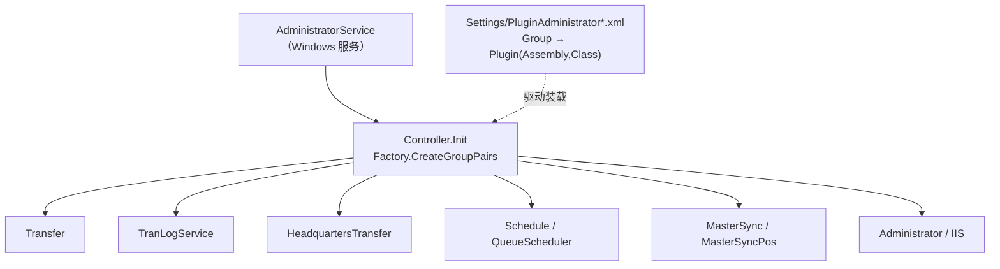

# 店舗端后台批处理总览（POS4UBackground · 16 项目）

> `POS4UBackground`（`Application/Source/POS4UBackground/`）是店舗端的**后台/批处理**子系统：以 Windows 服务为核心宿主，通过 **XML 驱动的插件机制**装载各业务模块，完成交易日志集计（BI）、店↔云/店↔本部数据转送、主数据同步、版本升级、定时调度等。它与前台 [边缘 API](../edge-api/index.md) 经 `BackgroundService.svc` 对接。

---

## 1. 16 个项目

| 层 | 项目 | 角色 |
|---|---|---|
| 宿主 | `POS4U.WindowsService.Administrator` | **主宿主**：Windows 服务，装载并调度各插件模块 |
| 宿主 | `POS4U.Console.MasterSync` | 主数据同步控制台（被调度触发） |
| 宿主 | `POS4U.Console.VersionUp` | 版本升级控制台 |
| Business | `Background.Business.Administrator` | 模块监视 / 日志复制 / VM 管理最终日时更新 |
| Business | `Background.Business.Transfer` | 数据转送（店↔云 / 店↔上位）→ [transfer.md](./transfer.md) |
| Business | `Background.Business.TranLogService` | 交易日志→BI 集计 → [tranlog_service.md](./tranlog_service.md) |
| Business | `Background.Business.HeadquartersTransfer` | 店→本部数据文件生成/压缩 → [headquarters_transfer.md](./headquarters_transfer.md) |
| Business | `Background.Business.QueueScheduler` | 定时向队列投递触发消息 → [schedule_queue.md](./schedule_queue.md) |
| Business | `Background.Business.Schedule` | 消费 Schedule 队列执行调度 → [schedule_queue.md](./schedule_queue.md) |
| Business | `Background.Business.MasterSync` | 主数据同步（云端侧 bulk/diff/reserve） |
| Business | `Background.Business.MasterSyncPos` | 主数据同步（POS 侧下载/导入） |
| Business | `Background.Business.IIS` | IIS 相关（单类 `IIS.cs`） |
| Business | `Background.Business.BackgroundCommon` | 公共：队列/调度框架、通知邮件、常量 |
| Common | `Background.Common.Const` | 设置/常量（`BackgroundSettingValues` 等） |
| Data | `Background.Data.BackgroundAccessor` | DB 访问器（`SqlCommand` → `usp_*`） |
| Data | `Background.Data.BackgroundContainer` | 类型化 `DataSet` 容器 |

> 实测 `find POS4UBackground -name *.csproj` = **16**。

---

## 2. 三个宿主进程

| 进程 | 入口 | 职责 |
|---|---|---|
| `POS4U.WindowsService.Administrator` | `Program.cs:18` `static void Main()` | 正常运行走 `ServiceBase.Run(new AdministratorService())`（:53-58）；调试模式直接走 `Controller`（:32-49） |
| `POS4U.Console.MasterSync` | `Program.cs:24` `Main(string[] args)` | 单实例检查（`IsProcessAlreadyExist`:37）→ `new ControllerBulk(...).Execute(false)`（:45/:49）；退出码含重启标志 |
| `POS4U.Console.VersionUp` | `Program.cs:27` `Main(string[] args)` | 校验 4 参数（vmName/current/new/zip，:71-125）+ DB 版本校验 → `new UpdateManager().Execute(...)`（:53-54） |

**主宿主启动链**：`AdministratorService : ServiceBase`（`AdministratorService.cs:17`）`OnStart` → `_controller.Start()`（:47-51）；服务级 `Controller : IDisposable`（`Controller.cs:23`）`Init`（:79）→ `Factory.CreateGroupPairs(AdministratorServicePluginGroupIds.AdministratorModuleGroup)`（:91）逐模块 `Setup`，`Timer`（:327）轮询按 DB 定义（`AdminModuleManagementAccessor.GetAdminModuleMgt` :437）Start/Pause 各模块。

---

## 3. XML 驱动的插件机制（关键）

**「哪些模块/集计在跑」不由代码硬编码，而由宿主 `Settings/` 下的插件 XML 决定**：框架 `Factory.CreateGroupPairs(groupId)` / `Factory.CreatePlugin(id)` 读取 XML 中的 `Group` → `Plugin`（Assembly + Class）声明并反射装载。

存在 **3 套部署变体**（`Application/Source/POS4UBackground/POS4U.WindowsService.Administrator/Settings/`）：

| XML | 部署 | `AdministratorModuleGroup` 成员（实测差异） |
|---|---|---|
| `PluginAdministrator.xml` | 云端 / Azure VM 店铺控制器 | Administrator、IIS、**TranLogService**、**HeadquartersTransfer**、MasterSync、Schedule、Transfer |
| `PluginAdministrator_OnPremises.xml` | 店内 on-premises 控制器 | Administrator、IIS、Schedule、Transfer、**QueueScheduler**、**MasterSyncPos**、MasterSyncPosDiff |
| `PluginBOAdministrator.xml` | BO 后台 | （BO 专用子集） |

另有 `QueueSchedule.xml`（定时投递配置）与一族 `MasterImportOrder*.xml`（各端末类型的主数据导入顺序，如 `LocalPOS`/`LaneSelf`/`PaymentStation`/`OTCDrug` 等）。

> **推论**：云端 vs on-prem 的行为差异（如队列/存储后端、TranLogService/HeadquartersTransfer 是否运行）主要由 XML 变体切换，代码层面同一套程序集。逐组细节见各专篇。

---

## 4. 三层分工

- **Business（10 项目）**：各业务模块，普遍含 `Const/*PluginGroupIds.cs`（插件组 Id）+ `Logic/`（插件实现）。
- **Common（`Background.Common.Const`）**：`BackgroundSettingValues.cs:8`（`StorageConnectionString`:13、各模块 `IntervalMillisecond` 等）；Azure 存储命名 `StorageTableName.cs` / `StorageBlobContainerName.cs`。
- **Data（2 项目）**：`BackgroundAccessor`（DB 访问器，如 `TransactionManagementAccessor.cs:193` 调 `usp_UpdateTransactionManagementTransferState`）+ `BackgroundContainer`（`*DataSet.Designer.cs`）。

**DB = SQL Server**：后台经 `System.Data.SqlClient` 访问（如 `TranLogService/Controller.cs:4` `using System.Data.SqlClient`）；`POS4UBackground` 内约 **90** 个 `.cs` 引用 `SqlClient`/`SqlConnection`。

---

## 5. 可信度与核查

- `verification: verified`：§1（16 项目）、§2（三宿主入口）、§4（三层/SqlClient）实测 最新发布 核对；§3 的 XML 变体成员取自各 `PluginAdministrator*.xml` 侦察，属实测。
- **核查不能（uncheckable）**：框架基类 `ServiceTimerBase` / `QueueModuleBase` / `AdministratorModuleBase` / `Factory` / `PluginGroupId` 与队列名 `QueueNames.*` **不在本 worktree**（属外部框架程序集 `ForYouApplications.POS4U.Background.Framework(.Library)`），仅被引用；其内部实现不作断言。

---

## 6. ST-POS 迁移提示

> 本层为 POS4U 店舗端后台现状。ST-POS 以独立微服务（如 tranlog / report 等）承接同类职责，映射见团队内部文档，不在此复制。
