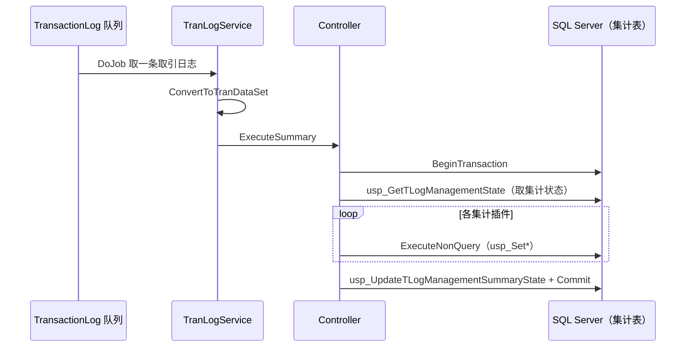

# 交易日志集计模块（Background.Business.TranLogService）

> `Background.Business.TranLogService` 消费交易日志（TransactionLog）队列，把每笔取引日志**转换并汇总成各类日别集计与 BI 数据**（写入对应集计表）。它是店端「交易 → 报表/BI」的核心加工环节。

---

## 1. 入口与处理流程

- `TranLogService.cs:17` `class TranLogService : QueueModuleBase`：队列名 `QueueNames.TransactionLog`（`GetQueueName()` :73）；`DoJob`（:79）取一条取引日志 → `GetTransactionLogRow`（:112，内部 `TransactionManagementAccessor.GetTransactionLogRow`:121，带重试）→ `TranLogConverterUtility.ConvertToTranDataSet`（:91）→ `ExecuteSummary`（:188）。
- `Controller.cs:19`：
  - `SetUpLogic`（:203）`Factory.CreateGroupPairs(TranLogServicePluginGroupIds.TranLogService)` 装载集计插件。
  - `ExecuteSummary`（:60）先逐插件 `CheckActionNeed` / `CalcParam`（:93-95），再在**单个 SQL 事务内**（`conn.BeginTransaction()` :106）：`UpdateSummaryState`（:262，`usp_GetTLogManagementState` :269 + `usp_UpdateTLogManagementSummaryState` :300）→ 逐插件 `ExecuteNonQuery`（:126）→ `Commit`（:131）；失败重试并 `UpdateSummaryStateError`（:181）。

即：一笔取引日志的所有集计在**同一事务**里完成，保证「集计状态」与各集计表一致。

---

## 2. 集计插件机制

每个集计是一个 `: TranLogServiceLogicBase`（BI 类为 `: TranLogServiceBILogicBase`）的插件，声明两个 `override`：`TransferType`（类型标识）与 `SpName`（执行的存储过程名）。Controller 遍历插件逐一 `ExecuteNonQuery` 调其 `SpName`。

---

## 3. 集计 Logic 清单（21 个 → 存储过程）

`Logic/` 下 21 个集计类（行号=类声明行；SP=`SpName` 常量值）：

| 分类 | Logic 类（`Logic/*.cs:类行`） | 存储过程 `SpName` |
|---|---|---|
| 売上 | `TranLogServiceOperatorSalesTotal.cs:14`（担当者别売上） | `usp_SetDailyOperatorSalesTotal` |
| 売上 | `TranLogServicePosSalesTotal.cs:17`（POS 売上日别） | `usp_SetDailyPosSalesTotal` |
| 时间 | `TranLogServiceOperatorTimeTotal.cs:17`（担当者别时间） | `usp_SetDailyOperatorTimeTotal` |
| 时间 | `TranLogServiceTimeZoneTotal.cs:14`（时间帯日别） | `usp_SetDailyTimeZoneTotal` |
| 现金/信用 | `TranLogServiceCashTotal.cs:17`（现金论理有高） | `usp_SetCashTotal` |
| 现金/信用 | `TranLogServiceCreditPaymentTotal.cs:17`（信用卡支付） | `usp_SetDailyCreditPaymentTotal` |
| 区分/理由/印紙 | `TranLogServiceDealCodeTotal.cs:18`（取引码日别） | `usp_SetDailyDealCodeTotal` |
| 区分/理由/印紙 | `TranLogServiceReasonTypeTotal.cs:15`（理由区分日别） | `usp_SetDailyReasonTypeTotal` |
| 区分/理由/印紙 | `TranLogServiceStampTypeTotal.cs:17`（印紙日别） | `usp_SetDailyStampTypeTotal` |
| RM/积分/券 | `TranLogServiceRMLoginPointTotal.cs:17`（RM 登录积分） | `usp_SetRMLoginPoint` |
| RM/积分/券 | `TranLogServiceRMCouponPointTotal.cs:17`（RM 优惠券积分） | `usp_SetRMCouponPoint` |
| RM/积分/券 | `TranLogServiceRMCouponStampPointTotal.cs:17`（集章活动） | `usp_SetRMCouponStampPoint` |
| RM/积分/券 | `TranLogServicePointOfflineTotal.cs:17`（离线积分） | `usp_SetPointOffline` |
| RM/积分/券 | `TranLogServiceTicketPointPaymentDetail.cs:17`（取引每券积分支付明细） | `usp_SetTransactionTicketPointPaymentDetail` |
| RM/积分/券 | `TranLogServiceTicketPointPaymentTotal.cs:17`（券积分支付日别） | `usp_SetDailyTicketPointPaymentTotal` |
| 利用履历 | `TranLogServiceMobileUsageData.cs:13`（手机利用履历） | `usp_SetMobileUsageData` |
| 利用履历 | `TranLogServiceFaceMeUsageData.cs:15`（人脸识别利用履历） | `usp_SetFaceMeUsageData` |
| 状态 | `TranLogServiceSetBusinessState.cs:17`（营业状态） | `usp_SetBusinessState` |
| 状态 | `TranLogServiceSetCashChangerStatusAtClose.cs:20`（精算时找零机状态） | `usp_UpdateCashChangerStatusAtClose` |
| **BI** | `TranLogServiceSetBISalesHeader.cs:14`（BI 销售头，`: TranLogServiceBILogicBase`） | `usp_SetBISalesHeaders` |
| **BI** | `TranLogServiceSetBILineItem.cs:14`（BI 明细，`: TranLogServiceBILogicBase`） | `usp_SetBILineItems` |

辅助：`Logic/TranLogServiceBILogicBase.cs:11`（BI 基类）；值对象 `CashTotalValue.cs` / `DealCodeTotalValue.cs` / `SetBusinessStateValue.cs` / `SetCashChangerStatusAtCloseValue.cs`。

---

## 4. 类型枚举

`Const/TranLogServiceTypes.cs`：实测 **22** 个 `TranLogServiceType`（21 个上述集计 + `ConvertTransactionLog` 转换类型）。`Const/TranLogServicePluginGroupIds.cs:14` `TranLogService`。

---

## 5. 部署差异（重要）

- **`CashTotal`**：未在任何 `POS4UBackground` 插件 XML 注册；其集计逻辑虽在本代码库，但由 **TRAN4U 交易服务器进程**（`TRAN4U/Settings/PluginTRAN4U.xml`）装载调度。
- **`SetBISalesHeader`**：在云端 `PluginAdministrator.xml:163-166` 处**被注释**，即该变体只跑 `SetBILineItem`。

> 即「哪些集计实际运行」取决于宿主与 XML 变体（见 [index.md §3](./index.md)），代码存在 ≠ 该宿主运行。

---

## 6. 数据依赖

- 读：TransactionLog / TransactionManagement（经 `TransactionManagementAccessor`）。
- 写：各日别集计表 + BI 表（经上表 21 个 `usp_Set*` / `usp_Update*`）。
- 集计状态管理：`usp_GetTLogManagementState` / `usp_UpdateTLogManagementSummaryState`（`Controller.cs:269/:300`）。

---

## 7. 可信度与核查

`verification: verified`：入口/事务流程、集计插件机制、21 个 Logic 的类行与 `SpName`、22 个类型枚举均实测 最新发布（抽样逐行核对，机制为 `override TransferType`+`override SpName`）。集计的中文描述为据类名/SP 名意译；§5 部署差异中 `TRAN4U/Settings/PluginTRAN4U.xml` 属其他宿主目录，本模块只登记该事实。`QueueModuleBase` / `Factory` / `QueueNames` 属外部框架（uncheckable）。
