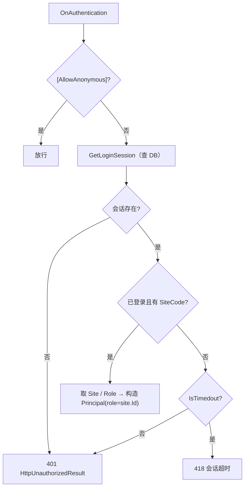

# 云端 BackOffice 认证与 RBAC

> BackOffice 采用**全局认证过滤器 + 双层授权（站点级 + ability 级）**。本文是认证/权限的「家」文档，`index.md` / `bo_apis.md` 只链接不复制。

---

## 1. BOAuthenticationAttribute（全局认证）

`Application/POS4UCloud/Source/POS4UBO/POS4UBackoffice/BOAuthenticationAttribute.cs`：

- `:15` `internal class BOAuthenticationAttribute : FilterAttribute, IAuthenticationFilter` —— 是 **认证过滤器**（`IAuthenticationFilter`），非 ActionFilter/AuthorizationFilter；全局注册于 `App_Start/FilterConfig.cs:23`（全站生效）。
- 主流程 `OnAuthentication(AuthenticationContext)`（:21）：

| 步 | 逻辑 | 行号 |
|---|---|---|
| 1 | 标注 `[AllowAnonymous]` 的 action/controller 跳过认证 | :24-30 |
| 2 | 从 Cookie 取 `CompanyCode`/`SessionId`，调 `AuthenticationLogic.GetLoginSession(...)`（**每次必查 DB** 以支持横向扩展，注释 :32-33） | :34-38 |
| 3 | 会话不存在 → `Logger.Warn` + `HttpUnauthorizedResult`（**401**） | :39-47 |
| 4 | **会话存在但未登录 / 无 SiteCode → 依 `IsTimedout` 二分**：超时 → `HttpStatusCodeResult(418)`，否则 → 401 | :49-59 |
| 5 | 依 `SiteCode` 取 `BOSites`；未知站点 → 401 | :61-68 |
| 6 | 依 `RoleCode` 调 `AbilityLogic.GetRoleByRoleCode`；取不到降级 `GeneralUser` | :70-82 |
| 7 | 构造 `GenericIdentity` + `UserExtensionData`（UserCode/SiteCode/RoleCode/AreaCode 等），序列化进 `identity.Label` | :84-98 |
| 8 | `filterContext.Principal = new GenericPrincipal(identity, new string[]{ site.Id })` —— **把站点 Id 作为 Principal 的 role** | :102 |

`OnAuthenticationChallenge` 为空实现（:109-111）。

### 1.1 HTTP 418（会话超时的特殊约定）

BackOffice 用 **HTTP 418（I'm a teapot）** 表达「会话超时」，以区别于普通未认证的 401。核心代码（`BOAuthenticationAttribute.cs:55-57`）：

```csharp
filterContext.Result = loginSession.IsTimedout
    ? new HttpStatusCodeResult(418)   // 会话超时
    : new HttpUnauthorizedResult();   // 其他未登录 → 401
```

- 触发条件：**会话记录存在**（步 3 未拦下）**且** `!IsLoggedIn || IsSiteCodeNull()`（:49-50）**且** `IsTimedout == true`。
- HACK 说明（原注释 :52-54）：因「处理执行与重定向的发生顺序难以控制」，借用 418 来区分超时，作者标注「若有更好方法愿改」。
- 后续落地：`Web.config` 将 418 映射到 `/Account/ErrorSessionTimeout`（`Web.config:35`）；该页 `AccountController.cs:141` 再次 `Response.StatusCode = 418`；前端脚本多处 `case 418:` 捕获并跳登录。



---

## 2. 登录 / 登出（AccountController + AuthenticationLogic）

`AccountController` 故意不用 `[RoutePrefix]`/`[Route]`，配合默认路由（注释 `AccountController.cs:14-17`）。全部 action 标 `[AllowAnonymous]`。

| action | 方法 | 行号 | 说明 |
|---|---|---|---|
| `Login()` | GET | :26 | 显示登录画面 |
| `Login(LoginModel)` | POST | :39 | `[ValidateAntiForgeryToken]` + `[Bind(Include="CompanyCode,UserCode,Password")]`；调 `AuthenticationLogic.Login`（:47），成功依 `SiteCode` 跳转（BackOffice→`BackOfficeMenu/Index` :71-73，CallCenter→`CallCenterMenu/Index` :77-79） |
| `Logout()` | GET | :94 | `AuthenticationLogic.Logout`（:110）后跳 `Login` |
| `Error()` | GET | :123 | 错误页 |
| `ErrorSessionTimeout()` | GET | :141 | 会话超时页；`Response.StatusCode = 418`（:143） |

**密码与会话**（`Logics/AuthenticationLogic.cs`）：

- `Login(...)`（:27）→ `AuthAccessor.Login(companyCode, userCode, GetPasswordHash(...))`（:29）。
- `GetPasswordHash(...)`（:94）：拼 `companyCode + SecretSalt1 + userCode + SecretSalt2 + password`（:97），SHA256 **迭代 `AuthConst.StrechCount` 次**（:99-107，小写 HEX 去连字符）。常量 `AuthConst.cs:29` `StrechCount = 5`，salt `:32`/`:35`。
- Cookie：`InitCookies`（:118）写 `CompanyCode`/`SessionId`/`LangCode`；`CreateCookie`（:170）设 `HttpOnly = true`（`Secure` 在 Release 下为 false，附 TODO）。
- `GetLoginSession`（:74）→ `AuthAccessor.GetLoginSession`（传入 `SessionTimeoutMinutes` 决定 `IsTimedout`）。
- 后端 SP：`usp_BOLogin` / `usp_BOLogout` / `usp_BOGetLoginSession`（`BOData.Container/AuthDataSet.Designer.cs:2141/1945/2357`）。

---

## 3. RBAC：站点级 + ability 级

### 3.1 站点级（粗粒度，决定可进入哪个后台）

- 站点常量 `BOCommon.Const/BOSites.cs:9`：`CallCenter`（"00"，:30）、`BackOffice`（"01"，:33）、`Customer`（"02"，:36）。
- 认证时 Principal 的 role 被设为 `site.Id`（`BOAuthenticationAttribute.cs:102`）。
- 控制器类级 `[Authorize(Roles = ...)]` 校验站点：
  - `BackOfficeMenuController.cs:26` `[Authorize(Roles = nameof(BOSites.BackOffice))]`
  - `CallCenterMenuController.cs:26` `[Authorize(Roles = nameof(BOSites.CallCenter))]`

### 3.2 ability 级（细粒度，决定功能显隐）

- 角色常量 `BOCommon.Const/BORoles.cs:9`：`Administrator`（"00"，:30）、`GeneralUser`（"01"，:33）。
- `ControllerBase.cs:24`（`abstract : Controller`）在 `OnActionExecuting`（:54）：
  - 判定登录站点（:62-69），据此设 `NavbarTheme` / 侧边菜单（`_BackOfficeSideMenu` / `_CallCenterSideMenu`，:77-86）；
  - `AbilityLogic.GetAbilityListByRoleCode(companyCode, RoleCode)` 结果存 `ViewData[AbilityList]`（:96-99），供视图按权限显隐控件；
  - 收集操作日志（:101-179）。
  - 另 `BeginExecute`（:33）按 `LangCode` Cookie 设线程 Culture（多语言）。
- `AbilityLogic`（`Logics/AbilityLogic.cs`）：`GetRoleByRoleCode`（:21，→ `usp_BOGetRoleMaster`）、`GetAbilityListByRoleCode`（:43，→ `usp_BOGetAbilityMaster`）。

---

## 4. BackOffice vs CallCenter

两个业务 Controller **action 完全同构**（各 93 个 public action，签名逐一一致；路由常量各 73 个逐名一致）。**唯一区别**是：

1. `RoutePrefix`（`BackOfficeMenu` vs `CallCenterMenu`）；
2. `[Authorize(Roles = ...)]` 的站点（`BOSites.BackOffice` vs `BOSites.CallCenter`）；
3. 侧边菜单主题（`_BackOfficeSideMenu` vs `_CallCenterSideMenu`）。

即：同一套后台功能，按登录站点做入口隔离与菜单主题切换。action 详见 [bo_apis.md](./bo_apis.md)。

---

## 5. 相关视图

- `Views/Account/Login.cshtml`（登录页）
- `Views/Shared/ErrorSessionTimeout.cshtml`（418 会话超时页）、`Views/Shared/Error.cshtml`
- `Views/Shared/_Layout.cshtml`、`_BackOfficeSideMenu.cshtml`、`_CallCenterSideMenu.cshtml`（按站点/权限渲染）

---

## 6. 可信度与核查

`verification: verified`：§1–§4 断言均实测 `pos-cloud`（BackOffice），含 HTTP 418 精确行号（`BOAuthenticationAttribute.cs:55-57`）逐行核对。密码 salt 的具体值虽在 `AuthConst.cs` 可见，本文不转录。`AuthAccessor` 背后的 `usp_BO*` SP 内部实现属数据库层，不在此断言。
