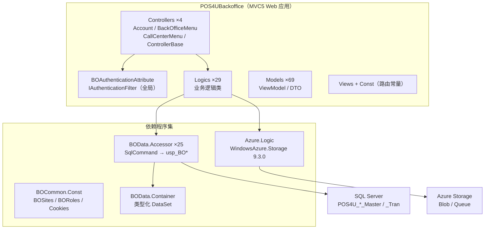

# 云端 BackOffice 总览（POS4UBO / ASP.NET MVC5）

> POS4UBO（BackOffice）是运行在**云端**的运营管理 Web 应用，供本部 / 呼叫中心人员做主数据维护、配信/受信状况监控、端末与店铺设定、日志下载、收银精算等。它与店舗端 [边缘 API](../edge-api/index.md) 分属不同宿主，共享同构的 SQL Server 数据库与 Azure Storage。

---

## 1. 层定位

- **一句话职责**：面向运营人员的 Web 后台（服务端渲染 MVC），通过存储过程 `usp_BO*` 读写业务库，并经 Azure Storage 交换日志/配信文件。
- **技术栈**：**ASP.NET MVC5**（`Microsoft.AspNet.Mvc 5.2.7`，`net461`，`Application/POS4UCloud/Source/POS4UBO/POS4UBackoffice/packages.config:8`）。
- **系统角色**：云端运营入口。数据面与店舗端后台/边缘服务共享 `POS4U_*_Master` / `POS4U_*_Tran` 库及 Azure Blob/Queue。

---

## 2. 启动与路由

`MvcApplication : HttpApplication`（`Global.asax.cs:16`），`Application_Start`（:25）依次注册：`AreaRegistration` → `FilterConfig.RegisterGlobalFilters` → `RouteConfig.RegisterRoutes` → `BundleConfig.RegisterBundles`（:31-34）。

- **全局过滤器**（`App_Start/FilterConfig.cs`）：`GlobalHandleErrorAttribute`（:19，全局异常）+ `BOAuthenticationAttribute`（:23，全站认证）。
- **路由**（`App_Start/RouteConfig.cs`）：`MapMvcAttributeRoutes()`（:20，属性路由）+ 兜底 `MapRoute` 默认 `Account/Login`（:24-27）。

---

## 3. 项目结构

| 目录 / 项目 | 角色 | 证据 |
|---|---|---|
| `Controllers/`（4） | `AccountController`(:18)、`BackOfficeMenuController`(:28)、`CallCenterMenuController`(:28)、`ControllerBase`(:24, `abstract : Controller`) | `Application/POS4UCloud/.../POS4UBackoffice/Controllers/` |
| `Const/` | 路由前缀/action 路由常量、`AuthConst`、`ViewDataDefinitions` | `Application/POS4UCloud/.../POS4UBackoffice/Const/` |
| `Logics/`（29） | 业务逻辑静态类（`AuthenticationLogic`/`AbilityLogic`/`DashboardLogic`/各 `*MaintenanceLogic`/`*DownloadLogic` 等） | `Application/POS4UCloud/.../POS4UBackoffice/Logics/` |
| `Models/`（69） | 页面模型/DTO（`LoginModel`、`*PageModel`、`BORoleModel` 等） | `Application/POS4UCloud/.../POS4UBackoffice/Models/` |
| `Views/` | Razor 视图（`Account/Login`、`Shared/_Layout`、`Shared/ErrorSessionTimeout` 等） | `Application/POS4UCloud/.../POS4UBackoffice/Views/` |
| `Azure/Azure.Logic` | Azure Storage 访问（Blob/Queue/Table） | `Application/POS4UCloud/Source/POS4UBO/Azure/Azure.Logic/` |
| `Common/BOCommon.Const` | 站点/角色/Cookie/数据访问类型常量 | `Application/POS4UCloud/Source/POS4UBO/Common/BOCommon.Const/` |
| `Data/BOData.Accessor`（25） | DB 访问器，`SqlCommand` 调 `usp_BO*` | `Application/POS4UCloud/Source/POS4UBO/Data/BOData.Accessor/` |
| `Data/BOData.Container` | 类型化 `DataSet`（`*DataSet.Designer.cs`） | `Application/POS4UCloud/Source/POS4UBO/Data/BOData.Container/` |

---

## 4. 数据依赖（本层的「家」）

### 4.1 存储过程 `usp_BO*`

- BO 业务后端逻辑集中在存储过程，命名前缀 **`usp_BO`**（例：`usp_BOLogin`、`usp_BOGetReceiveMasterHistory`、`usp_BOUpdateFunctionMenuMaster`）。
- SP 定义：`Application/Database/04_StoredProcedures/`（实测 **85** 个 `dbo.usp_BO*.StoredProcedure.sql`）。
- Accessor 经 `SqlCommand(..., CommandType.StoredProcedure)` 调用，如 `BOData.Accessor/FunctionMenuMasterAccessor.cs:91`（`dbo.usp_BOUpdateFunctionMenuMaster`）。

> ⚠️ **命名订正**：部分既有资料把该前缀记作 `usp_BO_`（带下划线）。经实测，全仓 `usp_BO_`（带下划线）匹配 **0 处**，正确前缀为 **`usp_BO`（无下划线）**。

### 4.2 数据库归属

- 连接类型 `BOCommon.Const/DataAccessTypes.cs`：`Master`（:14，连接串 `POS4UConnectionString`）、`Tran`（:19，连接串 `POS4UBackgroundConnectionString`）及各 `_ReadWrite`。
- 连接串取值 `POS4UBackoffice/Settings/SettingBOEnvironment.xml`：`POS4UConnectionString → Initial Catalog=POS4U_Trial_Master`（:4）、`POS4UBackgroundConnectionString → Initial Catalog=POS4U_Trial_Tran`（:5）。
- 25 个 Accessor 中，`Master*` 与 `Tran*` 均有使用 → `usp_BO*` **既跑 Master 库也跑 Tran 库**，由 Accessor 的 `DataAccessType` 决定。

> **核查不能（uncheckable）**：既有资料称「这些 SP 位于**店端** tran DB」。本代码库只能确认存在名为 `POS4U_Trial_Tran`（トランザクション格納DB）的库、样例连接串指向 `.\SQLEXPRESS`；**其物理部署位置（店端 vs 云端）无法从代码断定**，不作事实性断言。

### 4.3 Azure Storage

`Azure/Azure.Logic`（`WindowsAzure.Storage 9.3.0`，`Azure.Logic/packages.config:6`）封装 Blob/Queue/Table；账号分类 `Default` / `TransactionLog`（`Accessor/StorageLibrary.cs:62/:69`）。BO 的日志下载、模块配信等功能直接经其读写 Blob（详见 [bo_apis.md](./bo_apis.md)）。

---

## 5. 本层文档导航

| 文档 | 内容 |
|---|---|
| [auth_rbac.md](./auth_rbac.md) | `BOAuthenticationAttribute` 认证流程、HTTP 418 会话超时、登录/密码哈希、站点级 + ability 级 RBAC |
| [bo_apis.md](./bo_apis.md) | 4 个 Controller 的 action、路由常量、action→Logics→Accessor→`usp_BO*` 连线、Models |

---

## 6. 可信度与核查

- `verification: verified`：§1–§5 断言实测 `pos-cloud`（BackOffice）；MVC 版本、启动、结构、SP 定义数、连接串均逐条核对。
- **订正项**：SP 前缀 `usp_BO`（无下划线，见 §4.1）。
- **核查不能项**：`usp_BO*` SP 的物理部署位置（§4.2）；`POS4U.Framework.Library`（`Logger` 等）内部实现。

---

## 7. ST-POS 迁移提示

> 本层为 POS4U 云端 BackOffice 现状。ST-POS 的运营后台以不同技术栈重构，映射见团队内部文档，不在此复制。
