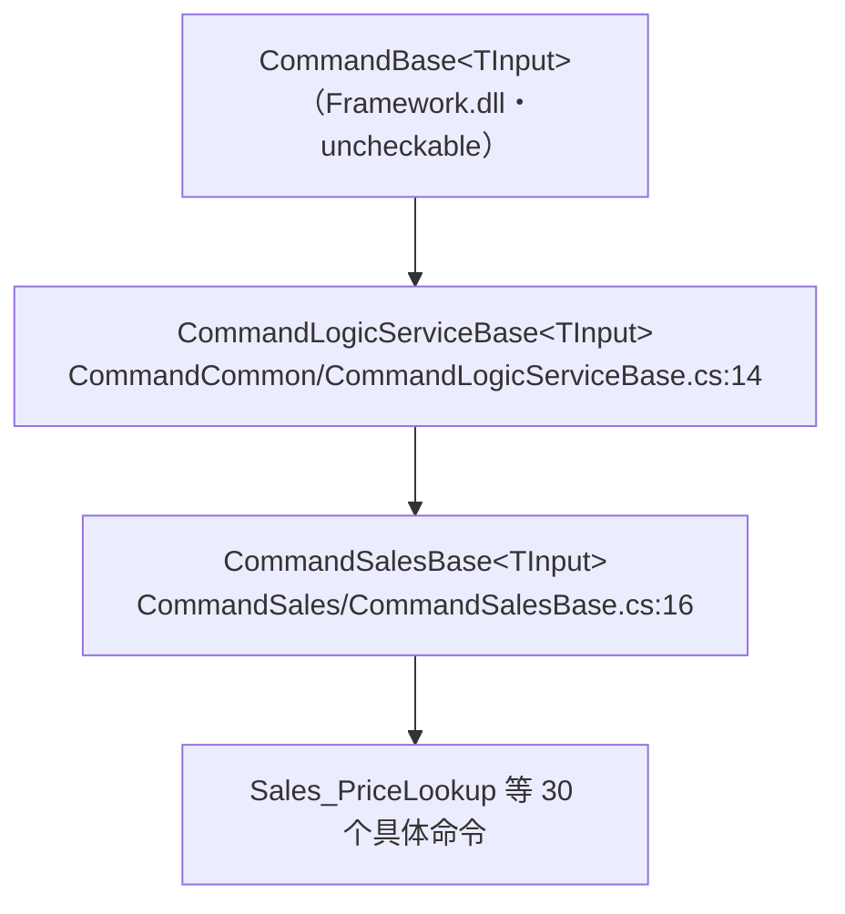

# 命令层与逻辑层（LogicService 6 项目）

> `LogicService`（`Application/Source/LogicService/`）是被 `POS4ULogicService` 各 Controller 调用的业务逻辑库，含 **6 个项目**。本文说明其分工、命令模式（Command Pattern）与出站访问器。

---

## 1. 六项目分工

| 项目 | 角色 | 关键内容 |
|---|---|---|
| **LogicService.ApiLogic** | 各 Controller 的业务逻辑落点 | 按 Controller 分子命名空间的 `*Logic` 类（见 §5） |
| **LogicService.CommandSales** | 售卖取引命令集 | `CommandSalesBase` + **30** 个 `Sales_*` 命令 + `InitPOSDataSales`（见 §3） |
| **LogicService.CommandCommon** | 通用命令与命令基类 | `CommandLogicServiceBase` / `CommandPreExecute` + 3 个 `Common_*` 命令 |
| **LogicService.ApiConverter** | 消息转换 | `MessageConverter`（见 §6） |
| **LogicService.ServiceAccessor** | 出站 HTTP 客户端库 | `ServiceAccessorLibrary` + 11 个 `*ServiceAccessor`（见 §7） |
| **LogicService.Common** | 设定值常量 | `Const/LogicServiceSettingValues.cs` |

---

## 2. 命令模式（Command Pattern）

前台事件经 `POSLogicWebServiceController.AcceptEvent` → 命令引擎 `LogicServiceController.Instance.AcceptEvent(...)`（`POSLogicWebServiceController.cs:677`），引擎按 `EventCode` 分发到对应命令类执行。

### 2.1 命令基类链

- `CommandLogicServiceBase<TInput>`（`CommandLogicServiceBase.cs:14`）仅桥接框架 `CommandBase<TInput>`，构造时传入 `EventCode`（:20-23）。
- `CommandSalesBase<TInput>`（`CommandSalesBase.cs:16`）：
  - `sealed override OnExecute(deviceId, inputData, POSData posData)`（:34）把 `posData.CurrentTran as SalesTran` 转型后转交子类抽象方法 `OnExecute(deviceId, inputData, userData, SalesTran tran)`（:54）——**具体命令只面向 `SalesTran` 编程**。
  - 提供公共校验 `TryParseIndex(...)`（:64，行号解析与范围校验）。

### 2.2 命令职责：薄编排

具体命令是**薄编排层**，真正业务在 `Business.Sales` 域（`SalesTran` / `LineItem*`）。以 `Sales_PriceLookup`（明细登录，`Sales_PriceLookup.cs`）为例：

- 构造绑定 `EventCodes.Sales_PriceLookup`（:17）。
- `OnExecute` 按 `inputData.OriginalEventCode` 分支（:32/:38）：
  - 商品参照 → `tran.ReferenceItem<LineItemPLU>(l => l.PriceLookup(...))`（:34）。
  - 商品登录 → `tran.AddLineItem<LineItemPLU>(l => { l.PriceLookup(...); ... l.ChangeQuantity(...) })`（:40-54）。

即命令负责「输入判定 + 调用取引对象方法」，PLU/价格/数量的算法在 `Business.Sales`（详见 [30_domain 售卖域](../../30_domain/sales.md)，如已建）。

---

## 3. CommandSales 命令清单（30 个）

均继承 `CommandSalesBase<TInput>`，构造绑定各自 `EventCode`。下表按命令名语义归类（分类为便于阅读，非源码显式分组）：

| 分类 | 命令 |
|---|---|
| 明细登录 / 参照 | `Sales_PriceLookup`、`Sales_PriceLookupBook`、`Sales_PriceLookupMagazine`、`Sales_NonPriceLookup`、`Sales_GetPriceReferenceList` |
| 数量 / 价格 / 税 | `Sales_ChangeQuantity`、`Sales_ChangePrice`、`Sales_ChangeTaxGroup`、`Sales_MarkDownItem` |
| 手动折扣 | `Sales_DiscountManualLineItem`、`Sales_DiscountManualSubTotal` |
| 取消 / 清除 | `Sales_CancelSpecifiedLine`、`Sales_CancelSpecifiedLineByItem`、`Sales_CancelSubTotal`、`Sales_CancelTransaction`、`Sales_ClearSubTotal` |
| 小计 / 合计 | `Sales_SubTotal`、`Sales_Total` |
| RM 促销 / 积分 | `Sales_SetRMCoupon`、`Sales_SetRMLoginPoint`、`Sales_SetRMStamprally`、`Sales_SetRMTrialCoupon` |
| 挂账（中断取引）管理 | `Sales_InitMTransactionManagement`、`Sales_LoadMTransactionManagement`、`Sales_SaveMTransactionManagement` |
| 信息取得 | `Sales_GetStoreInformation`、`Sales_GetTerminalInformation` |
| 其他 | `Sales_ApprovalAgeConfirmation`（年龄确认）、`Sales_ChangeDisplay`（显示切换）、`Sales_NumberingOrderNo`（订单号采番） |

> 全部文件位于 `Application/Source/LogicService/LogicService.CommandSales/`（实测 32 个 `.cs` = 30 个 `Sales_*` 命令 + `CommandSalesBase` + `InitPOSDataSales`）。各命令具体行为需回到 `Business.Sales`；本表仅登记存在性与名义。

---

## 4. CommandCommon（通用命令）

`Application/Source/LogicService/LogicService.CommandCommon/`（5 个 `.cs`）：

- `CommandLogicServiceBase.cs`：命令基类（见 §2.1）。
- `CommandPreExecute.cs`：命令执行前置处理。
- 3 个通用命令：`Common_ChangeDisplayTraining`（练习模式显示切换）、`Common_GetCurrentState`（取得当前状态）、`Common_SignInOut`（签入/签出）。

---

## 5. ApiLogic（按 Controller 分域的逻辑类）

`Application/Source/LogicService/LogicService.ApiLogic/` 按调用它的 Controller 分子命名空间。各 Controller 构造时 `new` 对应 `*Logic`（如 `MemberServiceController.cs:33` `new GetMemberInfoLogic()`）。

| 子命名空间 | 主要逻辑类 | 服务于 |
|---|---|---|
| `PosLogicWebService/Logic` | `POSLogicWebServiceLogic` | POSLogicWebService |
| `Member` | `GetMemberInfoLogic` | MemberService |
| `Receipt/Logic` | `GetReceiptListLogic`、`GetReceiptDataLogic`、`ReceiptServiceLogicBase` | ReceiptService |
| `Report/Logic` | `GerRMReportDataLogic`、`GetBIReportDataLogic`、`GetTransactionRMResultLogic`、`GetMobileUsageDataLogic`、`GetFaceMeUsageDataLogic` | ReportService |
| `DataService/Logic` | `DataSync4MasterLogic`、`DataSyncLogicBase`、`FileAccessLogic`、`GerUpdateModuleDataLogic` | DataService |
| `Background/Logic` | `AdministratorLogic`、`EnqueueScheduleLogic`、`ReceiveTransferDataLogic` | BackgroundService |
| `BackOffice/*` | `MaintenanceManager`、`ManagementManager`、`CheckLoginUserPermissionLogic` 及各 `Search*Logic` / `Get*ListLogic` | BackOfficeService |
| `ItemDetection` | `ItemDetectionLogic` | ItemDetectionService |
| `Manjyu/Logic` | `SendTransactionLogInfoLogic` | （交易日志外发，用途见源码） |

> 上表类名与路径取自 `find LogicService.ApiLogic -name *.cs` 实测；类的内部实现未逐一展开。

---

## 6. ApiConverter（MessageConverter）

`Application/Source/LogicService/LogicService.ApiConverter/MessageConverter.cs`：静态类，唯一方法 `Convert(TranBase tran, MessageInfo messageInfo)`（:23）→ 转调 `tran.ConvertMessageInfo(MessageSuffixes.Customer, messageInfo)`（:25），即把取引消息转换为「顾客用」表述。`TranBase` / `MessageInfo` 属框架层。

---

## 7. ServiceAccessor（出站 HTTP 客户端库）

`Application/Source/LogicService/LogicService.ServiceAccessor/`：本层向云端 / 店内其他 Web API 发起调用的客户端封装。

- `ServiceAccessorLibrary.cs`（`internal static`）：基于 `HttpWebRequest` 的 JSON POST/GET。
  - `Post(address, data, timeout)`（:27）、`HttpGet(address, timeout)`（:373）；泛型 `Post<T1,T2>`（:246）。
  - **序列化**：`DataContractJsonSerializer`（`SerializeToJsonString`:431 / `DeserializeFromJsonString`:448）。
  - **地址构造** `GetAddress(...)` 系列（:480-590）：拼 `{baseAddress}/{routeName}/{companyCode}/{storeCode}/{terminalNo}?Timestamp=...`，与 `POSLogicWebServiceController.cs:25` 的 URI 模板对应。
  - **TLS 1.2 二分（OS 兼容）**：当 `ServiceType == WinPOS` 且运行于 Windows XP（`Environment.OSVersion.Version.Major == 5`）时，走自实现的 `Tls12Library`（`PostByTls12`:265 / `HttpGetByTls12`:323 / `PostOutputFileResultByTls12`:176）；否则设 `ServicePointManager.SecurityProtocol = (SecurityProtocolType)4080`（:209/:299/:349）后走常规请求。
- 11 个 `*ServiceAccessor.cs`（`BackOffice/Background/CartMTran/CheckHealth/DataService/MTran/POSLogicWebService/Receipt` 等）+ `ServiceAccessorConst.cs` / `VoidTransactionData.cs`：面向各服务的具体访问器。

---

## 8. 命令引擎（uncheckable）

`LogicServiceController`（`Global.asax.cs:33` `Startup()`、`POSLogicWebServiceController.cs:677` `Instance.AcceptEvent(...)`）负责按 `EventCode` 分发命令。**全仓无 `class LogicServiceController` 定义**（`grep` 确认），其与 `CommandBase` / `EventCode` / `POSData` / `TranBase` 同属 `POS4U.Framework.dll`（无源码）。本文只描述命令如何挂接引擎，不断言引擎内部实现。

---

## 9. 可信度与核查

`verification: verified`：§1–§7 的项目结构、类名、方法/行号均实测 最新发布。命令清单（§3）为文件级实测（30 个 `Sales_*`）；单个命令的**内部行为**仅 `Sales_PriceLookup` 逐行读过，其余按命名登记，具体逻辑归 `Business.Sales`。§8 的命令引擎为 `uncheckable`（Framework.dll 无源码）。
