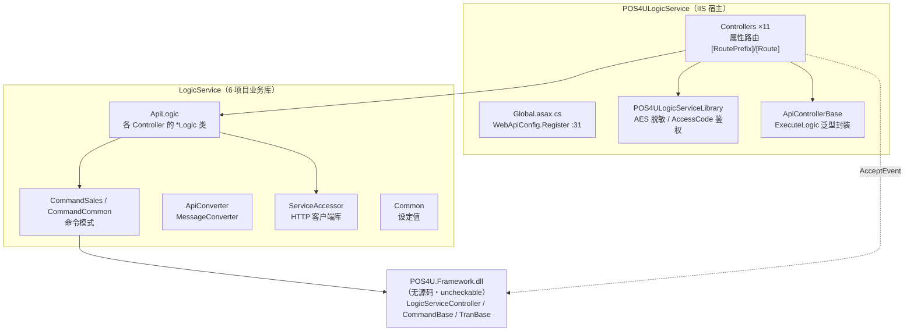
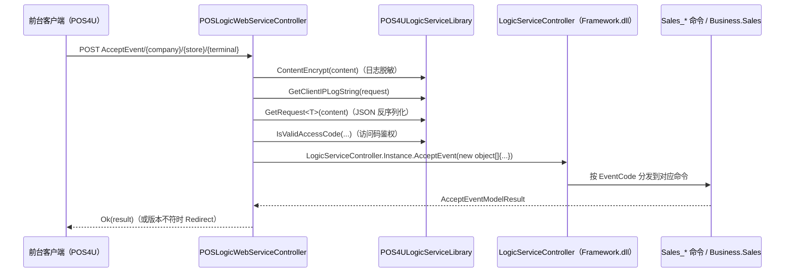

# 边缘 API 层总览（POS4ULogicService + LogicService）

> 本层指 POS **店舗端**的「内部 Web API」——运行在店内服务器 IIS 上，为前台进程（POS4U / TRAN4U）与店内其他组件提供交易受理、主数据下发、会员/积分、收据、报表、维护等 HTTP 接口。它是「前台事件」进入「业务逻辑」的第一道服务边界。

---

## 1. 层定位

- **一句话职责**：接收店内客户端的 HTTP(JSON) 请求，做统一的日志脱敏与访问码鉴权后，转交 `LogicService` 业务逻辑库（命令引擎 / 各 ApiLogic）处理，返回结果。
- **系统角色**：店内「边缘服务层」。上游是前台 UI 与外设守护进程，下游是 `Business.*` 业务域、店端 SQL Server（`SQLEXPRESS`）、以及经 `ServiceAccessor` 转发到的云端 / 店内其他 Web API。
- **协议**：**ASP.NET Web API（HTTP）**，非 WCF。证据：`Application/Source/POS4ULogicService/Global.asax.cs:31` 在 `Application_Start` 调用 `GlobalConfiguration.Configure(WebApiConfig.Register)`；`Application/Source/POS4ULogicService/App_Start/WebApiConfig.cs:25` 为 `config.MapHttpAttributeRoutes()`（属性路由）；`Web.config` 无 `serviceModel` 节点。
  > 多数路由前缀仍带 `.svc` 后缀（如 `POSLogicWebService.svc`），是从旧 WCF 服务迁移时保留的 URL 兼容痕迹，实现已是纯 Web API。详见 [conventions.md](./conventions.md)。

---

## 2. 两大构成

本层物理上由两个部分组成：

| 部分 | 角色 | 计数 | 证据 |
|---|---|---|---|
| **POS4ULogicService** | IIS 宿主工程：Controller（HTTP 入口）+ 横切库 | **11** Controller | `Application/Source/POS4ULogicService/Controllers/`（实测 11 个 `*Controller.cs`） |
| **LogicService** | 业务逻辑库（被上面引用） | **6** 项目 | `Application/Source/LogicService/`：ApiLogic / ApiConverter / CommandSales / CommandCommon / Common / ServiceAccessor |

> `LogicServiceController`（命令分发引擎）与 `CommandBase` / `TranBase` 等框架基类**无源码**，位于 `Application/POS4UCloud/ExternalModule/Framework/POS4U.Framework.dll`。凡涉其内部实现一律标 `uncheckable`（见 §6 与 [conventions.md](./conventions.md)）。

---

## 3. 一次请求的生命周期

以前台事件受理入口 `POSLogicWebService.svc/AcceptEvent` 为例：

关键行号：
- 脱敏 / IP / 反序列化 / 鉴权的统一模式：`Application/Source/POS4ULogicService/Controllers/POSLogicWebServiceController.cs:110-134`（`GetTransactionResponseInfo` 为典型样例）。
- 命令引擎分发：`POSLogicWebServiceController.cs:677`
  `LogicServiceController.Instance.AcceptEvent(new object[] { companyCode, storeCode, terminalNo, content })`。
- 版本不符重定向：`AcceptEvent` 检测 `ErrorOldModuleVersion` / `ErrorNewModuleVersion` 后调 `RedirectAcceptEvent`，`POSLogicWebServiceController.cs:53-58`。

统一的请求处理约定（脱敏、鉴权、计时、错误码）详见 [conventions.md](./conventions.md)。

---

## 4. 本层文档导航

| 文档 | 内容 |
|---|---|
| [controllers.md](./controllers.md) | 全 **11** 个 Controller 的路由前缀、基类、逐 action 清单（含 file:line） |
| [command_layer.md](./command_layer.md) | `LogicService` 6 项目分工、命令模式（CommandSales/CommandCommon）、ApiLogic、ServiceAccessor、ApiConverter |
| [conventions.md](./conventions.md) | 属性路由 / `.svc` 命名、请求处理统一模式、AES-256 脱敏、AccessCode 鉴权、错误码、两种基类模式 |

相邻服务层：店端后台批处理见 [../background/index.md](../background/index.md)；云端 BackOffice 见 [../cloud/index.md](../cloud/index.md)。

---

## 5. 关键横切一览

| 主题 | 落点 | 证据 |
|---|---|---|
| 属性路由 | `WebApiConfig.Register` | `Application/Source/POS4ULogicService/App_Start/WebApiConfig.cs:25` |
| 应用启动 | 引擎 `Startup()` | `Application/Source/POS4ULogicService/Global.asax.cs:33` `LogicServiceController.Instance.Startup()` |
| 连接上限 | `DefaultConnectionLimit=12` | `Application/Source/POS4ULogicService/Global.asax.cs:29` |
| 日志脱敏 | AES-256（CBC/PKCS7） | `Application/Source/POS4ULogicService/POS4ULogicServiceLibrary.cs:29-84` |
| 访问码鉴权 | `IsValidAccessCode` | `Application/Source/POS4ULogicService/POS4ULogicServiceLibrary.cs:187` |
| 泛型执行封装 | `ApiControllerBase.ExecuteLogic` | `Application/Source/POS4ULogicService/ApiControllerBase.cs:21` |

---

## 6. 可信度与核查

- `verification: verified`：§1–§5 的所有断言均来自实测 最新发布 源码，file:line 已逐条核对。
- **核查不能项（uncheckable）**：`LogicServiceController`（命令分发引擎，`Global.asax.cs:33` 与 `POSLogicWebServiceController.cs:677` 引用之，但全仓无 `class LogicServiceController` 定义）、`CommandBase` / `TranBase` / `EventCode` / `POSData` 等框架基类，均在 `POS4U.Framework.dll`（无源码）。本层文档只描述其被调用方式，不断言其内部实现。

---

## 7. ST-POS 迁移提示

> 本层为 POS4U（TrialPOS）现状描述。ST-POS（KugelPOS 派生）以 Python/FastAPI 微服务重构同类职责，映射关系见团队内部文档，不在此复制。
