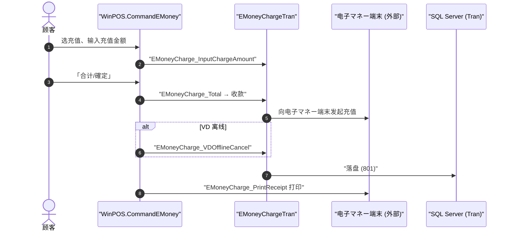

# 电子マネー充值 端到端流程

> 电子マネー / プリカ（预付卡）**充值**是一笔**独立交易**（不是销售的付款环节）。它自己有交易码、自己的确定/取消。规则之家 = [emoney](../30_domain/emoney.md)。

## 1. 交易码（`TranLogTypes.cs`）

| 交易 | 码 | 行 |
|---|---|---|
| 電子マネーチャージ | `EMoneyCharge = 801` | `TranLogTypes.cs:142` |
| 電子マネーチャージ取消 | `EMoneyChargeVoid = 816` | `TranLogTypes.cs:147` |
| 電子マネー残高照会 | `EMoneyInquiry = 804` | `TranLogTypes.cs:172` |
| 練習モードチャージ | `TrainingEMoneyCharge = 811` | `TranLogTypes.cs:207` |

## 2. 充值时序

## 3. 关键触发点 → 家

| 步骤 | 触发点 | 家 |
|---|---|---|
| 交易实体 | `Business.EMoney/EMoneyChargeTran.cs`（充值）/ `EMoneyChargeVoidTran.cs`（取消） | → [emoney](../30_domain/emoney.md) |
| 输入充值额 | `WinPOS.CommandEMoney/EMoneyCharge_InputChargeAmount.cs` | → [20_framework](../20_framework/index.md) |
| 合计·收款 | `EMoneyCharge_Total.cs`（充值款作为一笔收款，走 Payment） | → [payment_change](./payment_change.md) |
| VD 离线取消 | `EMoneyCharge_VDOfflineCancel.cs`（端末离线时的取消分支） | → [ADR-003](../80_decisions/adr-003-offline-degradation.md) |
| 打印凭证 | `EMoneyCharge_PrintReceipt.cs` | → [rj](../30_domain/rj.md) · [50_devices](../50_devices/index.md) |

## 4. 与 ValueCard 支付的区别

- **本流程 = 充值**（往卡里加钱，独立交易 801）。
- **ValueCard 作为金种付款**（从卡里扣钱结算销售）走 [payment_change](./payment_change.md)；其退货余额逆转走 [return_void](./return_void.md)。二者不要混淆。

## 5. 可信度

- verified：交易码（801/816/804/811）与实体类、命令类文件均回代码。
- uncheckable：**电子マネー端末/上游平台**（VD 等）通信与充值授权为外部系统——本页只核到 POS 侧命令与交易码。
